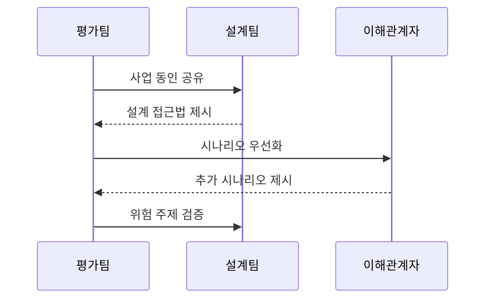

---
sidebar:
  order: 71
  label: "071. ATAM 아키텍처 트레이드오프 분석 방법 (Architecture Tradeoff Analysis Method)"
  badge:
    text: "기출 · 50%"
    variant: note
title: "ATAM 아키텍처 트레이드오프 분석 방법 (Architecture Tradeoff Analysis Method)"
date: "2026-07-25T18:03:00+09:00"
tags:
  - "notes-software"
weight: 71
extra:
  question_no: "071"
  source_status: "기출"
  source_history: "131회"
  priority: 50
  priority_note: "131회 기출, 품질속성 절충 분석 절차"
---

## 미리 알고가기

- **아키텍처 트레이드오프 분석 방법(Architecture Tradeoff Analysis Method, ATAM)**: 우선 품질 시나리오와 설계 접근법을 대조해 구현 전 민감점·상충점·위험 주제를 찾는 평가 방법
- **소프트웨어공학연구소(Software Engineering Institute, SEI)**: ATAM을 개발하고 아키텍처 평가 방법을 연구한 소프트웨어 공학 연구기관
- **사업 동인(Business Driver)**: 사업 목표·핵심 품질·제약처럼 평가 목표와 시나리오 우선순위를 정하는 조건
- **품질 속성 시나리오(Quality Attribute Scenario)**: 자극 원천·자극·환경·대상·응답·응답 측정값으로 검증 가능한 품질 요구를 표현한 상황
- **아키텍처 접근법(Architectural Approach)**: 품질 목표를 달성하려고 선택한 구조·설계 원칙과 그 근거
- **효용 트리(Utility Tree)**: 품질 목표를 시나리오까지 계층화하고 중요도·구현 난도로 분석 순서를 정하는 트리
- **민감점(Sensitivity Point)**: 한 설계 변수의 작은 변화가 특정 품질 속성에 크게 영향을 주는 지점
- **트레이드오프 지점(Tradeoff Point)**: 한 설계 결정이 둘 이상의 품질 속성에 서로 다른 방향으로 영향을 주는 지점
- **위험 주제(Risk Theme)**: 여러 시나리오의 설계 위험에서 반복되어 후속 검증과 조치가 필요한 구조적 원인
- **이해관계자(Stakeholder)**: 설계 결과의 영향을 받거나 품질 요구·시나리오·우선순위를 제시하는 사용자·운영자·사업 책임자
- **정량 검증(Quantitative Validation)**: ATAM의 정성적 위험 판단을 시험·모델·측정값으로 확인하는 후속 검증

## Ⅰ. 개요

- **정의/개념**: 품질 시나리오로 설계 상충·위험 분석
- **배경/필요성**: 품질 속성 충돌로 구현 전 구조 평가 필요

### 쉽게 이해하기 (학습용)

- 건물을 짓기 전에 채광과 냉방 충돌 등 중요한 사용 상황부터 따지는 것임

## Ⅱ. 특징

- 사업 동인과 중요도·난도로 시나리오를 우선화한다.
- 이해관계자 참여로 설계의 숨은 가정을 드러낸다.
- 접근법별 민감점·상충점·위험 주제를 식별한다.
- 정성 평가 결과는 후속 정량 검증이 필요하다.

### 쉽게 이해하기 (학습용)

- 담당자가 설계의 득실을 따져 위험한 지점을 공사 전에 표시하는 검토임

## Ⅲ. 아키텍처 및 구성요소

| 설계 요소 | 설명 |
|:---|:---|
| 사업 동인 | 평가 목표·품질 우선순위·제약 |
| 품질 시나리오 | 품질 요구의 자극·응답 측정값 |
| 설계 접근법 | 구조·핵심 설계 원칙·근거 |
| 분석 기록 | 시나리오별 민감점·상충점 |
| 평가 결과 | 위험 주제·후속 검증 항목 |

> 요약: 품질 시나리오와 설계 접근법을 연결해 위험을 추적함

### 쉽게 이해하기 (학습용)

- 사용 상황과 설계 판단을 연결해 위험 지점을 찾는 구조임

## Ⅳ. 원리 및 절차 흐름도

| 절차 | 설명 |
|:---|:---|
| 사업 동인 공유 | 평가 목표·품질 우선순위 전달 |
| 설계 접근법 제시 | 핵심 구조·설계 근거 설명 |
| 시나리오 우선화 | 중요도·난도로 분석 순서 결정 |
| 추가 시나리오 제시 | 이해관계자의 누락 상황 보완 |
| 위험 주제 검증 | 반복 위험과 후속 조치 확정 |

> 요약: 시나리오를 확장 분석해 위험 주제를 조치로 연결함

### 쉽게 이해하기 (학습용)

- 우선 상황을 분석하고 빠진 상황을 보태 공통 위험을 확정함

## Ⅴ. 종류 및 비교

| 판단 기준 | ATAM | 비정형 아키텍처 검토 |
|:---|:---|:---|
| 핵심 특징 | 동인·시나리오·접근법 추적 | 경험 중심 자유 형식 검토 |
| 산출 결과 | 위험·상충점·위험 주제 | 결함 목록·개선 의견 |
| 적용 기준 | 품질 목표·이해관계 충돌 | 영향이 국소적인 설계 변경 |
| 주요 위험 | 높은 참여 비용·정성 판단 편향 | 상충·민감점 누락 |

> 요약: 국소 변경은 검토, 품질 상충은 평가 적용

### 쉽게 이해하기 (학습용)

- 국소 변경은 경험으로 검토하고 품질 상충은 시나리오로 검토함

## Ⅵ. 실무 사례

1. 금융 코어는 복제 구조의 성능·가용성 상충 분석
2. 공공 클라우드는 배치 접근법의 반복 위험 식별

### 쉽게 이해하기 (학습용)

- 거래 속도와 장애 대응이 충돌하는 복제 수를 찾음
- 복구와 확장에 반복되는 배치 위험을 함께 찾음

## Ⅶ. 결론

- 품질 상충이 크면 ATAM으로 위험 주제 검증

### 쉽게 이해하기 (학습용)

- 품질 속성이 충돌하는 지점을 먼저 찾아 조치까지 정해야 개선으로 이어짐
