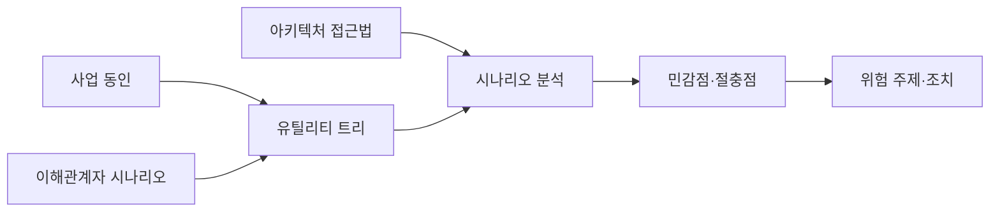
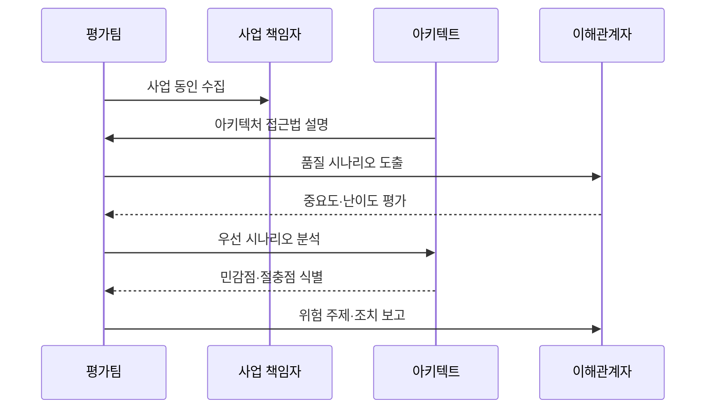

---
sidebar:
  order: 71
  label: "071. ATAM 아키텍처 트레이드오프 분석 방법 (Architecture Tradeoff Analysis Method)"
  badge:
    text: "기출 · 50%"
    variant: note
title: "ATAM 아키텍처 트레이드오프 분석 방법 (Architecture Tradeoff Analysis Method)"
date: "2026-07-27T23:59:59+09:00"
tags:
  - "notes-software"
weight: 71
extra:
  question_no: "071"
  source_status: "기출"
  source_history: "131회"
  priority: 50
  priority_note: "131회 기출, 품질속성 절충 분석 절차"
---

## 미리 알고가기

- **ATAM(Architecture Tradeoff Analysis Method)**: ‘에이탬’으로 읽고 영문 머리글자를 딴 약어이며, 품질속성 시나리오로 아키텍처의 위험·절충점을 분석하는 방법
- **SEI(Software Engineering Institute)**: ‘에스이아이’로 읽고 영문 머리글자를 딴 약어이며, ATAM을 개발한 소프트웨어 공학 연구기관
- **품질속성 시나리오(Quality Attribute Scenario)**: 자극원·자극·환경·대상·응답·응답 측정값으로 품질 요구를 검증 가능하게 표현한 상황
- **아키텍처 접근법(Architectural Approach)**: 품질 목표를 달성하기 위해 선택한 구조·전술과 근거
- **유틸리티 트리(Utility Tree)**: 품질 목표를 시나리오로 세분하고 중요도·난이도로 우선순위를 정한 트리
- **민감점(Sensitivity Point)**: 작은 설계 변화가 특정 품질속성에 큰 영향을 주는 지점
- **절충점(Tradeoff Point)**: 하나의 설계 결정이 여러 품질속성에 서로 다른 영향을 주는 지점
- **위험 주제(Risk Theme)**: 여러 시나리오에서 반복되는 구조적 위험의 공통 원인
- **이해관계자(Stakeholder)**: 품질 요구와 우선순위를 제시하거나 설계 결과의 영향을 받는 주체

## Ⅰ. 개요

- 정의/개념: 품질 시나리오로 **아키텍처 위험·절충점**을 분석하는 방법
- 기존 한계: 품질속성 충돌로 **설계 결정의 영향 판단** 곤란

### 쉽게 이해하기 (학습용)

- 건물을 짓기 전에 보안·속도·비용이 충돌하는 설계 지점을 실제 사용 상황으로 검토하는 방법이다.

## Ⅱ. 특징

- **사업 동인·품질 시나리오**로 평가 우선순위 결정
- 이해관계자 참여로 **누락 요구·위험** 탐색
- **민감점·절충점·위험 주제**를 결과로 도출

### 쉽게 이해하기 (학습용)

- 중요한 사용 상황부터 설계에 대입해 작은 변화의 큰 영향과 품질 간 충돌을 찾는다.

## Ⅲ. 아키텍처 및 구성요소

| 구성요소 | 책임 |
|:---|:---|
| 사업 동인 | 목표·제약과 **품질 우선순위** 제시 |
| 유틸리티 트리 | 시나리오의 **중요도·난이도 순위화** |
| 아키텍처 접근법 | 구조·전술과 **설계 근거 설명** |
| 시나리오 분석 | 접근법의 **품질 응답 검토** |
| 평가 결과 | 민감점·절충점·**위험 주제 기록** |

> 요약: 우선 시나리오와 설계 접근법을 대조해 위험 도출

### 쉽게 이해하기 (학습용)

- 중요한 사용 상황과 설계 선택을 연결해 어떤 결정이 어느 품질에 영향을 주는지 기록한다.

## Ⅳ. 원리 및 절차 흐름도

| 절차 | 설명 |
|:---|:---|
| 동인 수집 | 사업 목표·제약과 **품질 우선순위** 확인 |
| 접근법 설명 | 구조·전술과 **설계 근거 제시** |
| 시나리오 도출 | 이해관계자의 **품질 상황 수집** |
| 우선순위화 | 중요도·난이도로 **분석 순서 결정** |
| 접근법 분석 | 시나리오별 **품질 응답 검토** |
| 결과 보고 | 민감점·절충점·**위험 주제 정리** |

> 요약: 우선 품질 시나리오로 설계를 분석해 위험을 조치로 연결

### 쉽게 이해하기 (학습용)

- 중요한 상황을 먼저 검토하고 여러 상황에서 반복되는 위험을 묶어 개선 과제로 만든다.

## Ⅴ. 종류 및 비교

| 아키텍처 평가 방식 | ATAM | 비정형 아키텍처 검토 |
|:---|:---|:---|
| 적용 기준 | 품질속성 간 **절충 분석** | 국소 변경의 **빠른 동료 검토** |
| 핵심 특징 | 시나리오·접근법의 **근거 기반 평가** | 경험 중심의 **자유 형식 검토** |
| 한계 | 참여 비용·**정성 판단 편향** | 위험·절충점 **누락 가능성** |

### 쉽게 이해하기 (학습용)

- 여러 품질이 충돌하는 큰 결정은 ATAM으로 검토하고 작은 변경은 동료 검토로 빠르게 확인한다.

## Ⅵ. 실무 사례

1. 금융 복제 구조의 **성능·가용성 절충 분석**

### 쉽게 이해하기 (학습용)

- 복제 수를 늘릴 때 장애 대응은 좋아지지만 쓰기 지연이 커지는 지점을 분석한다.

## Ⅶ. 결론

- 아키텍처의 품질 속성 충돌과 위험을 조기에 드러내기 위해 **이해관계자 시나리오·민감점·절충점·위험 항목**을 검토하고, 중대한 설계 의사결정에 ATAM을 적용한다

### 쉽게 이해하기 (학습용)

- 품질 간 충돌이 큰 설계일수록 이해관계자 시나리오로 위험과 절충 근거를 남긴다.
