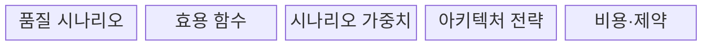
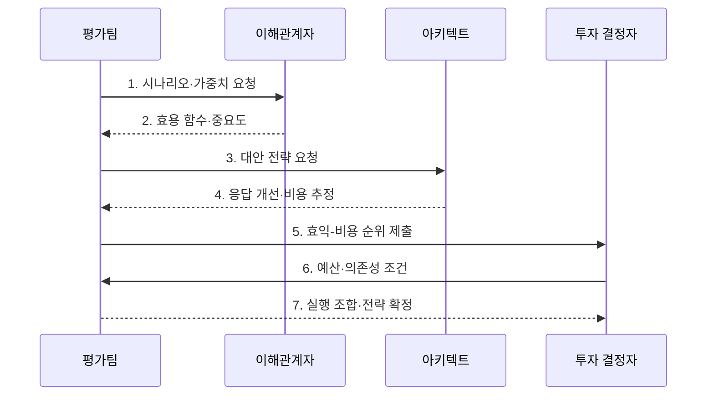

---
sidebar:
  order: 72
  label: "072. CBAM 비용 편익 분석 방법 (Cost Benefit Analysis Method)"
  badge:
    text: "기출 · 30%"
    variant: note
title: "CBAM 비용 편익 분석 방법 (Cost Benefit Analysis Method)"
date: "2026-07-27T23:59:59+09:00"
tags:
  - "notes-software"
weight: 72
extra:
  question_no: "072"
  source_status: "기출"
  source_history: "131회"
  priority: 30
  priority_note: "131회 기출, 아키텍처 대안 비용·효익 평가"
---

## 미리 알고가기

- **비용 편익 분석 방법(Cost Benefit Analysis Method, CBAM)**: 품질 효익과 실행 비용을 비교해 아키텍처 투자 우선순위를 정하는 방법
- **소프트웨어공학연구소(Software Engineering Institute, SEI)**: CBAM과 ATAM을 개발한 소프트웨어 공학 연구기관
- **아키텍처 트레이드오프 분석 방법(Architecture Tradeoff Analysis Method, ATAM)**: 품질속성 시나리오로 민감점·절충점·위험을 식별하는 아키텍처 평가 방법
- **품질 속성 시나리오(Quality Attribute Scenario)**: 자극·환경·응답·응답 측정값으로 검증 가능한 품질 요구를 표현한 상황
- **효용 함수(Utility Function)**: 응답시간·복구시간 같은 품질 응답 수준을 이해관계자가 평가한 가치 점수로 변환하는 함수
- **시나리오 가중치(Scenario Weight)**: 사업 목표에서 각 품질 시나리오가 차지하는 상대적 중요도를 나타내 전략 효익 계산에 반영하는 값
- **아키텍처 전략(Architectural Strategy)**: 품질 시나리오의 응답 수준을 바꾸려고 제안한 핵심 설계 변경안
- **효익-비용 비율(Benefit-Cost Ratio)**: 시나리오 가중치를 반영한 효용 증가분을 전략 비용으로 나눠 투자 순위를 비교하는 값
- **전략 의존성(Strategy Dependency)**: 한 전략이 다른 전략의 선행 구현이나 공통 자원을 필요로 해 투자 조합·순서를 제한하는 관계
- **추정 불확실성(Estimation Uncertainty)**: 효용 증가나 비용 예측의 오차 범위로, 순위가 작은 변화에도 뒤바뀌는지 검토할 대상
- **민감도 분석(Sensitivity Analysis)**: 비용·효익 추정값을 일정 범위로 바꿔도 투자 순위가 유지되는지 확인하는 분석

## Ⅰ. 개요

- 정의/개념: 품질 효익과 비용으로 전략 순위를 정하는 **평가 기법**
- 배경/필요성: 품질 전략의 경제적 투자 순위 결정

### 쉽게 이해하기 (학습용)

- 만족도 증가와 공사비를 비교해 한정된 예산으로 할 공사 조합을 정하는 것과 같다.

## Ⅱ. 특징

- **효용 함수**로 품질 응답의 사업 가치 정량화
- **가중 효익·전략 비용**으로 투자 순위 산출
- **의존성·불확실성·예산**으로 전략 조합 조정

### 쉽게 이해하기 (학습용)

- 공사 효과와 비용을 점수로 비교하고 오차와 선행 관계를 확인해 실행 순서를 정한다.

## Ⅲ. 구조 및 구성요소

| 구성요소 | 책임 |
|:---|:---|
| 품질 시나리오 | 사업 목표별 품질 응답 정의 |
| 효용 함수 | 응답 수준을 효용 점수로 변환 |
| 시나리오 가중치 | 시나리오 상대 중요도 반영 |
| 아키텍처 전략 | 적용 전후 효용 증가분 추정 |
| 비용·제약 | 투자비·의존성·불확실성 반영 |

### 쉽게 이해하기 (학습용)

- 품질 개선 가치를 비용과 제약에 맞춰 비교할 항목으로 구성한다.

## Ⅳ. 흐름도

**동작 원리**

- **1. 시나리오·가중치 요청**: 품질 요구를 수집
- **2. 효용 함수·중요도**: 가치 점수를 합의
- **3. 대안 전략 요청**: 품질 목표별 개선 방안 수집
- **4. 응답 개선·비용 추정**: 전략별 값을 계산
- **5. 효익-비용 순위 제출**: 투자 순위를 제시
- **6. 예산·의존성 조건**: 실행 제약을 전달
- **7. 실행 조합·전략 확정**: 순서와 검증 지표를 결정

$$B_j=\sum_i w_i\Delta U_{ij}, \qquad BCR_j=\frac{B_j}{C_j}$$

> 요약: 품질 효익을 사업 가치로 환산하고 비용·제약을 반영해 투자 조합을 결정

### 쉽게 이해하기 (학습용)

- 만족도 대비 비용 순위를 정하고 의존성을 반영해 조합한다.

## Ⅴ. 종류 및 비교

| 아키텍처 평가 방법 | CBAM | ATAM |
|:---|:---|:---|
| 적용 기준 | 전략별 **예산·투자 순위** 결정 | 품질 속성의 **기술 위험** 식별 |
| 핵심 특징 | **가중 효익·비용 비율** 평가 | **민감점·상충점·위험** 분석 |
| 한계 | 비용·효용 **추정 편향** | 경제성 평가·**투자 순위 미포함** |

> 요약: CBAM은 투자 순위, ATAM은 품질 위험 분석

### 쉽게 이해하기 (학습용)

- CBAM은 개선 투자 순위를 정하고 ATAM은 설계 위험을 찾는다.

## Ⅵ. 실무 고려사항 및 대책

| 고려사항 | 대책 | 효과 |
|:---|:---|:---|
| 효용 편향 | 역할별 값과 합의 근거 기록 | 가치 평가 편차 통제 |
| 비용 누락 | 수명주기 비용과 예비비 포함 | 총투자비 과소평가 방지 |
| 단일값 확신 | 범위 추정과 민감도 분석 수행 | 순위 변동 위험 확인 |
| 전략 의존성 | 선행·상호배타 제약으로 조합 평가 | 실행 불가능한 선택 방지 |
| 효익 미검증 | 측정값과 사후 검증 계획 포함 | 예상 품질 개선 확인 |

> 적용 사례: 금융 플랫폼은 장애 전환 전략의 가용성 효익과 수명주기 비용으로 투자를 결결정

### 쉽게 이해하기 (학습용)

- 장애 전환 효과와 비용으로 단계별 투자를 정한다.

## Ⅶ. 결론

- **효익·수명주기 비용·의존성**으로 투자 조합을 결정

### 쉽게 이해하기 (학습용)

- 한정된 예산에서 가치가 크고 함께 실행할 수 있는 개선 조합을 정한다.
