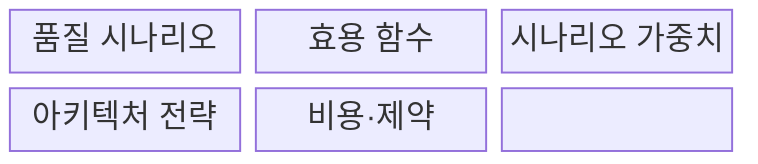
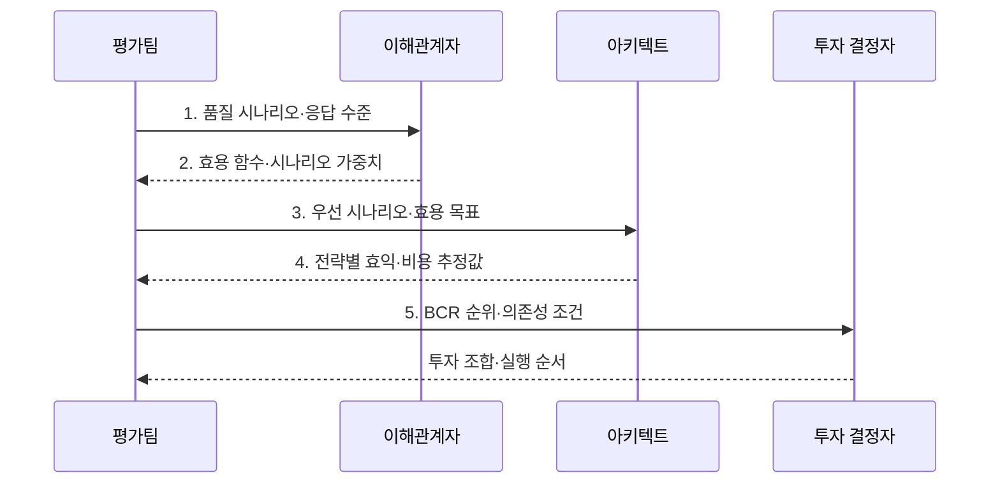

---
sidebar:
  order: 72
  label: "072. CBAM 비용 편익 분석 방법 (Cost Benefit Analysis Method)"
  badge:
    text: "기출 · 30%"
    variant: note
title: "CBAM 비용 편익 분석 방법 (Cost Benefit Analysis Method)"
date: "2026-08-02T23:12:00+09:00"
tags:
  - "notes-software"
weight: 72
extra:
  question_no: "072"
  source_status: "기출"
  source_history: "131회"
  priority: 30
  priority_note: "131회 기출, 아키텍처 대안 비용·효익 평가"
---

## Ⅰ. 개요

핵심 용어

- **비용 편익 분석 방법(Cost Benefit Analysis Method, CBAM)**: ATAM에서 도출한 아키텍처 전략의 품질 효익과 실행 비용을 비교해 투자 순위를 정하는 경제성 평가 방법이다.
- **투자 우선순위·조합**: 한정된 예산에서 먼저 실행할 전략과 함께 선택할 전략 묶음이다.

- 정의/개념: ATAM의 품질 분석을 비용·효익 평가로 확장해 아키텍처 전략의 투자 순위를 정하는 **CBAM 평가 기법**
- 배경/필요성: 기술 효과만 비교하면 한정 예산의 **투자 우선순위·조합 결정 불가**

#### 한줄 요약

- 만족도 증가와 공사비를 비교해 한정된 예산으로 할 공사 조합을 정하는 것과 같다.

## Ⅱ. 특징

핵심 용어

- **효용 함수(Utility Function)**: 품질 응답 수준을 이해관계자가 평가한 사업 가치 점수로 변환하는 함수이다.
- **가중 효익·전략 비용**: 시나리오 중요도를 반영한 가치 증가분과 전략의 수명주기 비용이다.
- **의존성·불확실성·예산**: 전략 조합과 실행 순서를 제한하는 선행 관계, 추정 오차, 투자 한도이다.

- **효용 함수** 로 품질 응답의 사업 가치 정량화
- **가중 효익·전략 비용** 으로 투자 순위 산출
- **의존성·불확실성·예산** 으로 전략 조합 조정

#### 한줄 요약

- 공사 효과와 비용을 점수로 비교하고 오차와 선행 관계를 확인해 실행 순서를 정한다.

## Ⅲ. 구조 및 구성요소

핵심 용어

- **품질 응답·측정값**: 전략이 개선해야 할 시스템 반응과 그 수준을 판정하는 수치이다.
- **시나리오 가중치(Scenario Weight)**: 각 품질 시나리오의 상대적 사업 중요도를 나타내는 값이다.
- **수명주기 비용·의존성·불확실성**: 도입부터 폐기까지의 비용과 전략 선행 관계 및 추정 오차이다.

| 구성요소 | 책임 |
|:---|:---|
| 품질 시나리오 | 사업 목표별 **품질 응답·측정값** 정의 |
| 효용 함수 | 응답 수준을 **효용 점수** 로 변환 |
| 시나리오 가중치 | 시나리오의 **상대적 사업 중요도** 반영 |
| 아키텍처 전략 | 적용 전후 **효용 증가분** 추정 |
| 비용·제약 | **수명주기 비용·의존성·불확실성** 반영 |

#### 한줄 요약

- 품질 개선 가치를 비용과 제약에 맞춰 비교할 항목으로 구성한다.

## Ⅳ. 흐름도

핵심 용어

- **BCR(Benefit-Cost Ratio, 효익-비용 비율)**: 가중 효익을 전략 비용으로 나눠 투자 가치를 비교하는 값이다.
- **전략별 효익·비용 추정값**: 각 설계 변경이 만드는 품질 가치 증가와 필요한 비용의 예측치이다.
- **투자 조합·실행 순서**: 예산과 의존성 조건을 반영해 선택한 전략 묶음과 적용 순서이다.
- **$B_j$·$w_i$·$\Delta U_{ij}$·$C_j$**: 전략 $j$의 가중 효익, 시나리오 $i$의 가중치, 전략 적용에 따른 효용 증가분, 전략의 수명주기 비용을 나타낸다.

**동작 원리**

- **1. 품질 시나리오·응답 수준**: 전략이 개선할 품질 기준 설정
- **2. 효용 함수·시나리오 가중치**: 응답 수준을 사업 가치로 환산
- **3. 우선 시나리오·효용 목표**: 품질 응답을 개선할 전략 도출
- **4. 전략별 효익·비용 추정값**: 가중 효익과 수명주기 비용 계산
- **5. BCR 순위·의존성 조건**: 예산·제약을 반영할 투자 후보 제시

$$B_j=\sum_i w_i\Delta U_{ij}, \qquad BCR_j=\frac{B_j}{C_j}$$

> 요약: 품질 효익을 사업 가치로 환산하고 비용·제약을 반영해 투자 조합을 결정

#### 한줄 요약

- 만족도 대비 비용 순위를 정하고 의존성을 반영해 조합한다.

## Ⅴ. 종류 및 비교

핵심 용어

- **CBAM(Cost Benefit Analysis Method, 비용 편익 분석 방법)**: 품질 효익과 비용으로 아키텍처 투자 순위를 정하는 방법이다.
- **ATAM(Architecture Tradeoff Analysis Method, 아키텍처 트레이드오프 분석 방법)**: 품질속성 시나리오로 민감점·절충점·위험을 식별하는 방법이다.

| 아키텍처 평가 방법 | CBAM | ATAM |
|:---|:---|:---|
| 적용 기준 | 전략별 **예산·투자 순위** 결정 | 품질 속성의 **기술 위험** 식별 |
| 핵심 특징 | **가중 효익·비용 비율** 평가 | **민감점·절충점·위험** 분석 |
| 한계 | 비용·효용 **추정 편향** | 경제성 평가·**투자 순위 미포함** |

> 요약: CBAM은 투자 순위, ATAM은 품질 위험 분석

#### 한줄 요약

- CBAM은 개선 투자 순위를 정하고 ATAM은 설계 위험을 찾는다.

## Ⅵ. 실무 고려사항 및 대책

핵심 용어

- **수명주기 비용·예비비**: 도입·운영·전환·유지보수·폐기 비용과 추정 위험에 대비한 여유 비용이다.
- **범위 추정·민감도 분석**: 비용과 효익의 오차 구간을 두고 값 변화에도 순위가 유지되는지 확인하는 분석이다.
- **전략 의존성·상호배타 제약**: 전략의 선행 관계와 동시에 선택할 수 없는 조건이다.
- **품질 측정값·사후 검증 계획**: 투자 후 실제 품질 개선을 예상 효익과 비교하기 위한 측정·검토 계획이다.
- **역할별 효용값·합의 근거**: 사업·운영·사용자 등 각 역할이 평가한 품질 가치와 최종 점수에 동의한 이유를 기록한 정보이다.

| 문제 | 대책 | 효과 |
|:---|:---|:---|
| 역할별 효용 평가 차이가 전략 순위를 왜곡 | **역할별 효용값·합의 근거** 기록 | **가치 평가 편차** 통제 |
| 도입비만 계산해 운영·전환 비용을 누락 | **수명주기 비용·예비비** 포함 | **총투자비 과소평가** 방지 |
| 단일 추정값을 확정값으로 보아 순위 변동 은폐 | **범위 추정·민감도 분석** 수행 | **순위 변동 위험** 확인 |
| 선행·상호배타 제약을 무시해 실행 불가 조합 선택 | **전략 의존성·상호배타 제약** 평가 | **실행 불가능한 선택** 방지 |
| 투자 후 측정이 없어 예상 효익 달성 여부 불명 | **품질 측정값·사후 검증 계획** 포함 | **예상 품질 개선** 확인 |

> 적용 사례: 금융 플랫폼은 장애 전환 전략의 가용성 효익과 수명주기 비용으로 투자 결정

#### 한줄 요약

- 장애 전환 효과와 비용으로 단계별 투자를 정한다.

## Ⅶ. 결론

핵심 용어

- **효익·수명주기 비용·의존성**: 아키텍처 투자 조합을 결정하는 가치, 전체 비용, 실행 선후 관계이다.
- **투자 조합**: 예산 안에서 가치가 크고 함께 실행할 수 있도록 선택한 전략 묶음이다.

- **효익·수명주기 비용·의존성** 으로 투자 조합을 결정

#### 한줄 요약

- 한정된 예산에서 가치가 크고 함께 실행할 수 있는 개선 조합을 정한다.
