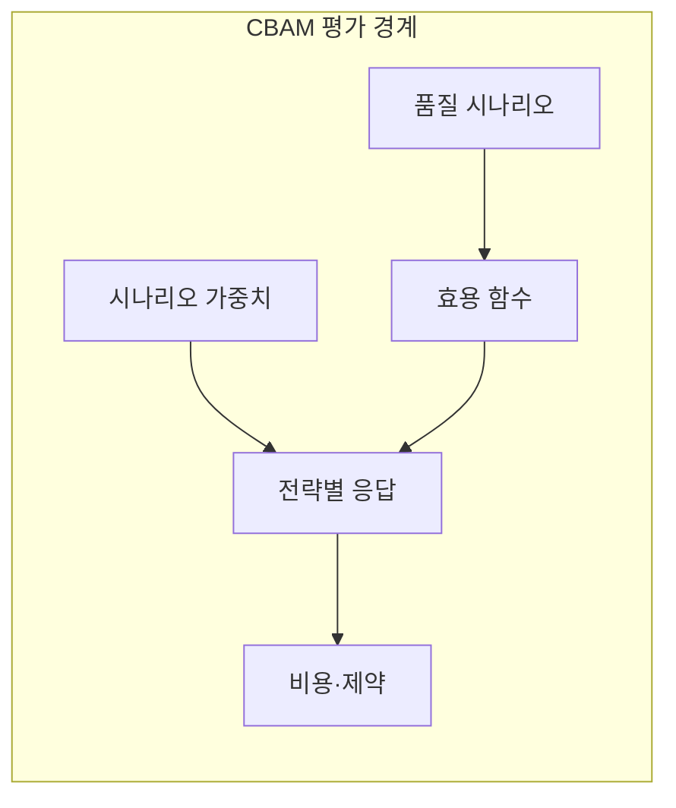
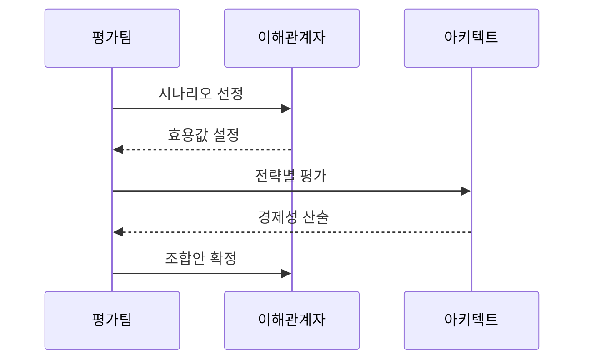

---
sidebar:
  order: 72
  label: "072. CBAM 비용 편익 분석 방법 (Cost Benefit Analysis Method)"
  badge:
    text: "기출 · 30%"
    variant: note
title: "CBAM 비용 편익 분석 방법 (Cost Benefit Analysis Method)"
date: "2026-07-25T18:04:00+09:00"
tags:
  - "notes-software"
weight: 72
extra:
  question_no: "072"
  source_status: "기출"
  source_history: "131회"
  priority: 30
  priority_note: "131회 기출, 아키텍처 대안 비용·효익 평가"
---

## 미리 알고가기

- **비용 편익 분석 방법(Cost Benefit Analysis Method, CBAM)**: 품질 시나리오별 효용 증가와 전략 비용을 비교해 예산 안에서 아키텍처 투자 조합을 정하는 방법
- **소프트웨어공학연구소(Software Engineering Institute, SEI)**: CBAM과 ATAM을 개발한 소프트웨어 공학 연구기관
- **아키텍처 트레이드오프 분석 방법(Architecture Tradeoff Analysis Method, ATAM)**: 품질 시나리오와 설계 접근법을 대조해 민감점·상충점·위험 주제를 찾는 평가 방법
- **품질 속성 시나리오(Quality Attribute Scenario)**: 자극·환경·응답·응답 측정값으로 검증 가능한 품질 요구를 표현한 상황
- **효용 함수(Utility Function)**: 응답시간·복구시간 같은 품질 응답 수준을 이해관계자가 평가한 가치 점수로 변환하는 함수
- **시나리오 가중치(Scenario Weight)**: 사업 목표에서 각 품질 시나리오가 차지하는 상대적 중요도를 나타내 전략 효익 계산에 반영하는 값
- **아키텍처 전략(Architectural Strategy)**: 품질 시나리오의 응답 수준을 바꾸려고 제안한 핵심 설계 변경안
- **효익-비용 비율(Benefit-Cost Ratio)**: 시나리오 가중치를 반영한 효용 증가분을 전략 비용으로 나눠 투자 순위를 비교하는 값
- **전략 의존성(Strategy Dependency)**: 한 전략이 다른 전략의 선행 구현이나 공통 자원을 필요로 해 투자 조합·순서를 제한하는 관계
- **추정 불확실성(Estimation Uncertainty)**: 효용 증가나 비용 예측의 오차 범위로, 순위가 작은 변화에도 뒤바뀌는지 검토할 대상

## Ⅰ. 개요

- **정의/개념**: 품질 효익과 비용으로 전략 투자 순위 결정
- **배경/필요성**: 전략별 비용·효용 차이로 투자 우선순위 필요

### 쉽게 이해하기 (학습용)
- 만족도 증가와 공사비를 비교해 한정된 예산으로 할 공사 조합을 정하는 것과 같음

## Ⅱ. 특징

- 응답 수준을 효용 점수로 바꿔 가치를 비교한다.
- 중요도와 효용 증가분으로 전략 효익을 계산한다.
- 효익-비용 비율로 전략 투자 순위를 산출한다.
- 추정 불확실성·의존성·예산으로 조합을 조정한다.

### 쉽게 이해하기 (학습용)
- 공사 효과와 비용을 점수로 비교하고 오차와 선행 관계를 확인해 실행 순서를 정함

## Ⅲ. 아키텍처 및 구성요소

| 설계 요소 | 설명 |
|:---|:---|
| 품질 시나리오 | 사업 목표별 품질 응답 |
| 효용 함수 | 응답 수준을 가치 점수로 변환 |
| 시나리오 가중치 | 시나리오의 상대적 중요도 |
| 전략별 응답 | 적용 후 효용 증가분 추정 |
| 비용·제약 | 투자비·불확실성·의존성 |

> 요약: 전략별 효익과 비용 제약을 연결해 투자 조합을 비교함

### 쉽게 이해하기 (학습용)
- 개선안마다 기대 가치와 비용 의존성을 한 표에서 비교함

## Ⅳ. 원리 및 절차 흐름도

| 절차 | 설명 |
|:---|:---|
| 시나리오 선정 | 사업 목표별 우선 시나리오 결정 |
| 효용값 설정 | 응답 수준별 효용 점수 합의 |
| 전략별 평가 | 전략별 응답·효용 증가 추정 |
| 경제성 산출 | 가중 효익·비용 비율 계산 |
| 조합안 확정 | 의존성·예산으로 투자 조합 결정 |

> 요약: 전략 가중 효익과 비용 제약으로 투자 조합을 확정함

### 쉽게 이해하기 (학습용)
- 만족도 대비 비용 순위를 정하고 의존성을 반영해 조합함

## Ⅴ. 종류 및 비교

| 판단 기준 | CBAM | ATAM |
|:---|:---|:---|
| 핵심 특징 | 전략의 비용 대비 효용 분석 | 품질 속성 상충·민감점 분석 |
| 산출 결과 | 전략별 효익·비용·투자 순위 | 위험·민감점·상충점 |
| 적용 기준 | 전략별 예산 배분 결정 | 품질 시나리오의 기술 위험 식별 |
| 주요 위험 | 추정 편향·민감도 누락 | 비용·효용 정량화 부족 |

> 요약: CBAM은 투자 순위, ATAM은 품질 위험 분석

### 쉽게 이해하기 (학습용)
- CBAM은 개선 투자 순위를 정하고 ATAM은 설계 위험을 찾음

## Ⅵ. 실무 사례

1. 금융 플랫폼은 장애 전환 전략의 투자 조합 결정
2. 공공 시스템은 접근통제 전략의 실행 순서 결정

### 쉽게 이해하기 (학습용)
- 장애 전환 효과와 비용으로 단계별 투자를 정함
- 보안 효과와 제약으로 실행 순서를 정함

## Ⅶ. 결론

- 예산·의존성이 제한되면 CBAM으로 조합 선정

### 쉽게 이해하기 (학습용)
- 한정된 예산에서 가치가 크고 함께 실행할 수 있는 개선 조합을 정함
