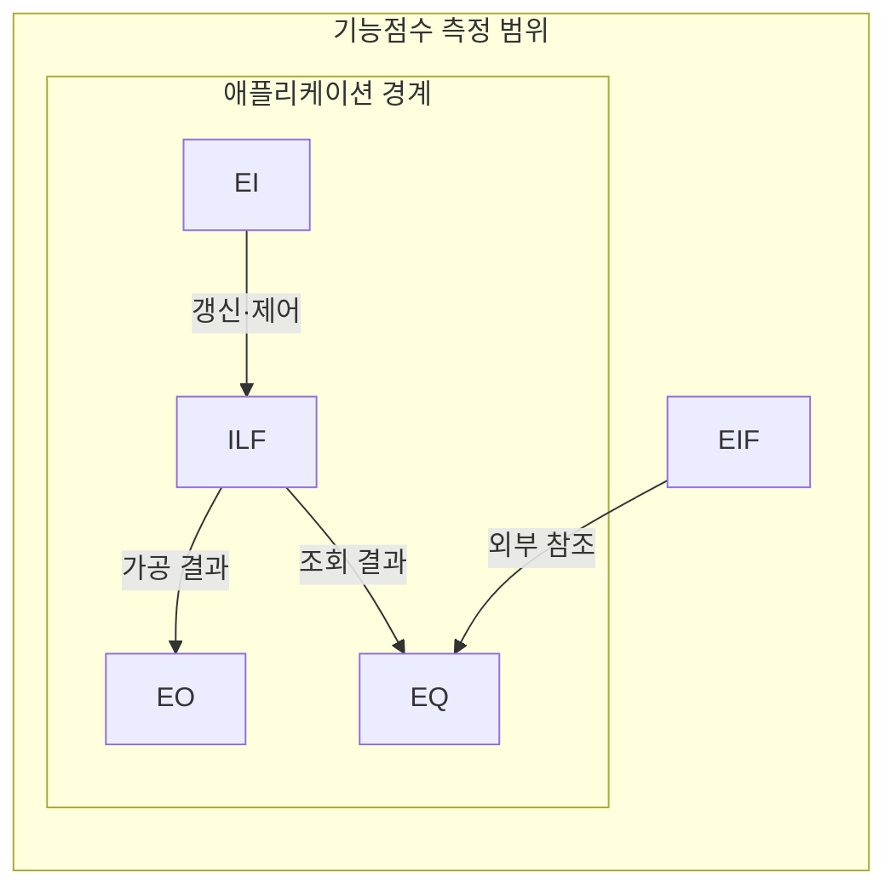
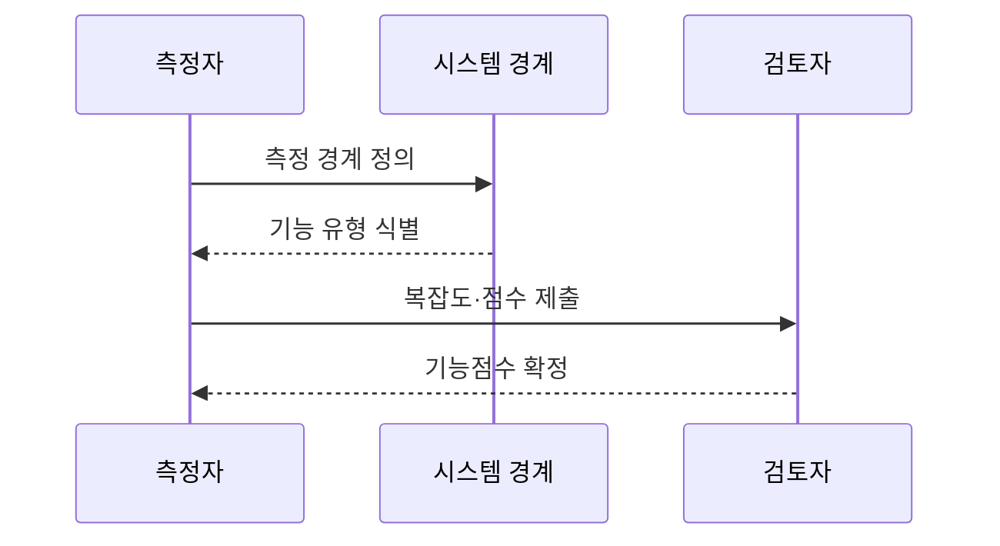

---
sidebar:
  order: 73
  label: "073. SW 기능점수 FP 측정 (Function Point)"
  badge:
    text: "기출 · 50%"
    variant: note
title: "SW 기능점수 FP 측정 (Function Point)"
date: "2026-07-27T23:59:59+09:00"
tags:
  - "notes-software"
weight: 73
extra:
  question_no: "073"
  source_status: "기출"
  source_history: "126회"
  priority: 50
  priority_note: "126회 기출, 기능점수 규모 산정의 기본 절차"
---

## 미리 알고가기

- **소프트웨어(Software, SW)**: ‘에스더블유’로 읽고 영문 첫 글자를 딴 약어이며, 기능점수로 측정할 사용자 기능의 구현 대상
- **기능점수(Function Point, FP)**: ‘에프피’로 읽고 영문 첫 글자를 딴 약어이며, 사용자 관점의 기능 규모를 나타내는 단위
- **코드 줄 수(Lines of Code, LOC)**: ‘엘오시’로 읽고 영문 핵심어의 첫 글자를 딴 약어이며, 구현된 소스 코드의 물리적 줄 수
- **외부입력(External Input, EI)**: ‘이아이’로 읽고 영문 첫 글자를 딴 약어이며, 외부 데이터로 내부 데이터를 갱신하는 기능
- **외부출력(External Output, EO)**: ‘이오’로 읽고 영문 첫 글자를 딴 약어이며, 가공 결과를 시스템 경계 밖으로 전달하는 기능
- **외부조회(External Inquiry, EQ)**: ‘이큐’로 읽고 영문 핵심어의 첫 글자를 딴 약어이며, 내부 변경 없이 조회 결과를 반환하는 기능
- **내부논리파일(Internal Logical File, ILF)**: ‘아이엘에프’로 읽고 영문 첫 글자를 딴 약어이며, 측정 대상이 유지하는 논리 데이터 그룹
- **외부인터페이스파일(External Interface File, EIF)**: ‘이아이에프’로 읽고 영문 첫 글자를 딴 약어이며, 외부가 유지하고 측정 대상이 참조하는 데이터 그룹
- **데이터요소유형(Data Element Type, DET)**: ‘디이티’로 읽고 영문 첫 글자를 딴 약어이며, 사용자가 식별하는 고유 데이터 필드
- **레코드요소유형(Record Element Type, RET)**: ‘알이티’로 읽고 영문 첫 글자를 딴 약어이며, 논리 파일 내부의 사용자 식별 하위 그룹
- **참조파일유형(File Type Referenced, FTR)**: ‘에프티알’로 읽고 영문 첫 글자를 딴 약어이며, 트랜잭션이 참조·갱신하는 논리 파일
- **응용 프로그래밍 인터페이스(Application Programming Interface, API)**: ‘에이피아이’로 읽고 영문 첫 글자를 딴 약어이며, 외부 기능·데이터를 호출하는 접점
- **시스템 경계(System Boundary)**: 기능점수를 측정할 애플리케이션의 안과 밖을 나눠 내부 유지 데이터와 외부 참조 데이터를 구분하는 선
- **트랜잭션 기능(Transactional Function)**: 사용자가 경계를 통해 데이터를 입력·출력·조회하는 EI·EO·EQ 기능
- **데이터 기능(Data Function)**: 사용자가 식별하는 논리 데이터 중 대상이 유지하는 ILF와 외부에서 유지해 참조하는 EIF 기능
- **복잡도 가중치(Complexity Weight)**: DET·RET·FTR 수로 판정한 기능 복잡도에 따라 각 기능점수에 적용하는 값
- **가중 기능점수(Weighted Function Point)**: 다섯 기능 유형별 개수에 복잡도 가중치를 곱해 합산한 논리적 규모

## Ⅰ. 개요

- 정의/개념: **데이터·트랜잭션 기능**의 논리 규모 측정
- 기존 한계: 코드량 산정은 **언어·구현 방식별 규모 왜곡**

### 쉽게 이해하기 (학습용)
- 건물을 지을 때 벽돌 대신 방과 화장실 개수로 크기와 가격을 매김

## Ⅱ. 특징

- **기술 독립적 사용자 기능**으로 논리 규모 측정
- **EI·EO·EQ·ILF·EIF**의 수와 복잡도 합산
- **시스템 경계·복잡도 규칙**으로 측정 편차 통제

### 쉽게 이해하기 (학습용)
- 어떤 언어를 쓰든 사용자에게 제공하는 가치만 평가해 대가 산정이 객관적임

## Ⅲ. 아키텍처 및 구성요소

| 설계 요소 | 설명 |
|:---|:---|
| 외부 입력(EI) | **외부 입력**으로 내부 상태 갱신 |
| 외부 출력(EO) | 계산·가공한 **파생 정보** 전달 |
| 외부 조회(EQ) | 상태 변경 없는 **조회 응답** |
| 내부 논리 파일(ILF) | 측정 대상이 **유지·관리**하는 데이터 |
| 외부 인터페이스 파일(EIF) | 외부가 관리하고 대상은 **참조** |

> 요약: 앞의 세 개는 거래 기능이고 뒤의 두 개는 데이터 기능임

### 쉽게 이해하기 (학습용)
- 입력과 조회는 동작이고 내부와 외부 파일은 데이터 기능임

## Ⅳ. 원리 및 절차 흐름도

| 절차 | 설명 |
|:---|:---|
| 측정 경계 정의 | **사용자 관점·시스템 경계** 설정 |
| 기능 유형 식별 | **EI·EO·EQ·ILF·EIF** 분류 |
| 복잡도·점수 제출 | **DET·RET·FTR**로 가중치 산정 |
| 기능점수 확정 | 기능별 **가중 점수 합산·검증** |

> 요약: 경계 안의 다섯 기능을 식별해 가중 기능점수를 합산함

### 쉽게 이해하기 (학습용)
- 범위를 정하고 기능별 복잡도 점수를 더해 규모를 확정함

## Ⅴ. 종류 및 비교

| 규모 산정 방식 | 기능점수 FP | LOC 기반 규모 산정 |
|:---|:---|:---|
| 적용 기준 | 구현 전 **논리 기능 규모** 산정 | 구현 후 **물리적 코드량** 산정 |
| 핵심 특징 | **기술 독립적 사용자 기능** 측정 | **소스 코드 라인 수** 측정 |
| 한계 | 경계·복잡도 **판정 편차** | 언어·코딩 방식별 **비교 왜곡** |

> 요약: 코드 라인은 길이, 기능점수는 기능 규모 측정

### 쉽게 이해하기 (학습용)
- 줄 수는 글자 수이고 기능점수는 핵심 에피소드 수를 셈

## Ⅵ. 실무 사례

1. 공공 사업은 **기능점수·단가**로 변경 대가 산정

### 쉽게 이해하기 (학습용)
- 기획서 기능 개수로 예산을 책정하고 추가 기능은 따로 요금을 산정해 정산함

## Ⅶ. 결론

- 조기 규모는 **기능점수**, 코드량은 **LOC**로 산정

### 쉽게 이해하기 (학습용)
- 구현 언어가 달라도 사용자 기능을 같은 측정 규칙으로 비교함
