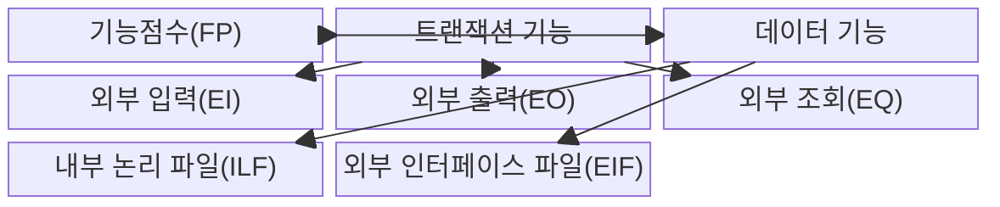
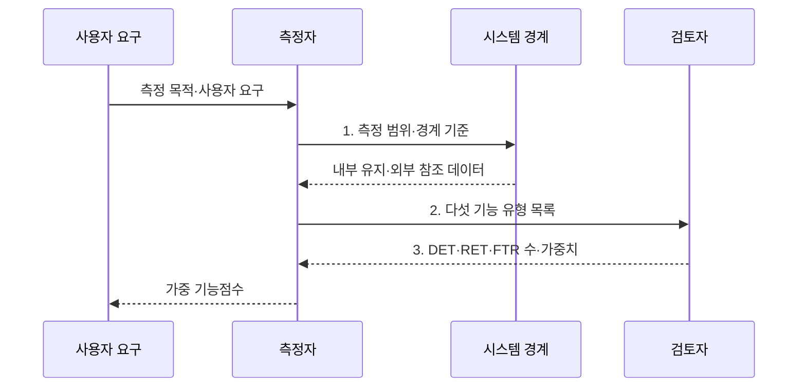

---
sidebar:
  order: 73
  label: "073. SW 기능점수 FP 측정 (Function Point)"
  badge:
    text: "기출 · 50%"
    variant: note
title: "SW 기능점수 FP 측정 (Function Point)"
date: "2026-07-30T23:22:46+09:00"
tags:
  - "notes-software"
weight: 73
extra:
  question_no: "073"
  source_status: "기출"
  source_history: "126회"
  priority: 50
  priority_note: "126회 기출, 기능점수 규모 산정의 기본 절차"
---

## 미리 알고가기

- **소프트웨어(Software, SW)**: 기능점수로 사용자 기능의 논리 규모를 측정하는 구현 대상
- **기능점수(Function Point, FP)**: 구현 기술과 무관하게 사용자 관점의 기능 규모를 나타내는 단위
- **코드 줄 수(Lines of Code, LOC)**: 구현된 소스 코드의 물리적 줄 수
- **외부입력(External Input, EI)**: 시스템 외부에서 입력받아 내부 논리파일을 갱신하는 기능
- **외부출력(External Output, EO)**: 계산·가공한 결과를 시스템 경계 밖으로 전달하는 기능
- **외부조회(External Inquiry, EQ)**: 내부 논리파일을 변경하지 않고 조회 결과를 반환하는 기능
- **내부논리파일(Internal Logical File, ILF)**: ‘아이엘에프’로 읽고 영문 첫 글자를 딴 약어이며, 측정 대상이 유지하는 논리 데이터 그룹
- **외부인터페이스파일(External Interface File, EIF)**: ‘이아이에프’로 읽고 영문 첫 글자를 딴 약어이며, 외부가 유지하고 측정 대상이 참조하는 데이터 그룹
- **데이터요소유형(Data Element Type, DET)**: ‘디이티’로 읽고 영문 첫 글자를 딴 약어이며, 사용자가 식별하는 고유 데이터 필드
- **레코드요소유형(Record Element Type, RET)**: ‘알이티’로 읽고 영문 첫 글자를 딴 약어이며, 논리 파일 내부의 사용자 식별 하위 그룹
- **참조파일유형(File Type Referenced, FTR)**: ‘에프티알’로 읽고 영문 첫 글자를 딴 약어이며, 트랜잭션이 참조·갱신하는 논리 파일
- **응용 프로그래밍 인터페이스(Application Programming Interface, API)**: ‘에이피아이’로 읽고 영문 첫 글자를 딴 약어이며, 외부 기능·데이터를 호출하는 접점
- **시스템 경계(System Boundary)**: 기능점수를 측정할 애플리케이션의 안과 밖을 나눠 내부 유지 데이터와 외부 참조 데이터를 구분하는 선
- **트랜잭션 기능(Transactional Function)**: 사용자가 경계를 통해 데이터를 입력·출력·조회하는 EI·EO·EQ 기능
- **데이터 기능(Data Function)**: 사용자가 식별하는 논리 데이터 중 대상이 유지하는 ILF와 외부에서 유지해 참조하는 EIF 기능
- **복잡도 가중치(Complexity Weight)**: DET·RET·FTR 수로 판정한 기능 복잡도에 따라 각 기능점수에 적용하는 값
- **가중 기능점수(Weighted Function Point)**: 다섯 기능 유형별 개수에 복잡도 가중치를 곱해 합산한 논리적 규모
- **측정 목적(Measurement Purpose)**: 개발 규모·변경 규모·대가 산정처럼 기능점수를 사용하는 이유로서 측정 범위와 유형을 결정한다.
- **기능점수 수식 기호(FP·t·Nₜ·Wₜ·Σ)**: 에프피는 기능점수, 티는 기능 유형, 엔은 유형별 개수, 더블유는 가중치, 시그마는 합계를 뜻하며 유형별 가중 점수를 합산한다.
- **비기능 요구(Non-functional Requirement)**: 성능·보안·신뢰성처럼 기능 동작 이외의 품질·제약 요구

> **키워드:** SW 기능점수 FP 측정 (Function Point)

## Ⅰ. 개요

- 정의/개념: 사용자 기능에 가중치를 적용하는 **논리 규모 측정 방법**
- 배경/필요성: LOC는 언어·구현 방식에 따라 **개발 전 규모 비교 불가**

### 쉽게 이해하기 (학습용)

- 건물을 지을 때 벽돌 대신 방과 화장실 개수로 크기와 가격을 매긴다.

## Ⅱ. 특징

- **기술 독립적 사용자 기능**으로 논리 규모 측정
- **EI·EO·EQ·ILF·EIF**의 수와 복잡도 합산
- **시스템 경계·복잡도 규칙**으로 측정 편차 통제

### 쉽게 이해하기 (학습용)

- 어떤 언어를 쓰든 사용자에게 제공하는 기능을 같은 규칙으로 평가한다.

## Ⅲ. 구조 및 구성요소

| 구성요소 | 책임 |
|:---|:---|
| 기능점수(FP) | 다섯 기능 유형의 **가중 논리 규모** 합산 |
| 트랜잭션 기능 | 경계의 **입력·출력·조회 기능** 분류 |
| 데이터 기능 | 논리 데이터의 **유지·참조 책임** 분류 |
| 외부 입력(EI) | 외부 입력으로 **내부 상태 갱신** |
| 외부 출력(EO) | 계산·가공한 **파생 정보 전달** |
| 외부 조회(EQ) | **상태 변경 없는 조회** 응답 |
| 내부 논리 파일(ILF) | 측정 대상이 **유지하는 논리 데이터** |
| 외부 인터페이스 파일(EIF) | 외부가 관리하는 **참조 데이터** |

### 쉽게 이해하기 (학습용)

- 입력·출력·조회와 내부·외부 데이터를 다섯 기능 유형으로 센다.

## Ⅳ. 흐름도

**동작 원리**

- **1. 측정 범위·경계 기준**: 측정 대상과 데이터 유지 책임 분리
- **2. 다섯 기능 유형 목록**: EI·EO·EQ·ILF·EIF 식별
- **3. DET·RET·FTR 수·가중치**: 복잡도와 중복을 검토해 규모 산정

$$FP=\sum_{t \in \{EI,EO,EQ,ILF,EIF\}} N_t \times W_t$$

> 요약: 시스템 경계 안의 다섯 사용자 기능을 식별하고 복잡도 가중치를 합산

### 쉽게 이해하기 (학습용)

- 범위를 정하고 기능별 복잡도 점수를 더해 규모를 확정한다.

## Ⅴ. 종류 및 비교

| 규모 산정 방식 | 기능점수 FP | LOC 기반 규모 산정 |
|:---|:---|:---|
| 적용 기준 | 구현 전 **논리 기능 규모** 산정 | 구현 후 **물리적 코드량** 산정 |
| 핵심 특징 | **기술 독립적 사용자 기능** 측정 | **소스 코드 라인 수** 측정 |
| 한계 | 경계·복잡도 **판정 편차** | 언어·코딩 방식별 **비교 왜곡** |

> 요약: 코드 라인은 길이, 기능점수는 기능 규모 측정

### 쉽게 이해하기 (학습용)

- 줄 수는 글자 수이고 기능점수는 사용자가 받는 기능 수를 센다.

## Ⅵ. 실무 고려사항 및 대책

| 고려사항 | 대책 | 효과 |
|:---|:---|:---|
| 측정자마다 시스템 경계를 달리 잡아 규모 편차 발생 | **목적·경계·연계 대상** 사전 합의 | **규모 산정 편차** 감소 |
| 같은 사용자 기능을 화면·API별로 중복 계수 | **사용자 목적·독립 처리**로 식별 | **화면·API 중복 계수** 방지 |
| 상태 변경·계산·유지 책임을 혼동해 유형 오분류 | **상태 변경·계산·유지 책임** 기록 | **기능 유형 판정** 일관성 확보 |
| DET·RET·FTR 해석 차이로 복잡도 가중치 편차 | **교육·동료 검토·기준 사례** 운영 | **측정자 해석 차이** 축소 |
| 기능점수를 비용으로 바로 환산해 품질·위험 누락 | **비기능 요구·위험·역량** 별도 보정 | **비용 추정 왜곡** 방지 |

> 적용 사례: 공공 소프트웨어 사업은 기능점수와 단가로 개발·변경 대가 산정

### 쉽게 이해하기 (학습용)

- 기획서의 사용자 기능으로 예산을 책정하고 추가 기능은 같은 규칙으로 정산한다.

## Ⅶ. 결론

- **측정 경계·기능 유형·복잡도 근거**로 기능점수 확정

### 쉽게 이해하기 (학습용)

- 구현 언어가 달라도 사용자 기능을 같은 측정 규칙으로 비교한다.
