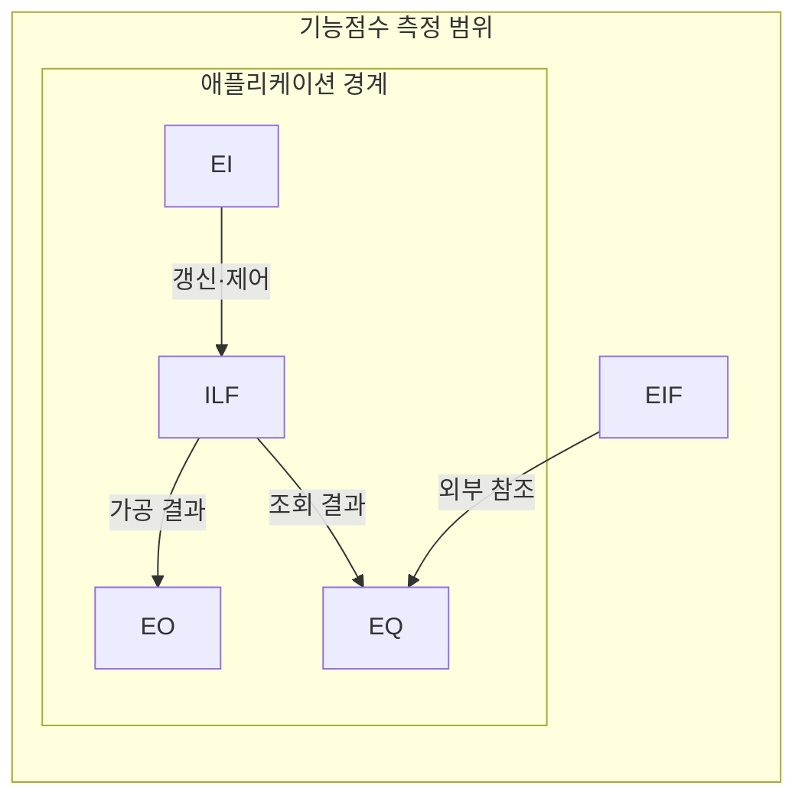
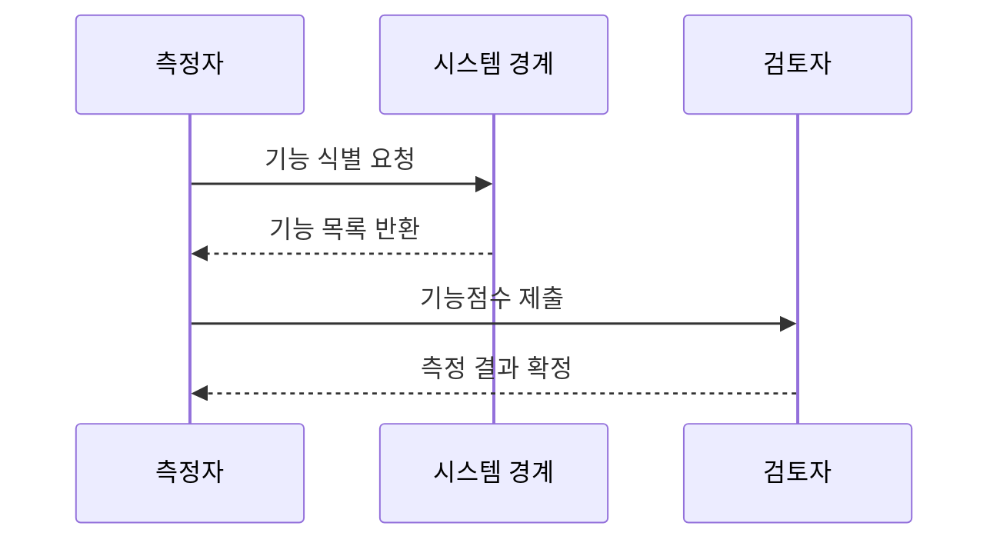

---
sidebar:
  order: 73
  label: "073. SW 기능점수 FP 측정 (Function Point)"
  badge:
    text: "기출 · 50%"
    variant: note
title: "SW 기능점수 FP 측정 (Function Point)"
date: "2026-07-25T18:05:00+09:00"
tags:
  - "notes-software"
weight: 73
extra:
  question_no: "073"
  source_status: "기출"
  source_history: "126회"
  priority: 50
  priority_note: "126회 기출, 기능점수 규모 산정의 기본 절차"
---

## 미리 알고가기

- **소프트웨어(Software, SW)**: 기능점수로 측정하는 사용자 기능의 구현 대상임
- **기능점수(Function Point, FP)**: 사용자 관점의 기능적 규모를 측정하는 단위임
- **코드 줄 수(Lines of Code, LOC)**: 구현된 소스 코드의 물리적 줄 수임
- **외부입력(External Input, EI)**: 외부 데이터로 내부 파일을 갱신함
- **외부출력(External Output, EO)**: 가공 결과를 시스템 경계 밖으로 전달함
- **외부조회(External Inquiry, EQ)**: 내부 변경 없이 조회 결과를 반환함
- **내부논리파일(Internal Logical File, ILF)**: 측정 시스템이 유지하는 데이터 그룹임
- **외부인터페이스파일(External Interface File, EIF)**: 다른 시스템이 유지하고 대상은 참조함
- **데이터요소유형(Data Element Type, DET)**: 사용자가 식별하는 고유 데이터 필드 수임
- **레코드요소유형(Record Element Type, RET)**: 논리 파일 내부의 데이터 하위 그룹 수임
- **참조파일유형(File Type Referenced, FTR)**: 트랜잭션이 참조하거나 갱신하는 파일 수임
- **응용 프로그래밍 인터페이스(Application Programming Interface, API)**: 외부 기능과 데이터를 호출하는 접점임
- **시스템 경계(System Boundary)**: 기능점수를 측정할 애플리케이션의 안과 밖을 나눠 내부 유지 데이터와 외부 참조 데이터를 구분하는 선
- **트랜잭션 기능(Transactional Function)**: 사용자가 경계를 통해 데이터를 입력·출력·조회하는 EI·EO·EQ 기능
- **데이터 기능(Data Function)**: 사용자가 식별하는 논리 데이터 중 대상이 유지하는 ILF와 외부에서 유지해 참조하는 EIF 기능
- **복잡도 가중치(Complexity Weight)**: DET·RET·FTR 수로 판정한 기능 복잡도에 따라 각 기능점수에 적용하는 값
- **가중 기능점수(Weighted Function Point)**: 다섯 기능 유형별 개수에 복잡도 가중치를 곱해 합산한 논리적 규모

## Ⅰ. 개요

- **정의/개념**: 데이터·트랜잭션 기반 기능 규모 측정
- **배경/필요성**: 구현 기술별 규모 차이로 기능 단위 산정 필요

### 쉽게 이해하기 (학습용)
- 건물을 지을 때 벽돌 대신 방과 화장실 개수로 크기와 가격을 매김

## Ⅱ. 특징

- 개발 언어·도구와 무관한 논리 기능 규모를 잰다.
- 요구사항의 거래·데이터 기능으로 초기 규모를 산정한다.
- 측정 규칙이 경계·복잡도 해석 편차를 줄인다.

### 쉽게 이해하기 (학습용)
- 어떤 언어를 쓰든 사용자에게 제공하는 가치만 평가해 대가 산정이 객관적임

## Ⅲ. 아키텍처 및 구성요소

| 설계 요소 | 설명 |
|:---|:---|
| 외부 입력(EI) | 외부 데이터로 내부 파일·동작 제어 |
| 외부 출력(EO) | 계산·가공 결과를 경계 밖으로 전달 |
| 외부 조회(EQ) | 내부 변경 없이 요청 정보 반환 |
| 내부 논리 파일(ILF) | 측정 대상이 유지하는 사용자 데이터 |
| 외부 인터페이스 파일(EIF) | 외부 시스템이 유지하고 대상은 참조 |

> 요약: 앞의 세 개는 거래 기능이고 뒤의 두 개는 데이터 기능임

### 쉽게 이해하기 (학습용)
- 입력과 조회는 동작이고 내부와 외부 파일은 데이터 기능임

## Ⅳ. 원리 및 절차 흐름도

| 절차 | 설명 |
|:---|:---|
| 기능 식별 요청 | 측정 목적과 사용자 경계 정의 |
| 기능 목록 반환 | EI·EO·EQ·ILF·EIF 식별 |
| 기능점수 제출 | 복잡도 가중치를 기능별 합산 |
| 측정 결과 확정 | 산정 기준으로 결과 검증 |

> 요약: 경계 안의 다섯 기능을 식별해 가중 기능점수를 합산함

### 쉽게 이해하기 (학습용)
- 범위를 정하고 기능별 복잡도 점수를 더해 규모를 확정함

## Ⅴ. 종류 및 비교

| 판단 기준 | 기능점수 FP | LOC 기반 규모 산정 |
|:---|:---|:---|
| 핵심 특징 | 데이터·트랜잭션 기능 측정 | 작성된 소스 코드 라인 측정 |
| 산정 시점 | 구현 전 요구사항으로 측정 | 구현 후 물리적 코드 측정 |
| 적용 기준 | 기술 독립적 논리 규모 산정 | 구현 결과의 물리적 크기 산정 |
| 주요 위험 | 경계 판정·복잡도 가중 편차 | 언어별 생산성 비교 왜곡 |

> 요약: 코드 라인은 길이, 기능점수는 기능 규모 측정

### 쉽게 이해하기 (학습용)
- 줄 수는 글자 수이고 기능점수는 핵심 에피소드 수를 셈

## Ⅵ. 실무 사례

1. 공공 사업은 기능점수로 예산·변경 대가를 산정함

### 쉽게 이해하기 (학습용)
- 기획서 기능 개수로 예산을 책정하고 추가 기능은 따로 요금을 산정해 정산함

## Ⅶ. 결론

- 사용자 경계·측정 규칙으로 기능점수 편차 통제

### 쉽게 이해하기 (학습용)
- 구현 언어가 달라도 사용자 기능을 같은 측정 규칙으로 비교함
