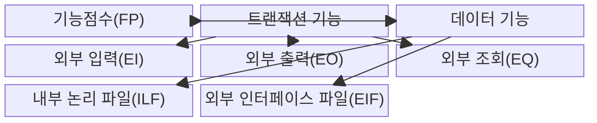
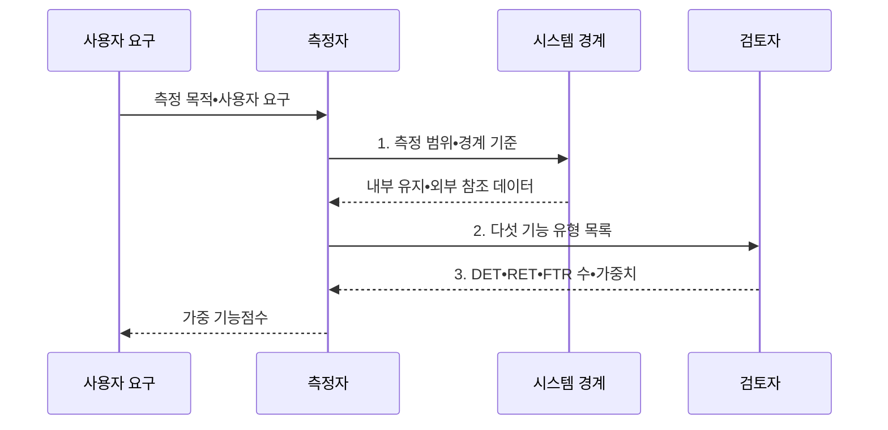

---
sidebar:
  order: 73
  label: "073. SW 기능점수 FP 측정 (Function Point)"
  badge:
    text: "기출 • 50%"
    variant: note
title: "SW 기능점수 FP 측정 (Function Point)"
date: "2026-08-03T08:48:47+09:00"
tags:
  - "notes-software"
weight: 73
extra:
  question_no: "073"
  source_status: "기출"
  source_history: "126회"
  priority: 50
  priority_note: "126회 기출, 기능점수 규모 산정의 기본 절차"
---

## Ⅰ. 개요

핵심 용어

- **기능점수(Function Point, FP)**: 구현 기술과 무관하게 사용자 관점의 입력•출력•조회•내부•외부 데이터 기능을 분류하고 가중치를 적용해 소프트웨어 논리 규모를 재는 방법이다.
- **개발 전 규모 비교**: 코드를 작성하기 전에 요구 기능을 공통 단위로 비교하는 활동이다.

- 정의/개념: 사용자 기능을 유형별로 분류하고 가중치를 적용하는 구현 독립적 **논리 규모 측정 방법 FP**
- 배경/필요성: LOC는 언어•구현 방식에 따라 **개발 전 규모 비교 불가**

#### 한줄 요약

- 건물을 지을 때 벽돌 대신 방과 화장실 개수로 크기와 가격을 매긴다.

## Ⅱ. 특징

핵심 용어

- **기술 독립적 사용자 기능**: 프로그래밍 언어나 구현 방식과 무관하게 사용자가 식별하는 기능이다.
- **EI•EO•EQ•ILF•EIF**: 입력•출력•조회 트랜잭션과 내부 유지•외부 참조 데이터를 구분한 다섯 기능 유형이다.
- **시스템 경계•복잡도 규칙**: 측정 대상의 안팎과 기능별 가중치를 일관되게 판정하는 기준이다.

- **기술 독립적 사용자 기능** 으로 논리 규모 측정
- **EI•EO•EQ•ILF•EIF** 의 수와 복잡도 합산
- **시스템 경계•복잡도 규칙** 으로 측정 편차 통제

#### 한줄 요약

- 어떤 언어를 쓰든 사용자에게 제공하는 기능을 같은 규칙으로 평가한다.

## Ⅲ. 구조 및 구성요소

핵심 용어

- **기능점수(FP)**: 다섯 기능 유형의 가중 논리 규모를 합산한 값이다.
- **트랜잭션 기능**: 사용자가 경계를 통해 데이터를 입력•출력•조회하는 EI•EO•EQ 기능이다.
- **데이터 기능**: 대상이 유지하는 ILF와 외부에서 유지해 참조하는 EIF 기능이다.

| 구성요소 | 책임 |
|:---|:---|
| 기능점수(FP) | 다섯 기능 유형의 **가중 논리 규모** 합산 |
| 트랜잭션 기능 | 경계의 **입력•출력•조회 기능** 분류 |
| 데이터 기능 | 논리 데이터의 **유지•참조 책임** 분류 |
| 외부 입력(EI) | 외부 입력으로 **내부 상태 갱신** |
| 외부 출력(EO) | 계산•가공한 **파생 정보 전달** |
| 외부 조회(EQ) | **상태 변경 없는 조회** 응답 |
| 내부 논리 파일(ILF) | 측정 대상이 **유지하는 논리 데이터** |
| 외부 인터페이스 파일(EIF) | 외부가 관리하는 **참조 데이터** |

#### 한줄 요약

- 입력•출력•조회와 내부•외부 데이터를 다섯 기능 유형으로 센다.

## Ⅳ. 흐름도

핵심 용어

- **측정 범위•경계 기준**: 측정 대상과 데이터 유지 책임을 안팎으로 구분하는 기준이다.
- **다섯 기능 유형 목록**: EI•EO•EQ•ILF•EIF로 식별한 사용자 기능 목록이다.
- **DET•RET•FTR(Data Element Type•Record Element Type•File Type Referenced)**: 사용자 식별 필드 수, 논리 파일의 하위 레코드 그룹 수, 트랜잭션이 참조•유지하는 파일 수이다.
- **가중 기능점수**: 기능 유형별 개수에 복잡도 가중치를 곱해 합산한 규모이다.
- **$N_t$•$W_t$**: 기능 유형 $t$의 개수와 해당 복잡도 가중치를 나타낸다.

**동작 원리**

- **1. 측정 범위•경계 기준**: 측정 대상과 데이터 유지 책임 분리
- **2. 다섯 기능 유형 목록**: EI•EO•EQ•ILF•EIF 식별
- **3. DET•RET•FTR 수•가중치**: 복잡도와 중복을 검토해 규모 산정

$$FP=\sum_{t \in \{EI,EO,EQ,ILF,EIF\}} N_t \times W_t$$

> 요약: 시스템 경계 안의 다섯 사용자 기능을 식별하고 복잡도 가중치를 합산

#### 한줄 요약

- 범위를 정하고 기능별 복잡도 점수를 더해 규모를 확정한다.

## Ⅴ. 종류 및 비교

핵심 용어

- **기능점수 FP(Function Point)**: 구현 전 사용자 기능의 논리 규모를 측정하는 단위이다.
- **LOC(Lines of Code, 코드 줄 수)**: 구현된 소스 코드의 물리적 줄 수로 규모를 나타내는 단위이다.

| 규모 산정 방식 | 기능점수 FP | LOC 기반 규모 산정 |
|:---|:---|:---|
| 적용 기준 | 구현 전 **논리 기능 규모** 산정 | 구현 후 **물리적 코드량** 산정 |
| 핵심 특징 | **기술 독립적 사용자 기능** 측정 | **소스 코드 라인 수** 측정 |
| 한계 | 경계•복잡도 **판정 편차** | 언어•코딩 방식별 **비교 왜곡** |

> 요약: 코드 라인은 길이, 기능점수는 기능 규모 측정

#### 한줄 요약

- 줄 수는 글자 수이고 기능점수는 사용자가 받는 기능 수를 센다.

## Ⅵ. 실무 고려사항 및 대책

핵심 용어

- **목적•경계•연계 대상**: 기능점수 측정 범위와 외부 시스템 관계를 합의하는 기준이다.
- **사용자 목적•독립 처리**: 화면이나 API가 아니라 사용자가 인식하는 독립 기능을 식별하는 기준이다.
- **비기능 요구•위험•역량**: 기능 규모 외에 비용을 좌우하므로 별도로 보정할 품질과 수행 조건이다.
- **상태 변경•계산•유지 책임**: 트랜잭션이 내부 데이터를 갱신하는지, 파생 정보를 계산하는지, 어느 시스템이 논리 데이터를 관리하는지를 판정하는 기준이다.
- **교육•동료 검토•기준 사례**: 측정 규칙을 학습하고 다른 측정자가 분류를 확인하며 동일 유형의 표준 판정 예를 재사용하는 편차 통제이다.

| 문제 | 대책 | 효과 |
|:---|:---|:---|
| 측정자마다 시스템 경계를 달리 잡아 규모 편차 발생 | **목적•경계•연계 대상** 사전 합의 | **규모 산정 편차** 감소 |
| 같은 사용자 기능을 화면•API별로 중복 계수 | **사용자 목적•독립 처리** 로 식별 | **화면•API 중복 계수** 방지 |
| 상태 변경•계산•유지 책임을 혼동해 유형 오분류 | **상태 변경•계산•유지 책임** 기록 | **기능 유형 판정** 일관성 확보 |
| DET•RET•FTR 해석 차이로 복잡도 가중치 편차 | **교육•동료 검토•기준 사례** 운영 | **측정자 해석 차이** 축소 |
| 기능점수를 비용으로 바로 환산해 품질•위험 누락 | **비기능 요구•위험•역량** 별도 보정 | **비용 추정 왜곡** 방지 |

> 적용 사례: 공공 소프트웨어 사업은 기능점수와 단가로 개발•변경 대가 산정

#### 한줄 요약

- 기획서의 사용자 기능으로 예산을 책정하고 추가 기능은 같은 규칙으로 정산한다.

## Ⅶ. 결론

핵심 용어

- **측정 경계•기능 유형•복잡도 근거**: 기능점수를 확정할 때 기록해야 하는 범위, 분류, 가중치 판정 정보이다.
- **기능점수 확정**: 검토된 기능 목록과 복잡도 가중치를 합산해 공식 규모로 승인하는 활동이다.

- **측정 경계•기능 유형•복잡도 근거** 로 기능점수 확정

#### 한줄 요약

- 구현 언어가 달라도 사용자 기능을 같은 측정 규칙으로 비교한다.
