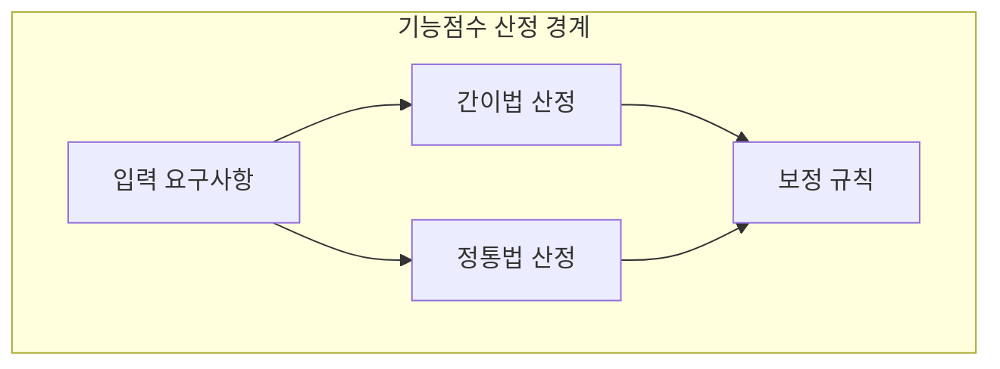
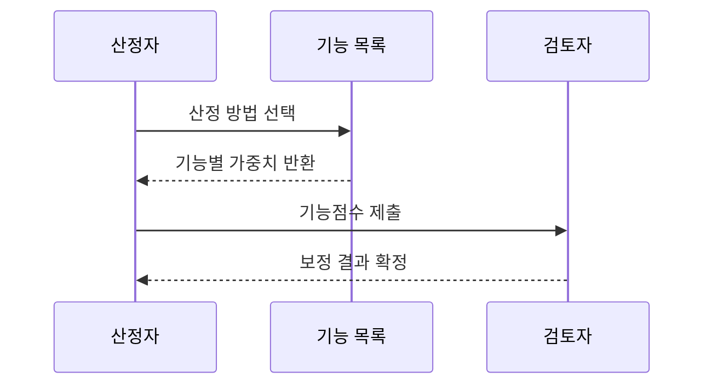

---
sidebar:
  order: 74
  label: "074. SW 기능점수 간이법·정통법 (FP Estimation Method)"
  badge:
    text: "기출 · 30%"
    variant: note
title: "SW 기능점수 간이법·정통법 (FP Estimation Method)"
date: "2026-07-25T18:06:00+09:00"
tags:
  - "notes-software"
weight: 74
extra:
  question_no: "074"
  source_status: "기출"
  source_history: "126회"
  priority: 30
  priority_note: "126회 기출, 간이·정통법은 기능점수 하위 기법"
---

## 미리 알고가기

- **소프트웨어(Software, SW)**: 기능점수로 사용자 기능의 논리 규모를 산정하는 구현 대상
- **기능점수(Function Point, FP)**: 구현 언어와 무관하게 사용자가 인식하는 데이터·트랜잭션 기능의 논리적 규모를 측정하는 단위
- **제안요청서(Request for Proposal, RFP)**: 발주자가 초기 기능 범위·조건을 제시해 간이법의 개략 견적 근거가 되는 문서
- **간이 기능점수(Estimated Function Point)**: 기능 유형별 평균 복잡도 가중치로 초기 요구의 규모를 빠르게 추정하는 방법
- **정통 기능점수(Detailed Function Point)**: 기능마다 데이터 요소와 참조 파일 수를 세어 복잡도 가중치를 판정하는 상세 측정 방법
- **미조정 기능점수(Unadjusted Function Point, UFP)**: 식별한 기능별 개수와 복잡도 가중치를 곱해 합산한 보정 전 기능 규모
- **다섯 기능 유형(Five Function Types)**: 외부입력(External Input, EI)·외부출력(External Output, EO)·외부조회(External Inquiry, EQ)·내부논리파일(Internal Logical File, ILF)·외부인터페이스파일(External Interface File, EIF)로 기능점수 산정 대상을 구분
- **데이터요소유형(Data Element Type, DET)**: 사용자가 식별하는 고유 데이터 필드 수로 트랜잭션·데이터 기능의 복잡도 판정에 사용
- **레코드요소유형(Record Element Type, RET)**: 논리 파일 내부에서 사용자가 식별하는 하위 데이터 그룹 수로 ILF·EIF 복잡도 판정에 사용
- **참조파일유형(File Type Referenced, FTR)**: 한 트랜잭션 기능이 참조하거나 갱신하는 ILF·EIF 수로 EI·EO·EQ 복잡도 판정에 사용

## Ⅰ. 개요

- **정의/개념**: 평균·상세 가중치로 기능 규모를 산정하는 두 방법
- **배경/필요성**: 요구 상세도 차이로 기능점수 산정법 선택 필요

### 쉽게 이해하기 (학습용)
- 평수만 보고 대략 견적을 내는 것과 창문까지 세어 상세 견적을 내는 것의 차이임

## Ⅱ. 특징

- 간이법은 평균 가중치로 초기 규모를 신속히 산정한다.
- 정통법은 상세 요소로 최종 규모를 정밀히 산정한다.
- 요구 구체화에 따라 간이값을 정통법으로 다시 산정한다.

### 쉽게 이해하기 (학습용)
- 간이법은 계산 항목이 적고 오차가 크며 정통법은 상세 요구가 필요함

## Ⅲ. 아키텍처 및 구성요소

| 설계 요소 | 설명 |
|:---|:---|
| 입력 요구사항 | 업무 시나리오·분석·설계 모델 |
| 간이법 산정 | 기능 유형별 평균 가중치로 UFP 계산 |
| 정통법 산정 | DET·RET·FTR로 복잡도 판정 |
| 보정 규칙 | 산정 기준의 보정 항목·계수 적용 |

> 요약: 간이법은 평균이고 정통법은 기능별 복잡도 가중치를 적용함

### 쉽게 이해하기 (학습용)
- 같은 기능을 평균 가중치나 상세 복잡도로 다르게 계산함

## Ⅳ. 원리 및 절차 흐름도

| 절차 | 설명 |
|:---|:---|
| 산정 방법 선택 | 요구 상세도로 간이·정통법 결정 |
| 기능별 가중치 반환 | 평균 또는 상세 복잡도 적용 |
| 기능점수 제출 | 기능 수와 가중치를 곱해 합산 |
| 보정 결과 확정 | 보정 기준 적용 후 결과 검증 |

> 요약: 요구 상세도에 맞춰 가중치를 선택하고 점수를 검증함

### 쉽게 이해하기 (학습용)
- 개략과 정밀 측정을 선택하고 가중치와 보정을 적용함

## Ⅴ. 종류 및 비교

| 판단 기준 | 간이법 (개략 측정법) | 정통법 (상세 측정법) |
|:---|:---|:---|
| 핵심 특징 | 개략 요구 범위 기반 조기 산정 | 상세 요구·데이터 구조 기반 산정 |
| 가중치 방식 | 기능 유형별 평균 가중치 | 요소별 상세 복잡도 판정 |
| 적용 기준 | 기획·발주 단계의 개략 예산 산정 | 설계와 종료 단계의 최종 대가 정산 |
| 주요 위험 | 초기 요구 누락·범위 변동 | 상세 분류 오류·산정 비용 |

> 요약: 간이법은 평균 가중치이고 정통법은 상세 복잡도를 적용함

### 쉽게 이해하기 (학습용)
- 초기에는 평균값, 정산에는 기능별 상세값을 적용함

## Ⅵ. 실무 사례

1. 공공 사업은 간이법으로 예산을 확보하고 정통법으로 정산함

### 쉽게 이해하기 (학습용)
- 입찰 시 간이법으로 예산을 받고 설계 후 정통법으로 정확한 잔금을 계산함

## Ⅶ. 결론

- 초기 간이법 후 요구 확정 시 정통법으로 재산정

### 쉽게 이해하기 (학습용)
- 초기에는 평균으로 예측하고 요구가 확정되면 상세 요소로 다시 계산함
