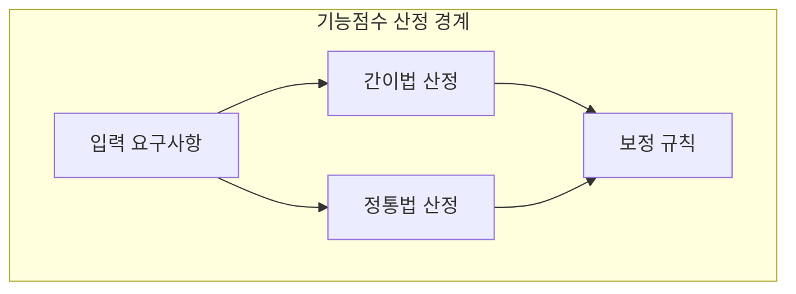
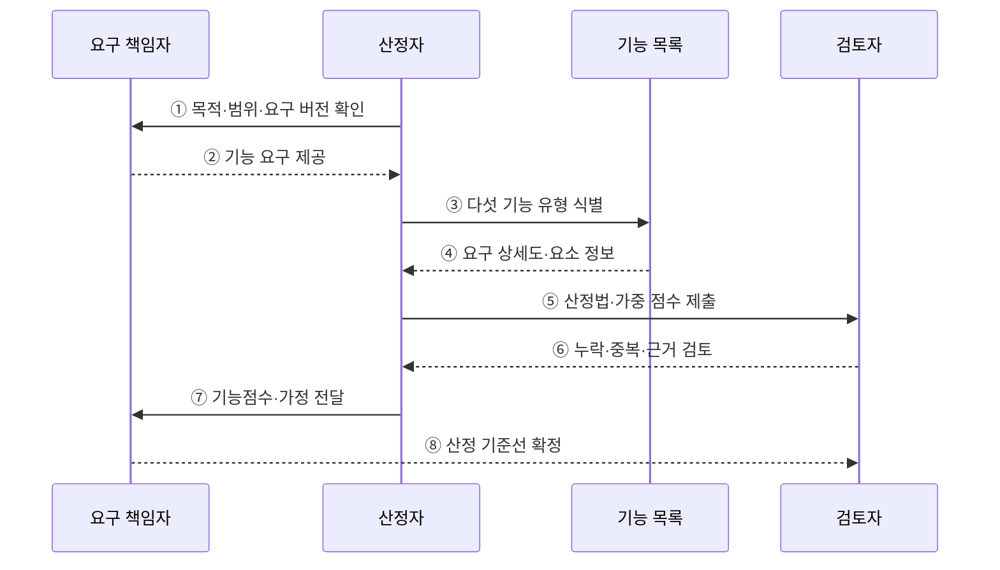

---
sidebar:
  order: 74
  label: "074. SW 기능점수 간이법·정통법 (FP Estimation Method)"
  badge:
    text: "기출 · 30%"
    variant: note
title: "SW 기능점수 간이법·정통법 (FP Estimation Method)"
date: "2026-07-27T23:59:59+09:00"
tags:
  - "notes-software"
weight: 74
extra:
  question_no: "074"
  source_status: "기출"
  source_history: "126회"
  priority: 30
  priority_note: "126회 기출, 간이·정통법은 기능점수 하위 기법"
---

## 미리 알고가기

- **소프트웨어(Software, SW)**: 기능점수로 사용자 기능의 논리 규모를 산정하는 구현 대상
- **기능점수(Function Point, FP)**: 구현 기술과 무관하게 사용자 기능의 논리 규모를 측정하는 단위
- **제안요청서(Request for Proposal, RFP)**: 발주 범위와 조건을 제시해 초기 기능점수 산정의 근거가 되는 문서
- **간이 기능점수(Estimated Function Point)**: 기능 유형별 평균 복잡도 가중치로 초기 요구의 규모를 빠르게 추정하는 방법
- **정통 기능점수(Detailed Function Point)**: 기능마다 데이터 요소와 참조 파일 수를 세어 복잡도 가중치를 판정하는 상세 측정 방법
- **미조정 기능점수(Unadjusted Function Point, UFP)**: 기능 유형별 개수와 복잡도 가중치를 합산한 보정 전 기능 규모
- **다섯 기능 유형(Five Function Types)**: External Input(EI, 이아이)·External Output(EO, 이오)·External Inquiry(EQ, 이큐)·Internal Logical File(ILF, 아이엘에프)·External Interface File(EIF, 이아이에프)의 첫 글자를 쓴 약어이며, 기능점수 산정 대상을 거래·데이터 기능으로 구분
- **데이터요소유형(Data Element Type, DET)**: ‘디이티’로 읽고 영문 첫 글자를 딴 약어이며, 사용자 식별 데이터 필드 수로 기능 복잡도를 판정
- **레코드요소유형(Record Element Type, RET)**: ‘알이티’로 읽고 영문 첫 글자를 딴 약어이며, 논리 파일의 사용자 식별 하위 그룹 수로 ILF·EIF 복잡도를 판정
- **참조파일유형(File Type Referenced, FTR)**: ‘에프티알’로 읽고 영문 첫 글자를 딴 약어이며, 트랜잭션이 참조·갱신하는 파일 수로 EI·EO·EQ 복잡도를 판정
- **산정 기준선(Estimation Baseline)**: 기능점수의 범위·요구 버전·판정 규칙을 고정해 변경 전후 규모를 비교하는 기준

## Ⅰ. 개요

- 정의/개념: **평균·상세 가중치** 기반 기능점수 산정법
- 기존 한계: 단일 산정법은 **초기 정보 부족·정밀도 요구** 대응 곤란

### 쉽게 이해하기 (학습용)

- 평수만 보고 대략 견적을 내는 것과 창문까지 세어 상세 견적을 내는 것의 차이다.

## Ⅱ. 특징

- **간이법**은 평균 가중치로 초기 규모 신속 산정
- **정통법**은 DET·RET·FTR로 복잡도 판정
- 요구 구체화 시 **간이값을 정통법으로 재산정**

### 쉽게 이해하기 (학습용)

- 간이법은 계산 항목이 적고 정통법은 상세 요구로 기능별 복잡도를 판정한다.

## Ⅲ. 아키텍처 및 구성요소

**도표안 A — 구조도**

**도표안 B — sequenceDiagram**

| 설계 요소 | 설명 |
|:---|:---|
| 입력 요구사항 | 업무 범위·기능 목록 제공 |
| 간이법 산정 | 기능 유형별 평균 가중치 적용 |
| 정통법 산정 | DET·RET·FTR로 복잡도 판정 |
| 검증 기준 | 기능 누락·중복과 산정 근거 검토 |

**동작 원리**

- ① 산정 목적·시스템 경계·대상 요구 버전을 확인한다.
- ② 요구 책임자가 사용자 기능과 데이터 요구를 제공한다.
- ③ 산정자가 EI·EO·EQ·ILF·EIF 기능을 식별한다.
- ④ 기능 목록에서 요구 상세도와 DET·RET·FTR 정보를 확인한다.
- ⑤ 초기 정보면 평균 가중치, 상세 정보면 복잡도 가중치로 점수를 산정한다.
- ⑥ 검토자가 기능 누락·중복·유형·가중치 근거를 확인한다.
- ⑦ 확정 기능점수와 경계·가정·제외 범위를 요구 책임자에게 전달한다.
- ⑧ 검토자가 이후 변경 비교에 사용할 산정 기준선을 확정한다.

> 요약: 요구 상세도에 맞는 가중치를 선택하고 판정 근거와 함께 기능점수를 확정한다.

### 쉽게 이해하기 (학습용)

- 정보가 적을 때는 평균값, 상세할 때는 기능별 복잡도로 계산한다.

## Ⅳ. 종류 및 비교

| 기능점수 산정법 | 간이법 | 정통법 |
|:---|:---|:---|
| 적용 기준 | 기획·발주의 **개략 예산** 산정 | 설계·종료의 **최종 대가** 정산 |
| 핵심 특징 | 기능 유형별 **평균 가중치** | 요소별 **상세 복잡도 가중치** |
| 한계 | 요구 누락·범위 변동에 **민감** | 상세 분류 오류·**산정 비용 증가** |

> 요약: 간이법은 평균 가중치이고 정통법은 상세 복잡도를 적용함

### 쉽게 이해하기 (학습용)

- 초기에는 평균값, 요구가 확정되면 기능별 상세값을 적용한다.

## Ⅴ. 실무 고려사항 및 대책

| 고려사항 | 문제점 | 대책 |
|:---|:---|:---|
| 정보 수준 불일치 | 초기 요구에 정통법을 억지 적용해 가짜 정밀도 발생 | 상세도에 맞춰 간이법을 쓰고 요구 확정 후 재산정 |
| 경계 변경 | 산정 사이에 대상 범위가 달라져 점수 비교 불가 | 경계·요구 버전·제외 범위를 기준선으로 고정 |
| 기능 중복·누락 | 화면·API 중심 집계로 논리 기능 왜곡 | 사용자 목적과 독립 처리 기준으로 목록 검토 |
| 가중치 혼용 | 간이·정통 규칙이 한 산정에 섞임 | 적용 방법·규칙 판본·복잡도 근거를 명시 |
| 차이 설명 부족 | 초기값과 확정값의 변화 원인을 알 수 없음 | 요구 추가·삭제·복잡도 변경별 증감 내역 추적 |

> 적용 사례: 공공 소프트웨어 사업은 초기 예산에 간이법을 활용하고 상세 요구 확정 후 정통법으로 재산정할 수 있다.

### 쉽게 이해하기 (학습용)

- 초기에는 개략 예산을 세우고 상세 요구가 정해지면 같은 범위를 정밀하게 다시 계산한다.

## Ⅵ. 결론

- 간이법은 정보가 적은 초기 추정에, 정통법은 상세 요구의 확정 규모에 적합하다.
- 같은 경계와 판정 근거를 유지해 초기값과 재산정값의 차이를 설명한다.

### 쉽게 이해하기 (학습용)

- 초기에는 평균으로 예측하고 요구가 확정되면 상세 요소로 다시 계산한다.
