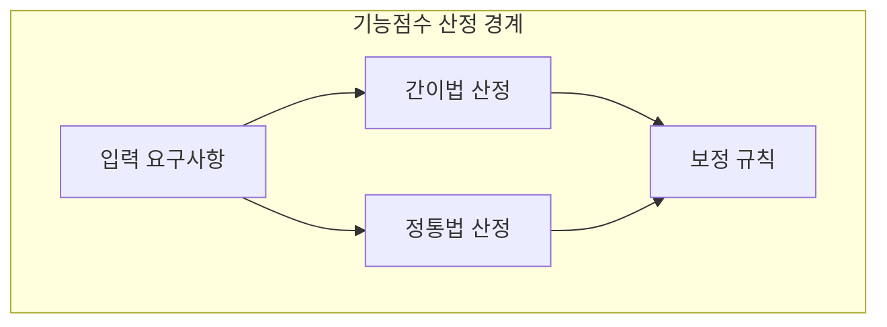
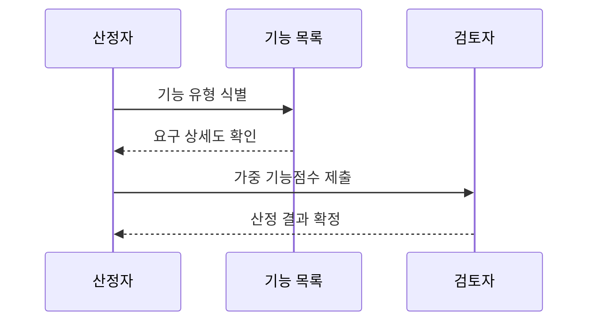

---
sidebar:
  order: 74
  label: "074. SW 기능점수 간이법·정통법 (FP Estimation Method)"
  badge:
    text: "기출 · 30%"
    variant: note
title: "SW 기능점수 간이법·정통법 (FP Estimation Method)"
date: "2026-07-27T23:59:59+09:00"
tags:
  - "notes-software"
weight: 74
extra:
  question_no: "074"
  source_status: "기출"
  source_history: "126회"
  priority: 30
  priority_note: "126회 기출, 간이·정통법은 기능점수 하위 기법"
---

## 미리 알고가기

- **소프트웨어(Software, SW)**: ‘에스더블유’로 읽고 영문 첫 글자를 딴 약어이며, 기능점수로 논리 규모를 산정할 구현 대상
- **기능점수(Function Point, FP)**: ‘에프피’로 읽고 영문 첫 글자를 딴 약어이며, 사용자 기능의 논리 규모를 측정하는 단위
- **제안요청서(Request for Proposal, RFP)**: ‘알에프피’로 읽고 영문 첫 글자를 딴 약어이며, 발주 범위·조건을 제시하는 개략 견적 근거
- **간이 기능점수(Estimated Function Point)**: 기능 유형별 평균 복잡도 가중치로 초기 요구의 규모를 빠르게 추정하는 방법
- **정통 기능점수(Detailed Function Point)**: 기능마다 데이터 요소와 참조 파일 수를 세어 복잡도 가중치를 판정하는 상세 측정 방법
- **미조정 기능점수(Unadjusted Function Point, UFP)**: ‘유에프피’로 읽고 영문 첫 글자를 딴 약어이며, 기능 수와 복잡도 가중치를 합산한 보정 전 규모
- **다섯 기능 유형(Five Function Types)**: External Input(EI, 이아이)·External Output(EO, 이오)·External Inquiry(EQ, 이큐)·Internal Logical File(ILF, 아이엘에프)·External Interface File(EIF, 이아이에프)의 첫 글자를 쓴 약어이며, 기능점수 산정 대상을 거래·데이터 기능으로 구분
- **데이터요소유형(Data Element Type, DET)**: ‘디이티’로 읽고 영문 첫 글자를 딴 약어이며, 사용자 식별 데이터 필드 수로 기능 복잡도를 판정
- **레코드요소유형(Record Element Type, RET)**: ‘알이티’로 읽고 영문 첫 글자를 딴 약어이며, 논리 파일의 사용자 식별 하위 그룹 수로 ILF·EIF 복잡도를 판정
- **참조파일유형(File Type Referenced, FTR)**: ‘에프티알’로 읽고 영문 첫 글자를 딴 약어이며, 트랜잭션이 참조·갱신하는 파일 수로 EI·EO·EQ 복잡도를 판정

## Ⅰ. 개요

- 정의/개념: **평균·상세 가중치** 기반 기능점수 산정법
- 기존 한계: 단일 산정법은 **초기 정보 부족·정밀도 요구** 대응 곤란

### 쉽게 이해하기 (학습용)
- 평수만 보고 대략 견적을 내는 것과 창문까지 세어 상세 견적을 내는 것의 차이임

## Ⅱ. 특징

- **간이법**은 평균 가중치로 초기 규모 신속 산정
- **정통법**은 DET·RET·FTR로 복잡도 판정
- 요구 구체화 시 **간이값을 정통법으로 재산정**

### 쉽게 이해하기 (학습용)
- 간이법은 계산 항목이 적고 오차가 크며 정통법은 상세 요구가 필요함

## Ⅲ. 아키텍처 및 구성요소

| 설계 요소 | 설명 |
|:---|:---|
| 입력 요구사항 | **업무 범위·기능 목록** 제공 |
| 간이법 산정 | 기능 유형별 **평균 가중치** 적용 |
| 정통법 산정 | **DET·RET·FTR**로 복잡도 판정 |
| 검증 기준 | 기능 누락·중복과 **산정 근거** 검토 |

> 요약: 간이법은 평균이고 정통법은 기능별 복잡도 가중치를 적용함

### 쉽게 이해하기 (학습용)
- 같은 기능을 평균 가중치나 상세 복잡도로 다르게 계산함

## Ⅳ. 원리 및 절차 흐름도

| 절차 | 설명 |
|:---|:---|
| 기능 유형 식별 | **EI·EO·EQ·ILF·EIF** 분류 |
| 요구 상세도 확인 | 정보 수준으로 **간이·정통법** 선택 |
| 가중 기능점수 제출 | 기능 수와 **가중치 곱을 합산** |
| 산정 결과 확정 | 누락·중복·근거 **검토 후 승인** |

> 요약: 요구 상세도에 맞춰 가중치를 선택하고 점수를 검증함

### 쉽게 이해하기 (학습용)
- 개략과 정밀 측정을 선택하고 가중치와 보정을 적용함

## Ⅴ. 종류 및 비교

| 기능점수 산정법 | 간이법 | 정통법 |
|:---|:---|:---|
| 적용 기준 | 기획·발주의 **개략 예산** 산정 | 설계·종료의 **최종 대가** 정산 |
| 핵심 특징 | 기능 유형별 **평균 가중치** | 요소별 **상세 복잡도 가중치** |
| 한계 | 요구 누락·범위 변동에 **민감** | 상세 분류 오류·**산정 비용 증가** |

> 요약: 간이법은 평균 가중치이고 정통법은 상세 복잡도를 적용함

### 쉽게 이해하기 (학습용)
- 초기에는 평균값, 정산에는 기능별 상세값을 적용함

## Ⅵ. 실무 사례

1. 공공 사업은 **간이법 예산·정통법 정산** 적용

### 쉽게 이해하기 (학습용)
- 입찰 시 간이법으로 예산을 받고 설계 후 정통법으로 정확한 잔금을 계산함

## Ⅶ. 결론

- 초기에는 **간이법**, 요구 확정 후 **정통법** 적용

### 쉽게 이해하기 (학습용)
- 초기에는 평균으로 예측하고 요구가 확정되면 상세 요소로 다시 계산함
