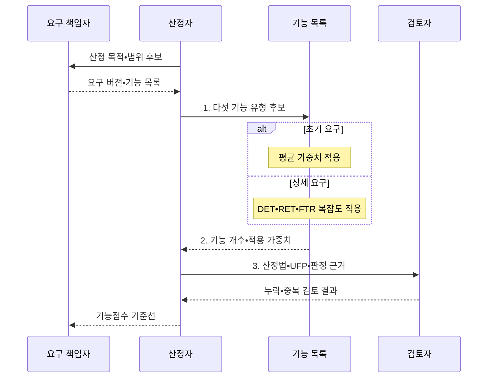

---
sidebar:
  order: 74
  label: "074. SW 기능점수 간이법•정통법 (FP Estimation Method)"
  badge:
    text: "기출 • 30%"
    variant: note
title: "SW 기능점수 간이법•정통법 (FP Estimation Method)"
date: "2026-08-05T04:00:00+09:00"
tags:
  - "notes-software"
weight: 74
extra:
  question_no: "074"
  source_status: "기출"
  source_history: "126회"
  priority: 30
  priority_note: "126회 기출, 간이•정통법은 기능점수 하위 기법"
---

## Ⅰ. 개요

<details>
<summary>핵심 용어</summary>

- **기능점수(Function Point, FP)**: 사용자 기능의 논리 규모를 측정하는 단위다.
- **간이법(Simplified Method)**: 기능 유형별 평균 가중치로 FP를 추정하는 방법이다.
- **정통법(Detailed Method)**: 복잡도별 가중치로 FP를 계산하는 방법이다.
- **정통법 산정 불가**: DET•RET•FTR 정보가 부족해 기능별 복잡도를 상세 판정할 수 없는 상태이다.

</details>

- 정의/개념: 평균 가중치의 간이법과 상세 복잡도 가중치의 정통법으로 기능점수를 구하는 **FP 하위 산정법**
- 배경/필요성: 불완전한 초기 요구에는 DET•RET•FTR이 없어 **정통법 산정 불가**

#### 한줄 요약

- 평수만 보고 대략 견적을 내는 것과 창문까지 세어 상세 견적을 내는 것의 차이다.

## Ⅱ. 특징

<details>
<summary>핵심 용어</summary>

- **간이값을 정통법으로 재산정**: 요구가 구체화되면 초기 추정치를 상세 근거로 다시 계산하는 절차이다.

</details>

- **간이법** 은 평균 가중치로 초기 규모 신속 산정
- **정통법** 은 DET•RET•FTR로 복잡도 판정
- 요구 구체화 시 **간이값을 정통법으로 재산정**

#### 한줄 요약

- 간이법은 계산 항목이 적고 정통법은 상세 요구로 기능별 복잡도를 판정한다.

## Ⅲ. 구조 및 구성요소

<details>
<summary>핵심 용어</summary>

- **업무 범위(Business Scope)**: 기능점수 측정에 포함할 업무 경계다.
- **기능 목록(Function List)**: 측정 대상으로 식별한 사용자 기능 집합이다.
- **요구 상세도(Requirement Detail)**: 기능 복잡도를 판정할 수 있는 요구 구체성이다.
- **평균 가중치**: 간이법에서 기능 유형별로 동일하게 적용하는 대표 복잡도 값이다.
- **데이터 요소 유형(Data Element Type, DET)**: 사용자가 식별하는 필드 유형이다.
- **레코드 요소 유형(Record Element Type, RET)**: 논리 파일의 하위 레코드 그룹 유형이다.
- **참조 파일 유형(File Type Referenced, FTR)**: 트랜잭션이 참조하거나 유지하는 파일 유형이다.

</details>

```text
                   [간이법 산정]
                    /          \
[입력 요구사항]                  [검증 기준]
                    \          /
                   [정통법 산정]
```

선의 의미: 입력 요구사항의 상세도에 따라 간이법 산정 또는 정통법 산정이 적용되며, 두 산정 결과는 동일한 검증 기준으로 누락•중복과 근거를 확인한다.

| 구성요소 | 책임 |
|:---|:---|
| 입력 요구사항 | **업무 범위•기능 목록•상세도** 제공 |
| 간이법 산정 | 기능 유형별 **평균 가중치** 적용 |
| 정통법 산정 | **DET•RET•FTR** 로 복잡도 판정 |
| 검증 기준 | **기능 누락•중복•산정 근거** 검토 |

#### 한줄 요약

- 요구 상세도에 따라 평균 가중치나 상세 복잡도 가중치를 적용한다.

## Ⅳ. 흐름도

<details>
<summary>핵심 용어</summary>

- **외부 입력(External Input, EI)**: 외부에서 내부 논리 파일을 변경하는 기능이다.
- **외부 출력(External Output, EO)**: 계산을 포함해 외부로 데이터를 내보내는 기능이다.
- **외부 조회(External Inquiry, EQ)**: 계산 없이 데이터를 조회하는 기능이다.
- **내부 논리 파일(Internal Logical File, ILF)**: 측정 대상이 유지하는 논리 데이터다.
- **외부 연계 파일(External Interface File, EIF)**: 외부가 유지하고 측정 대상이 참조하는 데이터다.
- **산정법(Estimation Method)**: 기능점수 계산에 적용한 방법이다.
- **판정 근거(Estimation Rationale)**: 기능 분류와 가중치를 선택한 이유다.
- **기능점수 기준선**: 요구 버전•범위•규칙을 고정해 변경 전후 규모를 비교하는 기준이다.
- **미조정 기능점수(Unadjusted Function Point, UFP)**: 다섯 기능 유형의 개수와 복잡도 가중치를 합산한 조정 전 기능점수이다.

</details>



**동작 원리**

- **1. 다섯 기능 유형 후보**: EI•EO•EQ•ILF•EIF 식별
- **2. 기능 개수•적용 가중치**: 간이 평균값 또는 상세 복잡도 적용
- **3. 산정법•UFP•판정 근거**: 누락•중복을 검토해 기준선 확정

> 요약: 요구 상세도에 맞는 가중치를 선택하고 판정 근거와 함께 기능점수 확정

#### 한줄 요약

- 정보가 적을 때는 평균값, 상세할 때는 기능별 복잡도로 계산한다.

## Ⅴ. 종류 및 비교

<details>
<summary>핵심 용어</summary>

- **개략 예산**: 초기 요구의 기능 개수와 평균 가중치로 빠르게 추정한 비용 범위이다.
- **최종 대가**: 상세 요구와 기능별 복잡도를 근거로 계약 종료 시 확정하는 비용이다.
- **상세 복잡도 가중치**: DET•RET•FTR 조합으로 기능마다 판정한 정통법의 값이다.

</details>

| 기능점수 산정법 | 간이법 | 정통법 |
|:---|:---|:---|
| 적용 기준 | 기획•발주의 **개략 예산** 산정 | 설계•종료의 **최종 대가** 정산 |
| 핵심 특징 | 기능 유형별 **평균 가중치** | 요소별 **상세 복잡도 가중치** |
| 한계 | 요구 누락•범위 변동에 **민감** | 상세 분류 오류•**산정 비용 증가** |

> 요약: 간이법은 평균 가중치이고 정통법은 상세 복잡도를 적용함

#### 한줄 요약

- 초기에는 평균값, 요구가 확정되면 기능별 상세값을 적용한다.

## Ⅵ. 실무 고려사항 및 대책

<details>
<summary>핵심 용어</summary>

- **가짜 정밀도(False Precision)**: 불충분한 입력으로 계산한 값을 실제보다 정확해 보이게 제시하는 오류이다.
- **측정 경계(Measurement Boundary)**: 산정값 비교를 위해 고정할 시스템 안팎의 기준이다.
- **요구 버전(Requirement Version)**: 기능점수 산정에 사용한 요구의 판본이다.
- **제외 범위(Exclusion Scope)**: 기능점수 산정에서 빼기로 합의한 대상이다.
- **규칙 판본(Rule Version)**: 산정에 사용한 가중치 규칙의 버전이다.
- **사용자 목적(User Goal)**: 사용자가 인식하는 완결된 업무 목표다.
- **독립 처리(Elementary Process)**: 화면과 API 구현에 무관한 최소 기능 단위다.
- **추가 증감(Addition Delta)**: 새 기능이 점수에 더한 값이다.
- **삭제 증감(Deletion Delta)**: 제거 기능이 점수에서 빠진 값이다.
- **복잡도 증감(Complexity Delta)**: 복잡도 등급 변화가 점수에 미친 값이다.

</details>

| 문제 | 대책 | 효과 |
|:---|:---|:---|
| 초기 요구에 정통법을 적용해 가짜 정밀도 발생 | **초기 간이법•요구 확정 후 재산정** | **가짜 정밀도** 방지 |
| 시스템 경계•요구 버전 변경으로 산정값 비교 불가 | **경계•버전•제외 범위** 기준선 고정 | **산정값 비교 가능성** 확보 |
| 같은 기능을 화면•API별로 세거나 요구 기능 누락 | **사용자 목적•독립 처리** 로 검토 | **논리 기능 왜곡** 방지 |
| 간이•정통 가중치와 다른 규칙 판본을 혼용 | **산정법•규칙 판본•근거** 명시 | **산정 규칙 일관성** 확보 |
| 재산정 총점만 제시해 변화 원인을 설명하지 못함 | **추가•삭제•복잡도별 증감** 추적 | **재산정 변화 원인** 설명 |

> 적용 사례: 공공 소프트웨어 사업은 초기 간이법 후 상세 요구로 정통법 재산정

#### 한줄 요약

- 초기에는 개략 예산을 세우고 상세 요구가 정해지면 같은 범위를 정밀하게 다시 계산한다.

## Ⅶ. 결론

<details>
<summary>핵심 용어</summary>


</details>

- 초기•개략 예산은 **간이법**, 상세•최종 정산은 **정통법** 선택

#### 한줄 요약

- 초기에는 평균으로 예측하고 요구가 확정되면 상세 요소로 다시 계산한다.
