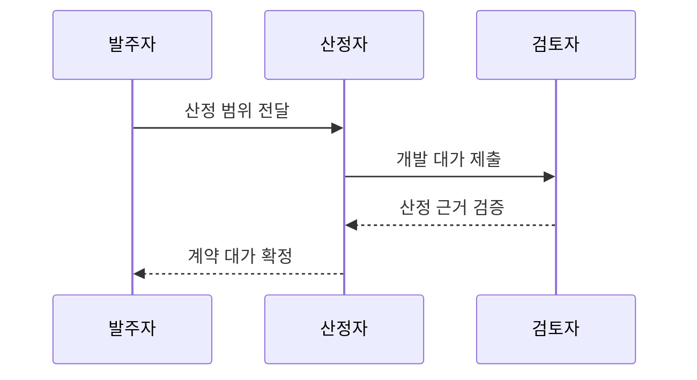

---
sidebar:
  order: 75
  label: "075. 소프트웨어 대가산정 (SW Cost Estimation)"
  badge:
    text: "기출 · 70%"
    variant: note
title: "소프트웨어 대가산정 (SW Cost Estimation)"
date: "2026-07-25T18:07:00+09:00"
tags:
  - "notes-software"
weight: 75
extra:
  question_no: "075"
  source_status: "기출"
  source_history: "135회, 138회"
  priority: 70
  priority_note: "135·138회 반복, 대가산정 기준과 절차 핵심"
---

## 미리 알고가기

- **소프트웨어 대가산정(Software Cost Estimation, SW Cost Estimation)**: 합의한 개발 범위의 기능 규모·공수에 단가와 허용 보정을 적용해 계약 비용을 산출하는 활동
- **작업분할구조(Work Breakdown Structure, WBS)**: 전체 개발 범위를 산정·책임 가능한 작업 패키지로 분해해 상향식 공수 합산의 기준을 만드는 구조
- **기능점수(Function Point, FP)**: 구현 언어와 무관하게 사용자가 인식하는 데이터·트랜잭션 기능의 논리적 규모를 측정하는 단위
- **코드 줄 수(Lines of Code, LOC)**: 구현된 소스 코드의 물리적 줄 수로 완료 코드 규모나 비용 모형 입력에 쓰는 값
- **인월(Man-Month, M/M, 맨 먼스)**: M/M은 한 사람의 한 달 투입을 뜻하는 Man-Month의 두 단어 첫 글자를 슬래시로 구분한 공수 단위
- **상향식 산정(Bottom-up Estimation)**: 작업 패키지별 규모·공수·비용을 계산한 뒤 합산해 전체 대가를 구하는 방식
- **하향식 산정(Top-down Estimation)**: 유사 사업이나 전문가 판단으로 전체 비용을 먼저 추정한 뒤 세부 항목에 배분하는 방식
- **직무 단가(Job Costing Rate)**: 역할·숙련 등급별 한 단위 공수의 비용으로 인월을 화폐 금액으로 환산하는 기준
- **범위 기준선(Scope Baseline)**: 계약 당사자가 승인한 기능·작업 패키지 경계로 최초 대가와 변경 대가의 비교 기준
- **보정 요소(Adjustment Factor)**: 연계·성능·운영 조건처럼 공통 산식만으로 반영되지 않은 비용 영향을 허용 기준에 따라 조정하는 항목
- **산정 불확실성(Estimation Uncertainty)**: 초기 정보 부족으로 실제 비용이 추정값과 달라질 수 있는 범위로, 예비 견적의 오차와 재산정 시점을 정하는 근거
- **변경 대가(Change Cost)**: 승인된 범위 기준선 이후 추가·변경된 기능과 작업에 대해 다시 산정하는 계약 비용

## Ⅰ. 개요

- **정의/개념**: 개발 범위·규모·공수를 계약 비용으로 환산
- **배경/필요성**: 범위·생산성 불확실성으로 근거 기반 산정 필요

### 쉽게 이해하기 (학습용)
- 눈대중이 아닌 규격과 난이도에 표준 단가를 대입해 가격을 정하는 기준임

## Ⅱ. 특징

- 요구 범위·기능 규모·기술 복잡도를 함께 반영한다.
- 초기 견적은 불확실성 범위·재산정 시점을 명시한다.
- 범위 기준선으로 추가·변경 대가를 분리한다.

### 쉽게 이해하기 (학습용)
- 개발 범위와 난이도를 고려하고 변경 시 가격을 다시 계산하는 기준임

## Ⅲ. 아키텍처 및 구성요소

| 설계 요소 | 설명 |
|:---|:---|
| 범위 기준선 | 산정 대상·작업 패키지 경계 |
| 규모·공수 모델 | 기능점수·코드로 규모·노력 측정 |
| 적용 단가 | 기능 규모·공수를 비용으로 환산 |
| 보정 요소 | 연계·성능 등 허용 비용 영향 반영 |

> 요약: 범위와 공수를 단가와 보정 요소로 비용화함

### 쉽게 이해하기 (학습용)
- 일의 범위와 규모에 단가와 허용 보정을 적용하는 구조임

## Ⅳ. 원리 및 절차 흐름도

| 절차 | 설명 |
|:---|:---|
| 산정 범위 전달 | 요구사항과 작업 경계 확정 |
| 개발 대가 제출 | 규모·공수에 단가와 보정 적용 |
| 산정 근거 검증 | 중복·누락·변경 조건 검토 |
| 계약 대가 확정 | 입력 근거를 계약 기준선으로 승인 |

> 요약: 범위와 단가 및 보정 근거로 계약 대가를 확정함

### 쉽게 이해하기 (학습용)
- 범위를 재고 단가와 보정을 적용해 견적 근거를 확정함

## Ⅴ. 종류 및 비교

| 판단 기준 | 체계적 대가산정 (상향식·기능점수식) | 단순 경험 추정 (하향식) |
|:---|:---|:---|
| 핵심 특징 | 작업 구조·공수·단가 기반 | 유사 사업·전문가 판단 기반 |
| 결과 재현성 | 입력값·산식·근거로 재현 | 산정자별 편차가 큼 |
| 적용 기준 | 예산·계약·정산 대가 산정 | 정보가 적은 초기 추정 |
| 주요 위험 | 작업 누락·가정 변경 | 전문가 편향·유사성 오판 |

> 요약: 초기에는 경험이고 계약 정산에는 근거를 사용함

### 쉽게 이해하기 (학습용)
- 초기에는 경험값, 계약에는 작업별 규모와 단가를 사용함

## Ⅵ. 실무 사례

1. 공공 소프트웨어 발주는 기능점수·표준 단가로 개발비 산정

### 쉽게 이해하기 (학습용)
- 공공 발주는 사용자 기능 규모와 표준 가격표를 대조해 개발비를 정함

## Ⅶ. 결론

- 보정 근거·오차를 공개하고 변경 시 재산정

### 쉽게 이해하기 (학습용)
- 최초 범위와 변경 범위를 나눠 같은 산정 기준으로 비용을 다시 계산함
