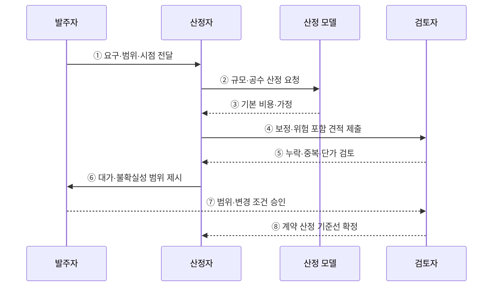

---
sidebar:
  order: 75
  label: "075. 소프트웨어 대가산정 (SW Cost Estimation)"
  badge:
    text: "기출 · 70%"
    variant: note
title: "소프트웨어 대가산정 (SW Cost Estimation)"
date: "2026-07-27T23:59:59+09:00"
tags:
  - "notes-software"
weight: 75
extra:
  question_no: "075"
  source_status: "기출"
  source_history: "135회, 138회"
  priority: 70
  priority_note: "135·138회 반복, 대가산정 기준과 절차 핵심"
---

## 미리 알고가기

- **소프트웨어 대가산정(Software Cost Estimation, SW Cost Estimation)**: ‘에스더블유 대가산정’으로 읽고 SW는 영문 첫 글자를 딴 약어이며, 개발 규모·공수·단가로 계약 비용을 산출하는 활동
- **작업분할구조(Work Breakdown Structure, WBS)**: ‘더블유비에스’로 읽고 영문 첫 글자를 딴 약어이며, 개발 범위를 책임 가능한 작업 패키지로 분해하는 구조
- **기능점수(Function Point, FP)**: ‘에프피’로 읽고 영문 첫 글자를 딴 약어이며, 사용자 기능의 논리 규모를 측정하는 단위
- **코드 줄 수(Lines of Code, LOC)**: ‘엘오시’로 읽고 영문 핵심어의 첫 글자를 딴 약어이며, 구현된 소스 코드의 물리적 줄 수
- **인월(Man-Month, M/M)**: ‘맨 먼스’ 또는 ‘엠 슬래시 엠’으로 읽고 두 영단어의 첫 글자를 슬래시로 구분한 표기이며, 한 사람의 한 달 투입을 나타내는 공수 단위
- **상향식 산정(Bottom-up Estimation)**: 작업 패키지별 규모·공수·비용을 계산한 뒤 합산해 전체 대가를 구하는 방식
- **하향식 산정(Top-down Estimation)**: 유사 사업이나 전문가 판단으로 전체 비용을 먼저 추정한 뒤 세부 항목에 배분하는 방식
- **직무 단가(Job Costing Rate)**: 역할·숙련 등급별 한 단위 공수의 비용으로 인월을 화폐 금액으로 환산하는 기준
- **범위 기준선(Scope Baseline)**: 계약 당사자가 승인한 기능·작업 패키지 경계로 최초 대가와 변경 대가의 비교 기준
- **보정 요소(Adjustment Factor)**: 연계·성능·운영 조건처럼 공통 산식만으로 반영되지 않은 비용 영향을 허용 기준에 따라 조정하는 항목
- **산정 불확실성(Estimation Uncertainty)**: 초기 정보 부족으로 실제 비용이 추정값과 달라질 수 있는 범위로, 예비 견적의 오차와 재산정 시점을 정하는 근거
- **변경 대가(Change Cost)**: 승인된 범위 기준선 이후 추가·변경된 기능과 작업에 대해 다시 산정하는 계약 비용
- **예비비(Contingency)**: 식별한 산정 불확실성과 위험이 현실화될 때 사용할 목적으로 별도 반영한 비용

## Ⅰ. 개요

- 정의/개념: **개발 규모·공수·단가**의 계약 비용 환산
- 기존 한계: 경험 견적은 **범위 누락·산정자 편차** 발생

### 쉽게 이해하기 (학습용)

- 눈대중이 아닌 범위·규모·난이도와 단가 근거로 가격을 정하는 활동이다.

## Ⅱ. 특징

- **범위·기능 규모·기술 복잡도**를 함께 반영
- **산정 근거·불확실성 범위**로 견적 검증
- **범위 기준선**으로 추가·변경 대가 분리

### 쉽게 이해하기 (학습용)

- 개발 범위와 난이도를 고려하고 변경 시 같은 기준으로 가격을 다시 계산한다.

## Ⅲ. 아키텍처 및 구성요소

**도표안 A — 구조도**

**도표안 B — sequenceDiagram**

| 설계 요소 | 설명 |
|:---|:---|
| 범위 기준선 | 산정 대상·작업 경계 확정 |
| 규모·공수 모델 | 기능점수·WBS로 규모·노력 산정 |
| 적용 단가 | 규모·공수를 화폐 비용으로 환산 |
| 보정 요소 | 연계·성능 등 추가 영향 반영 |

**동작 원리**

- ① 발주자가 요구사항·작업 경계·산정 시점의 정보 수준을 전달한다.
- ② 산정자가 기능점수·WBS 등 적합한 모델로 규모와 공수를 요청한다.
- ③ 산정 모델이 기본 비용과 생산성·단가 가정을 반환한다.
- ④ 산정자가 연계·성능·운영 조건과 위험·예비비를 반영해 제출한다.
- ⑤ 검토자가 범위 누락·중복·단가 출처·보정 근거를 확인한다.
- ⑥ 산정자가 단일값뿐 아니라 가정과 불확실성 범위를 제시한다.
- ⑦ 발주자가 범위와 변경 대가를 다시 산정할 조건을 승인한다.
- ⑧ 검토자가 계약과 이후 변경 비교에 사용할 기준선을 확정한다.

> 요약: 승인 범위의 규모·공수에 단가와 보정 근거를 적용해 계약 비용을 확정한다.

### 쉽게 이해하기 (학습용)

- 일의 범위와 규모에 단가와 위험 보정을 적용하고 근거를 함께 남긴다.

## Ⅳ. 종류 및 비교

| 대가산정 방식 | 상향식 산정 | 하향식 산정 |
|:---|:---|:---|
| 적용 기준 | 상세 범위의 **계약·정산** 산정 | 정보가 적은 **초기 개략** 추정 |
| 핵심 특징 | 작업별 **규모·공수·단가 합산** | 유사 사업·**전문가 판단** 배분 |
| 한계 | 작업 누락·**상세 산정 비용** | 전문가 편향·**유사성 오판** |

> 요약: 초기 정보가 적으면 하향식, 상세 범위가 있으면 상향식 근거를 사용한다.

### 쉽게 이해하기 (학습용)

- 초기에는 유사 경험값, 계약에는 작업별 규모와 단가를 사용한다.

## Ⅴ. 실무 고려사항 및 대책

| 고려사항 | 문제점 | 대책 |
|:---|:---|:---|
| 범위 불명확 | 누락 기능과 해석 차이가 계약 분쟁으로 연결 | 포함·제외·인수 조건과 범위 기준선 명시 |
| 단일값 견적 | 초기 불확실성을 숨겨 확정 비용처럼 오해 | 가정·오차 범위·재산정 시점과 예비비 제시 |
| 생산성 낙관 | 이상적 공수만 적용해 일정·비용 부족 | 유사 실적·팀 역량·환경 데이터를 근거로 보정 |
| 이중 계산 | 기본 규모와 보정 요소에 같은 난이도 중복 반영 | 보정 항목별 정의·근거·중복 검토 수행 |
| 변경 통제 부재 | 추가 요구가 기존 대가에 무상 포함 | 변경 기능·작업을 같은 기준으로 별도 산정 |

> 적용 사례: 공공 소프트웨어 발주는 적용 지침에 따라 기능 규모와 단가 근거로 개발비를 산정한다.

### 쉽게 이해하기 (학습용)

- 사용자 기능 규모와 적용 가능한 가격 근거를 대조해 개발비를 정한다.

## Ⅵ. 결론

- 소프트웨어 대가산정은 승인 범위의 규모·공수·단가·위험을 추적 가능한 계약 비용으로 바꾼다.
- 정보 수준에 맞는 산정법과 불확실성 범위·재산정 조건을 함께 명시한다.

### 쉽게 이해하기 (학습용)

- 최초 범위와 변경 범위를 나눠 같은 산정 기준으로 비용을 다시 계산한다.
