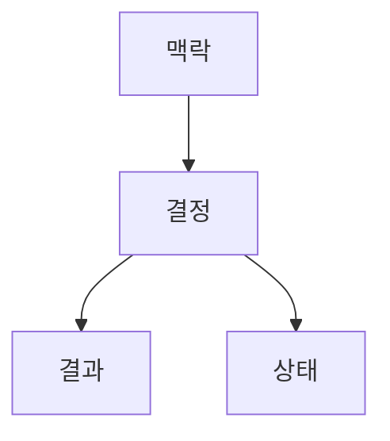
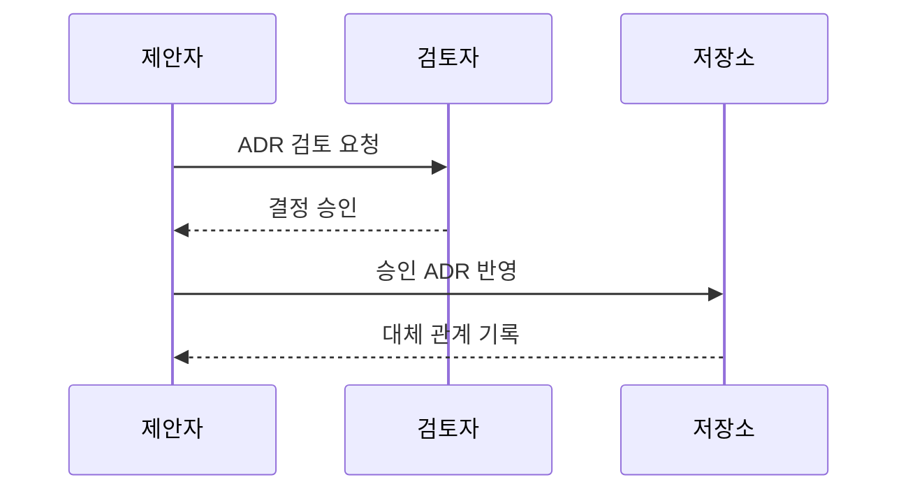

---
sidebar:
  order: 76
  label: "076. 아키텍처 결정 기록 ADR (Architecture Decision Record)"
  badge:
    text: "미출제 · 30%"
    variant: note
title: "아키텍처 결정 기록 ADR (Architecture Decision Record)"
date: "2026-07-25T18:08:00+09:00"
tags:
  - "notes-software"
weight: 76
extra:
  question_no: "076"
  source_status: "미출제"
  source_history: ""
  priority: 30
  priority_note: "ADR은 설계 근거·대안 추적의 실무 문서"
---

## 미리 알고가기

- **아키텍처 결정 기록(Architecture Decision Record, ADR)**: 중요한 기술 선택의 맥락·대안·결정·결과를 짧은 문서로 남겨 이후 변경 근거를 추적하게 하는 기록
- **아키텍처 중대 결정(Architecturally Significant Decision)**: 품질 속성·비용·조직·장기 변경 가능성에 큰 영향을 주어 ADR로 보존할 가치가 있는 결정
- **마크다운(Markdown)**: 제목·목록·링크를 간단한 기호로 표현해 코드 저장소에서 함께 관리하기 쉬운 문서 형식
- **아키텍처 드리프트(Architecture Drift)**: 구현이 누적되며 실제 코드 구조가 기록한 설계 의도에서 점차 벗어나는 현상
- **버전 제어 시스템(Version Control System, VCS)**: 문서·코드의 변경자·시점·내용과 이전 버전을 저장해 이력을 추적하는 시스템
- **코드 저장소(Code Repository)**: 소스 코드와 ADR를 버전 이력과 함께 보관·협업하는 공간
- **대체됨(Superseded)**: 기존 ADR를 삭제하지 않고 새 ADR가 그 결정을 대신함을 나타내는 상태

## Ⅰ. 개요

- 정의/개념: 기술 선택의 맥락·대안·결과를 보존하는 기록
- **배경/필요성**: 결정 근거 유실로 지속 가능한 기록 필요

### 쉽게 이해하기 (학습용)
- 기술 선택 당시의 문제와 탈락한 대안까지 적어 두면 나중에 같은 논의를 반복하지 않는다

## Ⅱ. 특징

- 코드 저장소에서 결정과 구현 변경 이력을 함께 추적한다.
- 기각 대안·제약조건을 보존해 선택 근거를 복원한다.
- 대체된 기록은 삭제하지 않고 후속 ADR로 연결한다.

### 쉽게 이해하기 (학습용)
- 결론만 적지 않고 탈락한 대안과 감수할 비용까지 남겨 이후 변경 판단의 출발점으로 삼는다

## Ⅲ. 아키텍처 및 구성요소

| 설계 요소 | 설명 |
|:---|:---|
| 맥락 | 결정을 요구한 문제·목표·제약 |
| 결정 | 검토 대안·최종 선택·판단 근거 |
| 결과 | 선택의 이점·비용·후속 조치 |
| 상태 | 제안·승인·폐기·대체 상태 |

> 요약: 선택·근거·감수할 결과를 함께 기록

### 쉽게 이해하기 (학습용)
- 진료 기록에 증상·처방·경과를 함께 적듯 문제·선택·결과를 한 기록으로 연결한다

## Ⅳ. 원리 및 절차 흐름도

| 절차 | 설명 |
|:---|:---|
| ADR 검토 요청 | 맥락·대안·결과를 작성해 검토 요청 |
| 결정 승인 | 이해관계자가 선택 근거와 영향을 승인 |
| 승인 ADR 반영 | 코드 저장소에 승인 상태로 기록 |
| 대체 관계 기록 | 변경 시 후속 ADR과 기존 기록 연결 |

> 요약: 결정 변경 시 기록을 보존하고 대체 관계 표시

### 쉽게 이해하기 (학습용)
- 대안을 검토해 결정한 뒤 저장소에 남기고, 결정이 바뀌면 기존 기록과 새 기록을 연결한다

## Ⅴ. 종류 및 비교

| 판단 기준 | 아키텍처 결정 기록(ADR) | 구두·암묵적 결정 |
|:---|:---|:---|
| 핵심 특징 | 결정 맥락을 코드와 함께 버전 관리 | 결정 근거가 대화·기억에 분산 |
| 결정 추적성 | 맥락·대안·결과·대체 이력 확인 | 참여자의 기억·검색에 의존 |
| 적용 기준 | 장기 유지·중대 아키텍처 결정 | 일회성·낮은 영향 결정 |
| 주요 위험 | 미갱신 ADR와 구현 불일치 | 인력 변경 시 설계 의도 유실 |

> 요약: 결정 맥락과 대체 관계를 버전 이력으로 보존

### 쉽게 이해하기 (학습용)
- 대화방에 흩어진 기억과 달리 결정 기록은 코드 옆에서 이유와 변경 이력을 바로 찾게 한다

## Ⅵ. 실무 사례

1. 시스템 전환은 기술 대안·이행 비용·결과를 ADR로 저장

### 쉽게 이해하기 (학습용)
- 서버 설계 방식을 바꾸면 코드와 같은 저장소에 변경 이유와 대체 기록을 함께 남긴다

## Ⅶ. 결론

- 설계 결정의 근거 유실과 반복 논의를 방지하기 위해 **문제 맥락·검토 대안·선택 근거·결과**를 기록하고, 코드 변경과 함께 ADR의 상태를 갱신한다

### 쉽게 이해하기 (학습용)
- 코드 구조를 바꿀 때 관련 결정 기록도 연결해야 다음 담당자가 설계 이유를 잃지 않는다
