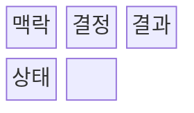
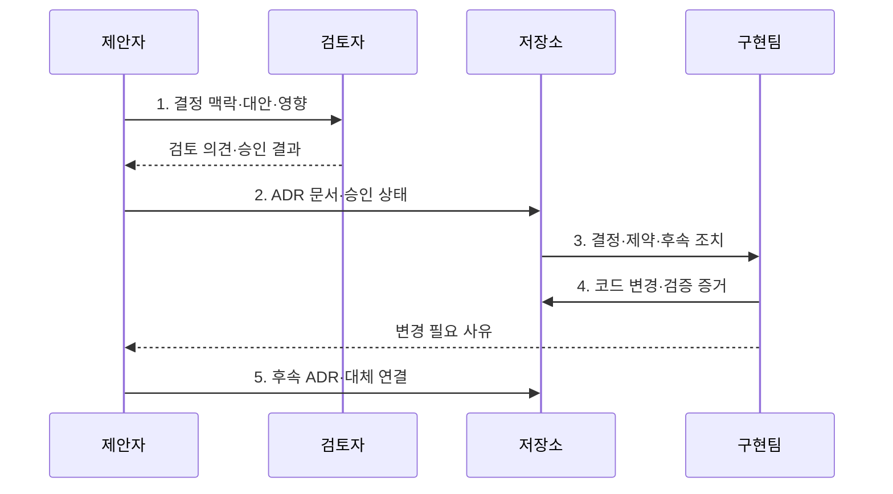

---
sidebar:
  order: 76
  label: "076. 아키텍처 결정 기록 ADR (Architecture Decision Record)"
  badge:
    text: "미출제 · 30%"
    variant: note
title: "아키텍처 결정 기록 ADR (Architecture Decision Record)"
date: "2026-08-02T23:16:00+09:00"
tags:
  - "notes-software"
weight: 76
extra:
  question_no: "076"
  source_status: "미출제"
  source_history: ""
  priority: 30
  priority_note: "ADR은 설계 근거·대안 추적의 실무 문서"
---

## Ⅰ. 개요

핵심 용어

- **아키텍처 결정 기록(Architecture Decision Record, ADR)**: 중요한 아키텍처 선택의 맥락·대안·결정·결과를 짧고 독립적인 단위로 보존하는 설계 기록 문서이다.
- **선택 근거·기각 대안**: 최종 기술을 고른 이유와 검토 후 제외한 선택지의 기록이다.

- 정의/개념: 중요한 아키텍처 선택의 맥락·대안·결정·결과를 보존하는 **설계 기록 문서 ADR**
- 배경/필요성: 구두·메신저 결정은 담당자 교체 시 **선택 근거·기각 대안 복원 불가**

#### 한줄 요약

- 기술 선택 당시의 문제와 탈락한 대안까지 적어 두면 나중에 같은 논의를 반복하지 않는다.

## Ⅱ. 특징

핵심 용어

- **공동 이력**: 결정 문서와 구현 변경을 같은 저장소의 버전 기록으로 함께 추적하는 방식이다.
- **근거 보존**: 선택의 제약과 기각 대안 및 부정적 결과를 기록하는 원칙이다.
- **대체 연결**: 기존 결정을 삭제하지 않고 후속 ADR이 대신함을 링크로 나타내는 방식이다.

- **공동 이력**: 결정과 구현 변경을 함께 추적
- **근거 보존**: 기각 대안과 제약조건 기록
- **대체 연결**: 기존 기록과 후속 ADR 연계

#### 한줄 요약

- 결론만 적지 않고 탈락한 대안과 감수할 비용까지 남겨 이후 변경 판단의 출발점으로 삼는다.

## Ⅲ. 구조 및 구성요소

핵심 용어

- **문제·목표·제약**: 아키텍처 결정을 요구한 배경과 달성 조건 및 제한 사항이다.
- **검토 대안·최종 선택·판단 근거**: 후보 기술, 채택 결과, 선택 이유를 함께 기록한 결정 내용이다.
- **제안·승인·폐기·대체됨**: ADR의 생명주기를 나타내는 상태 값이다.

| 구성요소 | 책임 |
|:---|:---|
| 맥락 | 결정을 요구한 **문제·목표·제약** |
| 결정 | **검토 대안·최종 선택·판단 근거** |
| 결과 | 선택의 **이점·비용·후속 조치** |
| 상태 | **제안·승인·폐기·대체됨** 상태 |

#### 한줄 요약

- 문제와 대안, 선택 결과와 현재 상태를 한 기록으로 관리한다.

## Ⅳ. 흐름도

핵심 용어

- **ADR(Architecture Decision Record, 아키텍처 결정 기록)**: 기술 선택의 맥락·대안·결정·결과를 보존하는 기록이다.
- **코드 변경·검증 증거**: 결정이 실제 구현에 반영되고 품질 조건을 충족했음을 보여 주는 자료이다.
- **후속 ADR·대체 연결**: 변경된 결정을 새 문서로 남기고 원 기록과 연결하는 방식이다.

**동작 원리**

- **1. 결정 맥락·대안·영향**: 문제·대안·품질 영향을 함께 검토
- **2. ADR 문서·승인 상태**: 맥락·결정·결과를 버전 이력으로 보존
- **3. 결정·제약·후속 조치**: 구현팀에 적용 범위와 실행 기준 제공
- **4. 코드 변경·검증 증거**: 구현과 결정 근거의 추적성 확보
- **5. 후속 ADR·대체 연결**: 원 기록을 보존하며 변경 결정을 연결

> 요약: 중요한 결정의 맥락·대안·결과를 코드와 연결하고 변경 시 대체 이력을 보존

#### 한줄 요약

- 대안을 검토해 결정한 뒤 저장소에 남기고, 결정이 바뀌면 기존 기록과 새 기록을 연결한다.

## Ⅴ. 종류 및 비교

핵심 용어

- **중대 아키텍처 결정**: 품질 속성·비용·조직·장기 변경 가능성에 큰 영향을 주는 기술 선택이다.
- **결정 맥락·대체 이력**: 선택 당시 조건과 이후 다른 결정으로 바뀐 관계를 보존한 정보이다.
- **구현·기록 불일치**: 실제 코드 구조와 ADR에 기록된 설계 의도가 서로 다른 상태이다.

| 판단 기준 | 아키텍처 결정 기록(ADR) | 구두·암묵적 결정 |
|:---|:---|:---|
| 적용 기준 | 장기 유지·**중대 아키텍처 결정** | 일회성·**낮은 영향 결정** |
| 핵심 특징 | **결정 맥락·대체 이력** 버전 관리 | 결정 근거가 **대화·기억에 분산** |
| 한계 | 미갱신 시 **구현·기록 불일치** | 인력 변경 시 **설계 의도 유실** |

> 요약: 결정 맥락과 대체 관계를 버전 이력으로 보존

#### 한줄 요약

- 대화방에 흩어진 기억과 달리 결정 기록은 코드 옆에서 이유와 변경 이력을 바로 찾게 한다.

## Ⅵ. 실무 고려사항 및 대책

핵심 용어

- **중대 아키텍처 결정**: 문서 유지 비용을 통제하도록 ADR로 남길 가치가 있는 고영향 결정이다.
- **설계 드리프트**: 구현이 누적되며 실제 구조가 기록한 설계 의도에서 벗어나는 현상이다.
- **새 ADR·대체 상태 연결**: 원 기록을 보존하며 변경 이유와 후속 결정을 잇는 방식이다.

| 문제 | 대책 | 효과 |
|:---|:---|:---|
| 낮은 영향 결정까지 기록해 문서 유지 비용 증가 | **중대 아키텍처 결정**만 기록 | **문서 유지 비용** 통제 |
| 결론만 남겨 기각 대안과 선택 이유 복원 불가 | **맥락·대안·근거·부정 결과** 포함 | **선택 이유 복원성** 확보 |
| ADR와 코드 변경이 분리돼 아키텍처 드리프트 발생 | **변경·모듈·검증 증거**를 ADR에 연결 | **설계 드리프트** 조기 발견 |
| 기존 ADR를 덮어써 당시 판단과 변경 이유 소실 | **새 ADR·대체 상태 연결** | **판단·변경 이력** 보존 |
| 결정 소유자·검토 기한이 없어 기록이 방치 | **소유자·검토 기한·상태 점검** 지정 | **방치 ADR** 감소 |

> 적용 사례: 시스템 전환의 기술 대안·이행 비용·결과를 ADR로 보존

#### 한줄 요약

- 서버 설계 방식을 바꾸면 코드와 같은 저장소에 변경 이유와 대체 기록을 함께 남긴다.

## Ⅶ. 결론

핵심 용어

- **결정 영향·변경 비용·추적 필요성**: ADR 작성 여부를 판단하는 품질 영향, 수정 부담, 근거 보존 요구이다.
- **ADR**: 중요한 결정의 이유와 변경 이력을 코드 옆에서 추적하도록 남기는 기록이다.

- **결정 영향·변경 비용·추적 필요성**에 따라 ADR을 기록

#### 한줄 요약

- 코드 구조를 바꿀 때 결정 기록도 연결해야 다음 담당자가 설계 이유를 잃지 않는다.
