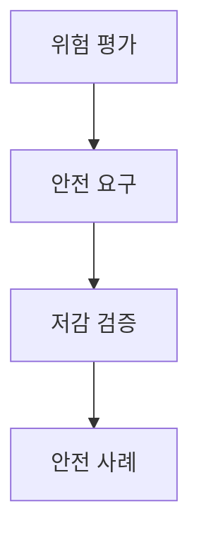
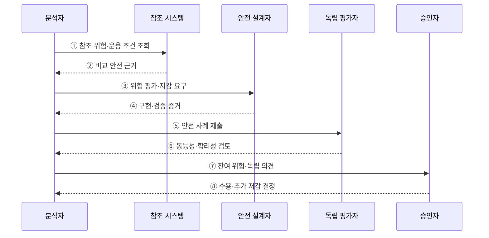

---
sidebar:
  order: 77
  label: "077. 소프트웨어 안전 — GAMAB·ALARP (Software Safety GAMAB ALARP)"
  badge:
    text: "기출 · 50%"
    variant: note
title: "소프트웨어 안전 — GAMAB·ALARP (Software Safety GAMAB ALARP)"
date: "2026-07-27T23:59:59+09:00"
tags:
  - "notes-software"
weight: 77
extra:
  question_no: "077"
  source_status: "기출"
  source_history: "128회"
  priority: 50
  priority_note: "128회 기출, 허용 위험 판단의 안전 기준"
---

## 미리 알고가기

- **전체적으로 적어도 동등한 안전 GAMAB(가맙, Globalement Au Moins Aussi Bon)**: 프랑스어 원어의 첫 글자를 붙인 표기로 새 시스템의 전체 위험이 검증된 참조 시스템보다 크지 않음을 비교 근거로 입증하는 원칙
- **합리적으로 실행 가능한 최저 수준 ALARP(앨럽, As Low As Reasonably Practicable)**: 영어 원어의 첫 글자를 붙인 표기로 추가 저감 비용이 얻는 안전 편익에 심하게 불균형할 때까지 위험을 계속 낮추는 원칙
- **안전 사례(Safety Case)**: 위험원·안전 요구·저감 조치·검증 증거를 논리로 연결해 잔여 위험의 수용 근거를 제시하는 문서
- **잔여 위험(Residual Risk)**: 모든 저감 조치를 적용한 뒤에도 남아 승인자가 수용 여부를 판단해야 하는 위험
- **허용 가능 위험(Acceptable Risk)**: 법규·조직 기준과 안전 논증에 따라 수용할 수 있다고 판정한 위험 수준
- **위험원(Hazard)**: 사람·환경·재산에 피해를 일으킬 잠재적 상태나 원인
- **참조 시스템(Reference System)**: 운용 통계와 안전성이 확인되어 GAMAB 비교 기준으로 쓰는 기존 시스템
- **정량·정성 평가(Quantitative·Qualitative Assessment)**: 정량 평가는 확률·피해 수치로, 정성 평가는 전문가 근거와 등급으로 위험을 판단함
- **다중화(Redundancy)**: 같은 안전 기능을 독립 구성요소로 중복해 하나의 고장에도 기능을 유지하는 설계
- **심한 불균형(Gross Disproportion)**: 추가 저감 비용이 안전 편익보다 단순히 큰 정도를 넘어 현저히 과도한 상태
- **독립 안전 평가(Independent Safety Assessment)**: 개발 책임과 분리된 평가자가 안전 요구·증거·잔여 위험 논증의 적절성을 검토하는 활동

## Ⅰ. 개요

- 정의/개념: **안전 동등성·저감 합리성** 기반 위험 수용
- 기존 한계: 주관적 위험 판단은 **저감 중단·수용 편차** 발생

### 쉽게 이해하기 (학습용)

- 검증된 기존 시스템보다 위험하지 않은지 보고, 더 낮출 수 있는 위험은 비용이 현저히 과도해질 때까지 줄인다.

## Ⅱ. 특징

- **GAMAB**는 참조 시스템과 전체 안전성 비교
- **ALARP**는 심한 불균형까지 위험 저감 지속
- **안전 사례**로 위험·저감·검증·수용 근거 추적

### 쉽게 이해하기 (학습용)

- 비용이 크다는 이유만으로 멈추지 않고 안전 편익과 현저히 불균형한지 근거로 남긴다.

## Ⅲ. 아키텍처 및 구성요소

**도표안 A — 구조도**

**도표안 B — sequenceDiagram**

| 설계 요소 | 설명 |
|:---|:---|
| 위험 평가 | 발생 가능성·피해 심각도 판정 |
| 안전 요구 | 탐지·차단·다중화 방안 정의 |
| 저감 검증 | 요구 구현과 위험 감소 효과 확인 |
| 안전 사례 | 평가·저감·검증의 수용 근거 연결 |

**동작 원리**

- ① 분석자가 비교 가능한 참조 시스템의 위험과 운용 조건을 조회한다.
- ② 참조 시스템이 검증된 운용 통계·안전 성능·적용 조건을 제공한다.
- ③ 위험원별 가능성·심각도를 평가하고 설계자에게 저감 요구를 전달한다.
- ④ 설계자가 안전 요구의 구현과 위험 감소 효과를 증거로 반환한다.
- ⑤ 분석자가 위험·요구·검증·잔여 위험을 안전 사례로 연결한다.
- ⑥ 독립 평가자가 GAMAB 비교 타당성과 ALARP 저감 근거를 검토한다.
- ⑦ 잔여 위험·불확실성·독립 의견을 권한 있는 승인자에게 제출한다.
- ⑧ 승인자가 수용하거나 추가 저감·운용 제한·재검증을 요구한다.

> 요약: 비교 안전성과 합리적 저감 증거를 안전 사례로 연결해 잔여 위험을 판정한다.

### 쉽게 이해하기 (학습용)

- 위험원을 찾고 보호 조치의 효과를 확인한 뒤 남은 위험을 수용할지 결정한다.

## Ⅳ. 종류 및 비교

| 위험 수용 원칙 | GAMAB | ALARP |
|:---|:---|:---|
| 적용 기준 | 검증된 **참조 시스템** 존재 | 추가 저감의 **합리성** 판단 |
| 핵심 특징 | 전체 위험의 **안전 동등성** 입증 | 심한 불균형까지 **위험 저감** |
| 한계 | 부적합 참조·**차이 누락** | 비용 과대평가·**중단 정당화** |

> 요약: 참조는 동등성, 절충은 저감 합리성 판단

### 쉽게 이해하기 (학습용)

- GAMAB는 검증된 기존 시스템과 비교하고 ALARP는 추가 저감의 편익과 희생을 비교한다.

## Ⅴ. 실무 고려사항 및 대책

| 고려사항 | 문제점 | 대책 |
|:---|:---|:---|
| 부적합 참조 | 기능·환경·사용량이 다른 시스템과 잘못 비교 | 운용 맥락·위험원·성능의 비교 가능성 입증 |
| 평균 위험 은폐 | 전체 수치는 같아도 특정 위험이 악화 | 위험원별 비교와 전체 안전성 논증 병행 |
| 단순 비용 편익 | 비용이 조금 크다는 이유로 저감 제외 | 안전 우선 가정과 심한 불균형의 입증 책임 적용 |
| 불확실성 축소 | 희귀·대형 사고 자료 부족을 무시 | 보수적 가정·민감도 분석·운용 감시 적용 |
| 승인 독립성 부족 | 개발 일정 압력이 잔여 위험 판단에 개입 | 독립 안전 평가와 권한 있는 위험 승인자 분리 |

> 적용 사례: 철도 신호 변경은 비교 가능한 기존 시스템의 운용 통계와 위험을 근거로 안전 동등성을 논증할 수 있다.

### 쉽게 이해하기 (학습용)

- 철도 신호는 비교 조건을 확인한 뒤 기존 운용 통계와 새 시스템 위험을 대조한다.

## Ⅵ. 결론

- GAMAB는 비교 가능한 참조 시스템과의 전체 안전 동등성을, ALARP는 추가 저감의 합리성을 논증한다.
- 두 원칙을 기계적으로 대체하지 말고 적용 법규·분야 기준과 독립 증거로 잔여 위험을 판단한다.

### 쉽게 이해하기 (학습용)

- 비교 가능한 기존 시스템은 동등성을 보고 추가 저감은 안전 편익과 현저한 비용 차이로 판단한다.
