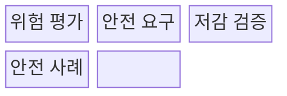
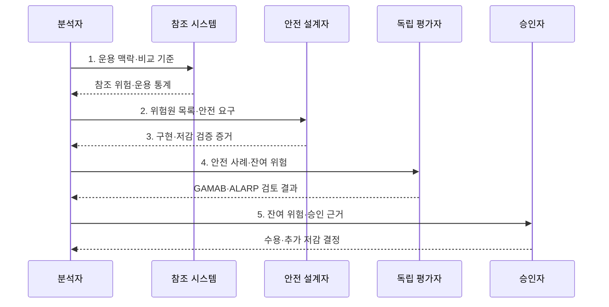

---
sidebar:
  order: 77
  label: "077. 소프트웨어 안전: GAMAB·ALARP (Software Safety GAMAB ALARP)"
  badge:
    text: "기출 · 50%"
    variant: note
title: "소프트웨어 안전: GAMAB·ALARP (Software Safety GAMAB ALARP)"
date: "2026-08-02T23:17:00+09:00"
tags:
  - "notes-software"
weight: 77
extra:
  question_no: "077"
  source_status: "기출"
  source_history: "128회"
  priority: 50
  priority_note: "128회 기출, 허용 위험 판단의 안전 기준"
---

## Ⅰ. 개요

핵심 용어

- **GAMAB·ALARP 안전 원칙**: GAMAB은 기존에 수용된 시스템보다 전체적으로 위험하지 않게 하고, ALARP는 추가 저감 비용이 편익에 비해 현저히 과도할 때까지 위험을 낮추는 잔여 위험 수용 원칙이다.
- **저감 중단 기준**: 추가 안전 조치를 언제까지 계속해야 하는지 결정하는 조건이다.

- 정의/개념: GAMAB의 동등 안전성과 ALARP의 합리적 저감 기준으로 잔여 위험 수용성을 판정하는 **소프트웨어 안전 원칙**
- 배경/필요성: 무한 저감 요구나 비용만으로는 **저감 중단 기준 설정 불가**

#### 한줄 요약

- 검증된 기존 시스템보다 위험하지 않은지 보고, 더 낮출 수 있는 위험은 비용이 현저히 과도해질 때까지 줄인다.

## Ⅱ. 특징

핵심 용어

- **GAMAB(Globalement Au Moins Aussi Bon)**: 새 시스템의 전체 위험이 검증된 참조 시스템보다 크지 않음을 입증하는 원칙이다.
- **ALARP(As Low As Reasonably Practicable)**: 비용이 안전 편익에 심하게 불균형할 때까지 위험을 낮추는 원칙이다.
- **안전 사례(Safety Case)**: 위험·저감·검증·수용 근거를 논리로 연결한 문서이다.

- **GAMAB**는 참조 시스템과 전체 안전성 비교
- **ALARP**는 심한 불균형까지 위험 저감 지속
- **안전 사례**로 위험·저감·검증·수용 근거 추적

#### 한줄 요약

- 비용이 크다는 이유만으로 멈추지 않고 안전 편익과 현저히 불균형한지 근거로 남긴다.

## Ⅲ. 구조 및 구성요소

핵심 용어

- **발생 가능성·피해 심각도**: 위험의 크기를 판단하는 빈도와 결과 영향 기준이다.
- **탐지·차단·다중화 방안**: 위험원을 발견하고 전파를 막거나 고장에도 기능을 유지하는 안전 조치이다.
- **평가·저감·검증 근거**: 잔여 위험 수용을 논증하도록 안전 사례에 연결한 증거이다.

| 구성요소 | 책임 |
|:---|:---|
| 위험 평가 | **발생 가능성·피해 심각도** 판정 |
| 안전 요구 | **탐지·차단·다중화 방안** 정의 |
| 저감 검증 | 요구 구현과 **위험 감소 효과** 확인 |
| 안전 사례 | **평가·저감·검증 근거** 연결 |

#### 한줄 요약

- 위험을 평가하고 저감 조치와 검증 증거를 수용 근거로 연결한다.

## Ⅳ. 흐름도

핵심 용어

- **참조 시스템(Reference System)**: 운용 통계와 안전성이 확인되어 GAMAB 비교 기준으로 쓰는 기존 시스템이다.
- **안전 사례·잔여 위험**: 저감 조치 후 남은 위험과 그 수용 근거를 연결한 논증 자료이다.
- **GAMAB·ALARP 검토 결과**: 비교 안전성과 추가 저감 합리성의 충족 여부를 판정한 결과이다.

**동작 원리**

- **1. 운용 맥락·비교 기준**: 참조 시스템과 운용 조건 정렬
- **2. 위험원 목록·안전 요구**: 가능성·심각도에 맞는 통제 할당
- **3. 구현·저감 검증 증거**: 안전 요구 구현과 위험 감소 입증
- **4. 안전 사례·잔여 위험**: GAMAB 동등성·ALARP 합리성 검토
- **5. 잔여 위험·승인 근거**: 승인자에게 수용 또는 추가 저감 근거 제공

> 요약: 비교 안전성과 합리적 저감 증거를 안전 사례로 연결해 잔여 위험 판정

#### 한줄 요약

- 위험원을 찾고 보호 조치의 효과를 확인한 뒤 남은 위험을 수용할지 결정한다.

## Ⅴ. 종류 및 비교

핵심 용어

- **안전 동등성**: 새 시스템의 전체 위험이 검증된 참조 시스템보다 크지 않은 성질이다.
- **심한 불균형(Gross Disproportion)**: 추가 저감 비용이 안전 편익보다 현저히 과도한 상태이다.
- **위험 저감**: 위험 발생 가능성이나 피해 심각도를 허용 수준까지 낮추는 활동이다.

| 위험 수용 원칙 | GAMAB | ALARP |
|:---|:---|:---|
| 적용 기준 | 검증된 **참조 시스템** 존재 | 추가 저감의 **합리성** 판단 |
| 핵심 특징 | 전체 위험의 **안전 동등성** 입증 | 심한 불균형까지 **위험 저감** |
| 한계 | 비교 불가 참조·**차이 누락** | 비용 과대평가·**중단 정당화** |

> 요약: **GAMAB**는 동등성, **ALARP**는 저감 합리성 판단

#### 한줄 요약

- GAMAB는 검증된 기존 시스템과 비교하고 ALARP는 추가 저감의 편익과 희생을 비교한다.

## Ⅵ. 실무 고려사항 및 대책

핵심 용어

- **위험원별 비교·전체 논증**: 개별 위험 악화를 숨기지 않으면서 시스템 전체 동등성을 평가하는 방식이다.
- **보수적 가정·민감도·운용 감시**: 불확실성과 희귀 사고를 반영하고 배치 후 가정 이탈을 확인하는 통제이다.
- **독립 평가자·위험 승인자**: 개발 일정 압력과 분리해 안전 논증을 검토하고 잔여 위험을 수용하는 역할이다.

| 문제 | 대책 | 효과 |
|:---|:---|:---|
| 운용 맥락·위험원 차이를 무시해 부적합 참조 선택 | **맥락·위험원·성능 비교 가능성** 입증 | **잘못된 동등성 판단** 방지 |
| 전체 평균 위험이 특정 위험원의 악화를 은폐 | **위험원별 비교·전체 논증** 병행 | **특정 위험 악화** 탐지 |
| 단순 비용 우위만으로 추가 저감을 조기 중단 | **심한 불균형 입증 책임** 적용 | **성급한 저감 중단** 방지 |
| 좁은 불확실성 가정이 희귀·중대 사고를 배제 | **보수적 가정·민감도·운용 감시** 적용 | **희귀 사고 위험** 반영 |
| 개발 조직이 안전 승인까지 맡아 일정 압력 개입 | **독립 평가자·위험 승인자** 분리 | **이해상충 판단 개입** 감소 |

> 적용 사례: 철도 신호 변경은 기존 운용 통계와 위험으로 안전 동등성 논증

#### 한줄 요약

- 철도 신호는 비교 조건을 확인한 뒤 기존 운용 통계와 새 시스템 위험을 대조한다.

## Ⅶ. 결론

핵심 용어

- **GAMAB**: 비교 가능한 참조 시스템이 있을 때 전체 안전 동등성을 판단하는 원칙이다.
- **ALARP**: 추가 저감 비용과 안전 편익의 심한 불균형으로 저감 한계를 판단하는 원칙이다.

- 참조 가능 시 **GAMAB**, 추가 저감 한계는 **ALARP**로 판단

#### 한줄 요약

- 비교 가능한 기존 시스템은 동등성을 보고 추가 저감은 안전 편익과 현저한 비용 차이로 판단한다.
