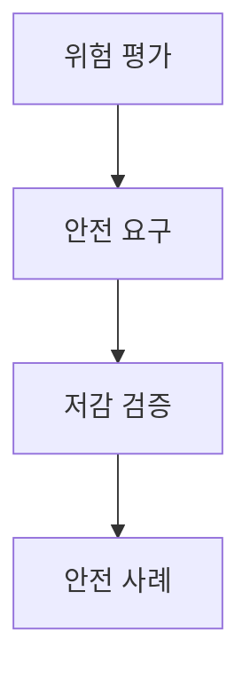
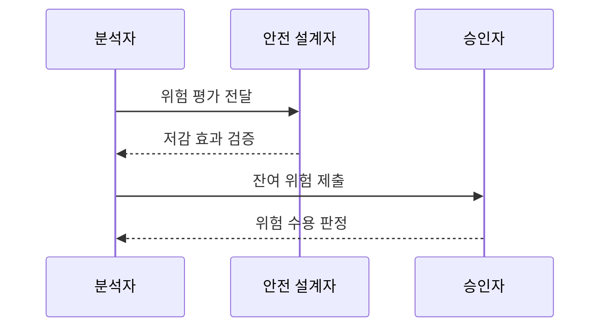

---
sidebar:
  order: 77
  label: "077. 소프트웨어 안전 — GAMAB·ALARP (Software Safety GAMAB ALARP)"
  badge:
    text: "기출 · 50%"
    variant: note
title: "소프트웨어 안전 — GAMAB·ALARP (Software Safety GAMAB ALARP)"
date: "2026-07-27T23:59:59+09:00"
tags:
  - "notes-software"
weight: 77
extra:
  question_no: "077"
  source_status: "기출"
  source_history: "128회"
  priority: 50
  priority_note: "128회 기출, 허용 위험 판단의 안전 기준"
---

## 미리 알고가기

- **전체적으로 적어도 동등한 안전 GAMAB(가맙, Globalement Au Moins Aussi Bon)**: 프랑스어 원어의 첫 글자를 붙인 표기로 새 시스템의 전체 위험이 검증된 참조 시스템보다 크지 않음을 비교 근거로 입증하는 원칙
- **합리적으로 실행 가능한 최저 수준 ALARP(앨럽, As Low As Reasonably Practicable)**: 영어 원어의 첫 글자를 붙인 표기로 추가 저감 비용이 얻는 안전 편익에 심하게 불균형할 때까지 위험을 계속 낮추는 원칙
- **안전 사례(Safety Case)**: 위험원·안전 요구·저감 조치·검증 증거를 논리로 연결해 잔여 위험의 수용 근거를 제시하는 문서
- **잔여 위험(Residual Risk)**: 모든 저감 조치를 적용한 뒤에도 남아 승인자가 수용 여부를 판단해야 하는 위험
- **허용 가능 위험(Acceptable Risk)**: 법규·조직 기준과 안전 논증에 따라 수용할 수 있다고 판정한 위험 수준
- **위험원(Hazard)**: 사람·환경·재산에 피해를 일으킬 잠재적 상태나 원인
- **참조 시스템(Reference System)**: 운용 통계와 안전성이 확인되어 GAMAB 비교 기준으로 쓰는 기존 시스템
- **정량·정성 평가(Quantitative·Qualitative Assessment)**: 정량 평가는 확률·피해 수치로, 정성 평가는 전문가 근거와 등급으로 위험을 판단함
- **다중화(Redundancy)**: 같은 안전 기능을 독립 구성요소로 중복해 하나의 고장에도 기능을 유지하는 설계
- **심한 불균형(Gross Disproportion)**: 추가 저감 비용이 안전 편익보다 단순히 큰 정도를 넘어 현저히 과도한 상태

## Ⅰ. 개요

- 정의/개념: **안전 동등성·저감 합리성** 기반 위험 수용
- 기존 한계: 주관적 위험 판단은 **저감 중단·수용 편차** 발생

### 쉽게 이해하기 (학습용)
- 검증된 기존 시스템보다 위험하지 않은지 보고, 더 낮출 수 있는 위험은 비용이 현저히 과도해질 때까지 줄인다

## Ⅱ. 특징

- **GAMAB**는 참조 시스템과 전체 안전성 비교
- **ALARP**는 심한 불균형까지 위험 저감 지속
- **안전 사례**로 위험·저감·검증·수용 근거 추적

### 쉽게 이해하기 (학습용)
- 비용이 크다는 이유만으로 멈추지 않고 안전 편익과 현저히 불균형한지 근거로 남긴다

## Ⅲ. 아키텍처 및 구성요소

| 설계 요소 | 설명 |
|:---|:---|
| 위험 평가 | **발생 가능성·피해 심각도** 판정 |
| 안전 요구 | **탐지·차단·다중화** 방안 정의 |
| 저감 검증 | 요구 구현과 **위험 감소 효과** 확인 |
| 안전 사례 | 평가·저감·검증의 **수용 근거** 연결 |

> 요약: 위험 평가·저감 검증으로 잔여 위험 수용

### 쉽게 이해하기 (학습용)
- 브레이크 고장 위험, 이중화 요구, 시험 결과를 한 논증으로 연결해 승인자가 근거를 따라가게 한다

## Ⅳ. 원리 및 절차 흐름도

| 절차 | 설명 |
|:---|:---|
| 위험 평가 전달 | 위험원별 **가능성·심각도** 산정 |
| 저감 효과 검증 | 안전 요구 구현과 **감소 효과** 확인 |
| 잔여 위험 제출 | 저감 후 위험을 **안전 사례화** |
| 위험 수용 판정 | **GAMAB·ALARP** 기준으로 승인 |

> 요약: 위험을 저감하고 수용 기준으로 잔여 위험을 판정함

### 쉽게 이해하기 (학습용)
- 위험원을 찾고 보호 조치의 효과를 확인한 뒤 남은 위험을 수용할지 결정한다

## Ⅴ. 종류 및 비교

| 위험 수용 원칙 | GAMAB | ALARP |
|:---|:---|:---|
| 적용 기준 | 검증된 **참조 시스템** 존재 | 추가 저감의 **합리성** 판단 |
| 핵심 특징 | 전체 위험의 **안전 동등성** 입증 | 심한 불균형까지 **위험 저감** |
| 한계 | 부적합 참조·**차이 누락** | 비용 과대평가·**중단 정당화** |

> 요약: 참조는 동등성, 절충은 저감 합리성 판단

### 쉽게 이해하기 (학습용)
- GAMAB는 검증된 기존 시스템과 비교하고 ALARP는 추가 저감의 편익과 비용을 비교한다

## Ⅵ. 실무 사례

1. 철도 신호는 **운용 통계 비교**로 동등 안전 입증

### 쉽게 이해하기 (학습용)
- 철도 신호는 기존 운용 통계와 새 시스템 위험을 비교해 안전 동등성을 입증한다

## Ⅶ. 결론

- 참조가 있으면 **GAMAB**, 추가 저감은 **ALARP**

### 쉽게 이해하기 (학습용)
- 비교 가능한 기존 시스템이 있으면 GAMAB를 쓰고 추가 저감은 ALARP 근거로 중단 시점을 정한다
