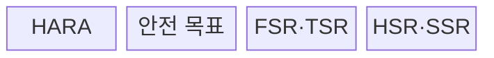
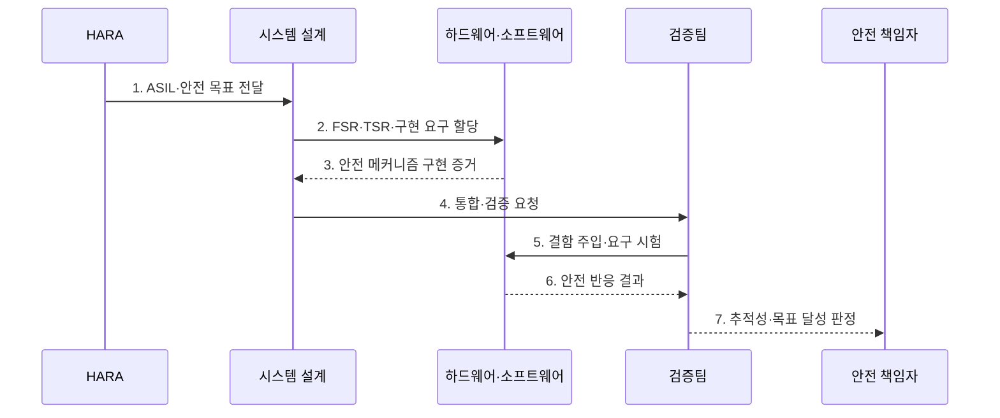

---
sidebar:
  order: 78
  label: "078. 기능 안전 ISO 26262·ASIL (Functional Safety ISO 26262)"
  badge:
    text: "기출 · 50%"
    variant: note
title: "기능 안전 ISO 26262·ASIL (Functional Safety ISO 26262)"
date: "2026-07-27T23:59:59+09:00"
tags:
  - "notes-software"
weight: 78
extra:
  question_no: "078"
  source_status: "기출"
  source_history: "134회"
  priority: 50
  priority_note: "134회 기출, ASIL 등급·안전수명주기 중요"
---

## 미리 알고가기

- **국제표준화기구(International Organization for Standardization, ISO)**: ‘아이에스오’로 읽고 그리스어 ‘같다(isos)’에서 정한 공통 단축 명칭이며, ISO 26262 같은 국제 표준을 제정하는 기구
- **ISO 26262:2018**: 양산 도로 차량의 전기·전자 안전 관련 시스템에 기능 안전 수명주기 요구를 제시한 현행 제2판 국제표준
- **기능 안전(Functional Safety)**: 전기·전자 시스템의 오동작으로 생기는 위해 때문에 불합리한 위험이 발생하지 않도록 하는 안전
- **자동차 안전 무결성 수준 ASIL(에이실, Automotive Safety Integrity Level)**: 영어 핵심어의 첫 글자를 붙인 표기로 심각도·노출가능성·제어가능성에 따라 차량 위해의 안전 요구 엄격도를 A부터 D까지 구분한 등급
- **위험원 분석 및 위험 평가(Hazard Analysis and Risk Assessment, HARA)**: ‘하라’로 읽고 영문 첫 글자를 딴 약어이며, 운전 상황별 위해를 분석해 ASIL과 안전 목표를 도출하는 과정
- **품질관리(Quality Management, QM)**: ‘큐엠’으로 읽고 영문 첫 글자를 딴 약어이며, ASIL이 도출되지 않은 항목을 일반 품질 절차로 관리하는 분류
- **기능 안전 요구사항(Functional Safety Requirement, FSR)**: ‘에프에스알’로 읽고 영문 첫 글자를 딴 약어이며, 안전 목표를 기능 수준 요구로 분해한 항목
- **기술 안전 요구사항(Technical Safety Requirement, TSR)**: ‘티에스알’로 읽고 영문 첫 글자를 딴 약어이며, 기능 안전 요구를 기술 구현 요구로 구체화한 항목
- **하드웨어 안전 요구사항(Hardware Safety Requirement, HSR)**: ‘에이치에스알’로 읽고 영문 첫 글자를 딴 약어이며, 회로·부품에 할당한 안전 요구
- **소프트웨어 안전 요구사항(Software Safety Requirement, SSR)**: ‘에스에스알’로 읽고 영문 첫 글자를 딴 약어이며, 소프트웨어에 할당한 감시·진단 요구
- **하드웨어·소프트웨어(Hardware·Software, HW·SW)**: ‘에이치더블유·에스더블유’로 읽고 각 영단어의 앞뒤 또는 첫 글자를 쓴 약어이며, 기술 안전 요구를 회로와 프로그램에 나누는 구현 영역
- **심각도 S(에스, Severity)**: 영어 첫 글자와 뒤 숫자로 상해 정도의 등급을 표기하며 S0부터 S3까지 HARA의 위해 축을 나타냄
- **노출가능성 E(이, Exposure)**: 영어 첫 글자와 뒤 숫자로 위험 운전 상황의 빈도를 표기하며 E0부터 E4까지 HARA의 위해 축을 나타냄
- **제어가능성 C(씨, Controllability)**: 영어 첫 글자와 뒤 숫자로 운전자·교통 참여자의 위해 회피 가능성을 표기하며 C0부터 C3까지 HARA의 위해 축을 나타냄
- **안전 목표(Safety Goal)**: HARA에서 도출하며 위험한 오동작을 방지하기 위한 차량 수준의 최상위 안전 요구
- **추적성(Traceability)**: 안전 목표에서 상세 요구·구현·시험 결과까지 양방향으로 연결해 누락과 변경 영향을 확인하는 성질
- **결함 주입(Fault Injection)**: 센서 오류·통신 단절 같은 고장을 의도적으로 만들어 안전 감지·전환 동작을 검증하는 시험
- **전동식 파워 스티어링(Electric Power Steering, EPS)**: ‘이피에스’로 읽고 영문 첫 글자를 딴 약어이며, 전동 모터로 조향력을 보조하는 차량 시스템
- **배터리 관리 시스템(Battery Management System, BMS)**: ‘비엠에스’로 읽고 영문 첫 글자를 딴 약어이며, 배터리 상태를 감시하고 위험 시 차단하는 시스템
- **안전 메커니즘(Safety Mechanism)**: 고장을 탐지·통제하거나 안전 상태로 전환해 안전 목표 위반을 방지하는 기술 수단

## Ⅰ. 개요

- 정의/개념: 차량 오동작 위험의 **ASIL별 수명주기 통제**
- **배경/필요성**: 인명 위해 수준별 안전 활동 차등 적용

### 쉽게 이해하기 (학습용)

- 차량 기능이 잘못 동작할 때의 피해를 등급화하고 그 등급만큼 설계·시험을 엄격하게 만든다.

## Ⅱ. 특징

- **S·E·C 조합**으로 ASIL과 안전 목표 도출
- 높은 ASIL일수록 **검증 엄격도·독립성** 강화
- 안전 목표부터 **구현·시험까지 양방향 추적**

### 쉽게 이해하기 (학습용)

- 위험한 차량 동작을 먼저 정하고 피해 가능성이 클수록 더 독립적이고 엄격한 설계·시험을 요구한다.

## Ⅲ. 구조 및 구성요소

| 구성요소 | 책임 |
|:---|:---|
| HARA | S·E·C 평가로 ASIL 도출 |
| 안전 목표 | 위해 방지 차량 수준 요구 정의 |
| FSR·TSR | 목표를 기능·기술 요구로 분해 |
| HSR·SSR | 기술 요구를 HW·SW에 할당 |

### 쉽게 이해하기 (학습용)

- 위험 등급에서 안전 목표와 구현 요구까지 단계적으로 분해한다.

## Ⅳ. 흐름도

**동작 원리**

- **1. ASIL·안전 목표 전달**: S·E·C로 등급을 정한다.
- **2. FSR·TSR·구현 요구 할당**: HW·SW로 분해한다.
- **3. 안전 메커니즘 구현 증거**: 검증 결과를 제출한다.
- **4. 통합·검증 요청**: 안전 요구의 시험을 시작한다.
- **5. 결함 주입·요구 시험**: 등급별 방법을 적용한다.
- **6. 안전 반응 결과**: 탐지와 안전 상태를 확인한다.
- **7. 추적성·목표 달성 판정**: 잔여 위험까지 검토한다.

> 요약: HARA의 ASIL부터 안전 목표·구현 요구·검증 증거를 수명주기 전체에서 추적한다.

### 쉽게 이해하기 (학습용)

- 센서 고장의 피해를 등급화하고 차단 요구·구현·시험 결과를 한 줄로 연결한다.

## Ⅴ. 종류 및 비교

| 안전 분류 | ASIL A~D | QM |
|:---|:---|:---|
| 적용 기준 | 오동작이 **인명 위해**로 연결 | **ASIL 미도출** 품질 항목 |
| 핵심 특징 | 위험별 **안전 무결성 등급** | 일반 **품질관리 절차** |
| 한계 | 등급 과소평가·**독립성 미달** | 안전 위험의 **QM 오분류** |

> 요약: 인명 위해는 ASIL, 비안전 품질은 QM 적용

### 쉽게 이해하기 (학습용)

- 오동작 위해가 ASIL로 분류되면 해당 안전 절차를 적용하고 그렇지 않은 항목은 품질관리로 다룬다.

## Ⅵ. 실무 고려사항 및 대책

| 고려사항 | 대책 | 효과 |
|:---|:---|:---|
| HARA 범위 누락 | 상황·오동작·영향을 조합해 검토 | 드문 오용과 위해 포함 |
| ASIL 과소평가 | 등급 근거·가정·독립 검토 보존 | 안전 활동 축소 방지 |
| 요구 추적 단절 | 목표·FSR·TSR·구현·시험 연결 | 누락과 변경 영향 확인 |
| 독립성 미달 | ASIL별 검증 독립성 확보 | 자기 승인 위험 감소 |
| 변경 영향 누락 | 영향 분석과 회귀 안전 시험 수행 | 기존 안전 논증 유지 |

> 적용 사례: EPS는 조향 보조 상실 HARA에서 도출한 안전 목표를 회로·코드·결함 주입 시험까지 추적한다.

### 쉽게 이해하기 (학습용)

- 조향 보조가 사라지는 상황의 위험 등급을 정하고 회로·코드·시험 요구까지 연결한다.

## Ⅶ. 결론

- **위해 등급·추적성·검증 독립성**에 따라 안전 활동을 정한다.

### 쉽게 이해하기 (학습용)

- 위험 등급을 정한 뒤 안전 목표가 코드와 시험까지 빠짐없이 이어지는지 증거로 확인한다.
