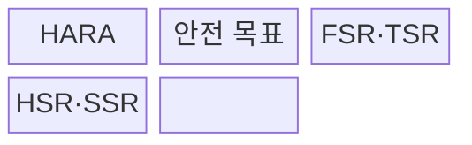
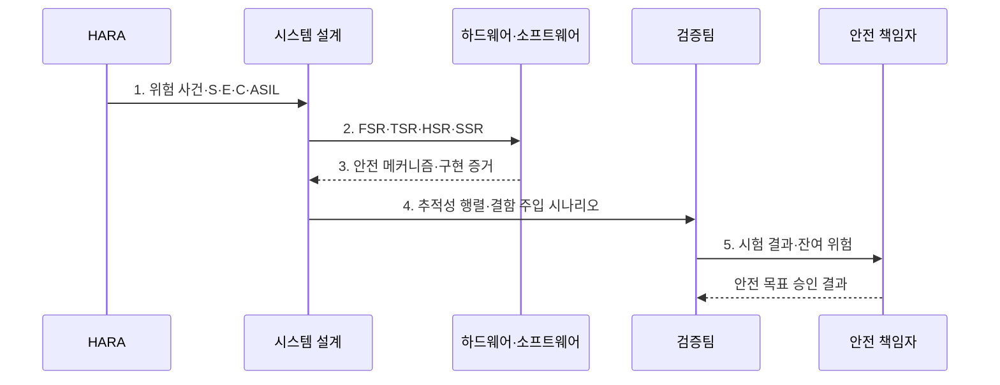

---
sidebar:
  order: 78
  label: "078. 기능 안전 ISO 26262·ASIL (Functional Safety ISO 26262)"
  badge:
    text: "기출 · 50%"
    variant: note
title: "기능 안전 ISO 26262·ASIL (Functional Safety ISO 26262)"
date: "2026-08-02T23:18:00+09:00"
tags:
  - "notes-software"
weight: 78
extra:
  question_no: "078"
  source_status: "기출"
  source_history: "134회"
  priority: 50
  priority_note: "134회 기출, ASIL 등급·안전수명주기 중요"
---

## Ⅰ. 개요

핵심 용어

- **ISO 26262·자동차 안전 무결성 수준(Automotive Safety Integrity Level, ASIL)**: 차량 전기·전자 시스템의 오동작 위험을 ASIL 등급별 안전 수명주기 활동으로 통제하는 기능 안전 표준과 위험 등급이다.
- **고위험 기능의 안전 강도 부족**: 모든 기능에 같은 검증을 적용해 심각한 위해에 필요한 엄격도가 확보되지 않는 문제이다.

- 정의/개념: 차량 전기·전자 시스템의 오동작 위험을 ASIL별 수명주기 활동으로 통제하는 **기능 안전 표준 ISO 26262**
- 배경/필요성: 모든 기능의 동일 검증은 **고위험 기능의 안전 강도 부족**

#### 한줄 요약

- 차량 기능이 잘못 동작할 때의 피해를 등급화하고 그 등급만큼 설계·시험을 엄격하게 만든다.

## Ⅱ. 특징

핵심 용어

- **S·E·C 조합**: 심각도(Severity)·노출가능성(Exposure)·제어가능성(Controllability)을 결합한 위해 평가 기준이다.
- **검증 엄격도·독립성**: ASIL이 높을수록 강화되는 시험 깊이와 개발 책임으로부터의 검증 분리 수준이다.
- **구현·시험까지 양방향 추적**: 안전 목표와 상세 요구, 코드·회로, 결과를 앞뒤로 연결하는 성질이다.

- **S·E·C 조합**으로 ASIL과 안전 목표 도출
- 높은 ASIL일수록 **검증 엄격도·독립성** 강화
- 안전 목표부터 **구현·시험까지 양방향 추적**

#### 한줄 요약

- 위험한 차량 동작을 먼저 정하고 피해 가능성이 클수록 더 독립적이고 엄격한 설계·시험을 요구한다.

## Ⅲ. 구조 및 구성요소

핵심 용어

- **HARA(Hazard Analysis and Risk Assessment, 위험원 분석 및 위험 평가)**: 운전 상황별 위해를 분석해 ASIL과 안전 목표를 도출하는 과정이다.
- **FSR·TSR(Functional·Technical Safety Requirement)**: 안전 목표를 기능·기술 안전 요구로 분해한 항목이다.
- **HSR·SSR(Hardware·Software Safety Requirement)**: 기술 요구를 하드웨어와 소프트웨어에 할당한 안전 요구이다.

| 구성요소 | 책임 |
|:---|:---|
| HARA | **S·E·C 평가**로 ASIL 도출 |
| 안전 목표 | 위해 방지 **차량 수준 요구** 정의 |
| FSR·TSR | 목표를 **기능·기술 안전 요구**로 분해 |
| HSR·SSR | 기술 요구를 **HW·SW 안전 요구**에 할당 |

#### 한줄 요약

- 위험 등급에서 안전 목표와 구현 요구까지 단계적으로 분해한다.

## Ⅳ. 흐름도

핵심 용어

- **위험 사건·S·E·C·ASIL**: 운전 상황의 오동작과 위해 축을 평가해 안전 무결성 수준을 정한 정보이다.
- **안전 메커니즘·구현 증거**: 고장을 탐지·통제하거나 안전 상태로 전환하는 수단과 구현 자료이다.
- **추적성 행렬·결함 주입 시나리오**: 요구 연결과 고장 발생 시 안전 반응을 검증하는 자료이다.
- **시험 결과·잔여 위험**: 안전 목표 충족 증거와 저감 후에도 남은 승인 대상 위험이다.

**동작 원리**

- **1. 위험 사건·S·E·C·ASIL**: 운전 상황별 위해 등급과 안전 목표 도출
- **2. FSR·TSR·HSR·SSR**: 안전 목표를 기능·기술·HW·SW 요구로 분해
- **3. 안전 메커니즘·구현 증거**: 등급별 진단·안전 상태 설계 입증
- **4. 추적성 행렬·결함 주입 시나리오**: 요구 연결과 안전 반응 검증
- **5. 시험 결과·잔여 위험**: 안전 책임자에게 목표 승인 근거 제공

> 요약: HARA의 ASIL부터 안전 목표·구현 요구·검증 증거를 수명주기 전체에서 추적

#### 한줄 요약

- 센서 고장의 피해를 등급화하고 차단 요구·구현·시험 결과를 한 줄로 연결한다.

## Ⅴ. 종류 및 비교

핵심 용어

- **ASIL A~D(Automotive Safety Integrity Level)**: 인명 위해의 심각도·노출·제어 가능성에 따라 엄격도를 구분한 등급이다.
- **QM(Quality Management, 품질관리)**: ASIL이 도출되지 않은 항목을 일반 품질 절차로 관리하는 분류이다.

| 안전 분류 | ASIL A~D | QM |
|:---|:---|:---|
| 적용 기준 | 오동작이 **인명 위해**로 연결 | **ASIL 미도출** 품질 항목 |
| 핵심 특징 | 위험별 **안전 무결성 등급** | 일반 **품질관리 절차** |
| 한계 | 등급 과소평가·**독립성 미달** | 안전 위험의 **QM 오분류** |

> 요약: 인명 위해는 ASIL, 비안전 품질은 QM 적용

#### 한줄 요약

- 오동작 위해가 ASIL로 분류되면 해당 안전 절차를 적용하고 그렇지 않은 항목은 품질관리로 다룬다.

## Ⅵ. 실무 고려사항 및 대책

핵심 용어

- **상황·오동작·영향 조합**: 드문 위해를 빠뜨리지 않도록 운전 맥락과 기능 실패 및 피해를 함께 검토한 단위이다.
- **목표·FSR·TSR·구현·시험**: 안전 목표에서 상세 요구와 구현 및 검증 결과까지 잇는 추적 사슬이다.
- **ASIL별 검증 독립성**: 안전 등급에 따라 개발자와 검증·승인 역할을 분리하는 수준이다.
- **영향 분석·안전 회귀 시험**: 변경이 안전 논증에 미치는 범위를 찾고 기존 메커니즘을 다시 검증하는 활동이다.

| 문제 | 대책 | 효과 |
|:---|:---|:---|
| 운전 상황·오동작·영향 조합 누락으로 위해 미식별 | **상황·오동작·영향 조합** 검토 | **드문 오용·위해** 포함 |
| 근거 없는 S·E·C 하향으로 ASIL 과소평가 | **등급 근거·가정·독립 검토** 보존 | **안전 활동 축소** 방지 |
| 안전 목표와 구현·시험 연결 단절로 요구 누락 | **목표·FSR·TSR·구현·시험** 연결 | **누락·변경 영향** 확인 |
| 개발자가 검증·승인까지 수행해 자기 승인 발생 | **ASIL별 검증 독립성** 확보 | **자기 승인 위험** 감소 |
| 변경 후 안전 영향·기존 메커니즘을 재검증하지 않음 | **영향 분석·안전 회귀 시험** 수행 | **기존 안전 논증** 유지 |

> 적용 사례: EPS는 조향 보조 상실 HARA에서 도출한 안전 목표를 회로·코드·결함 주입 시험까지 추적

#### 한줄 요약

- 조향 보조가 사라지는 상황의 위험 등급을 정하고 회로·코드·시험 요구까지 연결한다.

## Ⅶ. 결론

핵심 용어

- **안전 요구·검증 독립성**: ASIL이 높아질수록 강화해야 하는 요구 엄격도와 검증 역할 분리이다.
- **QM**: ASIL이 도출되지 않은 비안전 품질 항목에 적용하는 일반 품질관리 분류이다.

- ASIL이 높을수록 **안전 요구·검증 독립성** 강화, 미도출 항목은 **QM** 적용

#### 한줄 요약

- 위험 등급을 정한 뒤 안전 목표가 코드와 시험까지 빠짐없이 이어지는지 증거로 확인한다.
