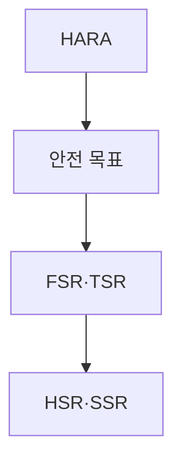
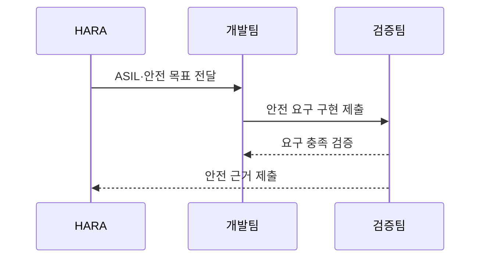

---
sidebar:
  order: 78
  label: "078. 기능 안전 ISO 26262·ASIL (Functional Safety ISO 26262)"
  badge:
    text: "기출 · 50%"
    variant: note
title: "기능 안전 ISO 26262·ASIL (Functional Safety ISO 26262)"
date: "2026-07-27T23:59:59+09:00"
tags:
  - "notes-software"
weight: 78
extra:
  question_no: "078"
  source_status: "기출"
  source_history: "134회"
  priority: 50
  priority_note: "134회 기출, ASIL 등급·안전수명주기 중요"
---

## 미리 알고가기

- **국제표준화기구(International Organization for Standardization, ISO)**: ‘아이에스오’로 읽고 그리스어 ‘같다(isos)’에서 정한 공통 단축 명칭이며, ISO 26262 같은 국제 표준을 제정하는 기구
- **ISO 26262**: ‘아이에스오 이육이육이’로 읽고 제정 기구와 표준 번호를 함께 쓴 표기이며, 차량 전기·전자 시스템의 기능 안전 수명주기를 규정한 표준
- **기능 안전(Functional Safety)**: 시스템이 입력 오류·내부 고장에도 위험한 동작을 방지하거나 안전 상태로 전환하게 하는 안전
- **자동차 안전 무결성 수준 ASIL(에이실, Automotive Safety Integrity Level)**: 영어 핵심어의 첫 글자를 붙인 표기로 심각도·노출가능성·제어가능성에 따라 차량 위해의 안전 요구 엄격도를 A부터 D까지 구분한 등급
- **위험원 분석 및 위험 평가(Hazard Analysis and Risk Assessment, HARA)**: ‘하라’로 읽고 영문 첫 글자를 딴 약어이며, 운전 상황별 위해를 분석해 ASIL과 안전 목표를 도출하는 과정
- **품질관리(Quality Management, QM)**: ‘큐엠’으로 읽고 영문 첫 글자를 딴 약어이며, ASIL이 도출되지 않은 항목을 일반 품질 절차로 관리하는 분류
- **기능 안전 요구사항(Functional Safety Requirement, FSR)**: ‘에프에스알’로 읽고 영문 첫 글자를 딴 약어이며, 안전 목표를 기능 수준 요구로 분해한 항목
- **기술 안전 요구사항(Technical Safety Requirement, TSR)**: ‘티에스알’로 읽고 영문 첫 글자를 딴 약어이며, 기능 안전 요구를 기술 구현 요구로 구체화한 항목
- **하드웨어 안전 요구사항(Hardware Safety Requirement, HSR)**: ‘에이치에스알’로 읽고 영문 첫 글자를 딴 약어이며, 회로·부품에 할당한 안전 요구
- **소프트웨어 안전 요구사항(Software Safety Requirement, SSR)**: ‘에스에스알’로 읽고 영문 첫 글자를 딴 약어이며, 소프트웨어에 할당한 감시·진단 요구
- **하드웨어·소프트웨어(Hardware·Software, HW·SW)**: ‘에이치더블유·에스더블유’로 읽고 각 영단어의 앞뒤 또는 첫 글자를 쓴 약어이며, 기술 안전 요구를 회로와 프로그램에 나누는 구현 영역
- **심각도 S(에스, Severity)**: 영어 첫 글자와 뒤 숫자로 상해 정도의 등급을 표기하며 S0부터 S3까지 HARA의 위해 축을 나타냄
- **노출가능성 E(이, Exposure)**: 영어 첫 글자와 뒤 숫자로 위험 운전 상황의 빈도를 표기하며 E0부터 E4까지 HARA의 위해 축을 나타냄
- **제어가능성 C(씨, Controllability)**: 영어 첫 글자와 뒤 숫자로 운전자·교통 참여자의 위해 회피 가능성을 표기하며 C0부터 C3까지 HARA의 위해 축을 나타냄
- **안전 목표(Safety Goal)**: HARA에서 도출하며 위험한 오동작을 방지하기 위한 차량 수준의 최상위 안전 요구
- **추적성(Traceability)**: 안전 목표에서 상세 요구·구현·시험 결과까지 양방향으로 연결해 누락과 변경 영향을 확인하는 성질
- **결함 주입(Fault Injection)**: 센서 오류·통신 단절 같은 고장을 의도적으로 만들어 안전 감지·전환 동작을 검증하는 시험
- **전동식 파워 스티어링(Electric Power Steering, EPS)**: ‘이피에스’로 읽고 영문 첫 글자를 딴 약어이며, 전동 모터로 조향력을 보조하는 차량 시스템
- **배터리 관리 시스템(Battery Management System, BMS)**: ‘비엠에스’로 읽고 영문 첫 글자를 딴 약어이며, 배터리 상태를 감시하고 위험 시 차단하는 시스템

## Ⅰ. 개요

- 정의/개념: 차량 오동작 위험의 **ASIL별 수명주기 통제**
- 기존 한계: 일반 품질관리는 **인명 위해별 엄격도 차등 부족**

### 쉽게 이해하기 (학습용)
- 차량 기능이 잘못 동작할 때의 피해를 등급화하고 그 등급만큼 설계·시험을 엄격하게 만든다

## Ⅱ. 특징

- **S·E·C 조합**으로 ASIL과 안전 목표 도출
- 높은 ASIL일수록 **검증 엄격도·독립성** 강화
- 안전 목표부터 **구현·시험까지 양방향 추적**

### 쉽게 이해하기 (학습용)
- 위험한 차량 동작을 먼저 정하고 피해 가능성이 클수록 더 독립적이고 엄격한 설계·시험을 요구한다

## Ⅲ. 아키텍처 및 구성요소

| 설계 요소 | 설명 |
|:---|:---|
| HARA | **S·E·C 평가**로 ASIL 도출 |
| 안전 목표 | 위해 방지 **차량 수준 요구** 정의 |
| FSR·TSR | 목표를 **기능·기술 요구**로 분해 |
| HSR·SSR | 기술 요구를 **HW·SW**에 할당 |

> 요약: 안전 목표를 기능·기술·하드웨어·소프트웨어 요구로 분해

### 쉽게 이해하기 (학습용)
- 위해 등급에서 안전 목표를 정하고 회로와 코드 요구로 나눠 시험 결과까지 연결한다

## Ⅳ. 원리 및 절차 흐름도

| 절차 | 설명 |
|:---|:---|
| ASIL·안전 목표 전달 | **S·E·C**로 등급과 목표 산정 |
| 안전 요구 구현 제출 | 목표를 **FSR·TSR·HSR·SSR**로 분해 |
| 요구 충족 검증 | 등급별 **방법·독립성**으로 검증 |
| 안전 근거 제출 | **양방향 추적 결과**로 안전 입증 |

> 요약: 위해 등급부터 안전 요구 구현과 검증 근거까지 연결함

### 쉽게 이해하기 (학습용)
- 센서 고장의 피해를 등급화하고 차단 요구·구현·시험 결과를 한 줄로 연결한다

## Ⅴ. 종류 및 비교

| 안전 분류 | ASIL A~D | QM |
|:---|:---|:---|
| 적용 기준 | 오동작이 **인명 위해**로 연결 | **ASIL 미도출** 품질 항목 |
| 핵심 특징 | 위험별 **안전 무결성 등급** | 일반 **품질관리 절차** |
| 한계 | 등급 과소평가·**독립성 미달** | 안전 위험의 **QM 오분류** |

> 요약: 인명 위해는 ASIL, 비안전 품질은 QM 적용

### 쉽게 이해하기 (학습용)
- 인명 위해가 있으면 ASIL 절차를 적용하고 안전 위험이 없을 때만 일반 품질로 관리한다

## Ⅵ. 실무 사례

1. EPS는 **조향 상실 HARA**를 안전 시험까지 추적

### 쉽게 이해하기 (학습용)
- 조향 보조가 사라지는 상황의 위험 등급을 정하고 회로·코드·시험 요구까지 연결한다

## Ⅶ. 결론

- 차량 기능 고장이 인명 위해로 이어지는 것을 방지하기 위해 **심각도·노출도·통제 가능성**을 검토하고, HARA로 산정한 ASIL에 맞춰 안전 요구와 시험 증적을 추적한다

### 쉽게 이해하기 (학습용)
- 위험 등급을 정한 뒤 안전 목표가 코드와 시험까지 빠짐없이 이어지는지 증거로 확인한다
