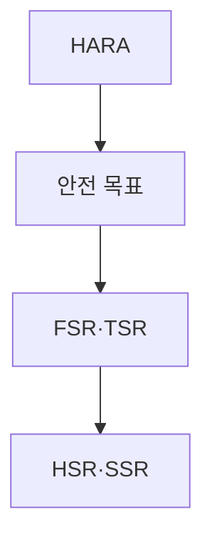
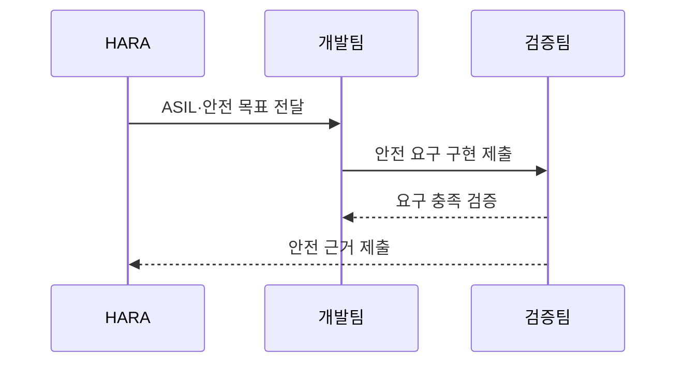

---
sidebar:
  order: 78
  label: "078. 기능 안전 ISO 26262·ASIL (Functional Safety ISO 26262)"
  badge:
    text: "기출 · 50%"
    variant: note
title: "기능 안전 ISO 26262·ASIL (Functional Safety ISO 26262)"
date: "2026-07-25T18:10:00+09:00"
tags:
  - "notes-software"
weight: 78
extra:
  question_no: "078"
  source_status: "기출"
  source_history: "134회"
  priority: 50
  priority_note: "134회 기출, ASIL 등급·안전수명주기 중요"
---

## 미리 알고가기

- **국제표준화기구(International Organization for Standardization, ISO)**: 국가별 표준기관이 참여해 ISO 26262 같은 국제 표준을 제정하는 기구
- **ISO 26262**: 양산 도로 차량의 전기·전자 시스템 오동작 위험을 안전 수명주기와 요구·검증 절차로 통제하는 기능 안전 표준
- **기능 안전(Functional Safety)**: 시스템이 입력 오류·내부 고장에도 위험한 동작을 방지하거나 안전 상태로 전환하게 하는 안전
- **자동차 안전 무결성 수준 ASIL(에이실, Automotive Safety Integrity Level)**: 영어 핵심어의 첫 글자를 붙인 표기로 심각도·노출가능성·제어가능성에 따라 차량 위해의 안전 요구 엄격도를 A부터 D까지 구분한 등급
- **위험원 분석 및 위험 평가(Hazard Analysis and Risk Assessment, HARA)**: 운전 상황별 오동작·위해를 분석해 ASIL과 안전 목표를 도출하는 과정
- **품질관리(Quality Management, QM)**: 기능 안전 위험이 ASIL에 해당하지 않을 때 일반 품질 절차로 관리하는 분류
- **기능 안전 요구사항(Functional Safety Requirement, FSR)**: 안전 목표를 시스템이 수행할 기능 수준의 안전 요구로 분해한 항목
- **기술 안전 요구사항(Technical Safety Requirement, TSR)**: 기능 안전 요구를 센서·제어기·통신 등 기술 구현 요구로 구체화한 항목
- **하드웨어 안전 요구사항(Hardware Safety Requirement, HSR)**: 기술 안전 요구 중 회로·부품에 할당한 고장 탐지·제어 요구
- **소프트웨어 안전 요구사항(Software Safety Requirement, SSR)**: 기술 안전 요구 중 소프트웨어에 할당한 감시·진단·안전 상태 요구
- **심각도 S(에스, Severity)**: 영어 첫 글자와 뒤 숫자로 상해 정도의 등급을 표기하며 S0부터 S3까지 HARA의 위해 축을 나타냄
- **노출가능성 E(이, Exposure)**: 영어 첫 글자와 뒤 숫자로 위험 운전 상황의 빈도를 표기하며 E0부터 E4까지 HARA의 위해 축을 나타냄
- **제어가능성 C(씨, Controllability)**: 영어 첫 글자와 뒤 숫자로 운전자·교통 참여자의 위해 회피 가능성을 표기하며 C0부터 C3까지 HARA의 위해 축을 나타냄
- **안전 목표(Safety Goal)**: HARA에서 도출하며 위험한 오동작을 방지하기 위한 차량 수준의 최상위 안전 요구
- **추적성(Traceability)**: 안전 목표에서 상세 요구·구현·시험 결과까지 양방향으로 연결해 누락과 변경 영향을 확인하는 성질
- **결함 주입(Fault Injection)**: 센서 오류·통신 단절 같은 고장을 의도적으로 만들어 안전 감지·전환 동작을 검증하는 시험
- **전동식 파워 스티어링(Electric Power Steering, EPS)**: 전동 모터로 조향력을 보조하며 오동작이 조향 위해로 이어질 수 있는 차량 시스템
- **배터리 관리 시스템(Battery Management System, BMS)**: 배터리 전압·온도·충방전을 감시하고 위험 시 차단하는 차량 제어 시스템

## Ⅰ. 개요

- **정의/개념**: 차량 위험을 ASIL별 요구·검증으로 통제
- **배경/필요성**: 제어 오작동의 인명 위해로 안전 수명주기 필요

### 쉽게 이해하기 (학습용)
- 차량 기능이 잘못 동작할 때의 피해를 등급화하고 그 등급만큼 설계·시험을 엄격하게 만든다

## Ⅱ. 특징

- 위해 시나리오별 안전 목표가 요구 분해의 출발점이 된다.
- 높은 ASIL일수록 검증 방법·검토 독립성을 강화한다.
- 안전 목표를 기능·기술·HW·SW 요구로 추적한다.
- 개발부터 생산·운용·폐기까지 안전 수명주기를 적용한다.

### 쉽게 이해하기 (학습용)
- 위험한 차량 동작을 먼저 정하고 피해 가능성이 클수록 더 독립적이고 엄격한 설계·시험을 요구한다

## Ⅲ. 아키텍처 및 구성요소

| 설계 요소 | 설명 |
|:---|:---|
| HARA | 위해 시나리오에서 ASIL 도출 |
| 안전 목표 | 위해 방지 최상위 요구 정의 |
| FSR·TSR | 목표를 기능·기술 요구로 분해 |
| HSR·SSR | 기술 요구를 하드웨어·소프트웨어에 할당 |

> 요약: 안전 목표를 기능·기술·하드웨어·소프트웨어 요구로 분해

### 쉽게 이해하기 (학습용)
- 위해 등급에서 안전 목표를 정하고 회로와 코드 요구로 나눠 시험 결과까지 연결한다

## Ⅳ. 원리 및 절차 흐름도

| 절차 | 설명 |
|:---|:---|
| ASIL·안전 목표 전달 | S·E·C로 등급과 목표 산정 |
| 안전 요구 구현 제출 | 목표를 FSR·TSR·HSR·SSR로 구현 |
| 요구 충족 검증 | 등급별 방법·독립성으로 검증 |
| 안전 근거 제출 | 추적 결과로 기능 안전 입증 |

> 요약: 위해 등급부터 안전 요구 구현과 검증 근거까지 연결함

### 쉽게 이해하기 (학습용)
- 센서 고장의 피해를 등급화하고 차단 요구·구현·시험 결과를 한 줄로 연결한다

## Ⅴ. 종류 및 비교

| 비교축 | ASIL A~D | QM |
|:---|:---|:---|
| 핵심 특징 | 상해 위험 기반 안전 등급 | 일반 품질 절차 |
| 검증 엄격성 | 등급에 따라 분석·독립성 강화 | 일반 품질 검토 수행 |
| 적용 기준 | 고장이 인명 위해로 이어질 때 | ASIL이 도출되지 않을 때 |
| 주요 위험 | 등급 과소평가·독립성 미달 | 안전 위험을 QM으로 오분류 |

> 요약: 인명 위해는 ASIL, 비안전 품질은 QM 적용

### 쉽게 이해하기 (학습용)
- 인명 위해가 있으면 ASIL 절차를 적용하고 안전 위험이 없을 때만 일반 품질로 관리한다

## Ⅵ. 실무 사례

1. EPS는 조향 상실 HARA 결과를 안전 요구·시험에 추적
2. BMS는 센서 결함 주입으로 과충전 차단 동작 검증

### 쉽게 이해하기 (학습용)
- 조향 보조가 사라지는 상황의 위험 등급을 정하고 회로·코드·시험 요구까지 연결한다
- 배터리 센서에 잘못된 값을 넣어도 과충전 전에 전류를 차단하는지 확인한다

## Ⅶ. 결론

- ASIL별 요구·구현·검증 증거로 기능 안전 입증

### 쉽게 이해하기 (학습용)
- 위험 등급을 정한 뒤 안전 목표가 코드와 시험까지 빠짐없이 이어지는지 증거로 확인한다
