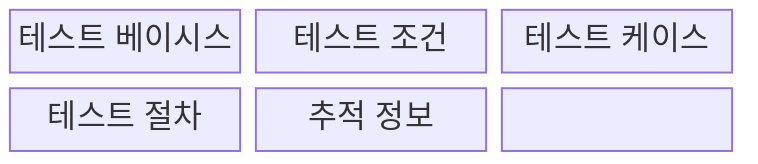
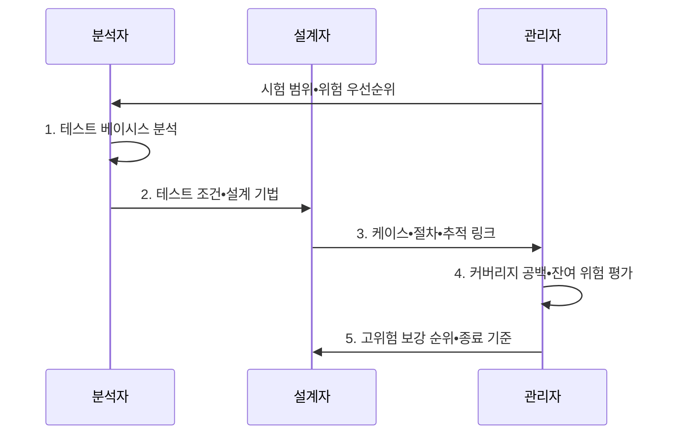

---
sidebar:
  order: 79
  label: "079. ISO 29119 테스트 설계 (ISO 29119 Test Design)"
  badge:
    text: "기출 • 30%"
    variant: note
title: "ISO 29119 테스트 설계 (ISO 29119 Test Design)"
date: "2026-08-04T12:08:00+09:00"
tags:
  - "notes-software"
weight: 79
extra:
  question_no: "079"
  source_status: "기출"
  source_history: "128회"
  priority: 30
  priority_note: "128회 기출, 테스트 설계기법 표준화 주제"
---

## Ⅰ. 개요

핵심 용어

- **ISO/IEC/IEEE 29119 테스트 설계**: 테스트 근거에서 조건•커버리지 항목•케이스•절차를 도출하고 결과까지 추적하도록 규정한 국제 소프트웨어 테스트 표준 체계이다.
- **범위 누락(Scope Omission)**: 경험 기반 시험에서 검증 대상이 빠지는 문제다.
- **결과 재현 불가(Irreproducibility)**: 같은 시험 결과를 다시 얻기 어려운 문제다.

- 정의/개념: 테스트 근거를 조건•커버리지 항목•케이스•절차로 변환하고 추적하는 **ISO/IEC/IEEE 29119 표준 설계 체계**
- 배경/필요성: 경험 의존 테스트는 **범위 누락•결과 재현 불가**

#### 한줄 요약

- 무엇을 검사할지 정한 뒤 입력•예상 결과•실행 순서를 만들고 각 요구와 연결한다.

## Ⅱ. 특징

핵심 용어

- **위험 수준**: 결함 발생 가능성과 피해 영향으로 시험 우선순위와 엄격도를 정하는 기준이다.
- **요구 추적(Requirement Trace)**: 테스트 근거를 조건과 연결하는 관계다.
- **조건 추적(Condition Trace)**: 테스트 조건을 케이스와 연결하는 관계다.
- **케이스 추적(Case Trace)**: 테스트 케이스를 실행 결과와 연결하는 관계다.
- **결과 추적(Result Trace)**: 실행 증거를 원래 요구까지 역으로 잇는 관계다.

- **위험 수준** 에 따라 설계 기법•자원 우선 배정
- **요구•조건•케이스•결과** 의 양방향 추적
- **조건•케이스•절차 분리** 로 재사용•재현성 확보

#### 한줄 요약

- 위험한 기능부터 검사하고 조건•입력•실행 순서를 나눠 두면 변경된 부분만 고쳐 다시 쓸 수 있다.

## Ⅲ. 구조 및 구성요소

핵심 용어

- **테스트 베이시스(Test Basis)**: 요구사항•설계•위험 분석처럼 테스트 조건과 기대 결과를 도출하는 근거이다.
- **테스트 조건(Test Condition)**: 검증해야 할 기능•품질 속성•위험을 시험 가능한 단위로 식별한 항목이다.
- **테스트 케이스(Test Case)**: 특정 조건을 검증할 입력•사전 조건•예상 결과의 묶음이다.
- **테스트 절차(Test Procedure)**: 하나 이상의 테스트 케이스를 실행할 순서•환경•조작을 명세한 절차이다.

| 구성요소 | 책임 |
|:---|:---|
| 테스트 베이시스 | **요구•설계•위험 근거** 제공 |
| 테스트 조건 | 검증할 **기능•품질•위험** 식별 |
| 테스트 케이스 | **입력•사전 조건•기대 결과** 정의 |
| 테스트 절차 | 케이스의 **실행 순서•환경•조작** 구성 |
| 추적 정보 | 요구부터 결과까지 **양방향 연결** |

#### 한줄 요약

- 요구와 위험에서 조건•입력•절차를 만들고 결과까지 연결한다.

## Ⅳ. 흐름도

핵심 용어

- **설계 기법(Test Design Technique)**: 조건 특성에 맞춰 입력과 기대 결과를 도출하는 규칙이다.
- **추적 링크(Trace Link)**: 케이스와 절차를 테스트 근거에 연결한 정보다.
- **테스트 오라클(Test Oracle)**: 실제 실행 결과가 올바른지 비교•판정하는 기대 결과나 규칙이다.
- **커버리지 공백(Coverage Gap)**: 시험이 다루지 못한 요구와 조건이다.
- **잔여 위험(Residual Risk)**: 시험 완료 뒤에도 남은 위험이다.
- **종료 기준(Test Completion Criteria)**: 커버리지•결함•위험 수준으로 테스트 완료 여부를 판단하는 기준이다.

**동작 원리**

- **1. 테스트 베이시스 분석**: 요구•설계•위험 식별자에서 검증 대상 근거 수집
- **2. 테스트 조건•설계 기법**: 위험과 조건 특성에 맞는 기법 선택
- **3. 케이스•절차•추적 링크**: 입력•오라클•실행 순서와 근거 연결
- **4. 커버리지 공백•잔여 위험**: 요구•조건•케이스 누락을 관리자에게 제공
- **5. 고위험 보강 순위•종료 기준**: 위험 기반 보강과 완료 조건 확정

> 요약: 테스트 근거에서 조건•케이스•절차를 도출하고 결과까지 양방향 추적

#### 한줄 요약

- 결제 조건별 입력과 순서를 만들고 요구 추적률과 잔여 위험으로 완료를 판단한다.

## Ⅴ. 종류 및 비교

핵심 용어

- **비형식 테스트(Ad-hoc Testing)**: 정해진 설계 절차보다 테스터의 경험과 즉석 탐색에 의존하는 테스트이다.
- **표준 설계**: 테스트 베이시스부터 결과까지 추적 가능한 조건•케이스•절차를 만드는 방식이다.
- **재현성 부족**: 다른 사람이 같은 조건과 절차로 같은 결과를 얻기 어려운 상태이다.

| 테스트 설계 방식 | ISO 29119 기반 설계 | 비형식 테스트 |
|:---|:---|:---|
| 적용 기준 | 반복 검증•**감사 증거** 요구 | 저위험 기능의 **빠른 탐색** |
| 핵심 특징 | 베이시스부터 결과까지 **추적** | 테스터의 **경험•즉석 탐색** |
| 한계 | 문서 비용•**변경 대응 지연** | 범위 누락•**재현성 부족** |

> 요약: 빠른 탐색은 **비형식**, 반복•감사 추적은 **표준 설계** 선택

#### 한줄 요약
- 빠른 탐색은 비형식으로 시작할 수 있지만 반복•감사 대상은 조건과 결과를 추적해야 한다

## Ⅵ. 실무 고려사항 및 대책

핵심 용어

- **위험 기반 재단(Risk-based Tailoring)**: 시험 위험에 따라 산출물 상세도를 조정하는 활동이다.
- **규제 기반 재단(Regulation-based Tailoring)**: 규제 의무에 따라 산출물을 조정하는 활동이다.
- **재현 요구 기반 재단(Reproducibility Tailoring)**: 반복 필요성에 따라 절차 상세도를 조정하는 활동이다.
- **추적 링크로 영향 케이스 식별**: 변경된 요구와 연결된 테스트 조건•케이스를 역추적해 다시 검증할 범위를 찾는 방법이다.
- **조건 특성별 설계 기법**: 경계•조합•상태 등 검증 대상의 성격에 맞춰 선택한 테스트 도출 규칙이다.
- **측정 오라클(Measurement Oracle)**: 실제 결과를 객관적으로 판정하는 기준이다.
- **허용 범위(Tolerance)**: 합격으로 인정할 수 있는 측정 오차다.
- **결함(Defect)**: 실제 결과가 기대 결과와 다른 원인이다.

| 문제 | 대책 | 효과 |
|:---|:---|:---|
| 저위험 변경에도 동일 문서를 요구해 피드백 지연 | **위험•규제•재현 요구별 재단** | **저위험 변경 피드백** 단축 |
| 요구 변경 후 추적 링크가 낡아 케이스 불일치 | **추적 링크로 영향 케이스** 식별 | **요구•케이스 불일치** 방지 |
| 조건 특성과 맞지 않는 기법으로 결함 경계 누락 | **조건 특성별 설계 기법** 선택 | **입력 설계 결함 누락** 감소 |
| 기대 결과가 모호해 성공•실패 판정이 상충 | **측정 오라클•허용 범위** 포함 | **성공•실패 판정** 명확화 |
| 추적률 숫자만 채워 고위험 검증 깊이가 부족 | **결과•결함•잔여 위험** 함께 검토 | **위험 검증 깊이** 확보 |

> 적용 사례: 뱅킹 시스템은 요구•조건•케이스•결과 추적으로 고위험 기능의 누락을 확인

#### 한줄 요약
- 금융 요구가 테스트 조건•케이스•결과까지 빠짐없이 연결됐는지 확인한다

## Ⅶ. 결론

핵심 용어

- **반복성(Repeatability)**: 같은 조건에서 같은 결과를 얻을 수 있는 성질이다.
- **감사 증거(Audit Evidence)**: 시험 절차 준수를 입증하는 기록이다.
- **설계 상세도와 추적성**: 케이스•절차의 구체성 및 요구에서 결과까지 연결 가능한 정도이다.

- **위험•반복성•감사 증거** 에 따라 설계 상세도와 추적성을 결정

#### 한줄 요약
- 위험이 큰 요구는 체계적 기법으로 케이스를 만들고 요구부터 결과까지 연결해 완료 근거를 남긴다
