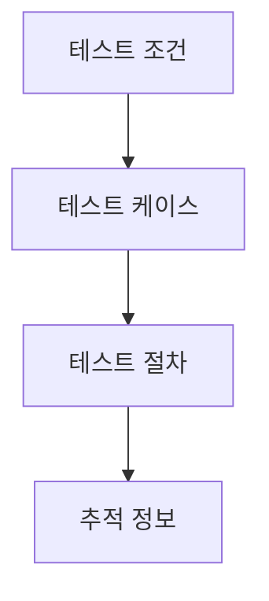
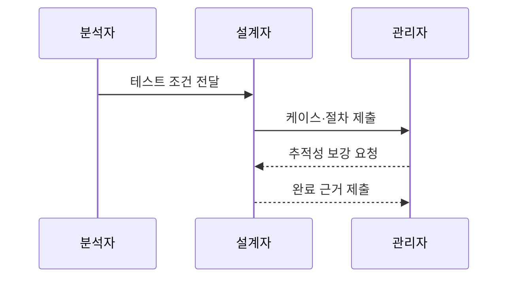

---
sidebar:
  order: 79
  label: "079. ISO 29119 테스트 설계 (ISO 29119 Test Design)"
  badge:
    text: "기출 · 30%"
    variant: note
title: "ISO 29119 테스트 설계 (ISO 29119 Test Design)"
date: "2026-07-25T18:11:00+09:00"
tags:
  - "notes-software"
weight: 79
extra:
  question_no: "079"
  source_status: "기출"
  source_history: "128회"
  priority: 30
  priority_note: "128회 기출, 테스트 설계기법 표준화 주제"
---

## 미리 알고가기

- **국제표준화기구(International Organization for Standardization, ISO)**: 국가별 표준기관이 참여해 국제 소프트웨어 테스트 표준을 제정하는 기구
- **국제전기기술위원회(International Electrotechnical Commission, IEC)**: 전기·전자와 관련 시스템의 국제 표준을 제정하는 기구
- **전기전자공학자협회(Institute of Electrical and Electronics Engineers, IEEE)**: 전기·전자·소프트웨어 공학 표준을 개발하는 전문기구
- **ISO/IEC/IEEE 29119**: 소프트웨어 테스트의 프로세스·문서·설계 기법과 용어를 공통 구조로 정의한 국제 표준
- **테스트 베이시스(Test Basis)**: 요구사항·설계·위험 분석처럼 테스트 조건과 기대 결과를 도출하는 근거 문서
- **테스트 조건(Test Condition)**: 검증해야 할 기능·품질 속성·위험을 시험 가능한 단위로 식별한 항목
- **테스트 케이스(Test Case)**: 특정 조건을 검증할 입력·사전 조건·예상 결과의 묶음
- **테스트 절차(Test Procedure)**: 하나 이상의 테스트 케이스를 실행할 순서·환경·조작을 명세한 절차
- **테스트 커버리지(Test Coverage)**: 요구·조건·코드 등 전체 대상 중 테스트가 다룬 비율
- **추적 행렬(Traceability Matrix)**: 요구·조건·케이스·결과의 연결을 표로 보여 누락과 변경 영향을 찾는 산출물
- **위험 기반 테스트(Risk-based Testing)**: 고장 가능성과 피해가 큰 항목에 테스트 자원과 엄격도를 먼저 배정하는 접근
- **테스트 설계 기법(Test Design Technique)**: 동등 분할·경곗값·결정표·상태 전이처럼 테스트 입력과 기대 결과를 체계적으로 도출하는 규칙
- **종료 기준(Test Completion Criteria)**: 요구 커버리지·결함 상태·위험 수준으로 테스트를 끝낼 수 있는지 판단하는 기준
- **비형식 테스트(Ad-hoc Testing)**: 정해진 설계 절차보다 테스터의 경험과 즉석 탐색에 의존하는 테스트
- **재현성(Reproducibility)**: 다른 사람이 같은 조건·절차를 따라 같은 테스트 결과를 다시 얻을 수 있는 성질

## Ⅰ. 개요

- **정의/개념**: 조건을 케이스·절차·추적으로 구체화
- **배경/필요성**: 시험 설계 편차로 표준 기법·추적성 필요

### 쉽게 이해하기 (학습용)
- 무엇을 검사할지 정한 뒤 입력·예상 결과·실행 순서를 만들고 각 요구와 연결한다

## Ⅱ. 특징

- 위험이 큰 조건에 설계 기법·테스트 자원을 먼저 배정한다.
- 요구·조건·케이스·결함 결과를 연결해 누락을 추적한다.
- 조건·케이스·절차를 분리해 데이터·순서를 재사용한다.
- 공통 산출물·용어가 검증 범위 해석 차이를 줄인다.

### 쉽게 이해하기 (학습용)
- 위험한 기능부터 검사하고 조건·입력·실행 순서를 나눠 두면 변경된 부분만 고쳐 다시 쓸 수 있다

## Ⅲ. 아키텍처 및 구성요소

| 설계 요소 | 설명 |
|:---|:---|
| 테스트 조건 | 베이시스에서 검증 기능·위험 식별 |
| 테스트 케이스 | 입력·사전 조건·기대 결과 구체화 |
| 테스트 절차 | 케이스 실행 순서·환경 구성 |
| 추적 정보 | 요구·조건·케이스·결과 연결 |

> 요약: 베이시스에서 조건과 케이스 및 절차를 만들고 추적함

### 쉽게 이해하기 (학습용)
- 적립 조건마다 입력과 예상 결과를 정하고 실제 실행 순서와 요구사항까지 연결한다

## Ⅳ. 원리 및 절차 흐름도

| 절차 | 설명 |
|:---|:---|
| 테스트 조건 전달 | 베이시스·위험에서 조건 식별 |
| 케이스·절차 제출 | 기법으로 입력·기대값·순서 설계 |
| 추적성 보강 요청 | 요구·조건·케이스 누락 확인 |
| 완료 근거 제출 | 종료 기준 충족 결과 제출 |

> 요약: 조건별 기법으로 케이스와 절차를 만들고 완료를 판정함

### 쉽게 이해하기 (학습용)
- 결제 조건별 입력과 순서를 만들고 요구 추적률로 완료를 판단함

## Ⅴ. 종류 및 비교

| 판단 기준 | ISO 29119 기반 테스트 설계 | 비형식 테스트 설계 |
|:---|:---|:---|
| 핵심 특징 | 베이시스·위험·기법을 추적 | 경험·탐색 결과로 범위 조정 |
| 산출물 구성 | 조건·케이스·절차·결과 연결 | 체크리스트·실행 기록 중심 |
| 적용 기준 | 반복 검증·감사 증거 필요 | 낮은 위험의 빠른 탐색 |
| 주요 위험 | 문서 과잉·변경 대응 지연 | 범위 누락·재현성 부족 |

> 요약: 비형식은 탐색 속도이고 표준 설계는 추적성에 강점이 있음

### 쉽게 이해하기 (학습용)
- 빠른 탐색은 비형식으로 시작할 수 있지만 반복·감사 대상은 조건과 결과를 추적해야 한다

## Ⅵ. 실무 사례

1. 뱅킹 요구·테스트 조건·결과 추적으로 누락 확인
2. 차량 테스트 조건·절차 변경의 정합성 점검

### 쉽게 이해하기 (학습용)
- 금융 요구가 테스트 조건·케이스·결과까지 빠짐없이 연결됐는지 확인한다
- 차량 기능 변경 시 영향받은 조건과 절차를 찾아 다시 실행한다

## Ⅶ. 결론

- 위험 수준에 맞춰 설계 기법·완료 근거 선택

### 쉽게 이해하기 (학습용)
- 위험이 큰 요구는 체계적 기법으로 케이스를 만들고 요구부터 결과까지 연결해 완료 근거를 남긴다
