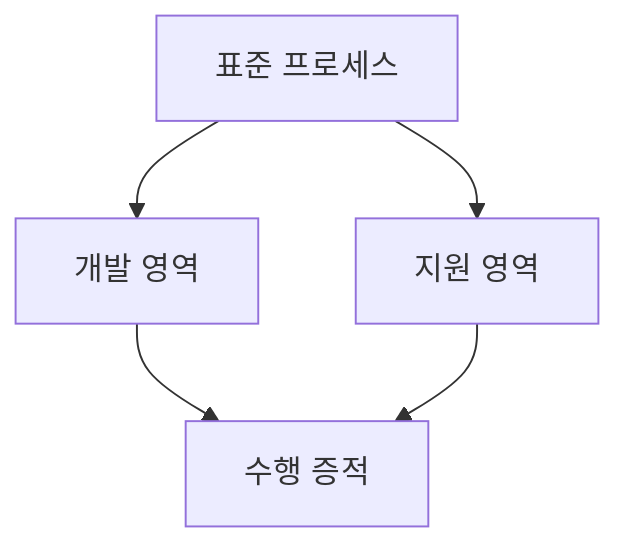
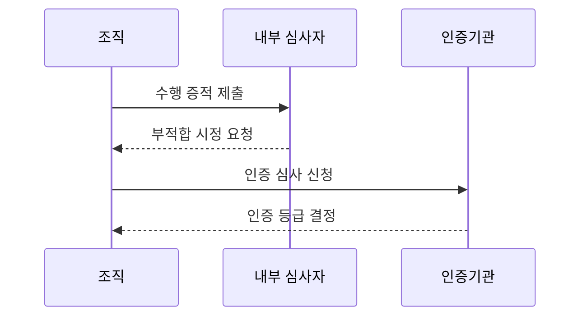

---
sidebar:
  order: 80
  label: "080. SP 소프트웨어 프로세스 품질 인증 (SP Quality Certification)"
  badge:
    text: "기출 · 50%"
    variant: note
title: "SP 소프트웨어 프로세스 품질 인증 (SP Quality Certification)"
date: "2026-07-25T18:12:00+09:00"
tags:
  - "notes-software"
weight: 80
extra:
  question_no: "080"
  source_status: "기출"
  source_history: "134회"
  priority: 50
  priority_note: "134회 기출, 프로세스 품질인증 절차·등급"
---

## 미리 알고가기

- **소프트웨어 프로세스 품질인증 SP(에스피, Software Process Quality Certification)**: Software Process의 첫 글자를 쓴 명칭으로 국내 소프트웨어 조직의 개발·관리·지원 프로세스 수행 역량을 심사해 등급을 부여하는 제도
- **소프트웨어 프로세스 SP(에스피, Software Process)**: 영어 두 낱말의 첫 글자를 쓴 표기로 요구·설계·구현·시험·관리 활동을 역할·순서·산출물로 정한 작업 체계
- **프로세스 자산(Process Asset)**: 조직이 반복 사용하도록 관리하는 표준 절차·양식·지침·과거 수행 자료
- **수행 증적(Evidence of Implementation)**: 표준 절차가 실제 프로젝트에서 수행됐음을 보여 주는 승인·변경·시험·검토 기록
- **부적합 사항(Non-conformance)**: 실제 수행이나 증거가 인증 심사 기준을 충족하지 못한 항목
- **형상관리(Configuration Management)**: 코드·문서·설정의 기준 버전과 변경 이력을 식별·통제하는 지원 활동
- **품질보증(Quality Assurance)**: 개발 과정과 산출물이 정한 절차·품질 기준을 따르는지 독립적으로 확인하는 활동
- **현장 심사(On-site Assessment)**: 심사자가 조직의 담당자·프로젝트·증적을 현장에서 확인해 문서와 실제 수행의 일치를 평가하는 절차
- **핫픽스(Hotfix)**: 운영 중인 서비스의 긴급 결함을 짧은 절차로 수정·배포하는 변경

## Ⅰ. 개요

- **정의/개념**: 조직의 소프트웨어 프로세스 역량 인증
- **배경/필요성**: 조직별 개발 편차로 프로세스 역량 인증 필요

### 쉽게 이해하기 (학습용)
- 완성품 하나만 보지 않고 여러 프로젝트에서 같은 개발 절차를 실제로 지켰는지 기록으로 확인한다

## Ⅱ. 특징

- 결과물보다 표준 절차의 반복 수행과 증적 일치를 평가한다.
- 요구·설계·검증과 관리·형상·품질보증을 함께 심사한다.
- 문서와 현장 수행이 다르면 인증 형식화로 판정한다.

### 쉽게 이해하기 (학습용)
- 개발 규칙을 적어 둔 것만 보지 않고 프로젝트 기록과 담당자 확인으로 실제 수행 여부를 심사한다

## Ⅲ. 아키텍처 및 구성요소

| 설계 요소 | 설명 |
|:---|:---|
| 표준 프로세스 | 조직 공통 절차·역할·산출물 정의 |
| 개발 영역 | 요구·설계·구현·검증 절차 수행 |
| 지원 영역 | 관리·형상·품질보증 활동 지원 |
| 수행 증적 | 표준 절차의 실제 수행 입증 |

> 요약: 조직 표준을 개발과 지원 활동에 적용하고 증적으로 입증함

### 쉽게 이해하기 (학습용)
- 개발과 지원 절차의 수행 기록을 모아 조직 역량을 입증함

## Ⅳ. 원리 및 절차 흐름도

| 절차 | 설명 |
|:---|:---|
| 수행 증적 제출 | 표준 적용 결과와 기록을 내부 진단 |
| 부적합 시정 요청 | 기준 미충족 원인과 증거 보완 요구 |
| 인증 심사 신청 | 시정된 증적과 프로세스 평가 요청 |
| 인증 등급 결정 | 현장 심사와 심의로 등급 부여 |

> 요약: 표준 수행 증적과 부적합 개선을 심사해 등급을 결정함

### 쉽게 이해하기 (학습용)
- 표준 수행 기록을 진단하고 개선한 뒤 심사로 등급을 받음

## Ⅴ. 종류 및 비교

| 비교축 | SP 프로세스 인증 | 프로젝트 산출물 점검 |
|:---|:---|:---|
| 핵심 특징 | 개발·지원 프로세스 역량 평가 | 제품 요구 충족·결과 품질 확인 |
| 증거 범위 | 표준·수행 증적·개선 기록 | 해당 사업의 코드·문서·결과 |
| 적용 기준 | 조직의 반복 수행 역량 입증 | 개별 산출물의 납품 적합성 확인 |
| 주요 위험 | 인증 형식화·현장 실행 괴리 | 결과 중심의 과정 결함 누락 |

> 요약: 산출물은 결과, 인증은 반복 수행 역량 평가

### 쉽게 이해하기 (학습용)
- 한 제품의 납품 품질은 산출물로 보고 조직이 같은 품질을 반복할 역량은 수행 증적으로 확인한다

## Ⅵ. 실무 사례

1. 인증 기준·개발 도구 기록을 연결해 증적 중복 축소
2. 핫픽스 절차 예외를 승인 규칙으로 제한

### 쉽게 이해하기 (학습용)
- 개발 도구 기록을 수행 증적으로 자동 연결함
- 긴급 수정 예외도 승인 규칙에 따라 기록함

## Ⅶ. 결론

- 반복 수행 증적으로 조직 프로세스 역량 입증

### 쉽게 이해하기 (학습용)
- 표준 문서보다 프로젝트마다 남은 수행 증적과 부적합 개선이 반복 역량을 실제로 보여 주는지 확인한다
