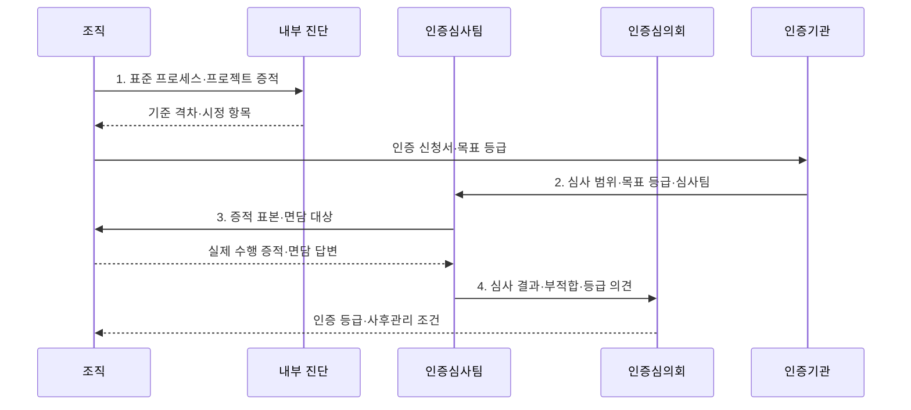

---
sidebar:
  order: 80
  label: "080. SP 소프트웨어 프로세스 품질 인증 (SP Quality Certification)"
  badge:
    text: "기출 · 50%"
    variant: note
title: "SP 소프트웨어 프로세스 품질 인증 (SP Quality Certification)"
date: "2026-07-30T23:27:01+09:00"
tags:
  - "notes-software"
weight: 80
extra:
  question_no: "080"
  source_status: "기출"
  source_history: "134회"
  priority: 50
  priority_note: "134회 기출, 프로세스 품질인증 절차·등급"
---

## 미리 알고가기

- **소프트웨어 프로세스 품질인증 SP(에스피, Software Process Quality Certification)**: 「소프트웨어 진흥법」에 따라 국내 소프트웨어 조직의 개발·관리·지원 프로세스 역량을 심사해 2·3등급을 부여하는 제도
- **소프트웨어 프로세스 SP(에스피, Software Process)**: 영어 두 낱말의 첫 글자를 쓴 표기로 요구·설계·구현·시험·관리 활동을 역할·순서·산출물로 정한 작업 체계
- **프로세스 자산(Process Asset)**: 조직이 반복 사용하도록 관리하는 표준 절차·양식·지침·과거 수행 자료
- **수행 증적(Evidence of Implementation)**: 표준 절차가 실제 프로젝트에서 수행됐음을 보여 주는 승인·변경·시험·검토 기록
- **부적합 사항(Non-conformance)**: 실제 수행이나 증거가 인증 심사 기준을 충족하지 못한 항목
- **형상관리(Configuration Management)**: 코드·문서·설정의 기준 버전과 변경 이력을 식별·통제하는 지원 활동
- **품질보증(Quality Assurance)**: 개발 과정과 산출물이 정한 절차·품질 기준을 따르는지 독립적으로 확인하는 활동
- **현장 심사(On-site Assessment)**: 심사자가 조직의 담당자·프로젝트·증적을 현장에서 확인해 문서와 실제 수행의 일치를 평가하는 절차
- **핫픽스(Hotfix)**: 운영 중인 서비스의 긴급 결함을 짧은 절차로 수정·배포하는 변경
- **SP 2등급**: 프로젝트 차원에서 소프트웨어 프로세스를 계획·수행·통제할 역량을 인정하는 등급
- **SP 3등급**: 조직 표준과 정량 데이터를 바탕으로 일관된 프로젝트 수행과 지속적 프로세스 개선 역량을 인정하는 등급
- **인증심의회(Certification Review Committee)**: 인증심사 결과를 심의해 등급 부여 여부를 결정하는 기구
- **내부 진단(Internal Assessment)**: 인증 전에 조직이 기준 대비 수행 격차와 시정 항목을 확인하는 활동
- **인증기관(Certification Body)**: 신청을 접수하고 심사팀·범위·일정을 운영하는 기관
- **재단 기준(Tailoring Criteria)**: 프로젝트 위험·규모에 맞춰 표준 절차를 조정할 수 있는 조건
- **시정 조치(Corrective Action)**: 부적합 원인을 제거하고 재발 방지 효과를 검증하는 조치
- **사후관리(Follow-up Management)**: 인증 후에도 프로세스 수행과 개선 상태를 유지하는 활동

## Ⅰ. 개요

- 정의/개념: 개발·관리·지원 프로세스 역량을 심사하는 **국내 인증 제도**
- 배경/필요성: 산출물 점검만으로는 조직의 **반복 수행 역량 검증 불가**

### 쉽게 이해하기 (학습용)

- 완성품 하나만 보지 않고 여러 프로젝트에서 같은 개발 절차를 실제로 지켰는지 기록으로 확인한다.

## Ⅱ. 특징

- **표준 프로세스의 반복 수행·증적**을 평가
- **개발·관리·지원 영역**을 통합 심사
- 문서와 **현장 수행의 일치성**을 확인

### 쉽게 이해하기 (학습용)

- 개발 규칙을 적어 둔 것만 보지 않고 프로젝트 기록과 담당자 확인으로 실제 수행 여부를 심사한다.

## Ⅲ. 구조 및 구성요소

| 구성요소 | 책임 |
|:---|:---|
| 표준 프로세스 | **공통 절차·역할·산출물** 정의 |
| 개발 영역 | **요구·설계·구현·검증** 수행 |
| 관리 영역 | **계획·통제·위험관리** 수행 |
| 지원 영역 | **형상관리·품질보증** 수행 |
| 수행 증적 | 표준 절차의 **실제 프로젝트 적용** 입증 |

### 쉽게 이해하기 (학습용)

- 개발·관리·지원 절차와 실제 수행 기록을 함께 심사한다.

## Ⅳ. 흐름도

**동작 원리**

- **1. 표준 프로세스·프로젝트 증적**: 기준 격차와 시정 항목 진단
- **2. 심사 범위·목표 등급·심사팀**: 신청 내용에 맞는 현장 심사 계획 확정
- **3. 증적 표본·면담 대상**: 문서와 실제 프로젝트 수행의 일치 검증
- **4. 심사 결과·부적합·등급 의견**: 인증심의회에 등급 판단 근거 제공

> 요약: 실제 프로젝트의 프로세스 수행 증거를 현장 심사·심의해 조직 역량 등급 결정

### 쉽게 이해하기 (학습용)

- 표준 수행 기록을 진단하고 개선한 뒤 현장 심사와 심의로 등급을 받는다.

## Ⅴ. 종류 및 비교

| 품질 평가 방식 | SP 프로세스 인증 | 프로젝트 산출물 점검 |
|:---|:---|:---|
| 적용 기준 | 조직의 **반복 수행 역량** 입증 | 개별 제품의 **납품 적합성** 확인 |
| 핵심 특징 | 표준·수행 증적·**개선 기록** 심사 | 코드·문서·**시험 결과** 점검 |
| 한계 | 인증 형식화·**현장 실행 괴리** | 과정 결함·**재발 원인 누락** |

> 요약: 산출물은 결과, 인증은 반복 수행 역량 평가

### 쉽게 이해하기 (학습용)

- 한 제품의 납품 품질은 산출물로 보고 조직이 같은 품질을 반복할 역량은 수행 증적으로 확인한다.

## Ⅵ. 실무 고려사항 및 대책

| 고려사항 | 대책 | 효과 |
|:---|:---|:---|
| 심사용 문서를 사후 작성해 실제 업무와 증적 불일치 | **도구의 승인·변경·시험 기록** 연결 | **실제 업무·증적 일치** |
| 모든 프로젝트에 같은 절차를 강제해 편법 우회 | **재단 기준·예외 승인 절차** 명시 | **불필요한 절차 우회** 감소 |
| 계획·변경·시험 기록의 식별자가 달라 추적 단절 | **공통 식별자·추적 링크** 적용 | **계획부터 시험까지 연결** |
| 부적합 문서만 임시 보완해 같은 원인이 재발 | **원인·책임자·효과 기반 시정 조치** | **동일 원인 재발** 방지 |
| 등급 획득 후 성과 측정과 개선 활동이 중단 | **성과 지표·사후관리** 연계 | **인증 후 개선 지속성** 확보 |

> 적용 사례: 개발 도구의 승인·형상·시험 기록을 인증 수행 증적으로 자동 연결

### 쉽게 이해하기 (학습용)

- 평소 개발 도구에 남은 기록을 수행 증적으로 자동 연결한다.

## Ⅶ. 결론

- 프로젝트 차원 역량은 **2등급**, 조직 표준·정량 개선은 **3등급** 신청

### 쉽게 이해하기 (학습용)

- 표준 문서보다 프로젝트마다 남은 수행 증적과 부적합 개선이 반복 역량을 실제로 보여 주는지 확인한다.
