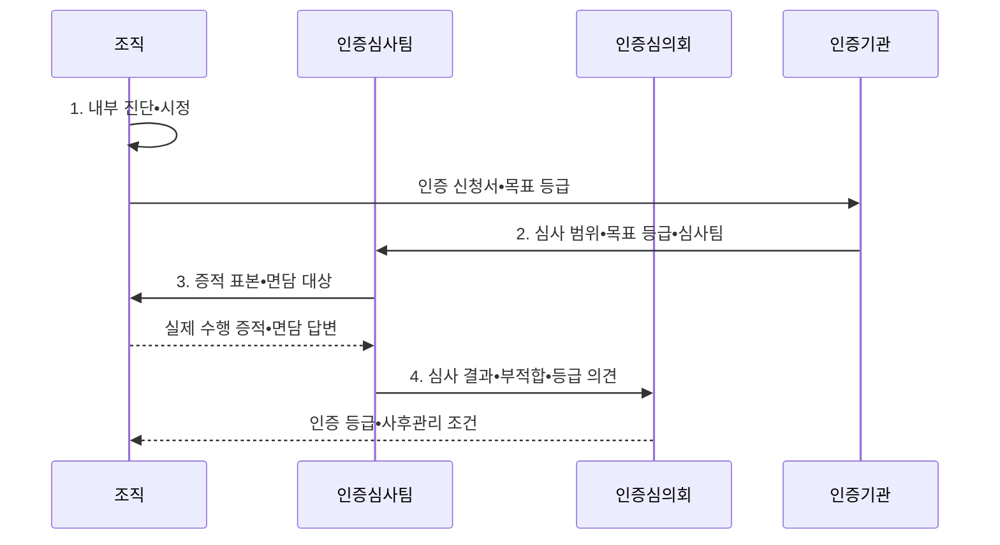

---
sidebar:
  order: 80
  label: "080. SP 소프트웨어 프로세스 품질 인증 (SP Quality Certification)"
  badge:
    text: "기출 • 50%"
    variant: note
title: "SP 소프트웨어 프로세스 품질 인증 (SP Quality Certification)"
date: "2026-08-03T09:18:33+09:00"
tags:
  - "notes-software"
weight: 80
extra:
  question_no: "080"
  source_status: "기출"
  source_history: "134회"
  priority: 50
  priority_note: "134회 기출, 프로세스 품질인증 절차•등급"
---

## Ⅰ. 개요

핵심 용어

- **소프트웨어 프로세스 품질 인증(Software Process Quality Certification, SP 인증)**: 국내 소프트웨어 조직의 개발•관리•지원 프로세스 역량을 심사해 등급을 부여하는 인증 제도이다.
- **반복 수행 역량**: 여러 프로젝트에서 정한 절차를 일관되게 실행하고 개선할 수 있는 조직 능력이다.

- 정의/개념: 조직의 개발•관리•지원 프로세스 역량을 심사해 등급을 부여하는 **국내 SP 품질 인증 제도**
- 배경/필요성: 산출물 점검만으로는 조직의 **반복 수행 역량 검증 불가**

#### 한줄 요약

- 완성품 하나만 보지 않고 여러 프로젝트에서 같은 개발 절차를 실제로 지켰는지 기록으로 확인한다.

## Ⅱ. 특징

핵심 용어

- **표준 프로세스의 반복 수행•증적**: 정한 절차를 여러 프로젝트에 적용하고 실제 기록으로 입증하는 기준이다.
- **개발•관리•지원 영역**: 요구•구현•검증, 계획•통제, 형상•품질보증을 묶은 심사 범위이다.
- **현장 수행의 일치성**: 문서에 적힌 절차와 실제 프로젝트 활동 및 기록이 같은 정도이다.

- **표준 프로세스의 반복 수행•증적** 을 평가
- **개발•관리•지원 영역** 을 통합 심사
- 문서와 **현장 수행의 일치성** 을 확인

#### 한줄 요약

- 개발 규칙을 적어 둔 것만 보지 않고 프로젝트 기록과 담당자 확인으로 실제 수행 여부를 심사한다.

## Ⅲ. 구조 및 구성요소

핵심 용어

- **공통 절차•역할•산출물**: 조직이 반복 사용하도록 표준 프로세스에 정의한 작업 체계이다.
- **요구•설계•구현•검증**: 요구를 구체화하고 구조와 동작을 설계한 뒤 개발•시험하는 개발 영역의 활동 흐름이다.
- **계획•통제•위험관리**: 범위•일정•자원을 정하고 수행 편차와 위험을 지속 관리하는 관리 영역의 활동이다.
- **형상관리•품질보증**: 기준 버전과 변경 이력을 통제하고 절차•품질 기준 준수를 독립 확인하는 지원 활동이다.
- **실제 프로젝트 적용**: 표준 절차가 수행 증적으로 확인되는 현장 실행 상태이다.

| 구성요소 | 책임 |
|:---|:---|
| 표준 프로세스 | **공통 절차•역할•산출물** 정의 |
| 개발 영역 | **요구•설계•구현•검증** 수행 |
| 관리 영역 | **계획•통제•위험관리** 수행 |
| 지원 영역 | **형상관리•품질보증** 수행 |
| 수행 증적 | 표준 절차의 **실제 프로젝트 적용** 입증 |

#### 한줄 요약

- 개발•관리•지원 절차와 실제 수행 기록을 함께 심사한다.

## Ⅳ. 흐름도

핵심 용어

- **내부 진단(Internal Assessment)**: 인증 전에 기준 대비 수행 격차와 시정 항목을 확인하는 활동이다.
- **표준 프로세스•프로젝트 증적**: 조직이 정한 절차와 실제 프로젝트에서 그 절차를 수행했음을 보여 주는 기록이다.
- **현장 심사(On-site Assessment)**: 담당자•프로젝트•증적을 확인해 문서와 실제 수행의 일치를 평가하는 절차이다.
- **인증심의회(Certification Review Committee)**: 심사 결과를 심의해 등급 부여 여부를 결정하는 기구이다.
- **부적합(Non-conformance)**: 실제 수행이나 증거가 인증 심사 기준을 충족하지 못한 항목이다.

**동작 원리**

- **1. 표준 프로세스•프로젝트 증적**: 기준 격차와 시정 항목 진단
- **2. 심사 범위•목표 등급•심사팀**: 신청 내용에 맞는 현장 심사 계획 확정
- **3. 증적 표본•면담 대상**: 문서와 실제 프로젝트 수행의 일치 검증
- **4. 심사 결과•부적합•등급 의견**: 인증심의회에 등급 판단 근거 제공

> 요약: 실제 프로젝트의 프로세스 수행 증거를 현장 심사•심의해 조직 역량 등급 결정

#### 한줄 요약

- 표준 수행 기록을 진단하고 개선한 뒤 현장 심사와 심의로 등급을 받는다.

## Ⅴ. 종류 및 비교

핵심 용어

- **SP 프로세스 인증(Software Process Quality Certification)**: 조직의 반복 수행 역량을 표준•증적•개선 기록으로 심사하는 방식이다.
- **프로젝트 산출물 점검**: 개별 제품의 코드•문서•시험 결과로 납품 적합성을 확인하는 방식이다.
- **현장 실행 괴리**: 인증 문서와 실제 업무 수행이 서로 다른 상태이다.

| 품질 평가 방식 | SP 프로세스 인증 | 프로젝트 산출물 점검 |
|:---|:---|:---|
| 적용 기준 | 조직의 **반복 수행 역량** 입증 | 개별 제품의 **납품 적합성** 확인 |
| 핵심 특징 | 표준•수행 증적•**개선 기록** 심사 | 코드•문서•**시험 결과** 점검 |
| 한계 | 인증 형식화•**현장 실행 괴리** | 과정 결함•**재발 원인 누락** |

> 요약: 산출물은 결과, 인증은 반복 수행 역량 평가

#### 한줄 요약

- 한 제품의 납품 품질은 산출물로 보고 조직이 같은 품질을 반복할 역량은 수행 증적으로 확인한다.

## Ⅵ. 실무 고려사항 및 대책

핵심 용어

- **재단 기준•예외 승인 절차**: 위험과 규모에 맞춰 표준 절차를 조정하고 이를 통제하는 조건이다.
- **도구의 승인•변경•시험 기록 연결**: 업무 도구에 생성된 승인 이력과 변경 내역 및 시험 결과를 수행 증적으로 이어 붙이는 방식이다.
- **공통 식별자•추적 링크**: 계획•변경•시험 기록을 같은 항목으로 연결하는 수단이다.
- **원인•책임자•효과 기반 시정 조치**: 부적합의 근본 원인을 제거하고 재발 방지 결과를 확인하는 조치이다.
- **성과 지표•사후관리**: 인증 후에도 프로세스 수행과 개선 효과를 지속 확인하는 활동이다.

| 문제 | 대책 | 효과 |
|:---|:---|:---|
| 심사용 문서를 사후 작성해 실제 업무와 증적 불일치 | **도구의 승인•변경•시험 기록** 연결 | **실제 업무•증적 일치** |
| 위험•규모와 무관한 절차 강제로 현장 미준수 | **재단 기준•예외 승인 절차** 명시 | **표준 프로세스 준수율** 향상 |
| 계획•변경•시험 기록의 식별자가 달라 추적 단절 | **공통 식별자•추적 링크** 적용 | **계획부터 시험까지 연결** |
| 부적합 문서만 임시 보완해 같은 원인이 재발 | **원인•책임자•효과 기반 시정 조치** | **동일 원인 재발** 방지 |
| 등급 획득 후 성과 측정과 개선 활동이 중단 | **성과 지표•사후관리** 연계 | **인증 후 개선 지속성** 확보 |

> 적용 사례: 개발 도구의 승인•형상•시험 기록을 인증 수행 증적으로 자동 연결

#### 한줄 요약

- 평소 개발 도구에 남은 기록을 수행 증적으로 자동 연결한다.

## Ⅶ. 결론

핵심 용어

- **2등급**: 프로젝트 차원에서 소프트웨어 프로세스를 계획•수행•통제할 역량을 인정하는 등급이다.
- **3등급**: 조직 표준과 정량 데이터로 일관된 수행과 지속 개선 역량을 인정하는 등급이다.

- 프로젝트 차원 역량은 **2등급**, 조직 표준•정량 개선은 **3등급** 신청

#### 한줄 요약

- 표준 문서보다 프로젝트마다 남은 수행 증적과 부적합 개선이 반복 역량을 실제로 보여 주는지 확인한다.
