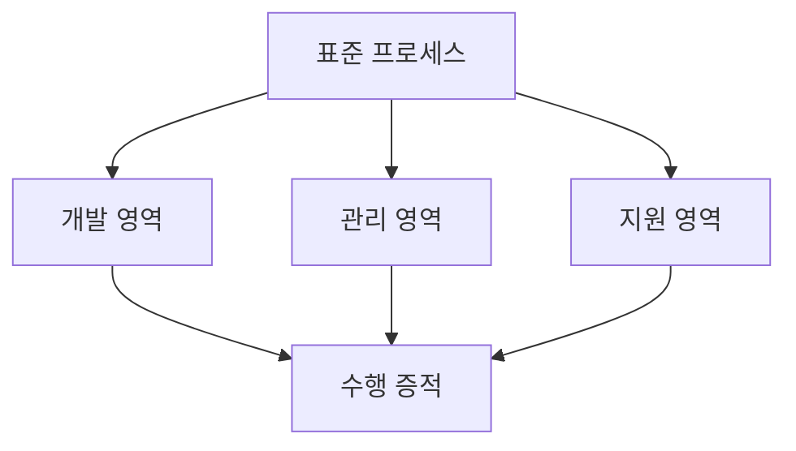
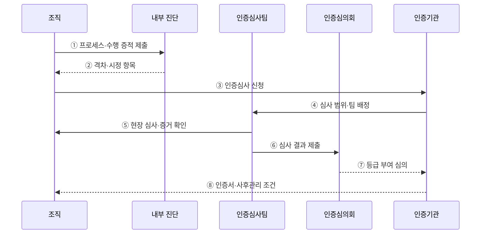

---
sidebar:
  order: 80
  label: "080. SP 소프트웨어 프로세스 품질 인증 (SP Quality Certification)"
  badge:
    text: "기출 · 50%"
    variant: note
title: "SP 소프트웨어 프로세스 품질 인증 (SP Quality Certification)"
date: "2026-07-27T23:59:59+09:00"
tags:
  - "notes-software"
weight: 80
extra:
  question_no: "080"
  source_status: "기출"
  source_history: "134회"
  priority: 50
  priority_note: "134회 기출, 프로세스 품질인증 절차·등급"
---

## 미리 알고가기

- **소프트웨어 프로세스 품질인증 SP(에스피, Software Process Quality Certification)**: 「소프트웨어 진흥법」에 따라 국내 소프트웨어 조직의 개발·관리·지원 프로세스 역량을 심사해 2·3등급을 부여하는 제도
- **소프트웨어 프로세스 SP(에스피, Software Process)**: 영어 두 낱말의 첫 글자를 쓴 표기로 요구·설계·구현·시험·관리 활동을 역할·순서·산출물로 정한 작업 체계
- **프로세스 자산(Process Asset)**: 조직이 반복 사용하도록 관리하는 표준 절차·양식·지침·과거 수행 자료
- **수행 증적(Evidence of Implementation)**: 표준 절차가 실제 프로젝트에서 수행됐음을 보여 주는 승인·변경·시험·검토 기록
- **부적합 사항(Non-conformance)**: 실제 수행이나 증거가 인증 심사 기준을 충족하지 못한 항목
- **형상관리(Configuration Management)**: 코드·문서·설정의 기준 버전과 변경 이력을 식별·통제하는 지원 활동
- **품질보증(Quality Assurance)**: 개발 과정과 산출물이 정한 절차·품질 기준을 따르는지 독립적으로 확인하는 활동
- **현장 심사(On-site Assessment)**: 심사자가 조직의 담당자·프로젝트·증적을 현장에서 확인해 문서와 실제 수행의 일치를 평가하는 절차
- **핫픽스(Hotfix)**: 운영 중인 서비스의 긴급 결함을 짧은 절차로 수정·배포하는 변경
- **SP 2등급**: 프로젝트 차원에서 소프트웨어 프로세스를 계획·수행·통제할 역량을 인정하는 등급
- **SP 3등급**: 조직 표준과 정량 데이터를 바탕으로 일관된 프로젝트 수행과 지속적 프로세스 개선 역량을 인정하는 등급
- **인증심의회(Certification Review Committee)**: 인증심사 결과를 심의해 등급 부여 여부를 결정하는 기구

## Ⅰ. 개요

- 정의/개념: 조직의 **소프트웨어 프로세스 역량** 인증
- 기존 한계: 산출물 점검만으로 **반복 수행 역량 확인 곤란**

### 쉽게 이해하기 (학습용)

- 완성품 하나만 보지 않고 여러 프로젝트에서 같은 개발 절차를 실제로 지켰는지 기록으로 확인한다.

## Ⅱ. 특징

- **표준 프로세스의 반복 수행·증적**을 평가
- **개발·관리·지원 영역**을 통합 심사
- 문서와 **현장 수행의 일치성**을 확인

### 쉽게 이해하기 (학습용)

- 개발 규칙을 적어 둔 것만 보지 않고 프로젝트 기록과 담당자 확인으로 실제 수행 여부를 심사한다.

## Ⅲ. 아키텍처 및 구성요소

**도표안 A — 구조도**

**도표안 B — sequenceDiagram**

| 설계 요소 | 설명 |
|:---|:---|
| 표준 프로세스 | 조직 공통 절차·역할·산출물 정의 |
| 개발 영역 | 요구·설계·구현·검증 수행 |
| 관리 영역 | 프로젝트 계획·통제·위험관리 수행 |
| 지원 영역 | 형상관리·품질보증 수행 |
| 수행 증적 | 표준 절차의 실제 적용 입증 |

**동작 원리**

- ① 조직이 표준 프로세스와 실제 프로젝트 수행 증적을 내부 진단에 제출한다.
- ② 내부 진단에서 기준 격차·원인·시정 필요 항목을 식별한다.
- ③ 조직이 시정 증거와 대상 사업 정보를 갖춰 인증기관에 신청한다.
- ④ 인증기관이 신청 등급·조직 범위에 맞는 심사팀과 계획을 배정한다.
- ⑤ 심사팀이 현장에서 담당자·프로젝트·증적의 실제 수행 일치를 확인한다.
- ⑥ 심사팀이 충족·부적합 근거와 등급 판정 결과를 심의회에 제출한다.
- ⑦ 인증심의회가 심사 결과를 검토해 2·3등급 부여 여부를 결정한다.
- ⑧ 인증기관이 인증서와 유효기간 중 사후관리 조건을 안내한다.

> 요약: 실제 프로젝트의 프로세스 수행 증거를 현장 심사·심의해 조직 역량 등급을 결정한다.

### 쉽게 이해하기 (학습용)

- 표준 수행 기록을 진단하고 개선한 뒤 현장 심사와 심의로 등급을 받는다.

## Ⅳ. 종류 및 비교

| 품질 평가 방식 | SP 프로세스 인증 | 프로젝트 산출물 점검 |
|:---|:---|:---|
| 적용 기준 | 조직의 **반복 수행 역량** 입증 | 개별 제품의 **납품 적합성** 확인 |
| 핵심 특징 | 표준·수행 증적·**개선 기록** 심사 | 코드·문서·**시험 결과** 점검 |
| 한계 | 인증 형식화·**현장 실행 괴리** | 과정 결함·**재발 원인 누락** |

> 요약: 산출물은 결과, 인증은 반복 수행 역량 평가

### 쉽게 이해하기 (학습용)

- 한 제품의 납품 품질은 산출물로 보고 조직이 같은 품질을 반복할 역량은 수행 증적으로 확인한다.

## Ⅴ. 실무 고려사항 및 대책

| 고려사항 | 문제점 | 대책 |
|:---|:---|:---|
| 문서 중심 준비 | 심사 직전에 만든 양식이 실제 업무와 불일치 | 개발 도구의 승인·변경·시험 기록을 자연스러운 증적으로 연결 |
| 표준의 일률 적용 | 프로젝트 규모·위험과 무관한 절차로 우회 증가 | 재단 기준과 예외 승인·회수 절차 명시 |
| 증적 단절 | 계획–요구–변경–시험의 연결 근거 부족 | 작업·형상·시험 도구에 공통 식별자와 추적 링크 적용 |
| 부적합 임시 시정 | 심사 후 같은 원인이 반복 | 원인 분석·책임자·효과 측정으로 시정조치 검증 |
| 등급 목표화 | 인증 취득 뒤 프로세스 성과 개선 중단 | 결함·재작업·납기 등 성과 지표와 사후관리 연계 |

> 적용 사례: 개발 도구의 승인·형상·시험 기록을 인증 수행 증적으로 자동 연결한다.

### 쉽게 이해하기 (학습용)

- 평소 개발 도구에 남은 기록을 수행 증적으로 자동 연결한다.

## Ⅵ. 결론

- SP 인증은 실제 프로젝트 증거로 국내 소프트웨어 조직의 반복 가능한 프로세스 역량을 평가한다.
- 등급보다 표준과 현장 수행의 일치·부적합 개선·성과 지속성을 우선한다.

### 쉽게 이해하기 (학습용)

- 표준 문서보다 프로젝트마다 남은 수행 증적과 부적합 개선이 반복 역량을 실제로 보여 주는지 확인한다.
