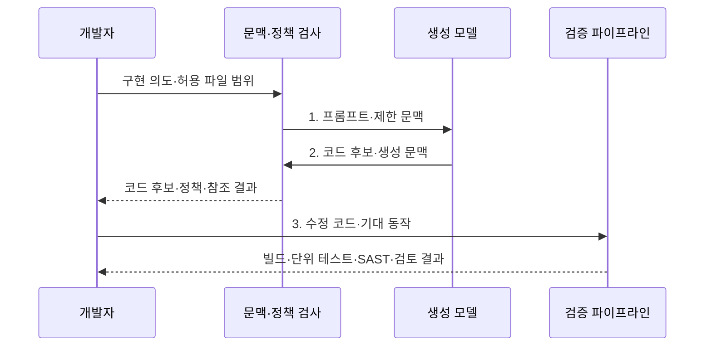

---
sidebar:
  order: 81
  label: "081. AI 코드 생성: GitHub Copilot (AI Code Generation)"
  badge:
    text: "미출제 · 50%"
    variant: note
title: "AI 코드 생성: GitHub Copilot (AI Code Generation)"
date: "2026-08-02T12:00:00+09:00"
tags:
  - "notes-software"
weight: 81
extra:
  question_no: "081"
  source_status: "미출제"
  source_history: ""
  priority: 50
  priority_note: "AI 코드 생성의 생산성·보안 검증이 현안"
---

## Ⅰ. 개요

핵심 용어

- **생성 기법**: 거대 언어 모델이 요구와 코드 문맥을 바탕으로 구현 후보를 만드는 방식이다.
- **정확성·보안·출처**: 확률적 생성 코드가 자동으로 보장하지 못해 독립 검증해야 하는 세 가지 조건이다.

- 정의/개념: **AI 코드 생성**은 LLM이 요구사항과 코드 문맥을 바탕으로 구현•테스트 후보를 만들고 개발자가 검증해 반영하는 **소프트웨어 개발 지원 기법**
- 배경/필요성: 확률적 생성만으로는 **정확성·보안·출처 보장 불가**

#### 한줄 요약

- AI는 초안을 빠르게 만들고 개발자는 정확성·안전성·권리를 확인한 뒤 반영한다.

## Ⅱ. 특징

핵심 용어

- **문맥 생성**: 허용한 코드·주석·지시를 모델 입력으로 구성해 후보를 만드는 활동이다.
- **독립 검증**: 생성과 분리된 기대 결과·시험·검토로 후보의 옳음을 확인하는 활동이다.
- **위험 통제**: 환각·취약점·권리 문제를 검사하고 반영을 제한하는 절차이다.

- **문맥 생성**: 허용한 코드·주석으로 후보 작성
- **독립 검증**: 기대 결과와 누락 조건 확인
- **위험 통제**: 환각·취약점·권리 문제 점검

#### 한줄 요약

- 문맥이 많으면 알맞은 코드를 만들기 쉽지만 기밀 입력 범위도 커져 통제가 필요하다.

## Ⅲ. 구조 및 구성요소

핵심 용어

- **컨텍스트 수집 엔진(Context Collection Engine)**: 허용된 코드·파일·지시를 모델 입력으로 구성하는 기능이다.
- **LLM(Large Language Model, 거대 언어 모델)**: 대규모 텍스트·코드에서 다음 토큰 확률을 학습한 생성 모델이다.
- **정책·참조 검사**: 생성 후보의 사용 정책과 공개 코드 일치 정보를 확인하는 검사이다.
- **수정·시험·보안·동료 검토**: 개발자가 생성 후보를 실제 코드로 반영하기 전에 거치는 검증 경로이다.

| 구성요소 | 책임 |
|:---|:---|
| 컨텍스트 수집 엔진 | 허용 **코드·파일·지시**를 모델 입력으로 구성 |
| LLM 코드 생성 모델 | 지시·문맥에 맞는 **코드 후보** 생성 |
| 정책·참조 검사 | **사용 정책·공개 코드 일치** 정보 제공 |
| 개발자 검증 경로 | **수정·시험·보안·동료 검토** 후 반영 |

#### 한줄 요약

- 허용 문맥으로 만든 코드 후보를 정책과 개발자 검증에 통과시킨다.

## Ⅳ. 흐름도

핵심 용어

- **프롬프트·제한 문맥**: 구현 의도와 제약 및 권한 경계 안의 코드만 담은 모델 입력이다.
- **코드 후보·생성 문맥**: 모델이 만든 초안과 그 결과에 사용한 입력 정보이다.
- **빌드·단위 테스트·SAST·검토 결과**: 생성 코드를 독립적으로 확인하는 실행·보안·사람 검증 증거이다.

**동작 원리**

- **1. 프롬프트·제한 문맥**: 비밀·권한 경계 안의 코드와 제약만 제공
- **2. 코드 후보·생성 문맥**: 정책·공개 코드 일치 검사를 위한 초안 전달
- **3. 수정 코드·기대 동작**: 개발자가 이해·수정한 후보를 독립 검증

> 요약: 허용 문맥으로 생성한 초안을 사람·시험·보안·권리 검토를 거쳐 반영

#### 한줄 요약

- 허용한 문맥만 모델에 보내고 생성 코드는 정책·빌드·테스트·리뷰를 차례로 통과시킨다.

## Ⅴ. 종류 및 비교

핵심 용어

- **AI 기반 코드 생성**: 넓은 코드 문맥으로 함수·알고리즘·테스트 초안을 만드는 방식이다.
- **전통적 IDE 자동 완성**: 타입과 구문 규칙으로 멤버·키워드·짧은 구문 후보를 제공하는 기능이다.
- **환각·취약점·공개 코드 유사성**: AI 생성 후보에서 별도로 검사해야 하는 로직·보안·권리 위험이다.

| 판단 기준 | AI 기반 코드 생성 | 전통적 IDE 자동 완성 |
|:---|:---|:---|
| 적용 기준 | 문맥 기반 **구현 초안** 필요 | 결정적 **구문 후보** 필요 |
| 핵심 특징 | **함수·알고리즘·테스트 후보** 생성 | **멤버·키워드·구문** 완성 |
| 한계 | **환각·취약점·공개 코드 유사성** | 잘못된 **멤버·타입 선택** |

> 요약: 언어 모델은 넓은 문맥만큼 검증 범위가 큼

#### 한줄 요약

- 자동 완성은 짧은 구문을 찾고 AI 생성은 로직까지 쓰므로 검증 범위도 넓다.

## Ⅵ. 실무 고려사항 및 대책

핵심 용어

- **제외·최소 문맥·비밀 탐지**: 기밀 코드와 자격증명의 모델 입력 노출을 줄이는 통제이다.
- **공식 문서·빌드·시험·SAST**: 존재하지 않는 API와 취약 로직을 확인하는 독립 검증 수단이다.
- **코드 참조·라이선스·IP 검사**: 공개 코드 유사 제안의 출처와 지식재산 위험을 확인하는 절차이다.

| 문제 | 대책 | 효과 |
|:---|:---|:---|
| 기밀 코드·자격증명이 모델 문맥으로 외부 노출 | **제외·최소 문맥·비밀 탐지** 적용 | **외부 정보 노출** 감소 |
| 존재하지 않는 API·취약 로직을 그럴듯하게 생성 | **공식 문서·빌드·시험·SAST** 확인 | **환각·취약 로직** 차단 |
| 공개 코드와 유사한 제안을 그대로 반영해 권리 침해 | **코드 참조·라이선스·IP 검사** | **권리 침해 위험** 감소 |
| 생성 코드와 테스트가 같은 잘못된 가정을 공유 | **기대 결과·실패 조건 독립 설계** | **동일 가정 반복** 방지 |
| 생성 시간만 측정해 수정·검토·결함 비용을 은폐 | **총시간·수정량·결함·검토 통과율** 측정 | **실제 절감 효과** 판단 |

> 적용 사례: 데이터 변환 코드 초안을 생성하고 수정량·검토 시간·리뷰 통과율로 실제 효과 측정

#### 한줄 요약

- 생성 시간뿐 아니라 수정량·검토 시간·결함까지 측정해 실제 절감 효과를 판단한다.

## Ⅶ. 결론

핵심 용어

- **문맥 민감도·검증 비용·권리 위험**: 생성 코드의 반영 여부를 결정하는 정보 노출, 검토 부담, 지식재산 기준이다.
- **생성 코드 반영**: 개발자가 후보를 이해·수정하고 검증한 뒤 제품 코드에 포함하는 결정이다.

- **문맥 민감도·검증 비용·권리 위험**으로 생성 코드 반영을 결정

#### 한줄 요약

- AI 생성 코드는 빠른 초안일 뿐이며 개발자가 이해하고 검증해야 실무 코드가 된다.
