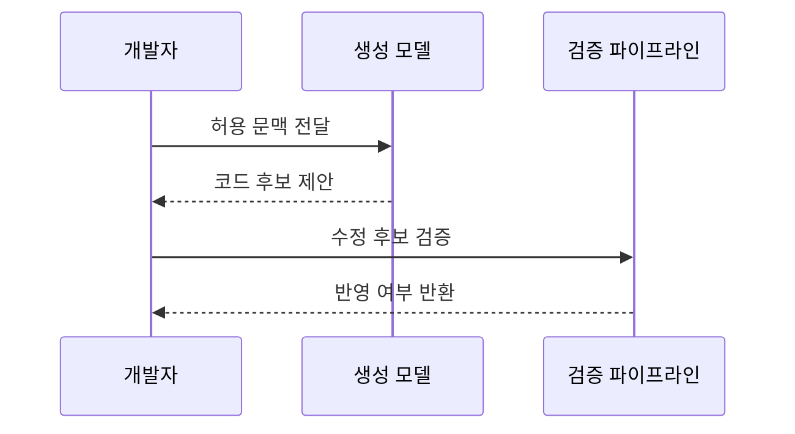

---
sidebar:
  order: 81
  label: "081. AI 코드 생성 — GitHub Copilot (AI Code Generation)"
  badge:
    text: "미출제 · 50%"
    variant: note
title: "AI 코드 생성 — GitHub Copilot (AI Code Generation)"
date: "2026-07-25T18:13:00+09:00"
tags:
  - "notes-software"
weight: 81
extra:
  question_no: "081"
  source_status: "미출제"
  source_history: ""
  priority: 50
  priority_note: "AI 코드 생성의 생산성·보안 검증이 현안"
---

## 미리 알고가기

- **인공지능(Artificial Intelligence, AI)**: 학습한 데이터로 추론·생성 등 사람의 지적 작업을 수행하는 기술임
- **거대 언어 모델(Large Language Model, LLM)**: 대규모 텍스트와 코드를 학습해 다음 토큰을 예측하는 생성 모델임
- **AI 코드 생성(AI Code Generation)**: LLM이 지시와 코드 문맥을 바탕으로 코드 후보를 만드는 기술임
- **컨텍스트 윈도우(Context Window)**: LLM이 한 번에 참고할 수 있는 입력 토큰의 최대 범위임
- **깃허브 코파일럿(GitHub Copilot)**: 코드 편집기에서 문맥 기반 코드 후보를 제안하는 AI 개발 지원 서비스임
- **통합 개발 환경(Integrated Development Environment, IDE)**: 편집·빌드·디버깅 도구를 한곳에 묶은 개발 환경임
- **프롬프트 엔지니어링(Prompt Engineering)**: 원하는 결과가 나오도록 지시와 제약 조건을 구조화하는 기법임
- **코드 환각(Hallucination)**: 모델이 존재하지 않는 응용 프로그래밍 인터페이스(Application Programming Interface, API)나 패키지를 그럴듯하게 생성하는 현상임
- **정적 응용 프로그램 보안 테스트(Static Application Security Testing, SAST)**: 프로그램을 실행하지 않고 소스 코드의 보안 취약점을 찾는 검사임
- **정책·참조 검사**: 생성 코드가 기밀·금칙어·허용 라이선스 정책을 지키는지 확인하는 절차임
- **단위 테스트(Unit Test)**: 함수나 모듈처럼 작은 코드 단위의 입력과 기대 결과를 검증하는 시험임

## Ⅰ. 개요

- 정의/개념: LLM이 문맥에 맞는 코드 후보를 생성함
- **배경/필요성**: 생성 코드 결함 위험으로 검증 관문 필요

### 쉽게 이해하기 (학습용)
- AI는 초안을 빠르게 만들고 개발자는 정확성과 안전성을 확인한 뒤 반영함

## Ⅱ. 특징

- 허용된 코드·주석·도구 문맥으로 후보를 생성한다.
- 테스트 후보의 기대 결과와 누락 조건을 검증해야 한다.
- 공개 코드 유사성·취약 API 추천 위험이 있다.
- 생성 시간 절감이 검토 비용보다 클 때 유용하다.

### 쉽게 이해하기 (학습용)
- 넓은 문맥일수록 알맞은 코드를 만들기 쉽지만 기밀 유출 범위도 커져 입력 통제가 필요함

## Ⅲ. 아키텍처 및 구성요소

| 설계 요소 | 설명 |
|:---|:---|
| 컨텍스트 수집 엔진 | 허용된 코드·주석·파일 정보를 모델 입력으로 구성함 |
| LLM 코드 생성 모델 | 지시와 문맥 다음에 올 코드 후보를 생성함 |
| 정책·참조 검사 | 기밀·금칙어·라이선스 정책 위반을 검사함 |
| 개발자 검증 경로 | 빌드·테스트·리뷰를 통과한 후보만 반영함 |

> 요약: 모델 제안을 정책·빌드·리뷰로 검증

### 쉽게 이해하기 (학습용)
- 수집기가 참고 자료를 모으면 모델이 초안을 만들고 검사 도구와 개발자가 반영 여부를 결정함

## Ⅳ. 원리 및 절차 흐름도

| 절차 | 설명 |
|:---|:---|
| 허용 문맥 전달 | 프롬프트·파일·도구 정보를 모델 입력화 |
| 코드 후보 제안 | 문맥에 이어질 코드 후보 생성 |
| 수정 후보 검증 | 정책·빌드·테스트·리뷰 수행 |
| 반영 여부 반환 | 통과 후보만 저장소에 반영 |

> 요약: 허용 문맥과 정책·개발자 검증 후 반영

### 쉽게 이해하기 (학습용)
- 허용한 문맥만 모델에 보내고 생성된 코드는 정책·빌드·테스트·리뷰를 차례로 통과시킴

## Ⅴ. 종류 및 비교

| 판단 기준 | AI 기반 코드 생성 | 전통적 IDE 자동 완성 |
|:---|:---|:---|
| 핵심 특징 | 함수·알고리즘·테스트 후보를 생성함 | 멤버·키워드 등 짧은 구문을 완성함 |
| 추천 근거 | 자연어 지시와 여러 파일의 문맥을 사용함 | 현재 구문의 문법·타입 정보를 사용함 |
| 주요 위험 | 환각·취약점·라이선스 위반 위험이 있음 | 잘못된 멤버나 타입을 선택할 수 있음 |
| 적용 기준 | 문맥 기반 초안이 필요할 때 사용함 | 정확한 구문 후보가 필요할 때 사용함 |

> 요약: 언어 모델은 넓은 문맥만큼 검증 범위가 큼

### 쉽게 이해하기 (학습용)
- 자동 완성은 문법에 맞는 짧은 조각을 찾고 AI 생성은 넓은 문맥으로 로직까지 쓰므로 검증 범위도 넓음

## Ⅵ. 실무 사례

1. 데이터 변환 초안을 생성하고 리뷰 통과율 측정
2. 내부 모델·SAST 통과 코드만 저장소 반영

### 쉽게 이해하기 (학습용)
- 반복 코드의 생성 시간뿐 아니라 수정량과 리뷰 통과율까지 측정해 실제 절감 효과를 판단함
- 민감한 금융 코드는 외부 전송을 막고 SAST를 통과해야 기밀과 취약점 위험을 함께 줄일 수 있음

## Ⅶ. 결론

- 신뢰 문맥·사람·보안 검증을 통과한 코드만 반영

### 쉽게 이해하기 (학습용)
- AI 코드 생성은 초안 속도를 높이는 도구이며 정확성·보안·권리 검증을 통과해야 실무 코드가 됨
