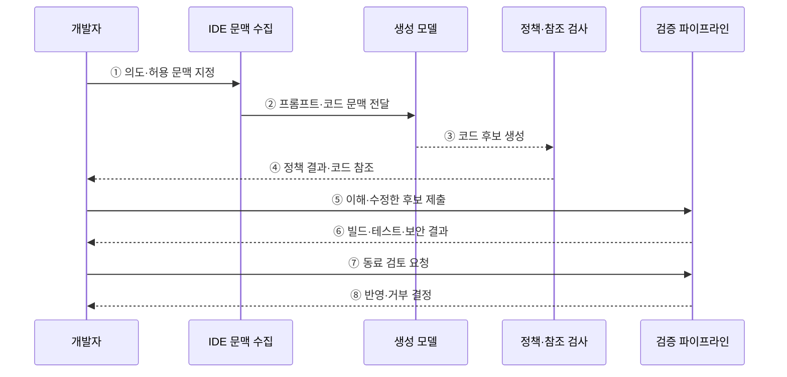

---
sidebar:
  order: 81
  label: "081. AI 코드 생성 — GitHub Copilot (AI Code Generation)"
  badge:
    text: "미출제 · 50%"
    variant: note
title: "AI 코드 생성 — GitHub Copilot (AI Code Generation)"
date: "2026-07-25T18:13:00+09:00"
tags:
  - "notes-software"
weight: 81
extra:
  question_no: "081"
  source_status: "미출제"
  source_history: ""
  priority: 50
  priority_note: "AI 코드 생성의 생산성·보안 검증이 현안"
---

## 미리 알고가기

- **인공지능(Artificial Intelligence, AI)**: 학습 데이터로 추론·생성 등 사람의 지적 작업을 수행하는 기술
- **거대 언어 모델(Large Language Model, LLM)**: 대규모 텍스트·코드에서 다음 토큰의 확률을 학습한 생성 모델
- **AI 코드 생성(AI Code Generation)**: LLM이 지시와 코드 문맥을 바탕으로 코드 후보를 만드는 기술
- **컨텍스트 윈도우(Context Window)**: LLM이 한 번의 요청에서 참고할 수 있는 토큰 범위
- **깃허브 코파일럿(GitHub Copilot)**: IDE·명령줄·GitHub 등에서 코드 작성 작업을 지원하는 AI 코딩 도우미
- **통합 개발 환경(Integrated Development Environment, IDE)**: 편집·빌드·디버깅 도구를 한곳에 묶은 개발 환경
- **프롬프트 엔지니어링(Prompt Engineering)**: 원하는 결과가 나오도록 지시·맥락·제약·완료 조건을 구성하는 기법
- **코드 환각(Hallucination)**: 모델이 존재하지 않는 API·패키지나 틀린 로직을 그럴듯하게 생성하는 현상
- **정적 애플리케이션 보안 테스트(Static Application Security Testing, SAST)**: 프로그램을 실행하지 않고 소스 코드의 보안 취약점을 찾는 검사
- **공개 코드 일치(Code Matching)**: 생성 제안이 공개 저장소 코드와 같거나 유사한지 확인하고 설정에 따라 차단하거나 참조 정보를 제공하는 기능
- **코드 참조(Code Reference)**: 공개 코드와 일치한 제안의 저장소 위치와 확인된 라이선스 정보를 검토하도록 제공하는 근거
- **단위 테스트(Unit Test)**: 함수나 모듈처럼 작은 코드 단위의 입력과 기대 결과를 검증하는 시험

## Ⅰ. 개요

- 정의/개념: LLM이 문맥에 맞는 코드 후보를 생성함
- **배경/필요성**: 생성 코드 결함 위험으로 검증 관문 필요

### 쉽게 이해하기 (학습용)

- AI는 초안을 빠르게 만들고 개발자는 정확성·안전성·권리를 확인한 뒤 반영한다.

## Ⅱ. 특징

- 허용된 코드·주석·도구 문맥으로 후보를 생성한다.
- 테스트 후보의 기대 결과와 누락 조건을 검증해야 한다.
- 공개 코드 유사성·취약 API 추천 위험이 있다.
- 생성 시간 절감이 검토 비용보다 클 때 유용하다.

### 쉽게 이해하기 (학습용)

- 문맥이 많으면 알맞은 코드를 만들기 쉽지만 기밀 입력 범위도 커져 통제가 필요하다.

## Ⅲ. 아키텍처 및 구성요소

**도표안 A — 구조도**

**도표안 B — sequenceDiagram**

| 설계 요소 | 설명 |
|:---|:---|
| 컨텍스트 수집 엔진 | 허용한 코드·주석·파일을 모델 입력으로 구성 |
| LLM 코드 생성 모델 | 지시와 문맥에 맞는 코드 후보 생성 |
| 정책·참조 검사 | 기능 허용 정책과 공개 코드 일치 정보 제공 |
| 개발자 검증 경로 | 이해·수정·빌드·테스트·리뷰 후 반영 |

**동작 원리**

- ① 개발자가 구현 의도·제약·완료 조건과 모델에 보낼 문맥을 정한다.
- ② IDE가 허용한 파일·코드·주석을 프롬프트와 함께 전달한다.
- ③ 생성 모델이 확률적으로 코드 후보를 만든다.
- ④ 정책에 따라 기능을 통제하고 공개 코드 일치 시 차단 또는 참조를 제공한다.
- ⑤ 개발자가 코드를 이해·수정한 뒤 자신의 변경으로 검증 파이프라인에 제출한다.
- ⑥ 빌드·단위 시험·SAST·의존성 검사로 정확성과 안전성을 확인한다.
- ⑦ 기능·유지보수성·권리 위험을 동료가 검토하도록 요청한다.
- ⑧ 모든 근거를 통과한 후보만 저장소에 반영한다.

> 요약: 허용 문맥으로 생성한 초안을 사람·시험·보안·권리 검토를 거쳐 반영한다.

### 쉽게 이해하기 (학습용)

- 허용한 문맥만 모델에 보내고 생성 코드는 정책·빌드·테스트·리뷰를 차례로 통과시킨다.

## Ⅳ. 종류 및 비교

| 판단 기준 | AI 기반 코드 생성 | 전통적 IDE 자동 완성 |
|:---|:---|:---|
| 핵심 특징 | 함수·알고리즘·테스트 후보 생성 | 멤버·키워드 등 짧은 구문 완성 |
| 추천 근거 | 자연어 지시와 넓은 코드 문맥 | 현재 구문의 문법·타입 정보 |
| 주요 위험 | 환각·취약점·공개 코드 유사성 | 잘못된 멤버·타입 선택 |
| 적용 기준 | 문맥 기반 구현 초안이 필요할 때 | 결정적 구문 후보가 필요할 때 |

> 요약: 언어 모델은 넓은 문맥만큼 검증 범위가 큼

### 쉽게 이해하기 (학습용)

- 자동 완성은 짧은 구문을 찾고 AI 생성은 로직까지 쓰므로 검증 범위도 넓다.

## Ⅴ. 실무 고려사항 및 대책

| 고려사항 | 문제점 | 대책 |
|:---|:---|:---|
| 기밀 문맥 | 비밀키·개인정보·비공개 코드가 외부 처리 범위에 포함 | 콘텐츠 제외·최소 문맥·비밀 탐지와 조직 정책 적용 |
| 그럴듯한 오류 | 존재하지 않는 API·취약 로직을 그대로 수용 | 공식 문서 확인과 빌드·시험·SAST 필수화 |
| 공개 코드 일치 | 참조·라이선스 검토 없이 유사 코드 반영 | 일치 차단 또는 코드 참조 검토와 IP 검사 |
| 검토 자동화 편향 | AI가 만든 시험도 같은 잘못된 가정을 반복 | 사람이 독립적으로 기대 결과·경계·실패 조건 설계 |
| 생산성 오판 | 생성 시간만 줄고 수정·검토 비용은 증가 | 채택률보다 총 작업시간·수정량·결함·리뷰 통과율 측정 |

> 적용 사례: 데이터 변환 코드 초안을 생성하고 수정량·검토 시간·리뷰 통과율로 실제 효과를 측정한다.

### 쉽게 이해하기 (학습용)

- 생성 시간뿐 아니라 수정량·검토 시간·결함까지 측정해 실제 절감 효과를 판단한다.

## Ⅵ. 결론

- AI 코드 생성은 구현 초안을 빠르게 만들지만 정확성·보안·유지보수성·권리 책임을 대신하지 않는다.
- 허용 문맥과 검증 관문을 통과하고 개발자가 이해한 코드만 반영한다.

### 쉽게 이해하기 (학습용)

- AI 생성 코드는 빠른 초안일 뿐이며 개발자가 이해하고 검증해야 실무 코드가 된다.
