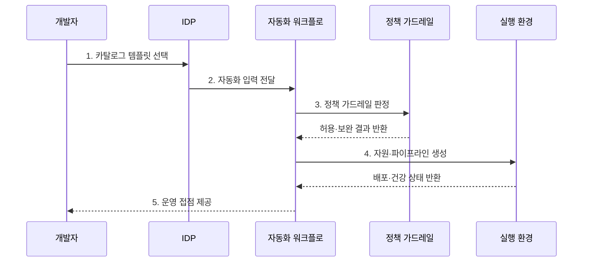

---
sidebar:
  order: 82
  label: "082. 플랫폼 엔지니어링 IDP (Platform Engineering IDP)"
  badge:
    text: "기출 · 70%"
    variant: note
title: "플랫폼 엔지니어링 IDP (Platform Engineering IDP)"
date: "2026-07-27T23:59:59+09:00"
tags:
  - "notes-software"
weight: 82
extra:
  question_no: "082"
  source_status: "기출"
  source_history: "134회, 135회"
  priority: 70
  priority_note: "134·135회 반복, IDP·셀프서비스 설계 핵심"
---

## 미리 알고가기

- **내부 개발자 플랫폼(Internal Developer Platform, IDP)**: 개발·배포·운영 기능을 셀프서비스로 제공하는 사내 플랫폼
- **응용 프로그래밍 인터페이스(Application Programming Interface, API)**: 플랫폼 기능을 프로그램 호출로 제공하는 접점
- **사용자 인터페이스(User Interface, UI)**: 개발자가 플랫폼 기능을 직접 선택하는 화면
- **개발자 경험(Developer Experience, DX)**: 개발자가 도구·프로세스로 목표를 달성하는 효율성과 만족도
- **플랫폼 엔지니어링(Platform Engineering)**: 반복 개발·운영 기능을 개발자가 선택해 쓰는 내부 제품으로 만드는 활동
- **가드레일(Guardrail)**: 허용된 범위 안에서 자율성을 주며 보안·비용·운영 정책을 자동 통제하는 규칙
- **셀프서비스(Self-service)**: 정형 요청을 다른 팀의 수동 처리 없이 개발자가 직접 실행하는 방식
- **골든 패스(Golden Path)**: 조직이 지원·검증하는 권장 개발·배포 경로로서 필요하면 승인된 예외 경로를 허용한다.
- **서비스 카탈로그(Service Catalog)**: 검증된 서비스·환경·배포 템플릿과 소유 정보를 모은 목록
- **워크플로(Workflow)**: 요청부터 검증·생성·배포까지의 작업 순서를 자동 실행하는 흐름
- **배포 파이프라인(Deployment Pipeline)**: 코드와 설정을 검사해 실행 환경에 전달하는 자동화 경로
- **정책 코드(Policy as Code)**: 보안·비용·운영 규칙을 실행 가능한 코드로 표현해 자동 판정하는 방식

## Ⅰ. 개요

- 정의/개념: 개발·배포 기능의 **셀프서비스 제공 체계**
- 배경/필요성: 인프라 대기시간·환경 편차·병목 해소

### 쉽게 이해하기 (학습용)

- 개발자는 승인 티켓을 기다리지 않고 검증된 메뉴에서 필요한 환경을 직접 만든다.

## Ⅱ. 특징

- **포털·API 추상화**로 복잡한 인프라 작업 은닉
- **정책 코드 가드레일**로 보안·비용 기준 자동 적용
- **플랫폼 제품 운영**으로 채택률·실패율·개발자 경험 개선

### 쉽게 이해하기 (학습용)

- 개발자는 내부 구조를 몰라도 표준 메뉴를 고르고 플랫폼은 허용된 구성만 자동 제공한다.

## Ⅲ. 구조 및 구성요소

| 구성요소 | 책임 |
|:---|:---|
| 개발자 포털 | 서비스·문서·요청의 단일 진입점 |
| 서비스 카탈로그 | 검증된 환경·템플릿 제공 |
| 자동화 워크플로 | 자원 생성·설정·배포 실행 |
| 정책 가드레일 | 보안·비용·운영 기준 판정 |

### 쉽게 이해하기 (학습용)

- 포털에서 표준 구성을 고르면 자동화와 정책 검사가 실행된다.

## Ⅳ. 흐름도

**동작 원리**

- **1. 카탈로그 템플릿 선택**: 검증된 셀프서비스 경로 선택
- **2. 자동화 입력 전달**: 매개변수·소유 정보로 실행 구체화
- **3. 정책 가드레일 판정**: 보안·비용 기준의 허용 여부 결정
- **4. 자원·파이프라인 생성**: 허용된 표준 환경을 자동 구성
- **5. 운영 접점 제공**: 배포 상태·소유 정보·피드백 연결

> 요약: 검증된 템플릿을 자동 가드레일 안에서 셀프서비스로 생성하고 사용 피드백으로 개선

### 쉽게 이해하기 (학습용)

- 표준 메뉴를 선택하면 정책 검사 뒤 환경과 운영 도구가 함께 준비된다.

## Ⅴ. 종류 및 비교

| 개발 환경 제공 | 플랫폼 엔지니어링 IDP | 전통적 공용 인프라팀 |
|:---|:---|:---|
| 적용 기준 | 반복 환경의 **신속·표준 배포** | 비정형 **예외 환경 중심** |
| 핵심 특징 | 개발자의 **표준 구성 셀프서비스** | 운영팀의 **요청별 수동 작업** |
| 한계 | 경직된 표준·**현장 요구 불일치** | 요청 병목·**담당자 의존** |

> 요약: 운영팀 티켓을 자동 검사 기반 셀프서비스로 전환함

### 쉽게 이해하기 (학습용)

- IDP는 반복 요청을 자동화하고 플랫폼팀은 예외와 공통 경로 개선에 집중한다.

## Ⅵ. 실무 고려사항 및 대책

| 고려사항 | 대책 | 효과 |
|:---|:---|:---|
| 공급자 중심 설계 | 사용자 연구와 사용 데이터로 로드맵 운영 | 개발자 문제와 기능 일치 |
| 경직된 골든 패스 | 승인 예외와 회수 절차 제공 | 비정형 요구의 우회 감소 |
| 추상화 누수 | 책임 경계·진단·원시 도구 접근 제공 | 장애 복구 시간 단축 |
| 카탈로그 노후화 | 메타데이터 동기화와 만료 검증 | 소유·지원 정보 현행화 |
| 채택률 목표화 | 시간·실패율·우회율·만족도 측정 | 개발자 성과 중심 개선 |

> 적용 사례: 표준 포털의 환경 생성시간·채택률·실패율·우회율을 함께 측정

### 쉽게 이해하기 (학습용)

- 표준 경로가 수동 요청보다 빠르고 편해야 개발자가 우회하지 않는다.

## Ⅶ. 결론

- **반복 수요·정책 통제·개발자 성과**로 IDP 범위를 결정

### 쉽게 이해하기 (학습용)

- IDP는 개발자에게 빠른 셀프서비스를 주고 조직에는 자동 통제를 제공할 때 효과가 난다.
