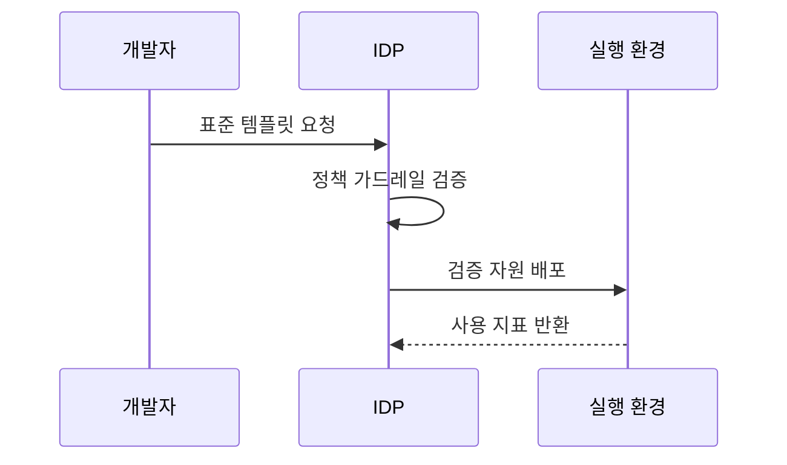

---
sidebar:
  order: 82
  label: "082. 플랫폼 엔지니어링 IDP (Platform Engineering IDP)"
  badge:
    text: "기출 · 70%"
    variant: note
title: "플랫폼 엔지니어링 IDP (Platform Engineering IDP)"
date: "2026-07-25T18:14:00+09:00"
tags:
  - "notes-software"
weight: 82
extra:
  question_no: "082"
  source_status: "기출"
  source_history: "134회, 135회"
  priority: 70
  priority_note: "134·135회 반복, IDP·셀프서비스 설계 핵심"
---

## 미리 알고가기

- **내부 개발자 플랫폼(Internal Developer Platform, IDP)**: 개발 환경을 셀프서비스로 제공하는 사내 플랫폼임
- **응용 프로그래밍 인터페이스(Application Programming Interface, API)**: 플랫폼 기능을 프로그램 호출로 제공함
- **사용자 인터페이스(User Interface, UI)**: 개발자가 플랫폼 기능을 직접 선택하는 화면임
- **개발자 경험(Developer Experience, DX)**: 개발 도구 사용의 효율성과 만족도를 나타냄
- **플랫폼 엔지니어링(Platform Engineering)**: 공통 도구와 경로를 내부 제품으로 개발함
- **가드레일(Guardrail)**: 보안·비용 정책을 자동으로 강제하는 규칙임
- **셀프서비스(Self-service)**: 개발자가 승인 대기 없이 자원을 직접 생성함
- **서비스 카탈로그(Service Catalog)**: 검증된 개발 환경과 배포 템플릿을 선택할 수 있게 모은 목록임
- **워크플로(Workflow)**: 요청부터 검증·생성·배포까지의 작업 순서를 자동으로 실행하는 흐름임
- **배포 파이프라인(Deployment Pipeline)**: 코드와 설정을 검사해 실행 환경에 전달하는 자동화 경로임
- **정책 코드(Policy as Code)**: 보안·비용·운영 규칙을 실행 가능한 코드로 표현해 자동 검사하는 방식임

## Ⅰ. 개요

- **정의/개념**: 표준 개발 환경을 셀프서비스로 제공함
- **배경/필요성**: 환경 구축 편차·대기로 셀프서비스 플랫폼 필요

### 쉽게 이해하기 (학습용)
- 개발자는 승인 티켓을 기다리지 않고 검증된 메뉴에서 필요한 환경을 직접 만들어 사용함

## Ⅱ. 특징

- 복잡한 기반 시설 명령을 포털과 API 뒤로 감춘다.
- 생성 시 보안·비용 규칙을 자동 적용한다.
- 채택률·실패율·요청을 바탕으로 플랫폼을 개선한다.
- 표준 경로 안에서 개발자가 환경을 직접 생성한다.

### 쉽게 이해하기 (학습용)
- 사용자는 내부 구조를 몰라도 표준 메뉴를 선택하고 플랫폼은 안전한 구성만 자동으로 제공함

## Ⅲ. 아키텍처 및 구성요소

| 설계 요소 | 설명 |
|:---|:---|
| 개발자 포털 | 서비스와 문서 및 요청 단일 진입점을 제공함 |
| 서비스 카탈로그 | 검증된 환경과 배포 애플리케이션 템플릿을 제공함 |
| 배포 워크플로우 | 자원 생성과 설정 및 배포 순서를 자동화함 |
| 정책 가드레일 | 보안과 비용 및 통제 기준을 자동 검사함 |

> 요약: 포털 구성을 워크플로우와 가드레일로 배포함

### 쉽게 이해하기 (학습용)
- 카탈로그 선택을 워크플로우가 정책 범위 안에서 배포함

## Ⅳ. 원리 및 절차 흐름도

| 절차 | 설명 |
|:---|:---|
| 표준 템플릿 요청 | 카탈로그에서 표준 구성 선택 |
| 정책 가드레일 검증 | 보안·비용·통제 기준 검사 |
| 검증 자원 배포 | 인프라와 실행 환경 자동 생성 |
| 사용 지표 반환 | 채택률·실패율로 템플릿 개선 |

> 요약: 표준 요청을 검증 후 배포하고 지표로 개선함

### 쉽게 이해하기 (학습용)
- 표준 메뉴를 선택하면 정책 검사 후 환경이 자동 배포됨

## Ⅴ. 종류 및 비교

| 비교축 | 플랫폼 엔지니어링 IDP | 전통적 공용 인프라팀 |
|:---|:---|:---|
| 핵심 특징 | 개발자가 표준 구성을 직접 생성함 | 운영팀이 요청을 받아 직접 작업함 |
| 통제 방식 | 정책 코드가 배포 과정에서 검사함 | 담당자가 요청마다 수동 검사함 |
| 적용 기준 | 반복 환경을 빠르게 배포할 때 | 비정형 예외 환경이 많을 때 |
| 주요 위험 | 강제된 표준이 현장 요구와 어긋날 수 있음 | 요청 병목과 담당자 의존이 생길 수 있음 |

> 요약: 운영팀 티켓을 자동 검사 기반 셀프서비스로 전환함

### 쉽게 이해하기 (학습용)
- IDP는 반복 요청을 자동화해 개발자가 즉시 처리하고 운영팀은 예외와 플랫폼 개선에 집중하게 함

## Ⅵ. 실무 사례

1. 표준 포털 환경의 생성 시간·채택률·우회율 측정
2. 정책 코드로 비인가 자원 차단·감사 기록

### 쉽게 이해하기 (학습용)
- 표준 경로가 수동 요청보다 빠르고 편해야 개발자가 우회하지 않고 플랫폼을 사용함
- 정책을 배포 전에 자동 검사하면 위반 자원의 실행과 사후 수정을 함께 줄일 수 있음

## Ⅶ. 결론

- 반복 환경은 셀프서비스·가드레일로 표준화

### 쉽게 이해하기 (학습용)
- IDP는 개발자에게 빠른 셀프서비스를 주면서 조직에는 자동 통제를 제공할 때 효과가 생김
