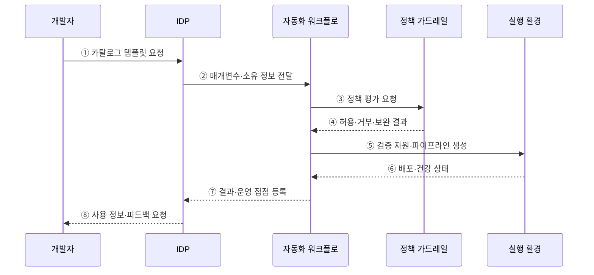

---
sidebar:
  order: 82
  label: "082. 플랫폼 엔지니어링 IDP (Platform Engineering IDP)"
  badge:
    text: "기출 · 70%"
    variant: note
title: "플랫폼 엔지니어링 IDP (Platform Engineering IDP)"
date: "2026-07-27T23:59:59+09:00"
tags:
  - "notes-software"
weight: 82
extra:
  question_no: "082"
  source_status: "기출"
  source_history: "134회, 135회"
  priority: 70
  priority_note: "134·135회 반복, IDP·셀프서비스 설계 핵심"
---

## 미리 알고가기

- **내부 개발자 플랫폼(Internal Developer Platform, IDP)**: 개발·배포·운영 기능을 셀프서비스로 제공하는 사내 플랫폼
- **응용 프로그래밍 인터페이스(Application Programming Interface, API)**: 플랫폼 기능을 프로그램 호출로 제공하는 접점
- **사용자 인터페이스(User Interface, UI)**: 개발자가 플랫폼 기능을 직접 선택하는 화면
- **개발자 경험(Developer Experience, DX)**: 개발자가 도구·프로세스로 목표를 달성하는 효율성과 만족도
- **플랫폼 엔지니어링(Platform Engineering)**: 반복 개발·운영 기능을 개발자가 선택해 쓰는 내부 제품으로 만드는 활동
- **가드레일(Guardrail)**: 허용된 범위 안에서 자율성을 주며 보안·비용·운영 정책을 자동 통제하는 규칙
- **셀프서비스(Self-service)**: 정형 요청을 다른 팀의 수동 처리 없이 개발자가 직접 실행하는 방식
- **골든 패스(Golden Path)**: 조직이 지원·검증하는 권장 개발·배포 경로로서 필요하면 승인된 예외 경로를 허용함
- **서비스 카탈로그(Service Catalog)**: 검증된 서비스·환경·배포 템플릿과 소유 정보를 모은 목록
- **워크플로(Workflow)**: 요청부터 검증·생성·배포까지의 작업 순서를 자동 실행하는 흐름
- **배포 파이프라인(Deployment Pipeline)**: 코드와 설정을 검사해 실행 환경에 전달하는 자동화 경로
- **정책 코드(Policy as Code)**: 보안·비용·운영 규칙을 실행 가능한 코드로 표현해 자동 판정하는 방식

## Ⅰ. 개요

- 정의/개념: 표준 개발·배포 기능을 **셀프서비스 제품으로 제공**하는 체계
- 기존 한계: 티켓 기반 인프라 제공은 **대기시간·환경 편차·운영팀 병목** 유발

### 쉽게 이해하기 (학습용)

- 개발자는 승인 티켓을 기다리지 않고 검증된 메뉴에서 필요한 환경을 직접 만든다.

## Ⅱ. 특징

- **포털·API 추상화**로 복잡한 인프라 작업 은닉
- **정책 코드 가드레일**로 보안·비용 기준 자동 적용
- **플랫폼 제품 운영**으로 채택률·실패율·개발자 경험 개선

### 쉽게 이해하기 (학습용)

- 개발자는 내부 구조를 몰라도 표준 메뉴를 고르고 플랫폼은 허용된 구성만 자동 제공한다.

## Ⅲ. 아키텍처 및 구성요소

**도표안 A — 구조도**

**도표안 B — sequenceDiagram**

| 설계 요소 | 설명 |
|:---|:---|
| 개발자 포털 | 서비스·문서·요청의 단일 진입점 |
| 서비스 카탈로그 | 검증된 환경·애플리케이션 템플릿 제공 |
| 자동화 워크플로 | 자원 생성·설정·배포 순서 실행 |
| 정책 가드레일 | 보안·비용·운영 기준 자동 판정 |

**동작 원리**

- ① 개발자가 카탈로그에서 지원되는 서비스·환경 템플릿을 선택한다.
- ② IDP가 입력값·서비스 소유자·환경 정보를 자동화 워크플로에 전달한다.
- ③ 워크플로가 자원 생성 전에 보안·비용·운영 정책 평가를 요청한다.
- ④ 가드레일이 허용·거부 또는 보완할 설정과 근거를 반환한다.
- ⑤ 허용된 요청만 인프라·저장소·배포 파이프라인·관측 구성을 생성한다.
- ⑥ 실행 환경이 배포 결과와 건강 상태를 워크플로에 반환한다.
- ⑦ IDP가 서비스 카탈로그에 소유권·문서·운영 접점을 등록한다.
- ⑧ 개발자에게 사용 정보를 제공하고 마찰·실패·우회 피드백을 수집한다.

> 요약: 검증된 템플릿을 자동 가드레일 안에서 셀프서비스로 생성하고 사용 피드백으로 개선한다.

### 쉽게 이해하기 (학습용)

- 표준 메뉴를 선택하면 정책 검사 뒤 환경과 운영 도구가 함께 준비된다.

## Ⅳ. 종류 및 비교

| 개발 환경 제공 | 플랫폼 엔지니어링 IDP | 전통적 공용 인프라팀 |
|:---|:---|:---|
| 적용 기준 | 반복 환경의 **신속·표준 배포** | 비정형 **예외 환경 중심** |
| 핵심 특징 | 개발자의 **표준 구성 셀프서비스** | 운영팀의 **요청별 수동 작업** |
| 한계 | 경직된 표준·**현장 요구 불일치** | 요청 병목·**담당자 의존** |

> 요약: 운영팀 티켓을 자동 검사 기반 셀프서비스로 전환함

### 쉽게 이해하기 (학습용)

- IDP는 반복 요청을 자동화하고 플랫폼팀은 예외와 공통 경로 개선에 집중한다.

## Ⅴ. 실무 고려사항 및 대책

| 고려사항 | 문제점 | 대책 |
|:---|:---|:---|
| 공급자 중심 설계 | 플랫폼팀이 만든 기능이 개발자 문제와 불일치 | 사용자 연구·제품 책임자·사용 데이터로 로드맵 운영 |
| 경직된 골든 패스 | 비정형 요구가 막혀 음성 인프라와 우회 증가 | 지원 경로와 승인된 탈출구·예외 회수 절차 제공 |
| 추상화 누수 | 장애 때 내부 구조를 몰라 복구 지연 | 생성 자원·책임 경계·진단 정보와 원시 도구 접근 제공 |
| 카탈로그 노후화 | 소유자·문서·지원 상태가 실제와 불일치 | 배포·저장소에서 메타데이터 자동 동기화와 만료 검증 |
| 채택률 목표화 | 강제 사용은 늘지만 개발 시간은 줄지 않음 | 환경 생성시간·실패율·우회율·만족도·리드타임 함께 측정 |

> 적용 사례: 표준 포털의 환경 생성시간·채택률·실패율·우회율을 함께 측정한다.

### 쉽게 이해하기 (학습용)

- 표준 경로가 수동 요청보다 빠르고 편해야 개발자가 우회하지 않는다.

## Ⅵ. 결론

- 플랫폼 엔지니어링은 공통 개발·운영 기능을 셀프서비스 내부 제품으로 제공한다.
- 강제 표준화보다 유용한 골든 패스·자동 가드레일·예외 경로와 개발자 성과를 함께 설계한다.

### 쉽게 이해하기 (학습용)

- IDP는 개발자에게 빠른 셀프서비스를 주고 조직에는 자동 통제를 제공할 때 효과가 난다.
