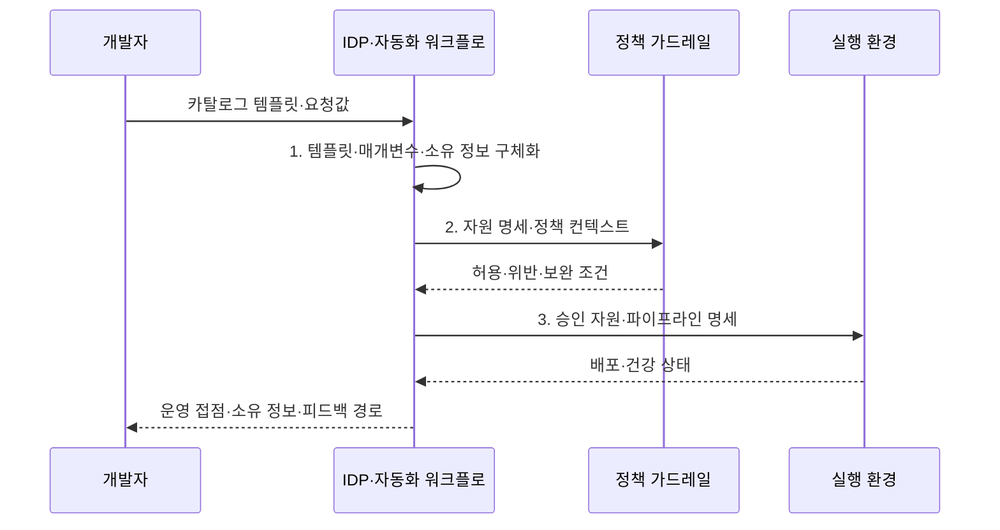

---
sidebar:
  order: 82
  label: "082. 플랫폼 엔지니어링 IDP (Platform Engineering IDP)"
  badge:
    text: "기출 · 70%"
    variant: note
title: "플랫폼 엔지니어링 IDP (Platform Engineering IDP)"
date: "2026-08-02T12:00:00+09:00"
tags:
  - "notes-software"
weight: 82
extra:
  question_no: "082"
  source_status: "기출"
  source_history: "134회, 135회"
  priority: 70
  priority_note: "134·135회 반복, IDP·셀프서비스 설계 핵심"
---

## Ⅰ. 개요

핵심 용어

- **셀프서비스 플랫폼**: 반복 개발·배포·운영 기능을 다른 팀의 수동 처리 없이 직접 실행하게 하는 내부 제품이다.
- **대기시간·환경 편차·운영 병목**: 티켓 기반 수동 제공으로 발생하는 지연·불일치·집중 부담이다.

- 정의/개념: **플랫폼 엔지니어링**은 반복 개발•배포•운영 기능을 셀프서비스 IDP로 제공하고 내부 제품처럼 개선하는 **개발자 지원 운영 방식**
- 배경/필요성: 티켓 기반 수동 제공은 **대기시간·환경 편차·운영 병목**

#### 한줄 요약

- 개발자는 승인 티켓을 기다리지 않고 검증된 메뉴에서 필요한 환경을 직접 만든다.

## Ⅱ. 특징

핵심 용어

- **포털·API 추상화**: 개발자가 복잡한 인프라 세부를 몰라도 화면과 호출로 기능을 쓰게 하는 경계이다.
- **정책 코드 가드레일**: 보안·비용·운영 규칙을 실행 가능한 정책으로 자동 판정하는 통제이다.
- **플랫폼 제품 운영**: 개발자 문제와 사용 성과를 근거로 내부 플랫폼을 지속 개선하는 방식이다.

- **포털·API 추상화**로 복잡한 인프라 작업 은닉
- **정책 코드 가드레일**로 보안·비용 기준 자동 적용
- **플랫폼 제품 운영**으로 채택률·실패율·개발자 경험 개선

#### 한줄 요약

- 개발자는 내부 구조를 몰라도 표준 메뉴를 고르고 플랫폼은 허용된 구성만 자동 제공한다.

## Ⅲ. 구조 및 구성요소

핵심 용어

- **개발자 포털(Developer Portal)**: 서비스·문서·셀프서비스 요청의 단일 진입점이다.
- **서비스 카탈로그(Service Catalog)**: 검증된 환경·배포 템플릿과 소유 정보를 모은 목록이다.
- **자동화 워크플로**: 자원 생성·설정·배포 작업을 정해진 순서로 실행하는 흐름이다.
- **정책 가드레일**: 보안·비용·운영 기준의 허용 여부를 자동 판정하는 규칙이다.

| 구성요소 | 책임 |
|:---|:---|
| 개발자 포털 | **서비스·문서·요청**의 단일 진입점 |
| 서비스 카탈로그 | 검증된 **환경·배포 템플릿** 제공 |
| 자동화 워크플로 | **자원 생성·설정·배포** 실행 |
| 정책 가드레일 | **보안·비용·운영 기준** 판정 |

#### 한줄 요약

- 포털에서 표준 구성을 고르면 자동화와 정책 검사가 실행된다.

## Ⅳ. 흐름도

핵심 용어

- **템플릿·매개변수·소유 정보**: 검증된 경로를 실행 가능한 요청으로 구체화하는 입력이다.
- **자원 명세·정책 컨텍스트**: 생성할 환경의 선언과 정책 판정에 필요한 조건이다.
- **승인 자원·파이프라인 명세**: 가드레일을 통과해 자동 구성할 실행 환경과 전달 경로의 선언이다.

**동작 원리**

- **1. 템플릿·매개변수·소유 정보**: 검증된 경로를 실행 가능한 요청으로 구체화
- **2. 자원 명세·정책 컨텍스트**: 보안·비용·운영 기준의 허용 여부 판정
- **3. 승인 자원·파이프라인 명세**: 허용된 표준 실행 환경을 자동 구성

> 요약: 검증된 템플릿을 자동 가드레일 안에서 셀프서비스로 생성하고 사용 피드백으로 개선

#### 한줄 요약

- 표준 메뉴를 선택하면 정책 검사 뒤 환경과 운영 도구가 함께 준비된다.

## Ⅴ. 종류 및 비교

핵심 용어

- **플랫폼 엔지니어링 IDP(Internal Developer Platform)**: 반복 환경을 표준 구성 셀프서비스로 제공하는 내부 개발자 플랫폼이다.
- **전통적 공용 인프라팀**: 비정형 요청을 운영 담당자가 건별로 수동 처리하는 제공 방식이다.

| 개발 환경 제공 | 플랫폼 엔지니어링 IDP | 전통적 공용 인프라팀 |
|:---|:---|:---|
| 적용 기준 | 반복 환경의 **신속·표준 배포** | 비정형 **예외 환경 중심** |
| 핵심 특징 | 개발자의 **표준 구성 셀프서비스** | 운영팀의 **요청별 수동 작업** |
| 한계 | 경직된 표준·**현장 요구 불일치** | 요청 병목·**담당자 의존** |

> 요약: 운영팀 티켓을 자동 검사 기반 셀프서비스로 전환함

#### 한줄 요약

- IDP는 반복 요청을 자동화하고 플랫폼팀은 예외와 공통 경로 개선에 집중한다.

## Ⅵ. 실무 고려사항 및 대책

핵심 용어

- **사용자 연구·사용 데이터 기반 로드맵**: 개발자의 실제 불편과 행동을 근거로 플랫폼 기능 순서를 정하는 계획이다.
- **승인 예외·회수 절차**: 골든 패스가 맞지 않는 요구를 제한적으로 허용하고 종료하는 통제이다.
- **메타데이터 동기화·만료 검증**: 카탈로그의 소유·지원 정보를 실제 시스템과 맞추고 오래된 항목을 확인하는 활동이다.

| 문제 | 대책 | 효과 |
|:---|:---|:---|
| 공급자 편의로 기능을 정해 개발자 문제와 불일치 | **사용자 연구·사용 데이터 기반 로드맵** | **개발자 문제·기능 일치** |
| 골든 패스가 예외 요구를 막아 비공식 우회 증가 | **승인 예외·회수 절차** 제공 | **비정형 요구 우회** 감소 |
| 하부 장애가 추상화 밖으로 드러나 원인 진단 지연 | **책임 경계·진단·원시 도구 접근** 제공 | **장애 복구 시간** 단축 |
| 카탈로그 소유·지원 정보가 실제 시스템과 불일치 | **메타데이터 동기화·만료 검증** | **소유·지원 정보 현행화** |
| 채택률만 높여 느린 표준 경로의 강제 사용 은폐 | **시간·실패율·우회율·만족도** 측정 | **개발자 성과 중심 개선** |

> 적용 사례: 표준 포털의 환경 생성시간·채택률·실패율·우회율을 함께 측정

#### 한줄 요약

- 표준 경로가 수동 요청보다 빠르고 편해야 개발자가 우회하지 않는다.

## Ⅶ. 결론

핵심 용어

- **IDP 셀프서비스**: 반복·표준 수요를 개발자가 검증된 경로에서 직접 처리하는 방식이다.
- **전문팀 지원**: 비정형 예외를 전문 지식과 수동 검토로 처리하는 방식이다.

- 반복·표준 수요는 **IDP 셀프서비스**, 비정형 예외는 **전문팀 지원**

#### 한줄 요약

- IDP는 개발자에게 빠른 셀프서비스를 주고 조직에는 자동 통제를 제공할 때 효과가 난다.
