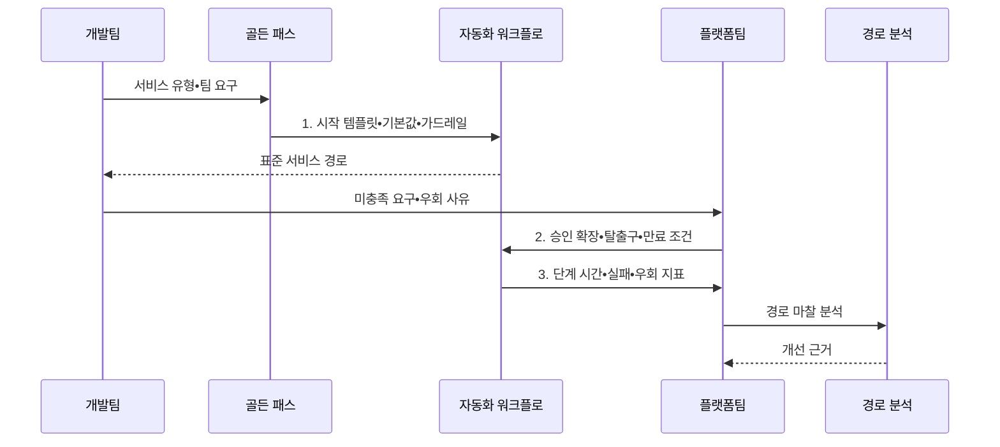

---
sidebar:
  order: 83
  label: "083. 내부 개발자 플랫폼 골든 패스 (Internal Developer Platform Golden Path)"
  badge:
    text: "기출 • 50%"
    variant: note
title: "내부 개발자 플랫폼 골든 패스 (Internal Developer Platform Golden Path)"
date: "2026-08-04T14:18:59+09:00"
tags:
  - "notes-software"
weight: 83
extra:
  question_no: "083"
  source_status: "기출"
  source_history: "135회"
  priority: 50
  priority_note: "135회 기출, 골든패스•개발자 경험 설계"
---

## Ⅰ. 개요

핵심 용어

- **골든 패스(Golden Path)**: 검증된 도구•템플릿•기본값을 조합해 공통 개발•배포 작업을 빠르고 안전하게 수행하도록 지원하는 권장 경로이다.
- **환경 편차(Environment Drift)**: 팀별 선택으로 구성이 달라진 상태다.
- **학습 비용(Learning Cost)**: 팀별 도구와 절차에 적응하는 부담이다.
- **보안 누락(Security Omission)**: 팀별 구성에서 필수 통제가 빠진 상태다.

- 정의/개념: **골든 패스** 는 검증된 도구•템플릿•기본값을 조합해 개발자가 공통 작업을 빠르고 안전하게 수행하도록 지원하는 **권장 개발•배포 경로**
- 배경/필요성: 팀별 도구•구성 선택은 **환경 편차•학습 비용•보안 누락**

#### 한줄 요약

- 팀은 검증된 기본 경로로 빠르게 시작하고 특별한 요구가 있을 때만 확장하거나 우회한다.

## Ⅱ. 특징

핵심 용어

- **검증 템플릿(Validated Template)**: 표준 경로를 시작하도록 조직이 제공하는 골격이다.
- **기본값(Default)**: 안전한 시작을 위해 미리 정한 설정이다.
- **우회 허용(Approved Bypass)**: 정당한 예외에 표준 경로 밖의 수행을 승인하는 방식이다.
- **중앙 템플릿 갱신**: 공통 도구 버전과 보안 패치를 권장 경로 사용자에게 전파하는 활동이다.

- **검증 템플릿•기본값** 으로 표준 경로의 사용 비용 절감
- **확장 지점•우회 허용** 으로 팀별 예외 요구 수용
- **중앙 템플릿 갱신** 으로 도구 버전•보안 패치 전파

#### 한줄 요약

- 길을 막기보다 검증된 길을 더 빠르고 편하게 만들어 자발적 사용을 유도한다.

## Ⅲ. 구조 및 구성요소

핵심 용어

- **시작 템플릿(Starter Template)**: 표준 구조•의존성•기본값을 담은 서비스 시작 골격이다.
- **권장 워크플로(Recommended Workflow)**: 빌드•검증•배포를 검증된 순서로 실행하는 기본 흐름이다.
- **확장 지점(Extension Point)**: 표준 흐름을 깨지 않고 팀별 설정•플러그인을 연결하는 접점이다.
- **탈출구(Escape Hatch)**: 정당한 예외를 승인된 방식으로 우회하는 경로이다.
- **경로 분석(Path Analytics)**: 단계별 시간과 실패 및 우회 지점을 측정해 골든 패스의 마찰을 찾는 활동이다.

| 구성요소 | 책임 |
|:---|:---|
| 시작 템플릿 | **표준 구조•의존성•기본값** 제공 |
| 권장 워크플로 | **빌드•검증•배포 기본 경로** 정의 |
| 확장 지점 | 지원되는 **팀별 설정•플러그인** 연결 |
| 탈출구 | 정당한 예외의 **승인 우회 경로** 제공 |
| 경로 분석 | **단계 시간•실패•우회 구간** 측정 |

#### 한줄 요약

- 표준 시작점과 확장 경로를 제공하고 사용 마찰을 측정한다.

## Ⅳ. 흐름도

핵심 용어

- **가드레일(Guardrail)**: 골든 패스에서 정책을 자동 집행하는 통제다.
- **승인 확장(Approved Extension)**: 조직이 지원하기로 한 팀별 확장이다.
- **만료 조건(Expiration Condition)**: 일시 예외를 종료하는 기준이다.
- **단계 시간(Stage Time)**: 골든 패스 각 단계에 걸린 시간이다.
- **실패 지표(Failure Metric)**: 권장 경로의 단계별 실패를 측정한 값이다.
- **우회 지표(Bypass Metric)**: 사용자가 표준 경로를 벗어난 비율이다.

**동작 원리**

- **1. 시작 템플릿•기본값•가드레일**: 서비스 유형별 검증 경로 실행
- **2. 승인 확장•탈출구•만료 조건**: 지원 확장과 일시 예외를 통제
- **3. 단계 시간•실패•우회 지표**: 경로 마찰을 기본값 개선에 반영

> 요약: 유용한 기본 경로와 안전한 확장•탈출구를 제공하고 실제 마찰 데이터로 개선

#### 한줄 요약

- 추천 경로를 실행하고 막히거나 우회한 지점으로 지도를 개선한다.

## Ⅴ. 종류 및 비교

핵심 용어

- **골든 패스 중심**: 조직 표준과 자동 기본값을 우선 제공하고 예외만 확장하는 플랫폼 방식이다.
- **자유 선택형**: 팀이 도구와 구성을 직접 선택해 자율 실험을 우선하는 방식이다.

| 플랫폼 사용 경로 | 골든 패스 중심 | 자유 선택형 |
|:---|:---|:---|
| 적용 기준 | 반복 경로•**조직 표준 우선** | 자율 실험•**비정형 구성 우선** |
| 핵심 특징 | 검증 템플릿•**자동 기본값** | 팀별 **도구•구성 직접 선택** |
| 한계 | 경직된 경로•**예외 요구 제한** | 구성 편차•**중복 운영** |

> 요약: 기본 경로와 확장 지점으로 표준과 자율성을 조율함

#### 한줄 요약

- 골든 패스는 안전한 기본값을 주고 확장 지점과 탈출구로 필요한 자율성을 남긴다.

## Ⅵ. 실무 고려사항 및 대책

핵심 용어

- **지원 버전(Supported Version)**: 조직이 유지보수하는 도구와 의존성 버전이다.
- **지원 기간(Support Period)**: 조직이 해당 버전을 지원하는 기간이다.
- **자동 갱신(Automatic Update)**: 새 표준 버전을 사용자 경로에 전파하는 정책이다.
- **운영 구조(Operational Structure)**: 추상화 아래의 실제 구성요소와 관계다.
- **운영 책임(Operational Ownership)**: 장애 진단과 복구를 맡은 주체다.
- **운영 로그(Operational Log)**: 추상화 아래의 장애 사건 기록이다.
- **복구 절차(Recovery Procedure)**: 장애를 정상 상태로 되돌리는 순서다.
- **실패율(Failure Rate)**: 권장 경로 실행 중 실패한 비율이다.
- **만족도(Satisfaction)**: 개발자가 골든 패스를 유용하다고 평가한 정도다.
- **가치 스트림(Value Stream)**: 요청부터 가치 전달까지 이어지는 활동 흐름이다.
- **기술별 최소 경로(Minimum Technical Path)**: 기술 유형별로 유지할 최소 표준 경로다.

| 문제 | 대책 | 효과 |
|:---|:---|:---|
| 표준 경로를 강제해 팀별 정당한 예외가 비공식화 | **확장 지점•승인 탈출구** 제공 | **비공식 우회** 감소 |
| 기본 도구•의존성 버전이 낡아 보안과 호환성 저하 | **버전•지원 기간•자동 갱신** 운영 | **의존성•정책 현행화** |
| 하부 구조를 숨겨 장애 원인과 복구 책임이 불명 | **구조•책임•로그•복구 절차** 공개 | **장애 진단 시간** 단축 |
| 우회율만 낮춰 강제 사용을 자발적 채택으로 오판 | **시간•실패율•만족도** 와 함께 해석 | **강제 사용•자발 채택** 구분 |
| 유사 경로가 늘어 선택 부담과 유지 비용 증가 | **가치 스트림•기술별 최소 경로** 통합 | **선택•유지 비용** 감소 |

> 적용 사례: 서비스 템플릿의 구축시간•실패율•우회율을 측정해 마찰 지점을 개선

#### 한줄 요약

- 구축시간과 우회율을 함께 보면 경로가 빠른지와 현장 요구를 놓치는지 알 수 있다.

## Ⅶ. 결론

핵심 용어

- 반복 경로는 **골든 패스**, 지원 확장•일시 예외는 **확장 지점•탈출구**

#### 한줄 요약

- 골든 패스는 반복 결정을 줄이고 확장 지점과 탈출구로 팀별 차이를 수용한다.
