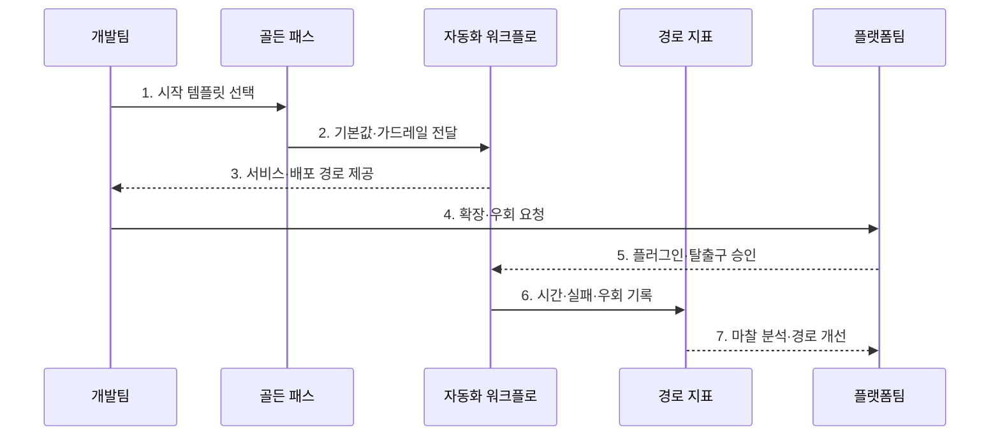

---
sidebar:
  order: 83
  label: "083. 내부 개발자 플랫폼 골든 패스 (Internal Developer Platform Golden Path)"
  badge:
    text: "기출 · 50%"
    variant: note
title: "내부 개발자 플랫폼 골든 패스 (Internal Developer Platform Golden Path)"
date: "2026-07-27T23:59:59+09:00"
tags:
  - "notes-software"
weight: 83
extra:
  question_no: "083"
  source_status: "기출"
  source_history: "135회"
  priority: 50
  priority_note: "135회 기출, 골든패스·개발자 경험 설계"
---

## 미리 알고가기

- **골든 패스(Golden Path)**: 검증된 도구·템플릿·기본값으로 목표를 빠르게 달성하게 하는 권장 개발·배포 경로
- **확장 지점(Extension Point)**: 표준 흐름을 깨지 않고 팀별 설정·기능을 연결하는 접점
- **탈출구(Escape Hatch)**: 골든 패스가 맞지 않는 정당한 요구를 승인된 방식으로 우회하는 경로
- **우회 비율(Bypass Rate)**: 팀이 권장 경로 대신 다른 방법을 사용한 비율
- **온보딩(Onboarding)**: 새 팀·개발자가 표준 개발 환경과 작업 방식에 적응하는 과정
- **가치 스트림(Value Stream)**: 요구부터 사용자 가치 전달까지 활동·대기·피드백이 흐르는 과정
- **코드형 인프라(Infrastructure as Code, IaC)**: 인프라 구성을 코드로 정의·검증·배포하는 방식
- **정적 애플리케이션 보안 테스트(Static Application Security Testing, SAST)**: 실행 없이 소스 취약점을 검사하는 기법
- **지속적 통합·전달(Continuous Integration/Continuous Delivery, CI/CD)**: 코드 변경을 자동 빌드·검증하고 배포 가능한 상태로 전달하는 방식
- **가드레일(Guardrail)**: 권장 경로 안에서 보안·비용·운영 규칙을 자동 통제하는 장치
- **플러그인(Plug-in)**: 플랫폼 핵심 구조를 바꾸지 않고 기능을 덧붙이는 모듈
- **도구 체인(Toolchain)**: 개발·빌드·검사·배포에 이어 사용하는 도구 묶음

## Ⅰ. 개요

- 정의/개념: 검증 도구 기반 **권장 개발·배포 경로**
- **배경/필요성**: 구성 편차·학습 비용·보안 누락 감소

### 쉽게 이해하기 (학습용)

- 팀은 검증된 기본 경로로 빠르게 시작하고 특별한 요구가 있을 때만 확장하거나 우회한다.

## Ⅱ. 특징

- **검증 템플릿·기본값**으로 표준 경로의 사용 비용 절감
- **확장 지점·우회 허용**으로 팀별 예외 요구 수용
- **중앙 템플릿 갱신**으로 도구 버전·보안 패치 전파

### 쉽게 이해하기 (학습용)

- 길을 막기보다 검증된 길을 더 빠르고 편하게 만들어 자발적 사용을 유도한다.

## Ⅲ. 구조 및 구성요소

| 구성요소 | 책임 |
|:---|:---|
| 시작 템플릿 | 표준 구조·의존성·기본값 제공 |
| 권장 워크플로 | 빌드·검증·배포 기본 경로 정의 |
| 확장 지점 | 팀별 설정·플러그인 연결 |
| 경로 분석 | 사용 단계·실패·우회 구간 측정 |

### 쉽게 이해하기 (학습용)

- 표준 시작점과 확장 경로를 제공하고 사용 마찰을 측정한다.

## Ⅳ. 흐름도

**동작 원리**

- **1. 시작 템플릿 선택**: 서비스 유형별 경로를 고른다.
- **2. 기본값·가드레일 전달**: 검증 도구와 정책을 보낸다.
- **3. 서비스·배포 경로 제공**: 자동화 흐름을 실행한다.
- **4. 확장·우회 요청**: 미충족 요구의 사유를 제출한다.
- **5. 플러그인·탈출구 승인**: 예외 경로를 정한다.
- **6. 시간·실패·우회 기록**: 단계별 마찰을 측정한다.
- **7. 마찰 분석·경로 개선**: 반복 우회를 기본값에 반영한다.

> 요약: 유용한 기본 경로와 안전한 확장·탈출구를 제공하고 실제 마찰 데이터로 개선한다.

### 쉽게 이해하기 (학습용)

- 추천 경로를 실행하고 막히거나 우회한 지점으로 지도를 개선한다.

## Ⅴ. 종류 및 비교

| 플랫폼 사용 경로 | 골든 패스 중심 | 자유 선택형 |
|:---|:---|:---|
| 적용 기준 | 반복 경로·**조직 표준 우선** | 자율 실험·**비정형 구성 우선** |
| 핵심 특징 | 검증 템플릿·**자동 기본값** | 팀별 **도구·구성 직접 선택** |
| 한계 | 경직된 경로·**예외 요구 제한** | 구성 편차·**중복 운영** |

> 요약: 기본 경로와 확장 지점으로 표준과 자율성을 조율함

### 쉽게 이해하기 (학습용)

- 골든 패스는 안전한 기본값을 주고 확장 지점과 탈출구로 필요한 자율성을 남긴다.

## Ⅵ. 실무 고려사항 및 대책

| 고려사항 | 대책 | 효과 |
|:---|:---|:---|
| 강제 표준화 | 확장 지점과 승인 탈출구 제공 | 비공식 우회 감소 |
| 낡은 기본값 | 버전·지원 기간·자동 갱신 운영 | 의존성·정책 현행화 |
| 숨은 복잡성 | 구조·책임·로그·복구 절차 공개 | 장애 진단 시간 단축 |
| 우회율 오해 | 시간·실패율·만족도와 함께 해석 | 강제 사용과 자발 채택 구분 |
| 경로 과다 | 가치 흐름·기술별 최소 경로 통합 | 선택·유지 비용 감소 |

> 적용 사례: 서비스 템플릿의 구축시간·실패율·우회율을 측정해 마찰 지점을 개선한다.

### 쉽게 이해하기 (학습용)

- 구축시간과 우회율을 함께 보면 경로가 빠른지와 현장 요구를 놓치는지 알 수 있다.

## Ⅶ. 결론

- **반복 빈도·예외 수요·사용 마찰**에 따라 골든 패스를 개선한다.

### 쉽게 이해하기 (학습용)

- 골든 패스는 반복 결정을 줄이고 확장 지점과 탈출구로 팀별 차이를 수용한다.
