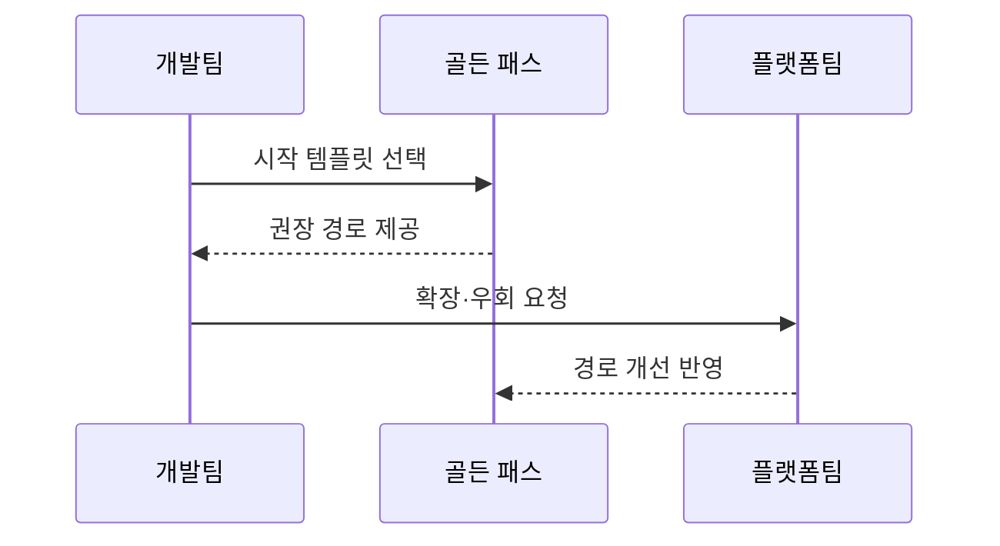

---
sidebar:
  order: 83
  label: "083. 내부 개발자 플랫폼 골든 패스 (Internal Developer Platform Golden Path)"
  badge:
    text: "기출 · 50%"
    variant: note
title: "내부 개발자 플랫폼 골든 패스 (Internal Developer Platform Golden Path)"
date: "2026-07-27T23:59:59+09:00"
tags:
  - "notes-software"
weight: 83
extra:
  question_no: "083"
  source_status: "기출"
  source_history: "135회"
  priority: 50
  priority_note: "135회 기출, 골든패스·개발자 경험 설계"
---

## 미리 알고가기

- **골든 패스(Golden Path)**: 검증된 도구·템플릿·배포의 기본 권장 경로임
- **확장 지점(Extension Point)**: 표준 흐름에 팀별 기능을 연결하는 접점임
- **우회 비율(Bypass Rate)**: 팀이 권장 경로를 벗어난 비율임
- **온보딩(Onboarding)**: 새 팀이 표준 개발 환경에 적응하는 과정임
- **가치 스트림(Value Stream)**: 요구부터 배포까지 가치가 흐르는 과정임
- **코드형 인프라(Infrastructure as Code, IaC)**: 인프라 구성을 코드로 정의·배포함
- **정적 응용 프로그램 보안 테스트(Static Application Security Testing, SAST)**: 실행 없이 소스 취약점을 검사함
- **지속적 통합·배포(Continuous Integration/Continuous Delivery, CI/CD)**: 코드 변경을 자동 빌드·검증·배포함
- **가드레일(Guardrail)**: 권장 경로 안에서 보안·비용·운영 규칙을 자동으로 강제하는 장치임
- **플러그인(Plug-in)**: 기존 플랫폼의 핵심 구조를 바꾸지 않고 팀별 기능을 덧붙이는 모듈임
- **도구 체인(Toolchain)**: 개발·빌드·검사·배포에 이어 사용하는 도구의 묶음임
- **리소스(Resource)**: 서비스가 사용하는 연산·메모리·저장 공간 등의 실행 자원임

## Ⅰ. 개요

- 정의/개념: 검증된 도구·기본값으로 **권장 개발·배포 경로**를 제공하는 방식
- 기존 한계: 팀별 반복 도구 선택은 **구성 편차·학습 비용·보안 누락** 증가

### 쉽게 이해하기 (학습용)
- 팀은 검증된 기본 경로로 빠르게 시작하고 특별한 요구가 있을 때만 확장하거나 우회함

## Ⅱ. 특징

- **검증 템플릿·기본값**으로 표준 경로의 사용 비용 절감
- **확장 지점·우회 허용**으로 팀별 예외 요구 수용
- **중앙 템플릿 갱신**으로 도구 버전·보안 패치 전파

### 쉽게 이해하기 (학습용)
- 강제로 길을 막는 대신 검증된 길을 더 빠르고 편하게 만들어 자발적 사용을 유도함

## Ⅲ. 아키텍처 및 구성요소

| 설계 요소 | 설명 |
|:---|:---|
| 시작 템플릿 | 표준 구조와 의존성 및 기본값을 제공함 |
| 권장 워크플로우 | 빌드와 검증 및 배포 기본 경로를 정의함 |
| 확장 지점 | 팀별 설정과 플러그인을 경로에 연결함 |
| 경로 분석 | 사용 단계와 우회 구간을 측정함 |

> 요약: 기본 경로에 확장 지점을 두고 사용 분석으로 개선함

### 쉽게 이해하기 (학습용)
- 표준 조립 순서에 확장 옵션을 두고 사용률로 개선함

## Ⅳ. 원리 및 절차 흐름도

| 절차 | 설명 |
|:---|:---|
| 시작 템플릿 선택 | 서비스 유형별 기본 구성 선택 |
| 권장 경로 제공 | 검증된 빌드·배포 흐름 실행 |
| 확장·우회 요청 | 기본 경로 밖 요구와 사유 전달 |
| 경로 개선 반영 | 우회 지표로 기본값·확장점 개선 |

> 요약: 기본 경로와 확장을 실행하고 우회 지표로 개선함

### 쉽게 이해하기 (학습용)
- 추천 경로를 실행하고 우회 지점 데이터로 지도를 개선함

## Ⅴ. 종류 및 비교

| 플랫폼 사용 경로 | 골든 패스 중심 | 자유 선택형 |
|:---|:---|:---|
| 적용 기준 | 반복 경로·**조직 표준 우선** | 자율 실험·**비정형 구성 우선** |
| 핵심 특징 | 검증 템플릿·**자동 기본값** | 팀별 **도구·구성 직접 선택** |
| 한계 | 경직된 경로·**예외 요구 제한** | 구성 편차·**중복 운영** |

> 요약: 기본 경로와 확장 지점으로 표준과 자율성을 조율함

### 쉽게 이해하기 (학습용)
- 골든 패스는 반복 작업의 안전한 기본값을 제공하고 확장 지점으로 필요한 자율성을 남김

## Ⅵ. 실무 사례

1. 서비스 템플릿은 **구축시간·우회율** 측정
2. 자원 한도는 **기본값·확장 지점**으로 예외 승인

### 쉽게 이해하기 (학습용)
- 구축 시간과 우회율을 함께 보면 경로가 빠른지와 현장 요구를 놓치는지를 함께 판단할 수 있음
- 자원 한도를 기본 적용하고 정당한 예외만 확장 지점으로 허용하면 비용과 자율성을 조율할 수 있음

## Ⅶ. 결론

- **검증 기본값·확장 지점**으로 표준·자율성 조율

### 쉽게 이해하기 (학습용)
- 골든 패스는 검증된 기본값으로 반복 결정을 줄이고 확장 지점으로 팀별 차이를 수용함
