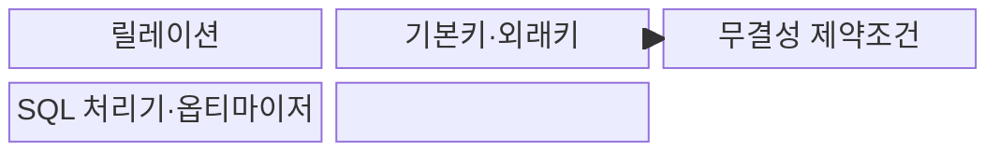
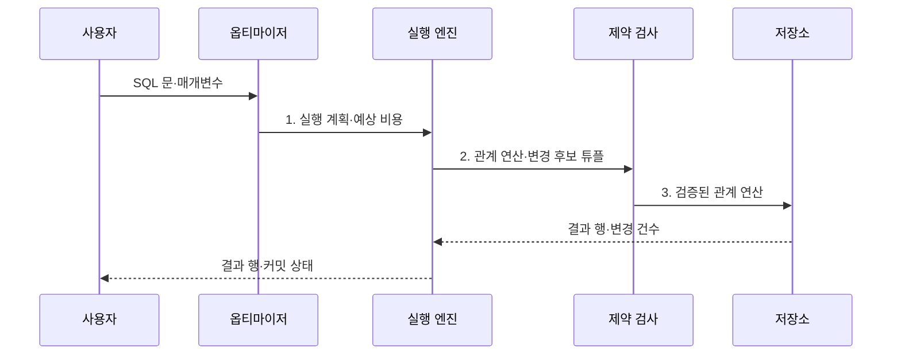

---
sidebar:
  order: 84
  label: "084. 관계형 데이터베이스 기본: 릴레이션·키·제약조건 (Relational Database)"
  badge:
    text: "미출제 · 30%"
    variant: note
title: "관계형 데이터베이스 기본: 릴레이션·키·제약조건 (Relational Database)"
date: "2026-07-30T23:29:48+09:00"
tags:
  - "notes-software"
weight: 84
extra:
  question_no: "084"
  source_status: "미출제"
  source_history: ""
  priority: 30
  priority_note: "릴레이션·키·제약은 데이터베이스의 기초"
---

## 미리 알고가기

- **관계형 데이터베이스(Relational Database, RDB)**: 데이터를 테이블로 표현하고 관계 대수·키·제약조건으로 관리하는 데이터베이스
- **릴레이션(Relation)**: 관계 모델에서 속성 집합과 중복 없는 튜플 집합으로 정의되는 논리 구조
- **튜플(Tuple)**: 릴레이션의 한 데이터 항목을 나타내는 속성값 묶음
- **속성(Attribute)**: 튜플을 구성하는 이름 있는 데이터 항목
- **무결성 제약조건(Integrity Constraint)**: 데이터가 허용된 상태를 유지하도록 삽입·변경·삭제를 통제하는 규칙
- **후보키(Candidate Key)**: 튜플을 유일하게 식별하는 최소 속성 집합
- **기본키(Primary Key, PK)**: 후보키 중 대표 식별자로 선택하며 중복과 NULL을 허용하지 않는 키
- **외래키(Foreign Key, FK)**: 다른 테이블의 후보키 또는 같은 테이블의 키를 참조하는 속성 집합
- **도메인(Domain)**: 한 속성이 가질 수 있는 유효한 값의 집합
- **구조화 질의어(Structured Query Language, SQL)**: 원하는 결과를 선언하면 데이터베이스가 실행 방법을 선택하는 표준 질의 언어
- **스키마(Schema)**: 테이블·열·키·제약조건 등 논리 구조의 명세
- **조인(Join)**: 관련 조건을 만족하는 여러 테이블의 행을 결합하는 연산
- **질의 최적화기(Query Optimizer)**: 여러 실행 계획의 예상 비용을 비교해 사용할 계획을 선택하는 구성요소
- **인덱스(Index)**: 조건에 맞는 행을 빠르게 찾도록 키와 위치를 정렬·구조화한 보조 자료구조
- **트랜잭션(Transaction)**: 여러 데이터 연산을 하나의 논리 작업으로 묶는 처리 단위
- **ACID**: 트랜잭션의 원자성·일관성·격리성·지속성을 나타내는 핵심 성질
- **샤딩(Sharding)**: 데이터를 여러 노드에 분할 저장해 처리량과 용량을 수평 확장하는 방식
- **비관계형 데이터베이스(Not Only SQL, NoSQL)**: 키-값·문서·열·그래프 등 관계형 외 데이터 모델을 사용하는 데이터베이스 범주
- **개체·참조 무결성(Entity·Referential Integrity)**: 기본키의 유효성과 외래키 참조 대상의 존재를 보장하는 규칙
- **SQL 처리기(SQL Processor)**: SQL을 해석·검증하고 최적화기와 실행 엔진에 전달하는 구성요소
- **실행 엔진(Execution Engine)**: 선택된 계획에 따라 관계 연산과 저장소 접근을 수행하는 구성요소
- **비정규화(Denormalization)**: 조회 성능을 위해 중복을 허용해 정규화 구조를 의도적으로 합치는 설계
- **선택도(Selectivity)**: 조건이 전체 행 중 얼마나 적은 행을 선택하는지 나타내는 비율
- **잠금 경합·교착(Lock Contention·Deadlock)**: 여러 트랜잭션이 같은 잠금을 기다리거나 서로의 잠금을 순환 대기하는 상태

## Ⅰ. 개요

- 정의/개념: 릴레이션·키·제약으로 데이터를 관리하는 **데이터베이스**
- 배경/필요성: 응용 코드만의 검증은 동시 변경에서 **중복·참조 불일치 통제 한계**

### 쉽게 이해하기 (학습용)

- 고객과 주문을 따로 저장하고 고객 번호로 연결해 관계를 정확히 유지한다.

## Ⅱ. 특징

- **집합 연산**: 튜플 순서와 중복에 비의존
- **선언형 질의**: 엔진이 실행 계획을 선택
- **무결성 강제**: 도메인·개체·참조 위반 거부

### 쉽게 이해하기 (학습용)

- 키는 행을 식별하고 제약조건은 잘못된 값과 존재하지 않는 참조를 거부한다.

## Ⅲ. 구조 및 구성요소

| 구성요소 | 책임 |
|:---|:---|
| 릴레이션 | **속성·튜플 집합**의 논리 구조 제공 |
| 기본키·외래키 | 튜플의 **식별·참조 관계** 정의 |
| 무결성 제약조건 | **도메인·개체·참조 규칙** 검사 |
| SQL 처리기·옵티마이저 | **비용 기반 실행 계획** 선택 |

### 쉽게 이해하기 (학습용)

- 테이블의 키와 제약을 지키며 질의를 실행할 계획을 고른다.

## Ⅳ. 흐름도

**동작 원리**

- **1. 실행 계획·예상 비용**: 통계로 접근 방법·조인 순서 결정
- **2. 관계 연산·변경 후보 튜플**: 키·참조·도메인 규칙 검증
- **3. 검증된 관계 연산**: 저장소·인덱스에서 계획을 수행

> 요약: SQL의 선언을 비용 기반 계획으로 실행하고 변경 시 무결성 제약을 강제

### 쉽게 이해하기 (학습용)

- 엔진은 질의의 뜻과 비용을 보고 실행 계획을 고른 뒤 데이터 규칙을 검사한다.

## Ⅴ. 종류 및 비교

| 데이터 모델 관점 | 관계형 데이터베이스 | 비관계형 데이터베이스 |
|:---|:---|:---|
| 적용 기준 | **복합 관계·트랜잭션·무결성** 중심 | **특정 접근 패턴·유연한 모델** 중심 |
| 핵심 특징 | **테이블·관계·선언형 SQL** | **키-값·문서·열·그래프** 모델 |
| 한계 | **분산 조인·샤딩 설계** 복잡도 | 제품별 **일관성·제약 기능** 차이 |

> 요약: 관계형은 스키마·제약을 엔진이 관리

### 쉽게 이해하기 (학습용)

- 관계형은 복합 관계와 제약에 강하고 비관계형은 목적별 데이터 모델을 선택한다.

## Ⅵ. 실무 고려사항 및 대책

| 고려사항 | 대책 | 효과 |
|:---|:---|:---|
| 변경 가능한 업무 값을 기본키로 써 연쇄 수정 발생 | **안정 후보키·업무 유일 제약** 분리 | **연쇄 키 수정** 방지 |
| 외래키 없이 응용 코드만 검사해 고아 데이터 생성 | **참조 무결성·변경 정책** 명시 | **고아 데이터 생성** 차단 |
| 과도한 정규화로 반복 조인과 조회 지연 증가 | **측정된 병목만 비정규화** | **무결성·조회 성능** 균형 |
| 낮은 선택도 인덱스까지 추가해 쓰기·저장 비용 증가 | **질의·선택도·통계 기반 인덱스** 운영 | **쓰기·저장 비용** 감소 |
| 긴 트랜잭션이 잠금을 오래 보유해 경합·교착 증가 | **원자성을 지키는 최소 범위**로 축소 | **잠금 경합·교착** 감소 |

> 적용 사례: 외래키는 존재하지 않는 계좌를 참조하는 이체 내역의 저장을 거부

### 쉽게 이해하기 (학습용)

- 외래키는 거래 대상 계좌가 실제로 있을 때만 이체 내역을 저장하게 한다.

## Ⅶ. 결론

- **관계 복잡도·무결성·접근 패턴**으로 데이터 모델을 결정

### 쉽게 이해하기 (학습용)

- 관계형 데이터베이스는 연결 데이터와 거래 규칙을 일관되게 관리한다.
