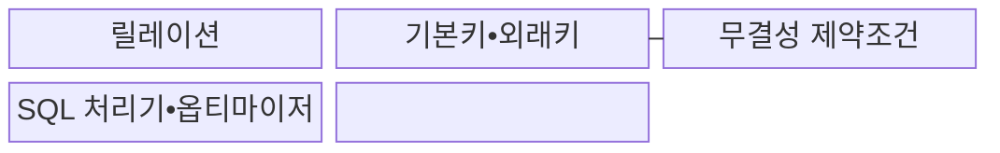
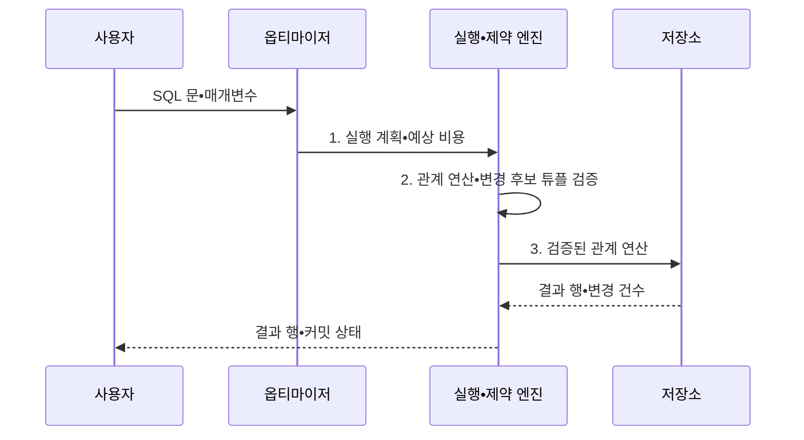

---
sidebar:
  order: 84
  label: "084. 관계형 데이터베이스 기본: 릴레이션•키•제약조건 (Relational Database)"
  badge:
    text: "미출제 • 30%"
    variant: note
title: "관계형 데이터베이스 기본: 릴레이션•키•제약조건 (Relational Database)"
date: "2026-08-03T09:18:33+09:00"
tags:
  - "notes-software"
weight: 84
extra:
  question_no: "084"
  source_status: "미출제"
  source_history: ""
  priority: 30
  priority_note: "릴레이션•키•제약은 데이터베이스의 기초"
---

## Ⅰ. 개요

핵심 용어

- **관계형 데이터베이스(Relational Database)**: 데이터를 릴레이션으로 표현하고 키•제약조건•관계 연산으로 구조와 무결성을 관리하는 데이터 관리 시스템이다.
- **중복•참조 불일치**: 같은 사실이 여러 값으로 저장되거나 외래키 대상이 존재하지 않는 오류이다.

- 정의/개념: **관계형 데이터베이스** 는 데이터를 릴레이션으로 표현하고 키•제약조건•관계 연산으로 구조와 무결성을 관리하는 **데이터 관리 시스템**
- 배경/필요성: 응용 코드만의 검증은 동시 변경에서 **중복•참조 불일치 통제 한계**

#### 한줄 요약

- 고객과 주문을 따로 저장하고 고객 번호로 연결해 관계를 정확히 유지한다.

## Ⅱ. 특징

핵심 용어

- **집합 연산**: 튜플 순서와 중복에 의존하지 않고 관계를 처리하는 연산 방식이다.
- **선언형 질의**: 원하는 결과를 기술하면 데이터베이스 엔진이 실행 방법을 선택하는 방식이다.
- **무결성 강제**: 도메인•개체•참조 규칙을 위반하는 변경을 데이터베이스가 거부하는 통제이다.

- **집합 연산**: 튜플 순서와 중복에 비의존
- **선언형 질의**: 엔진이 실행 계획을 선택
- **무결성 강제**: 도메인•개체•참조 위반 거부

#### 한줄 요약

- 키는 행을 식별하고 제약조건은 잘못된 값과 존재하지 않는 참조를 거부한다.

## Ⅲ. 구조 및 구성요소

핵심 용어

- **릴레이션(Relation)**: 속성과 중복 없는 튜플 집합으로 정의되는 논리 구조이다.
- **기본키•외래키**: 튜플의 고유 식별자와 다른 릴레이션을 참조하는 속성 집합이다.
- **무결성 제약조건(Integrity Constraint)**: 데이터가 허용된 상태를 유지하도록 변경을 통제하는 규칙이다.
- **SQL 처리기•옵티마이저**: 질의를 해석하고 예상 비용이 낮은 실행 계획을 선택하는 구성요소이다.
- **SQL(Structured Query Language, 구조화 질의 언어)**: 관계형 데이터의 정의•조회•변경•제어를 선언하는 표준 언어이다.

| 구성요소 | 책임 |
|:---|:---|
| 릴레이션 | **속성•튜플 집합** 의 논리 구조 제공 |
| 기본키•외래키 | 튜플의 **식별•참조 관계** 정의 |
| 무결성 제약조건 | **도메인•개체•참조 규칙** 검사 |
| SQL 처리기•옵티마이저 | **비용 기반 실행 계획** 선택 |

#### 한줄 요약

- 테이블의 키와 제약을 지키며 질의를 실행할 계획을 고른다.

## Ⅳ. 흐름도

핵심 용어

- **실행 계획•예상 비용**: 통계로 선택한 접근 방법과 조인 순서 및 예측 자원 비용이다.
- **관계 연산•변경 후보 튜플**: 질의가 처리하거나 저장 전 검증할 행 집합이다.
- **검증된 관계 연산**: 키•참조•도메인 규칙을 통과해 저장소와 인덱스에서 수행하는 작업이다.

**동작 원리**

- **1. 실행 계획•예상 비용**: 통계로 접근 방법•조인 순서 결정
- **2. 관계 연산•변경 후보 튜플**: 키•참조•도메인 규칙 검증
- **3. 검증된 관계 연산**: 저장소•인덱스에서 계획을 수행

> 요약: SQL의 선언을 비용 기반 계획으로 실행하고 변경 시 무결성 제약을 강제

#### 한줄 요약

- 엔진은 질의의 뜻과 비용을 보고 실행 계획을 고른 뒤 데이터 규칙을 검사한다.

## Ⅴ. 종류 및 비교

핵심 용어

- **관계형 데이터베이스(Relational Database)**: 테이블•관계•선언형 SQL과 제약을 중심으로 데이터를 관리한다.
- **비관계형 데이터베이스(Not Only SQL, NoSQL)**: 키-값•문서•열•그래프 등 목적별 모델을 사용하는 범주이다.

| 데이터 모델 관점 | 관계형 데이터베이스 | 비관계형 데이터베이스 |
|:---|:---|:---|
| 적용 기준 | **복합 관계•트랜잭션•무결성** 중심 | **특정 접근 패턴•유연한 모델** 중심 |
| 핵심 특징 | **테이블•관계•선언형 SQL** | **키-값•문서•열•그래프** 모델 |
| 한계 | **분산 조인•샤딩 설계** 복잡도 | 제품별 **일관성•제약 기능** 차이 |

> 요약: 관계형은 스키마•제약을 엔진이 관리

#### 한줄 요약

- 관계형은 복합 관계와 제약에 강하고 비관계형은 목적별 데이터 모델을 선택한다.

## Ⅵ. 실무 고려사항 및 대책

핵심 용어

- **안정 후보키•업무 유일 제약**: 변경 가능 업무 값과 내부 식별자를 분리해 연쇄 키 수정을 막는 설계이다.
- **참조 무결성•변경 정책**: 외래키 대상의 존재와 삭제•갱신 시 동작을 데이터베이스에 명시한 규칙이다.
- **측정된 병목만 비정규화**: 실제 성능 측정으로 확인한 반복 조인 구간에 한해 중복을 허용하고 일관성 통제를 함께 두는 원칙이다.
- **질의•선택도•통계 기반 인덱스**: 실제 접근 패턴과 분포를 근거로 유지하는 보조 자료구조이다.
- **원자성을 지키는 최소 범위**: 함께 성공하거나 실패해야 하는 작업만 하나의 트랜잭션에 넣어 잠금 보유 시간을 줄이는 경계이다.

| 문제 | 대책 | 효과 |
|:---|:---|:---|
| 변경 가능한 업무 값을 기본키로 써 연쇄 수정 발생 | **안정 후보키•업무 유일 제약** 분리 | **연쇄 키 수정** 방지 |
| 외래키 없이 응용 코드만 검사해 고아 데이터 생성 | **참조 무결성•변경 정책** 명시 | **고아 데이터 생성** 차단 |
| 과도한 정규화로 반복 조인과 조회 지연 증가 | **측정된 병목만 비정규화** | **무결성•조회 성능** 균형 |
| 낮은 선택도 인덱스까지 추가해 쓰기•저장 비용 증가 | **질의•선택도•통계 기반 인덱스** 운영 | **쓰기•저장 비용** 감소 |
| 긴 트랜잭션이 잠금을 오래 보유해 경합•교착 증가 | **원자성을 지키는 최소 범위** 로 축소 | **잠금 경합•교착** 감소 |

> 적용 사례: 외래키는 존재하지 않는 계좌를 참조하는 이체 내역의 저장을 거부

#### 한줄 요약

- 외래키는 거래 대상 계좌가 실제로 있을 때만 이체 내역을 저장하게 한다.

## Ⅶ. 결론

핵심 용어

- **관계 복잡도•무결성•접근 패턴**: 데이터 모델을 선택할 때 고려하는 연결 구조, 제약 요구, 조회•변경 방식이다.
- **데이터 모델**: 데이터를 표현하고 연결하며 제약하는 논리 구조와 연산 규칙이다.

- **관계 복잡도•무결성•접근 패턴** 으로 데이터 모델을 결정

#### 한줄 요약

- 관계형 데이터베이스는 연결 데이터와 거래 규칙을 일관되게 관리한다.
