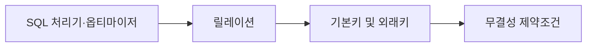
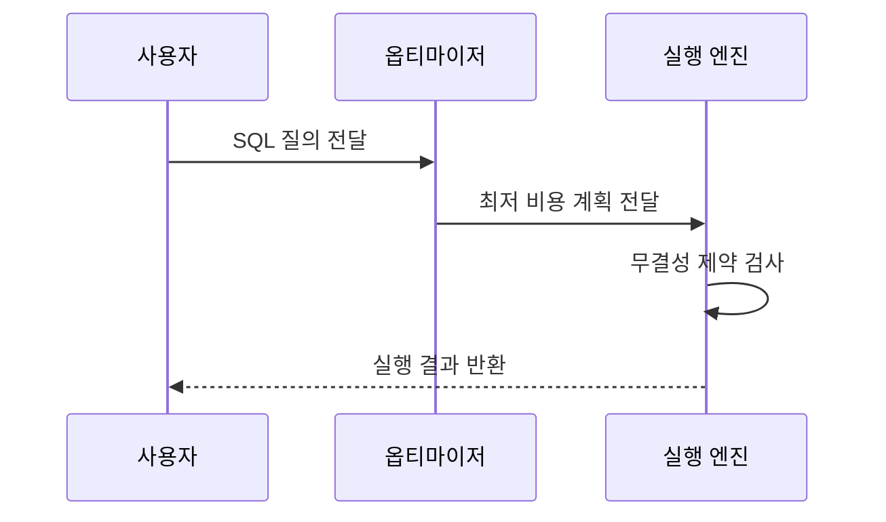

---
sidebar:
  order: 84
  label: "084. 관계형 데이터베이스 기본 — 릴레이션·키·제약조건 (Relational Database)"
  badge:
    text: "미출제 · 30%"
    variant: note
title: "관계형 데이터베이스 기본 — 릴레이션·키·제약조건 (Relational Database)"
date: "2026-07-25T18:16:00+09:00"
tags:
  - "notes-software"
weight: 84
extra:
  question_no: "084"
  source_status: "미출제"
  source_history: ""
  priority: 30
  priority_note: "릴레이션·키·제약은 데이터베이스의 기초"
---

## 미리 알고가기

- **관계형 데이터베이스(Relational Database, RDB)**: 데이터를 릴레이션으로 표현하고 키로 관계를 연결하는 데이터베이스임
- **릴레이션(Relation)**: 튜플과 속성으로 구성된 중복 없는 행의 집합임
- **튜플(Tuple)**: 릴레이션에서 하나의 개체를 나타내는 행임
- **속성(Attribute)**: 개체의 한 가지 성질을 나타내는 열임
- **무결성 제약조건(Integrity Constraint)**: 데이터의 정확성·정합성·일관성을 지키도록 강제하는 규칙임
- **기본키(Primary Key, PK)**: 릴레이션 내부에서 각각의 튜플을 고유하게 식별할 수 있는 대표 속성(또는 속성 집합)임
- **외래키(Foreign Key, FK)**: 다른 릴레이션의 기본키를 참조하여 테이블 간 논리적 연관 관계를 맺는 연결 속성임
- **도메인(Domain)**: 릴레이션의 각 열이 가질 수 있는 동일 성격의 유효한 원자값들의 집합임
- **구조화 질의어(Structured Query Language, SQL)**: 관계형 데이터를 선언형으로 다룸
- **데이터 정의어(Data Definition Language, DDL)**: 스키마를 정의·변경함
- **데이터 조작어(Data Manipulation Language, DML)**: 행을 조회·변경함
- **데이터 제어어(Data Control Language, DCL)**: 권한을 부여·회수함
- **스키마(Schema)**: 테이블·열·키·제약조건 등 데이터베이스의 논리 구조를 정의한 명세임
- **조인(Join)**: 공통 속성의 값을 기준으로 여러 릴레이션의 행을 결합하는 연산임
- **질의 최적화기(Query Optimizer)**: 여러 실행 방법의 예상 비용을 비교해 실행 계획을 선택하는 구성요소임
- **인덱스(Index)**: 전체 행을 읽지 않고 원하는 행의 위치를 빠르게 찾게 하는 보조 구조임
- **샤딩(Sharding)**: 데이터를 여러 서버에 나누어 저장해 처리 용량을 수평 확장하는 방식임
- **비관계형 데이터베이스(Not Only SQL, NoSQL)**: 고정된 관계형 스키마보다 유연한 데이터 모델과 분산 확장에 초점을 둔 데이터베이스임

## Ⅰ. 개요

- **정의/개념**: 릴레이션·키·제약으로 데이터를 관리함
- **배경/필요성**: 데이터 중복·불일치로 관계형 제약 필요

### 쉽게 이해하기 (학습용)
- 고객과 주문을 따로 저장하되 고객 번호로 연결해 중복을 줄이고 관계를 정확히 유지함

## Ⅱ. 특징

- 튜플의 순서와 중복에 의존하지 않는 집합 연산을 쓴다.
- 사용자는 결과를 선언하고 엔진은 실행 계획을 선택한다.
- 도메인·개체·참조 무결성 위반을 거부한다.
- 논리 구조와 물리 저장을 분리해 변경 영향을 줄인다.

### 쉽게 이해하기 (학습용)
- 키는 행을 정확히 찾고 제약조건은 잘못된 값과 존재하지 않는 참조의 저장을 거부함

## Ⅲ. 아키텍처 및 구성요소

| 설계 요소 | 설명 |
|:---|:---|
| **릴레이션** | 속성 헤더와 튜플로 구성된 기본 저장 단위 |
| **기본키 및 외래키** | 튜플 유일성을 확보하고 테이블 간의 참조 경로를 정의하는 장치임 |
| **무결성 제약조건** | 도메인과 개체 및 참조 무결성 유효 규칙을 검사함 |
| **SQL 처리기·옵티마이저** | 질의를 변환하고 비용 모델로 최적 실행 계획을 선택함 |

> 요약: 무결성 제약과 처리기가 올바른 저장과 질의를 보장함

### 쉽게 이해하기 (학습용)
- 학번으로 학생을 식별하고 수강 신청과 대조하며 전공명이 유효한지 통제함

## Ⅳ. 원리 및 절차 흐름도

| 절차 | 설명 |
|:---|:---|
| SQL 질의 전달 | 구문·의미를 검증해 논리 계획 생성 |
| 최저 비용 계획 전달 | 통계·비용 모델로 실행 계획 선택 |
| 무결성 제약 검사 | 변경 연산의 도메인·키 규칙 검사 |
| 실행 결과 반환 | 계획 수행 결과를 사용자에게 반환 |

> 요약: 비용 기반 계획 선택 후 무결성 제약 검사

### 쉽게 이해하기 (학습용)
- 엔진은 질의의 뜻을 확인하고 가장 저렴한 실행 계획을 선택한 뒤 변경 데이터의 제약조건을 검사함

## Ⅴ. 종류 및 비교

| 비교축 | 관계형 데이터베이스 | 비관계형 데이터베이스 |
|:---|:---|:---|
| 핵심 특징 | 엄격한 스키마로 정의함 | 유연한 스키마를 씀 |
| **관계 및 무결성** | 조인 연산과 제약을 엔진이 강제함 | 애플리케이션 방식으로 무결성을 처리함 |
| **확장 방식** | 수직 증설이나 샤딩으로 확장함 | 파티셔닝으로 수평 확장함 |
| 적용 기준 | 관계·트랜잭션·무결성 중심 | 유연한 모델·수평 확장 중심 |
| 주요 위험 | 조인 비용·수평 확장 복잡도 | 애플리케이션 무결성 검증 비용 |

> 요약: 관계형은 스키마·제약을 엔진이 관리

### 쉽게 이해하기 (학습용)
- 관계형은 관계와 규칙을 엔진이 강제하고 비관계형은 유연한 구조와 분산 확장을 우선함

## Ⅵ. 실무 사례

1. 외래키로 없는 계좌의 이체 내역 저장 거부
2. 전체 테이블 읽기에 인덱스를 추가해 조회 단축

### 쉽게 이해하기 (학습용)
- 외래키 검사는 거래 대상 계좌가 실제로 존재할 때만 이체 내역을 저장하게 함
- 실행 계획을 확인하면 느린 원인이 전체 읽기인지 판단하고 필요한 열에 인덱스를 적용할 수 있음

## Ⅶ. 결론

- 정합성은 관계형, 유연한 확장은 NoSQL 선택

### 쉽게 이해하기 (학습용)
- 관계형 데이터베이스는 키와 제약으로 데이터 관계를 정확히 유지해야 하는 업무에 적합함
