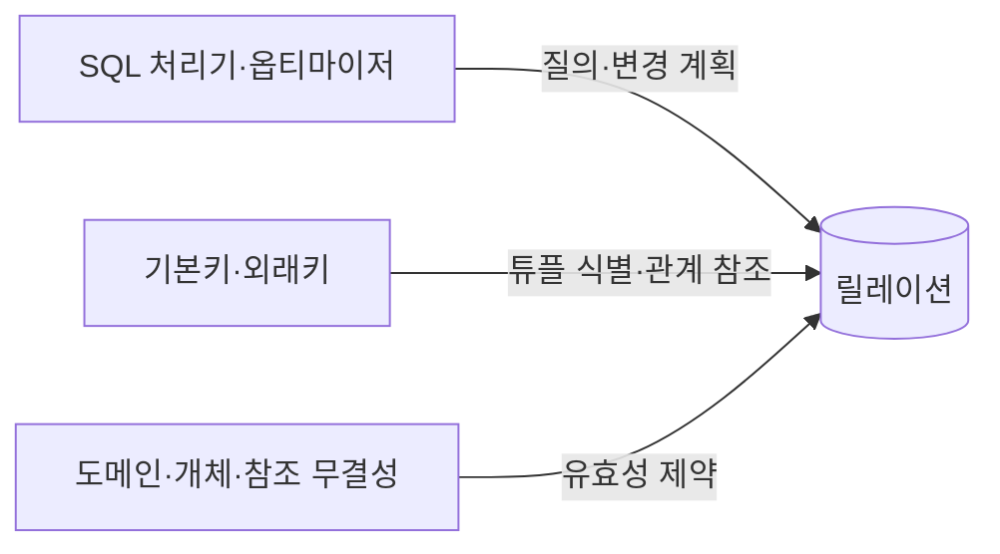
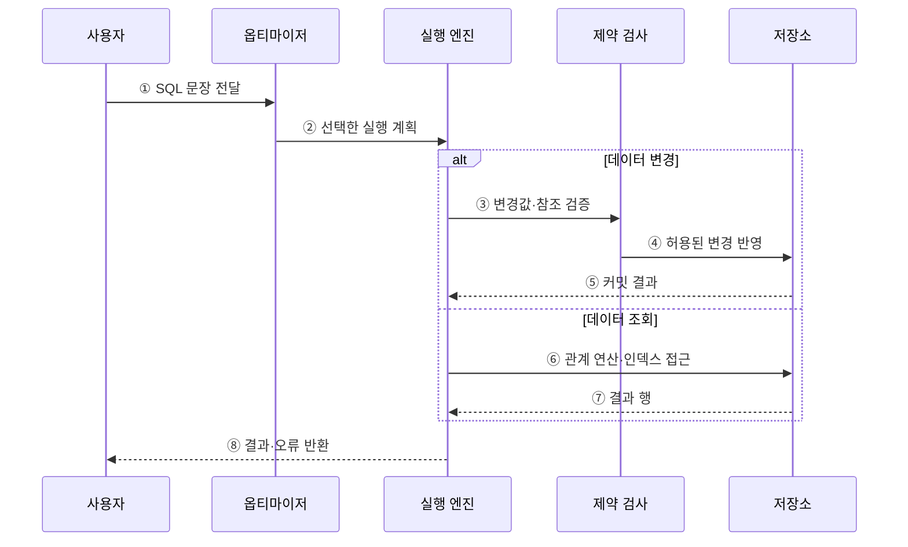

---
sidebar:
  order: 84
  label: "084. 관계형 데이터베이스 기본 — 릴레이션·키·제약조건 (Relational Database)"
  badge:
    text: "미출제 · 30%"
    variant: note
title: "관계형 데이터베이스 기본 — 릴레이션·키·제약조건 (Relational Database)"
date: "2026-07-25T18:16:00+09:00"
tags:
  - "notes-software"
weight: 84
extra:
  question_no: "084"
  source_status: "미출제"
  source_history: ""
  priority: 30
  priority_note: "릴레이션·키·제약은 데이터베이스의 기초"
---

## 미리 알고가기

- **관계형 데이터베이스(Relational Database, RDB)**: 데이터를 테이블로 표현하고 관계 대수·키·제약조건으로 관리하는 데이터베이스
- **릴레이션(Relation)**: 관계 모델에서 속성 집합과 중복 없는 튜플 집합으로 정의되는 논리 구조
- **튜플(Tuple)**: 릴레이션의 한 데이터 항목을 나타내는 속성값 묶음
- **속성(Attribute)**: 튜플을 구성하는 이름 있는 데이터 항목
- **무결성 제약조건(Integrity Constraint)**: 데이터가 허용된 상태를 유지하도록 삽입·변경·삭제를 통제하는 규칙
- **후보키(Candidate Key)**: 튜플을 유일하게 식별하는 최소 속성 집합
- **기본키(Primary Key, PK)**: 후보키 중 대표 식별자로 선택하며 중복과 NULL을 허용하지 않는 키
- **외래키(Foreign Key, FK)**: 다른 테이블의 후보키 또는 같은 테이블의 키를 참조하는 속성 집합
- **도메인(Domain)**: 한 속성이 가질 수 있는 유효한 값의 집합
- **구조화 질의어(Structured Query Language, SQL)**: 원하는 결과를 선언하면 데이터베이스가 실행 방법을 선택하는 표준 질의 언어
- **스키마(Schema)**: 테이블·열·키·제약조건 등 논리 구조의 명세
- **조인(Join)**: 관련 조건을 만족하는 여러 테이블의 행을 결합하는 연산
- **질의 최적화기(Query Optimizer)**: 여러 실행 계획의 예상 비용을 비교해 사용할 계획을 선택하는 구성요소
- **인덱스(Index)**: 조건에 맞는 행을 빠르게 찾도록 키와 위치를 정렬·구조화한 보조 자료구조
- **트랜잭션(Transaction)**: 여러 데이터 연산을 하나의 논리 작업으로 묶는 처리 단위
- **ACID**: 트랜잭션의 원자성·일관성·격리성·지속성을 나타내는 핵심 성질
- **샤딩(Sharding)**: 데이터를 여러 노드에 분할 저장해 처리량과 용량을 수평 확장하는 방식
- **비관계형 데이터베이스(Not Only SQL, NoSQL)**: 키-값·문서·열·그래프 등 관계형 외 데이터 모델을 사용하는 데이터베이스 범주

## Ⅰ. 개요

- 정의/개념: 릴레이션·키·제약으로 데이터를 관리함
- **배경/필요성**: 데이터 중복·불일치로 관계형 제약 필요

### 쉽게 이해하기 (학습용)

- 고객과 주문을 따로 저장하고 고객 번호로 연결해 관계를 정확히 유지한다.

## Ⅱ. 특징

- 튜플의 순서와 중복에 의존하지 않는 집합 연산을 쓴다.
- 사용자는 결과를 선언하고 엔진은 실행 계획을 선택한다.
- 도메인·개체·참조 무결성 위반을 거부한다.
- 논리 구조와 물리 저장을 분리해 변경 영향을 줄인다.

### 쉽게 이해하기 (학습용)

- 키는 행을 식별하고 제약조건은 잘못된 값과 존재하지 않는 참조를 거부한다.

## Ⅲ. 아키텍처 및 구성요소

**도표안 A — 구조도**

**도표안 B — sequenceDiagram**

| 설계 요소 | 설명 |
|:---|:---|
| 릴레이션 | 속성과 튜플로 구성된 논리 구조 |
| 기본키·외래키 | 튜플 식별과 참조 관계 정의 |
| 무결성 제약조건 | 도메인·개체·참조 규칙 검사 |
| SQL 처리기·옵티마이저 | 질의를 변환하고 비용 기반 계획 선택 |

**동작 원리**

- ① 사용자가 원하는 결과나 변경을 SQL로 선언한다.
- ② 처리기가 구문·의미를 확인하고 통계·비용 모델로 실행 계획을 고른다.
- ③ 변경이면 도메인·키·참조·사용자 정의 제약을 검사한다.
- ④ 제약을 통과한 변경만 트랜잭션 저장소에 반영한다.
- ⑤ 저장소가 커밋 또는 충돌·실패 결과를 실행 엔진에 반환한다.
- ⑥ 조회이면 계획에 따라 조인·필터·정렬과 인덱스 접근을 수행한다.
- ⑦ 저장소가 조건을 만족하는 결과 행을 반환한다.
- ⑧ 실행 엔진이 결과 또는 제약·트랜잭션 오류를 사용자에게 돌려준다.

> 요약: SQL의 선언을 비용 기반 계획으로 실행하고 변경 시 무결성 제약을 강제한다.

### 쉽게 이해하기 (학습용)

- 엔진은 질의의 뜻을 확인하고 효율적인 계획을 고른 뒤 변경 데이터의 규칙을 검사한다.

## Ⅳ. 종류 및 비교

| 비교축 | 관계형 데이터베이스 | 비관계형 데이터베이스 |
|:---|:---|:---|
| 핵심 모델 | 테이블·관계·선언형 SQL | 키-값·문서·열·그래프 등 |
| 관계·제약 | 조인과 키·참조 제약을 폭넓게 제공 | 제품별 관계·제약·트랜잭션 범위가 다름 |
| 확장 | 복제·파티셔닝·샤딩 지원 | 분산 파티셔닝을 주요 설계로 채택한 제품이 많음 |
| 적용 기준 | 복합 관계·트랜잭션·무결성 중심 | 특정 접근 패턴·유연한 모델·분산 처리 중심 |
| 주요 위험 | 분산 조인·샤딩의 설계 복잡도 | 제품별 일관성·질의·무결성 제약 차이 |

> 요약: 관계형은 스키마·제약을 엔진이 관리

### 쉽게 이해하기 (학습용)

- 관계형은 복합 관계와 제약에 강하고 비관계형은 목적별 데이터 모델을 선택한다.

## Ⅴ. 실무 고려사항 및 대책

| 고려사항 | 문제점 | 대책 |
|:---|:---|:---|
| 부적절한 키 | 변경되는 업무값을 기본키로 써 연쇄 수정 발생 | 안정적 후보키를 고르고 업무 유일성은 별도 제약 |
| 외래키 누락 | 존재하지 않는 부모를 참조하는 고아 데이터 생성 | 참조 무결성과 삭제·갱신 정책을 명시 |
| 과도한 정규화 | 단순 조회도 많은 조인으로 지연 | 무결성을 우선하되 측정된 병목만 선택적으로 비정규화 |
| 인덱스 남용 | 쓰기·저장 비용과 계획 선택 복잡도 증가 | 실제 질의·선택도·사용 통계로 최소 인덱스 운영 |
| 긴 트랜잭션 | 잠금 경합·교착·버전 보존 비용 증가 | 업무 원자성을 지키는 최소 범위로 트랜잭션 축소 |

> 적용 사례: 외래키는 존재하지 않는 계좌를 참조하는 이체 내역의 저장을 거부한다.

### 쉽게 이해하기 (학습용)

- 외래키는 거래 대상 계좌가 실제로 있을 때만 이체 내역을 저장하게 한다.

## Ⅵ. 결론

- 관계형 데이터베이스는 키·제약·트랜잭션과 선언형 질의로 복합 데이터 관계를 일관되게 관리한다.
- 관계·무결성·접근 패턴을 함께 검토해 스키마와 물리 구조를 설계한다.

### 쉽게 이해하기 (학습용)

- 관계형 데이터베이스는 연결된 데이터와 거래 규칙을 정확히 지켜야 하는 업무에 적합하다.
