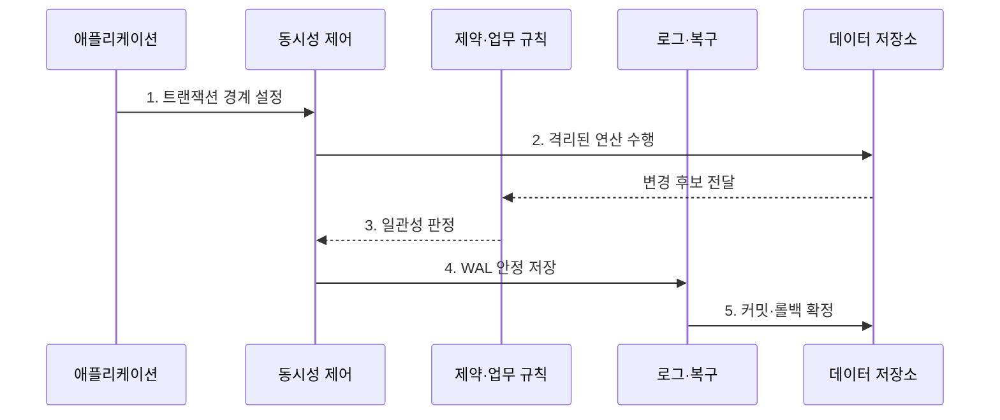

---
sidebar:
  order: 85
  label: "085. 트랜잭션 ACID (Transaction ACID)"
  badge:
    text: "기출 · 70%"
    variant: note
title: "트랜잭션 ACID (Transaction ACID)"
date: "2026-07-27T23:59:59+09:00"
tags:
  - "notes-software"
weight: 85
extra:
  question_no: "085"
  source_status: "기출"
  source_history: "120회, 129회, 131회"
  priority: 70
  priority_note: "120·129·131회 반복, ACID 트랜잭션 핵심"
---

## 미리 알고가기

- **트랜잭션(Transaction)**: 하나의 논리 작업으로 성공·실패를 함께 판정하는 데이터 연산 묶음
- **ACID**: 트랜잭션의 원자성·일관성·격리성·지속성을 나타내는 네 성질
- **원자성(Atomicity)**: 묶인 변경을 모두 반영하거나 모두 취소하는 성질
- **일관성(Consistency)**: 트랜잭션이 데이터베이스 제약과 업무 불변식을 만족하는 상태에서 다른 유효 상태로 옮기는 성질
- **격리성(Isolation)**: 동시 트랜잭션이 허용한 격리 수준 밖의 중간 결과에 간섭하지 않게 하는 성질
- **지속성(Durability)**: 커밋한 결과를 장애 뒤에도 복구할 수 있게 보존하는 성질
- **격리 수준(Isolation Level)**: 성능과 동시성 이상 방지 사이에서 트랜잭션에 허용할 관찰 범위를 정한 단계
- **다중 버전 동시성 제어(Multi-Version Concurrency Control, MVCC)**: 여러 데이터 버전의 가시성을 조절해 읽기·쓰기 간섭을 줄이는 방식
- **선행기입로그(Write-Ahead Logging, WAL)**: 데이터 페이지보다 변경 로그를 먼저 안정 저장하는 복구 방식
- **BASE**: 기본 가용성·유연 상태·최종 일관성을 강조하는 분산 시스템 설계 관점
- **커밋(Commit)**: 트랜잭션의 변경을 성공 결과로 확정하는 연산
- **롤백(Rollback)**: 실패한 트랜잭션의 미확정 변경을 취소하는 연산
- **실행 취소 로그(Undo Log)**: 미완료 변경을 되돌리도록 변경 전 값을 기록한 로그
- **불변식(Invariant)**: 트랜잭션 전후에 항상 참이어야 하는 잔액·합계 등의 업무 규칙
- **동시성 이상(Concurrency Anomaly)**: 갱신 손실·더티 읽기처럼 동시 실행 때문에 직렬 실행과 다른 잘못된 결과가 생기는 현상
- **보상 처리(Compensation)**: 이미 커밋한 분산 작업의 효과를 반대 업무로 상쇄하는 처리

## Ⅰ. 개요

- 정의/개념: 트랜잭션의 **원자성·일관성·고립성·지속성**을 보장하는 성질
- 배경/필요성: 부분 반영·불변식 위반·결과 소실 방지

### 쉽게 이해하기 (학습용)

- 송금은 출금과 입금이 모두 성공하거나 모두 취소되고, 확정한 결과는 장애 뒤에도 남아야 한다.

## Ⅱ. 특징

- **원자성**: 모든 연산을 함께 반영하거나 취소
- **일관성·격리성**: 불변식과 동시 간섭 통제
- **지속성**: 커밋 결과를 장애 뒤에도 복구

### 쉽게 이해하기 (학습용)

- ACID는 작업 완결성·유효 상태·동시 실행 통제·확정 결과 보존을 뜻한다.

## Ⅲ. 구조 및 구성요소

| 구성요소 | 책임 |
|:---|:---|
| 원자성 제어 | Undo 로그와 롤백으로 전체 취소 |
| 일관성 규칙 | 제약과 업무 로직으로 상태 판정 |
| 격리성 제어 | 잠금·버전으로 동시 간섭 통제 |
| 지속성 장치 | WAL·복구로 커밋 결과 보존 |

### 쉽게 이해하기 (학습용)

- 취소·제약·동시성·복구 장치가 한 거래의 안전을 보장한다.

## Ⅳ. 흐름도

**동작 원리**

- **1. 트랜잭션 경계 설정**: 원자 단위와 격리 수준 결정
- **2. 격리된 연산 수행**: 잠금·버전으로 동시 관찰 통제
- **3. 일관성 판정**: 제약·업무 불변식의 유효 상태 확인
- **4. WAL 안정 저장**: 데이터보다 커밋 로그를 먼저 보존
- **5. 커밋·롤백 확정**: 성공 변경 반영 또는 원자적 복구

> 요약: 동시 실행을 격리하고 유효 상태만 WAL로 커밋해 장애 뒤에도 복구

### 쉽게 이해하기 (학습용)

- 결제 규칙을 확인해 확정하고 장애가 나면 먼저 남긴 거래 로그로 복구한다.

## Ⅴ. 종류 및 비교

| 분산 데이터 모델 | ACID | BASE |
|:---|:---|:---|
| 적용 기준 | 명확한 트랜잭션 경계와 불변식 | 지연 수렴을 허용하는 분산 상태 |
| 핵심 특징 | 원자성·격리성·지속성 보장 | 가용성·유연 상태·최종 수렴 강조 |
| 한계 | 강한 격리·분산 합의의 비용 | 일시 불일치·충돌·보상 처리 부담 |

> 요약: 완결성은 거래 신뢰성, 수렴은 가용성 우선

### 쉽게 이해하기 (학습용)

- 한 거래 안에서 반드시 맞아야 하면 ACID를, 지연 수렴을 허용하면 BASE 관점을 검토한다.

## Ⅵ. 실무 고려사항 및 대책

| 고려사항 | 대책 | 효과 |
|:---|:---|:---|
| 넓은 경계 | 불변식을 지키는 최소 연산만 묶음 | 잠금 경합과 지연 감소 |
| 낮은 격리 수준 | 위험별 격리 수준과 잠금 선택 | 동시성 이상 방지 |
| 일관성 책임 오해 | DB 제약과 원자 연산 함께 설계 | 업무 불변식 누락 방지 |
| 재시도 부재 | 멱등성·제한 재시도·충돌 피드백 | 일시 충돌의 사용자 노출 감소 |
| 분산 원자성 남용 | 로컬 ACID와 메시지·보상 분리 | 장시간 합의 결합 감소 |

> 적용 사례: 출금·입금을 한 트랜잭션으로 묶어 **송금 전후 잔액 합계** 보존

### 쉽게 이해하기 (학습용)

- 출금과 입금을 하나로 묶으면 중간 장애에도 잔액 합계가 유지된다.

## Ⅶ. 결론

- **업무 불변식·격리 수준·복구 목표**로 거래 경계를 결정

### 쉽게 이해하기 (학습용)

- ACID는 모든 처리를 강하게 묶는 규칙이 아니라 필요한 거래 경계를 안전하게 지키는 기준이다.
