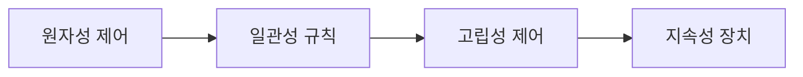
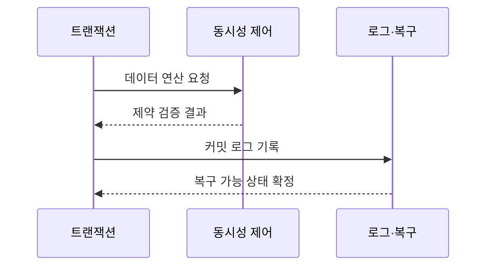

---
sidebar:
  order: 85
  label: "085. 트랜잭션 ACID (Transaction ACID)"
  badge:
    text: "기출 · 70%"
    variant: note
title: "트랜잭션 ACID (Transaction ACID)"
date: "2026-07-27T23:59:59+09:00"
tags:
  - "notes-software"
weight: 85
extra:
  question_no: "085"
  source_status: "기출"
  source_history: "120회, 129회, 131회"
  priority: 70
  priority_note: "120·129·131회 반복, ACID 트랜잭션 핵심"
---

## 미리 알고가기

- **트랜잭션(Transaction)**: 하나의 논리적 작업으로 묶은 데이터 연산임
- **원자성·일관성·고립성·지속성 ACID(애시드, Atomicity, Consistency, Isolation, Durability)**: 네 영어 성질의 첫 글자를 붙인 표기로 트랜잭션의 신뢰성을 구현하는 네 기준임
- **다중 버전 동시성 제어(Multi-Version Concurrency Control, MVCC)**: 버전 가시성으로 읽기·쓰기를 제어함
- **선행기입로그(Write-Ahead Logging, WAL)**: 데이터보다 로그를 먼저 안정 저장함
- **기본 가용성·유연 상태·최종 일관성(Basically Available, Soft State, Eventual Consistency, BASE)**: 분산 가용성과 상태 수렴을 우선함
- **회복(Recovery)**: 로그로 장애 전후의 일관된 상태를 복원함
- **동시성 제어(Concurrency Control)**: 동시 트랜잭션의 간섭을 조정함
- **커밋(Commit)**: 트랜잭션의 모든 변경을 성공 결과로 확정하는 연산임
- **롤백(Rollback)**: 실패한 트랜잭션의 변경을 시작 전 상태로 되돌리는 연산임
- **실행 취소 로그(Undo Log)**: 미완료 변경을 되돌릴 수 있도록 변경 전 값을 기록한 로그임
- **불변식(Invariant)**: 트랜잭션 전후에 항상 참이어야 하는 잔액·합계 등의 업무 규칙임
- **잠금(Lock)**: 다른 트랜잭션의 충돌하는 접근을 기다리게 하는 동시성 제어 장치임
- **보상 처리(Compensation)**: 이미 확정된 분산 작업의 효과를 반대 작업으로 상쇄하는 처리임

## Ⅰ. 개요

- 정의/개념: 트랜잭션의 **원자성·일관성·고립성·지속성**을 보장하는 성질
- 기존 한계: 무보호 동시 변경·장애는 **부분 반영·불변식 위반·결과 소실** 유발

### 쉽게 이해하기 (학습용)
- 송금은 출금과 입금이 모두 성공하거나 모두 취소되고, 성공한 결과는 장애 뒤에도 남아야 함

## Ⅱ. 특징

- 원자성은 모든 연산을 함께 반영하거나 함께 취소한다.
- 일관성은 처리 전후의 업무 불변식을 유지한다.
- 고립성은 동시 트랜잭션의 중간 간섭을 통제한다.
- 지속성은 커밋 결과를 장애 뒤에도 복구한다.

### 쉽게 이해하기 (학습용)
- ACID는 작업 묶음의 완결성, 결과의 유효성, 동시 실행의 분리, 확정 결과의 보존을 각각 책임짐

## Ⅲ. 아키텍처 및 구성요소

| 설계 요소 | 설명 |
|:---|:---|
| 원자성 제어 | Undo 로그와 롤백으로 전체 취소를 보장함 |
| 일관성 규칙 | 제약과 업무 로직으로 유효 상태만 반영함 |
| 고립성 제어 | 잠금과 버전 제어로 동시 실행 간섭을 차단함 |
| 지속성 장치 | 선행 로그와 복구로 커밋 결과를 보존함 |

> 요약: 롤백과 제약 및 버전 제어와 로그가 신뢰성을 구현함

### 쉽게 이해하기 (학습용)
- 취소 기록과 규칙 및 격리와 복구 로그가 신뢰성을 지킴

## Ⅳ. 원리 및 절차 흐름도

| 절차 | 설명 |
|:---|:---|
| 데이터 연산 요청 | 잠금·버전으로 동시 충돌 제어 |
| 제약 검증 결과 | 업무 규칙·무결성 충족 판정 |
| 커밋 로그 기록 | 성공은 커밋, 실패는 롤백 |
| 복구 가능 상태 확정 | 선행 로그로 커밋 결과 보존 |

> 요약: 격리와 제약 검증 후 커밋하고 로그로 장애를 복구함

### 쉽게 이해하기 (학습용)
- 결제 검증 후 승인하고 장애 시 거래 로그로 복구함

## Ⅴ. 종류 및 비교

| 분산 데이터 모델 | ACID | BASE |
|:---|:---|:---|
| 적용 기준 | 금융 거래의 **즉시 정합성** | 대규모 분산 **가용성** |
| 핵심 특징 | 즉시 일관성·**거래 완결성** | 가용성·**분산 상태 수렴** |
| 한계 | 잠금 경합·**분산 확장 비용** | 일시 불일치·**보상 처리 복잡도** |

> 요약: 완결성은 거래 신뢰성, 수렴은 가용성 우선

### 쉽게 이해하기 (학습용)
- 계좌 잔액처럼 즉시 맞아야 하는 값은 ACID를, 잠시 달라도 수렴 가능한 값은 BASE를 선택할 수 있음

## Ⅵ. 실무 사례

1. 송금은 **출금·입금을 단일 트랜잭션**으로 처리

### 쉽게 이해하기 (학습용)
- 출금과 입금을 하나로 묶으면 중간 장애가 발생해도 잔액 합계가 유지됨

## Ⅶ. 결론

- 장애와 동시 실행 중에도 업무 정합성을 보장하기 위해 **원자성 경계·일관성 규칙·격리 수준·복구 요구**를 검토하고, 핵심 거래에 필요한 ACID 속성을 구현한다

### 쉽게 이해하기 (학습용)
- ACID는 모든 업무를 느리게 만드는 규칙이 아니라 필요한 정합성을 장애와 동시 실행 속에서도 지키는 기준임
