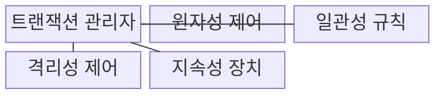
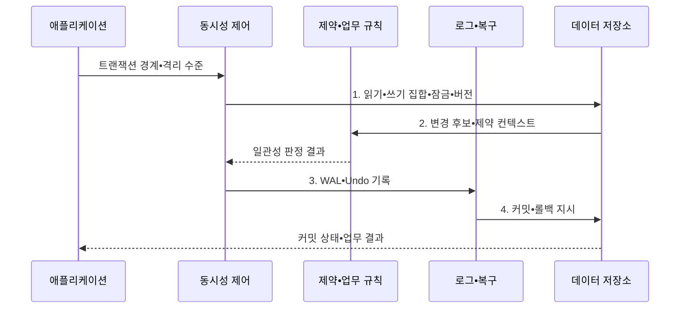

---
sidebar:
  order: 85
  label: "085. 트랜잭션 ACID (Transaction ACID)"
  badge:
    text: "기출 • 70%"
    variant: note
title: "트랜잭션 ACID (Transaction ACID)"
date: "2026-08-04T12:21:00+09:00"
tags:
  - "notes-software"
weight: 85
extra:
  question_no: "085"
  source_status: "기출"
  source_history: "120회, 129회, 131회"
  priority: 70
  priority_note: "120•129•131회 반복, ACID 트랜잭션 핵심"
---

## Ⅰ. 개요

핵심 용어

- **ACID(Atomicity, Consistency, Isolation, Durability)**: 트랜잭션이 장애와 동시 실행 중에도 원자성•일관성•격리성•지속성을 지키도록 요구하는 네 가지 속성이다.
- **부분 반영(Partial Commit)**: 트랜잭션 일부 변경만 저장된 오류다.
- **불변식 위반(Invariant Violation)**: 거래 뒤 업무 규칙이 깨진 오류다.
- **확정 결과 소실(Committed-data Loss)**: 커밋된 결과가 장애 뒤 사라진 오류다.

- 정의/개념: **ACID** 는 트랜잭션이 장애와 동시 실행 중에도 원자성•일관성•격리성•지속성을 지키도록 요구하는 **네 가지 속성**
- 배경/필요성: 장애•동시 실행은 **부분 반영•불변식 위반•확정 결과 소실** 유발

#### 한줄 요약

- 송금은 출금과 입금이 모두 성공하거나 모두 취소되고, 확정한 결과는 장애 뒤에도 남아야 한다.

## Ⅱ. 특징

핵심 용어

- **원자성(Atomicity)**: 묶인 변경을 모두 반영하거나 모두 취소하는 성질이다.
- **일관성(Consistency)**: 트랜잭션 전후에 업무 불변식을 유지하는 성질이다.
- **격리성(Isolation)**: 동시 트랜잭션의 허용 밖 간섭을 막는 성질이다.
- **지속성(Durability)**: 커밋한 결과를 장애 뒤에도 복구할 수 있게 보존하는 성질이다.

- **원자성**: 모든 연산을 함께 반영하거나 취소
- **일관성•격리성**: 불변식과 동시 간섭 통제
- **지속성**: 커밋 결과를 장애 뒤에도 복구

#### 한줄 요약

- ACID는 작업 완결성•유효 상태•동시 실행 통제•확정 결과 보존을 뜻한다.

## Ⅲ. 구조 및 구성요소

핵심 용어

- **트랜잭션 관리자(Transaction Manager)**: 경계•격리•커밋•롤백을 조정하는 구성요소이다.
- **실행 취소 로그(Undo Log)**: 미완료 변경의 이전 값을 기록하는 로그다.
- **롤백(Rollback)**: 미완료 변경을 이전 값으로 되돌리는 처리다.
- **선행 기록 로그(Write-Ahead Logging, WAL)**: 데이터 페이지보다 복구 로그를 먼저 저장하는 방식이다.
- **장애 복구(Crash Recovery)**: WAL로 커밋 결과를 복원하는 처리다.

| 구성요소 | 책임 |
|:---|:---|
| 트랜잭션 관리자 | **경계•격리•커밋•롤백** 조정 |
| 원자성 제어 | **Undo 로그•롤백** 으로 전체 취소 |
| 일관성 규칙 | **제약•업무 불변식** 으로 상태 판정 |
| 격리성 제어 | **잠금•버전 가시성** 으로 동시 간섭 통제 |
| 지속성 장치 | **WAL•장애 복구** 로 커밋 결과 보존 |

#### 한줄 요약

- 취소•제약•동시성•복구 장치가 한 거래의 안전을 보장한다.

## Ⅳ. 흐름도

핵심 용어

- **읽기•쓰기 집합•잠금•버전**: 격리 수준에 맞춰 동시 관찰과 변경 충돌을 통제하는 정보이다.
- **변경 후보•제약 컨텍스트**: 업무 불변식과 데이터베이스 제약을 검사할 미확정 상태이다.
- **WAL•Undo 기록**: 장애 복구와 미완료 변경 취소에 필요한 로그이다.
- **커밋•롤백 지시**: 성공 변경을 확정하거나 실패 변경을 취소하는 결정이다.

**동작 원리**

- **1. 읽기•쓰기 집합•잠금•버전**: 격리 수준에 맞춰 동시 관찰 통제
- **2. 변경 후보•제약 컨텍스트**: 제약•업무 불변식의 유효 상태 확인
- **3. WAL•Undo 기록**: 데이터보다 복구•취소 정보를 먼저 보존
- **4. 커밋•롤백 지시**: 성공 변경 반영 또는 미완료 변경 취소

> 요약: 동시 실행을 격리하고 유효 상태만 WAL로 커밋해 장애 뒤에도 복구

#### 한줄 요약

- 결제 규칙을 확인해 확정하고 장애가 나면 먼저 남긴 거래 로그로 복구한다.

## Ⅴ. 종류 및 비교

핵심 용어

- **기본 가용성•유연 상태•최종 일관성(Basically Available, Soft State, Eventually Consistent, BASE)**: 분산 가용성을 우선하는 관점이다.

| 분산 데이터 모델 | ACID | BASE |
|:---|:---|:---|
| 적용 기준 | 명확한 **트랜잭션 경계•불변식** | **지연 수렴** 을 허용하는 분산 상태 |
| 핵심 특징 | **원자성•일관성•격리성•지속성** | **가용성•유연 상태•최종 일관성** |
| 한계 | 강한 **격리•분산 합의 비용** | **일시 불일치•충돌•보상** 부담 |

> 요약: **ACID** 는 거래 신뢰성, **BASE** 는 분산 가용성 우선

#### 한줄 요약

- 한 거래 안에서 반드시 맞아야 하면 ACID를, 지연 수렴을 허용하면 BASE 관점을 검토한다.

## Ⅵ. 실무 고려사항 및 대책

핵심 용어

- **불변식을 지키는 최소 연산**: 잠금 경합을 줄이면서 업무 규칙을 보존하도록 묶은 거래 범위이다.
- **격리 수준(Isolation Level)**: 허용할 동시성 이상을 정하는 범위다.
- **명시적 잠금(Explicit Lock)**: 동시 변경을 직렬화하도록 직접 거는 잠금이다.
- **데이터베이스 제약(Database Constraint)**: 저장 값의 업무 규칙을 강제하는 규칙이다.
- **원자 연산(Atomic Operation)**: 조건 확인과 변경을 한 단계로 수행하는 연산이다.
- **멱등성(Idempotency)**: 반복 요청의 업무 효과를 한 번만 반영하는 성질이다.
- **제한 재시도(Bounded Retry)**: 일시 충돌을 정한 횟수 안에서 다시 수행하는 방식이다.
- **충돌 피드백(Conflict Feedback)**: 충돌 원인과 재시도 가능성을 호출자에게 알리는 정보다.
- **로컬 ACID(Local ACID)**: 한 서비스 저장소 안에서 보장하는 거래 속성이다.
- **메시지(Message)**: 서비스 사이의 비동기 상태 변경 전달이다.
- **보상 처리(Compensation)**: 완료된 분산 변경을 반대 업무로 상쇄하는 처리다.

| 문제 | 대책 | 효과 |
|:---|:---|:---|
| 넓은 거래 경계가 잠금을 오래 보유해 지연 증가 | **불변식을 지키는 최소 연산** 만 묶음 | **잠금 경합•지연** 감소 |
| 낮은 격리 수준이 업무상 허용 못 할 이상 노출 | **위험별 격리 수준•잠금** 선택 | **동시성 이상** 방지 |
| 일관성을 DB 엔진 책임으로만 보아 업무 규칙 누락 | **DB 제약•원자 연산** 함께 설계 | **업무 불변식 누락** 방지 |
| 충돌 재시도가 없거나 무제한이라 실패•중복 확대 | **멱등성•제한 재시도•충돌 피드백** | **일시 충돌 사용자 노출** 감소 |
| 분산 작업 전체를 원자화해 장시간 합의와 결합 증가 | **로컬 ACID•메시지•보상 처리** 분리 | **장시간 합의 결합** 감소 |

> 적용 사례: 출금•입금을 한 트랜잭션으로 묶어 **송금 전후 잔액 합계** 보존

#### 한줄 요약

- 출금과 입금을 하나로 묶으면 중간 장애에도 잔액 합계가 유지된다.

## Ⅶ. 결론

핵심 용어

- **업무 불변식(Business Invariant)**: 거래 경계를 정하는 업무 규칙이다.
- **복구 목표(Recovery Objective)**: 장애 뒤 거래 상태를 복원할 기준이다.
- **거래 경계**: 함께 성공하거나 실패해야 하는 데이터 연산의 논리 범위이다.

- **업무 불변식•격리 수준•복구 목표** 로 거래 경계를 결정

#### 한줄 요약

- ACID는 모든 처리를 강하게 묶는 규칙이 아니라 필요한 거래 경계를 안전하게 지키는 기준이다.
