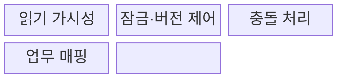
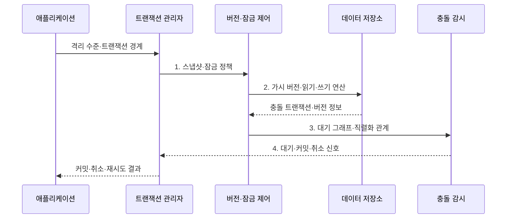

---
sidebar:
  order: 86
  label: "086. 트랜잭션 격리 수준 4단계 (Transaction Isolation Levels)"
  badge:
    text: "기출 · 70%"
    variant: note
title: "트랜잭션 격리 수준 4단계 (Transaction Isolation Levels)"
date: "2026-07-31T10:29:46+09:00"
tags:
  - "notes-software"
weight: 86
extra:
  question_no: "086"
  source_status: "기출"
  source_history: "120회, 138회"
  priority: 70
  priority_note: "120·138회 반복, 격리수준·이상현상 중요"
---

## 미리 알고가기

- **격리 수준(Isolation Level)**: 동시 트랜잭션이 서로의 변경을 관찰하고 충돌하는 방식을 정한 단계
- **동시성 제어(Concurrency Control)**: 동시 트랜잭션의 읽기·쓰기가 잘못 간섭하지 않도록 순서와 가시성을 조정하는 기능
- **직렬 가능성(Serializability)**: 동시 실행 결과가 어떤 순차 실행의 결과와 같아지는 성질
- **오손 읽기(Dirty Read)**: 다른 트랜잭션이 커밋하지 않은 값을 읽는 현상
- **반복 불가능 읽기(Non-Repeatable Read)**: 한 트랜잭션에서 같은 행을 다시 읽었을 때 값이 달라지는 현상
- **유령 읽기(Phantom Read)**: 한 트랜잭션에서 같은 조건을 다시 조회했을 때 행 집합이 달라지는 현상
- **갱신 손실(Lost Update)**: 두 트랜잭션이 같은 값을 바꾸며 한쪽 변경이 다른 변경에 덮이는 현상
- **쓰기 왜곡(Write Skew)**: 각 트랜잭션은 다른 행을 수정하지만 함께 커밋한 결과가 업무 불변식을 깨는 현상
- **다중 버전 동시성 제어(Multi-Version Concurrency Control, MVCC)**: 여러 데이터 버전의 가시성을 조절해 읽기·쓰기 간섭을 줄이는 방식
- **2단계 잠금(Two-Phase Locking, 2PL)**: 잠금을 획득하는 단계와 해제하는 단계를 분리해 직렬 가능성을 구현하는 방식
- **스냅샷(Snapshot)**: 특정 논리 시점에 보이는 데이터 버전을 일관되게 읽는 화면
- **교착 상태(Deadlock)**: 트랜잭션들이 서로 보유한 잠금을 기다려 진행하지 못하는 상태
- **직렬화 실패(Serialization Failure)**: 동시 실행을 유효한 직렬 순서로 만들 수 없어 한 트랜잭션을 취소하는 상황
- **처리량(Throughput)**: 단위 시간에 완료한 트랜잭션 수
- **미커밋 읽기(Read Uncommitted)**: 다른 트랜잭션의 미확정 변경까지 읽을 수 있는 수준
- **커밋 읽기(Read Committed)**: 읽는 시점에 커밋된 값만 보지만 재조회 값은 달라질 수 있는 수준
- **반복 읽기(Repeatable Read)**: 한 트랜잭션에서 읽은 행의 값을 반복 조회해도 유지하는 수준
- **직렬 가능(Serializable)**: 동시 실행 결과가 유효한 직렬 실행과 같도록 보장하는 수준
- **트랜잭션 관리자(Transaction Manager)**: 격리 수준·경계·커밋·취소를 조정하는 구성요소
- **백오프(Backoff)**: 충돌 재시도 사이의 대기 시간을 늘려 반복 충돌을 줄이는 방식
- **원자 조건부 갱신(Atomic Conditional Update)**: 조건 확인과 값 변경을 하나의 원자 연산으로 수행하는 방식

> **키워드:** 트랜잭션 격리 수준 4단계 (Transaction Isolation Levels)

## Ⅰ. 개요

- 정의/개념: 동시 변경의 가시성과 이상 허용 범위를 정하는 **격리 단계**
- 배경/필요성: 단일 수준 일률 적용은 **정합성 오류 또는 처리량 저하**

### 쉽게 이해하기 (학습용)

- 격리 수준은 동시에 처리되는 거래가 서로의 값을 어디까지 보고 바꿀지 정한다.

## Ⅱ. 특징

- **단계 구분**: 허용하는 읽기 이상별 네 단계
- **구현 차이**: 잠금·MVCC에 따라 동작 변화
- **비용 절충**: 이상 방지와 대기·재시도 균형

### 쉽게 이해하기 (학습용)

- 낮은 수준은 간섭을 더 허용하고 높은 수준은 잘못된 결과를 막기 위해 대기·취소·재시도를 늘릴 수 있다.

## Ⅲ. 구조 및 구성요소

| 구성요소 | 책임 |
|:---|:---|
| 읽기 가시성 | 관찰 가능한 **데이터 버전 범위** 결정 |
| 잠금·버전 제어 | **2PL·MVCC**로 격리 의미 구현 |
| 충돌 처리 | **교착·직렬화 실패**의 처리 결정 |
| 업무 매핑 | **정합성 오류 위험·대기·재시도 비용**으로 수준 선택 |

### 쉽게 이해하기 (학습용)

- 보이는 버전과 잠금 범위를 정하고 충돌 시 처리 방법을 고른다.

## Ⅳ. 흐름도

**동작 원리**

- **1. 스냅샷·잠금 정책**: 격리 수준별 가시성과 보호 범위 구성
- **2. 가시 버전·읽기·쓰기 연산**: 허용된 데이터에서 거래 수행
- **3. 대기 그래프·직렬화 관계**: 충돌·교착과 실행 순서 검사
- **4. 대기·커밋·취소 신호**: 안전한 결과와 재시도 여부 확정

> 요약: 격리 수준을 잠금·버전 가시성으로 구현하고 충돌은 대기·취소·재시도로 처리

### 쉽게 이해하기 (학습용)

- 장부 위험에 맞춰 자물쇠와 스냅샷의 보호 범위를 정한다.

## Ⅴ. 종류 및 비교

| 격리 수준 | Read Uncommitted | Read Committed | Repeatable Read | Serializable |
|:---|:---|:---|:---|:---|
| 적용 기준 | **오차 허용 임시 조회** | **일반적인 짧은 조회·변경** | 거래 중 **같은 행 반복 확인** | 범위 조건까지 **정합한 거래** |
| 핵심 특징 | **미커밋 변경 허용** | **커밋 값만 조회** | 같은 행의 **재조회 값 유지** | **직렬 실행과 동일 결과** |
| 한계 | **오손 읽기**로 오류 발생 | **반복 불가능 읽기** 허용 | **유령·쓰기 왜곡**은 제품별 차이 | **잠금 대기·직렬화 재시도** 증가 |

> 요약: 수준이 높을수록 읽기 이상은 줄고 자원 경합은 늘어남

### 쉽게 이해하기 (학습용)

- 네 단계는 미확정 값 허용에서 순차 실행과 같은 결과 보장까지 보호 범위를 높인다.

## Ⅵ. 실무 고려사항 및 대책

| 고려사항 | 대책 | 효과 |
|:---|:---|:---|
| 같은 수준 이름도 제품별 잠금·MVCC 의미가 다름 | **제품 문서·동시 실행 시험** 확인 | **실제 격리 의미** 검증 |
| 읽기 이상만 보아 쓰기 왜곡·갱신 손실을 누락 | **충돌 시나리오·원자 갱신** 설계 | **쓰기 이상·갱신 손실** 방지 |
| 무조건 최고 수준을 적용해 대기·취소·처리량 저하 | **허용 이상을 만족하는 최소 수준** 선택 | **대기·취소·처리량 저하** 감소 |
| 직렬화 실패 재시도가 없어 일시 충돌을 사용자 노출 | **멱등성·백오프·제한 재시도** 적용 | **일시 충돌 자동 복구** |
| 사용자 대기·외부 호출 중 잠금·스냅샷 장기 유지 | **대기·외부 호출을 거래 밖**으로 분리 | **잠금·스냅샷 유지시간** 단축 |

> 적용 사례: 재고 차감은 원자 조건부 갱신 또는 직렬 가능 격리와 실패 재시도로 음수 재고를 차단

### 쉽게 이해하기 (학습용)

- 재고 차감은 동시에 요청해도 음수가 되지 않도록 원자 갱신과 충돌 재시도를 적용한다.

## Ⅶ. 결론

- **업무 불변식·허용 이상·충돌 비용**으로 격리 수준을 결정

### 쉽게 이해하기 (학습용)

- 격리 수준은 높을수록 좋은 등급이 아니라 업무 오류와 처리 지연을 함께 맞추는 선택이다.
