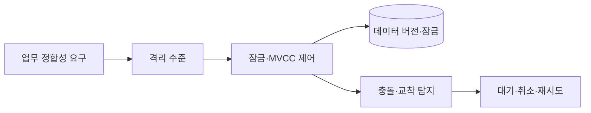
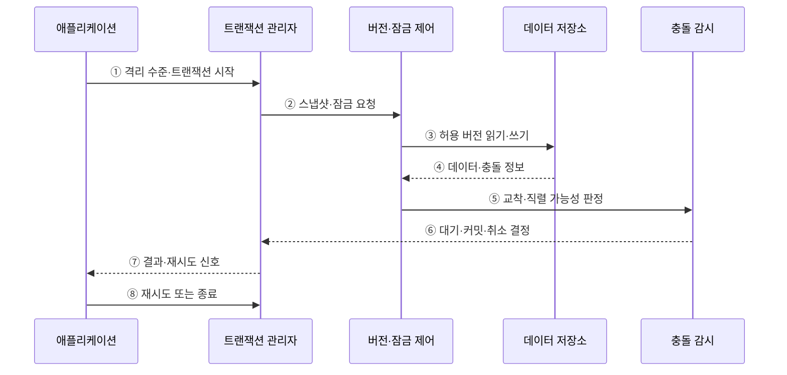

---
sidebar:
  order: 86
  label: "086. 트랜잭션 격리 수준 4단계 (Transaction Isolation Levels)"
  badge:
    text: "기출 · 70%"
    variant: note
title: "트랜잭션 격리 수준 4단계 (Transaction Isolation Levels)"
date: "2026-07-27T23:59:59+09:00"
tags:
  - "notes-software"
weight: 86
extra:
  question_no: "086"
  source_status: "기출"
  source_history: "120회, 138회"
  priority: 70
  priority_note: "120·138회 반복, 격리수준·이상현상 중요"
---

## 미리 알고가기

- **격리 수준(Isolation Level)**: 동시 트랜잭션이 서로의 변경을 관찰하고 충돌하는 방식을 정한 단계
- **동시성 제어(Concurrency Control)**: 동시 트랜잭션의 읽기·쓰기가 잘못 간섭하지 않도록 순서와 가시성을 조정하는 기능
- **직렬 가능성(Serializability)**: 동시 실행 결과가 어떤 순차 실행의 결과와 같아지는 성질
- **오손 읽기(Dirty Read)**: 다른 트랜잭션이 커밋하지 않은 값을 읽는 현상
- **반복 불가능 읽기(Non-Repeatable Read)**: 한 트랜잭션에서 같은 행을 다시 읽었을 때 값이 달라지는 현상
- **유령 읽기(Phantom Read)**: 한 트랜잭션에서 같은 조건을 다시 조회했을 때 행 집합이 달라지는 현상
- **갱신 손실(Lost Update)**: 두 트랜잭션이 같은 값을 바꾸며 한쪽 변경이 다른 변경에 덮이는 현상
- **쓰기 왜곡(Write Skew)**: 각 트랜잭션은 다른 행을 수정하지만 함께 커밋한 결과가 업무 불변식을 깨는 현상
- **다중 버전 동시성 제어(Multi-Version Concurrency Control, MVCC)**: 여러 데이터 버전의 가시성을 조절해 읽기·쓰기 간섭을 줄이는 방식
- **2단계 잠금(Two-Phase Locking, 2PL)**: 잠금을 획득하는 단계와 해제하는 단계를 분리해 직렬 가능성을 구현하는 방식
- **스냅샷(Snapshot)**: 특정 논리 시점에 보이는 데이터 버전을 일관되게 읽는 화면
- **교착 상태(Deadlock)**: 트랜잭션들이 서로 보유한 잠금을 기다려 진행하지 못하는 상태
- **직렬화 실패(Serialization Failure)**: 동시 실행을 유효한 직렬 순서로 만들 수 없어 한 트랜잭션을 취소하는 상황
- **처리량(Throughput)**: 단위 시간에 완료한 트랜잭션 수

## Ⅰ. 개요

- 정의/개념: 트랜잭션 간 **변경 가시성·읽기 이상 허용 범위**를 정하는 단계
- 기존 한계: 단일 격리 수준은 **업무 정합성·동시 처리량**을 함께 최적화하기 곤란

### 쉽게 이해하기 (학습용)

- 격리 수준은 동시에 처리되는 거래가 서로의 값을 어디까지 보고 바꿀지 정한다.

## Ⅱ. 특징

- 허용하는 읽기 이상에 따라 네 단계로 구분한다.
- DBMS의 잠금·MVCC 구현에 따라 세부 동작이 달라진다.
- 수준이 높으면 이상은 줄고 대기·재시도는 늘 수 있다.
- 업무 손실과 지연 비용에 맞는 최소 수준을 선택한다.

### 쉽게 이해하기 (학습용)

- 낮은 수준은 간섭을 더 허용하고 높은 수준은 잘못된 결과를 막기 위해 대기·취소·재시도를 늘릴 수 있다.

## Ⅲ. 아키텍처 및 구성요소

**도표안 A — 구조도**

**도표안 B — sequenceDiagram**

| 설계 요소 | 설명 |
|:---|:---|
| 읽기 가시성 | 다른 트랜잭션의 어떤 버전을 볼지 결정 |
| 잠금·버전 제어 | 2PL·MVCC로 격리 의미 구현 |
| 충돌 처리 | 교착·직렬화 실패의 대기·취소 결정 |
| 업무 매핑 | 이상 손실과 지연·재시도 비용으로 수준 선택 |

**동작 원리**

- ① 애플리케이션이 업무에 필요한 격리 수준으로 트랜잭션을 시작한다.
- ② 관리자가 수준과 DBMS 구현에 맞는 스냅샷·잠금을 요청한다.
- ③ 버전·잠금 제어가 허용된 데이터 버전에 읽기·쓰기를 수행한다.
- ④ 저장소가 데이터와 잠금 충돌·버전 변경 정보를 반환한다.
- ⑤ 충돌 감시가 교착과 직렬 순서 성립 여부를 판정한다.
- ⑥ 안전하면 커밋하고 충돌하면 대기하거나 한 트랜잭션을 취소한다.
- ⑦ 관리자가 결과와 직렬화·교착 재시도 신호를 반환한다.
- ⑧ 애플리케이션이 멱등성을 지키며 제한 재시도하거나 오류로 종료한다.

> 요약: 격리 수준을 잠금·버전 가시성으로 구현하고 충돌은 대기·취소·재시도로 처리한다.

### 쉽게 이해하기 (학습용)

- 장부 위험에 맞춰 자물쇠와 스냅샷의 보호 범위를 정한다.

## Ⅳ. 종류 및 비교

| 격리 수준 | Read Uncommitted | Read Committed | Repeatable Read | Serializable |
|:---|:---|:---|:---|:---|
| 적용 기준 | 오차를 허용하는 임시 조회 | 일반적인 짧은 조회·변경 | 거래 중 같은 행을 반복 확인 | 범위 조건까지 정합해야 하는 거래 |
| 핵심 특징 | **미커밋 변경 허용** | **커밋 값만 조회** | 같은 행의 **재조회 값 유지** | **직렬 실행과 동일 결과** |
| 표준상 방지 범위 | 오손 읽기 허용 | 오손 읽기 방지 | 반복 불가능 읽기까지 방지 | 유령 읽기를 포함해 직렬 실행과 같은 결과 |
| 구현 주의 | 제품이 지원하지 않거나 더 강하게 동작 가능 | 문장 단위·트랜잭션 스냅샷 차이 | 유령·쓰기 왜곡 방지는 DBMS마다 다름 | 잠금 대기 또는 직렬화 실패 재시도 필요 |

> 요약: 수준이 높을수록 읽기 이상은 줄고 자원 경합은 늘어남

### 쉽게 이해하기 (학습용)

- 네 단계는 미확정 값 허용에서 순차 실행과 같은 결과 보장까지 보호 범위를 높인다.

## Ⅴ. 실무 고려사항 및 대책

| 고려사항 | 문제점 | 대책 |
|:---|:---|:---|
| 이름만 신뢰 | 같은 격리 수준도 DBMS·잠금·MVCC 구현이 다름 | 제품 문서와 동시 실행 시험으로 실제 이상 방지 확인 |
| 읽기 이상만 검토 | 갱신 손실·쓰기 왜곡으로 업무 불변식 위반 | 읽기·쓰기 충돌 시나리오와 원자 조건부 갱신 설계 |
| 무조건 상향 | 잠금 대기·취소·처리량 저하 증가 | 허용 이상과 손실을 정하고 만족하는 최소 수준 선택 |
| 재시도 누락 | 교착·직렬화 실패가 사용자 실패로 노출 | 멱등 작업·지수 백오프·제한 횟수 재시도 적용 |
| 긴 트랜잭션 | 잠금·스냅샷 유지로 충돌과 저장 비용 증가 | 사용자 대기·외부 호출을 경계 밖으로 분리 |

> 적용 사례: 재고 차감은 원자 조건부 갱신 또는 직렬 가능 격리와 실패 재시도로 음수 재고를 막는다.

### 쉽게 이해하기 (학습용)

- 재고 차감은 동시에 요청해도 음수가 되지 않도록 원자 갱신과 충돌 재시도를 적용한다.

## Ⅵ. 결론

- 격리 수준은 동시성 이상 방지와 대기·취소·재시도 비용 사이의 설계 선택이다.
- DBMS의 실제 구현을 확인하고 업무 불변식을 지키는 최소 수준과 원자 연산을 조합한다.

### 쉽게 이해하기 (학습용)

- 격리 수준은 높을수록 좋은 등급이 아니라 업무 오류와 처리 지연을 함께 맞추는 선택이다.
