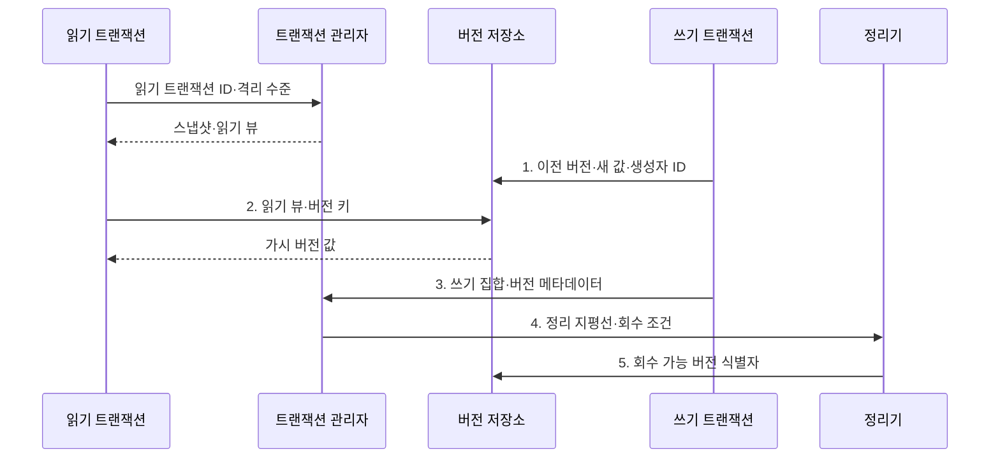

---
sidebar:
  order: 87
  label: "087. MVCC 다중 버전 동시성 제어 (MVCC)"
  badge:
    text: "미출제 · 50%"
    variant: note
title: "MVCC 다중 버전 동시성 제어 (MVCC)"
date: "2026-08-02T12:00:00+09:00"
tags:
  - "notes-software"
weight: 87
extra:
  question_no: "087"
  source_status: "미출제"
  source_history: ""
  priority: 50
  priority_note: "MVCC는 동시 읽기·버전 정리 설계 핵심"
---

## Ⅰ. 개요

핵심 용어

- **다중 버전 동시성 제어(Multi-Version Concurrency Control, MVCC)**: 스냅샷별 행 버전을 선택해 읽기·쓰기 대기를 줄이는 방식이다.
- **대기·처리량 저하**: 단일 버전 잠금에서 읽기와 쓰기가 서로 기다리며 발생하는 성능 문제이다.

- 정의/개념: 스냅샷별 행 버전을 선택하는 **다중 버전 동시성 제어**
- 배경/필요성: 단일 버전 잠금은 읽기·쓰기 간 **대기·처리량 저하** 유발

### 쉽게 이해하기 (학습용)

- 읽는 거래는 허용된 옛 버전을 보고 쓰는 거래는 새 버전을 만들어 서로 기다리는 시간을 줄인다.

## Ⅱ. 특징

핵심 용어

- **스냅샷 읽기**: 트랜잭션이 특정 논리 시점에 허용된 데이터 버전을 일관되게 읽는 방식이다.
- **가시성 판정**: 버전의 생성·종료 시점과 읽기 뷰를 비교해 관찰 가능 여부를 정하는 규칙이다.
- **충돌·정리**: 동시 쓰기를 통제하고 어떤 읽기도 필요로 하지 않는 구버전을 회수하는 활동이다.

- **스냅샷 읽기**: 쓰기와 조회의 대기 감소
- **가시성 판정**: 생성·종료 시점으로 버전 선택
- **충돌·정리**: 쓰기 보호와 구버전 회수 필요

### 쉽게 이해하기 (학습용)

- 읽기 대기는 줄지만 구버전이 공간을 차지하므로 안전한 시점에 회수해야 한다.

## Ⅲ. 구조 및 구성요소

핵심 용어

- **생성·종료 트랜잭션**: 버전의 유효 시점과 가시성을 판정하는 메타데이터이다.
- **스냅샷·읽기 뷰**: 커밋 경계와 활성 트랜잭션 범위로 보이는 버전을 정하는 구조이다.
- **현재·과거 버전**: 최신 값과 이전 상태를 함께 보존한 버전 체인의 데이터이다.

| 구성요소 | 책임 |
|:---|:---|
| 버전 메타데이터 | **생성·종료 트랜잭션**으로 가시성 판정 |
| 스냅샷·읽기 뷰 | **커밋 경계·활성 범위** 정의 |
| 버전 저장소·체인 | **현재·과거 버전** 보존 |
| 충돌 제어·정리기 | **동시 쓰기 통제·구버전 회수** |

### 쉽게 이해하기 (학습용)

- 읽기 기준과 여러 버전을 관리하고 필요 없는 옛 버전을 회수한다.

## Ⅳ. 흐름도

핵심 용어

- **이전 버전·새 값·생성자 ID**: 기존 값을 덮지 않고 변경 이력을 만드는 쓰기 정보이다.
- **읽기 뷰·버전 키**: 스냅샷에 허용된 최신 버전을 찾는 조회 정보이다.
- **정리 지평선·회수 조건**: 가장 오래된 활성 스냅샷을 기준으로 구버전 삭제 가능성을 정하는 경계이다.

**동작 원리**

- **1. 이전 버전·새 값·생성자 ID**: 기존 값을 덮지 않고 변경 이력 보존
- **2. 읽기 뷰·버전 키**: 스냅샷에 허용된 최신 버전 선택
- **3. 쓰기 집합·버전 메타데이터**: 동시 변경의 커밋·취소 판정
- **4. 정리 지평선·회수 조건**: 최저 활성 스냅샷으로 안전 경계 산정
- **5. 회수 가능 버전 식별자**: 어떤 읽기도 필요 없는 구버전 제거

> 요약: 스냅샷별 가시 버전을 읽게 하고 새 버전 기록과 안전한 구버전 회수를 병행

### 쉽게 이해하기 (학습용)

- 독자는 자기 기준에 맞는 판본을 보고 아무도 읽지 않는 옛 판본은 청소부가 치운다.

## Ⅴ. 종류 및 비교

핵심 용어

- **다중 버전 동시성 제어**: 여러 버전의 가시성을 이용해 읽기 대기를 줄이는 방식이다.
- **잠금 중심 제어**: 충돌 데이터에 잠금을 획득해 접근 순서를 직접 조정하는 방식이다.

| 동시성 제어 관점 | 다중 버전 동시성 제어 | 잠금 중심 제어 |
|:---|:---|:---|
| 적용 기준 | **읽기 비중·시점 일관성** 중요 | **충돌 접근 순서** 직접 통제 |
| 핵심 특징 | 가시 버전으로 **읽기 대기 감소** | 잠금 해제까지 **충돌 접근 대기** |
| 한계 | **버전 저장·판정·정리 비용** | **경합·교착·긴 대기** |

> 요약: 잠금 대기와 스냅샷 읽기를 비교

### 쉽게 이해하기 (학습용)

- MVCC는 독자에게 맞는 판본을 보여 주고 잠금 방식은 충돌 작업의 순서를 직접 통제한다.

## Ⅵ. 실무 고려사항 및 대책

핵심 용어

- **버전 팽창(Version Bloat)**: 오래된 스냅샷 때문에 회수 못 한 버전이 쌓여 비용이 커지는 현상이다.
- **조건부 갱신·잠금·재시도**: MVCC가 제거하지 않는 동시 쓰기 충돌과 갱신 손실을 통제하는 수단이다.
- **보존 지평선·복제 슬롯**: 복제 대상에 필요한 로그·버전을 보존하고 안전한 회수를 관리하는 기준이다.

| 문제 | 대책 | 효과 |
|:---|:---|:---|
| 장기·유휴 트랜잭션이 오래된 스냅샷을 유지 | **유휴 제한·읽기 작업 분할** | **버전 팽창** 감소 |
| 정리 지연을 관측하지 않아 저장·탐색 비용 증가 | **지연·회수량·팽창률** 관측 | **저장·탐색 비용** 통제 |
| MVCC가 동시 쓰기 충돌까지 제거한다고 오해 | **조건부 갱신·잠금·재시도** 적용 | **동시 갱신 손실** 방지 |
| 제품별 격리·가시성·정리 방식 차이를 무시 | **격리·가시성·정리 구현** 확인 | **제품 동작 오판** 방지 |
| 복제·백업 지연이 보존 지평선을 오래 유지 | **보존 지평선·복제 슬롯** 관리 | **구버전 회수 정체** 방지 |

> 적용 사례: 주문 조회는 트랜잭션 제한 시간을 두고 가장 오래된 스냅샷과 버전 팽창률을 관측

### 쉽게 이해하기 (학습용)

- 오래 열린 조회를 제한하면 구버전을 제때 회수해 저장·조회 비용을 줄일 수 있다.

## Ⅶ. 결론

핵심 용어

- **MVCC**: 읽기 비중과 시점 일관성이 중요할 때 여러 버전으로 대기를 줄이는 방식이다.
- **잠금 제어**: 충돌 접근의 순서를 직접 통제해야 할 때 잠금으로 실행을 조정하는 방식이다.

- 읽기 비중·시점 일관성이 크면 **MVCC**, 충돌 순서 통제는 **잠금 제어**

### 쉽게 이해하기 (학습용)

- MVCC는 읽기 대기를 줄이는 대신 구버전과 쓰기 충돌을 남기므로 수명·정리·재시도를 관리해야 한다.
